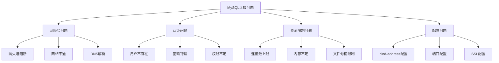

# MySQL问题排查-连接问题处理

## 业务场景引入

MySQL连接问题是生产环境中的常见故障：
- **连接被拒绝**：应用无法连接到MySQL服务器
- **连接超时**：连接建立缓慢或中途断开
- **连接池耗尽**：高并发时连接数达到上限
- **连接异常断开**：已建立的连接意外中断

## 连接问题分类

### 连接问题诊断框架



## 连接拒绝问题

### 基础连接测试

```bash
#!/bin/bash
# MySQL连接问题诊断脚本

MYSQL_HOST="${1:-localhost}"
MYSQL_PORT="${2:-3306}"
MYSQL_USER="${3:-root}"

echo "=== MySQL连接诊断 ==="
echo "目标主机: $MYSQL_HOST"
echo "端口: $MYSQL_PORT"
echo "用户: $MYSQL_USER"

# 1. 网络连通性测试
echo -e "\n1. 网络连通性测试:"
ping -c 3 $MYSQL_HOST
echo "Ping测试完成"

# 2. 端口连通性测试
echo -e "\n2. 端口连通性测试:"
if command -v telnet >/dev/null 2>&1; then
    timeout 5 telnet $MYSQL_HOST $MYSQL_PORT
elif command -v nc >/dev/null 2>&1; then
    nc -zv $MYSQL_HOST $MYSQL_PORT
else
    echo "未找到telnet或nc命令"
fi

# 3. MySQL服务状态检查
echo -e "\n3. MySQL服务状态:"
if [ "$MYSQL_HOST" = "localhost" ] || [ "$MYSQL_HOST" = "127.0.0.1" ]; then
    systemctl status mysql 2>/dev/null || service mysql status 2>/dev/null || echo "无法检查MySQL服务状态"
    
    # 检查MySQL进程
    echo -e "\nMySQL进程:"
    ps aux | grep mysqld | grep -v grep
    
    # 检查端口监听
    echo -e "\n端口监听状态:"
    netstat -tlnp | grep :$MYSQL_PORT || ss -tlnp | grep :$MYSQL_PORT
fi

# 4. 防火墙检查
echo -e "\n4. 防火墙检查:"
if command -v iptables >/dev/null 2>&1; then
    iptables -L | grep -i mysql
    iptables -L | grep $MYSQL_PORT
fi

# 5. MySQL连接测试
echo -e "\n5. MySQL连接测试:"
read -s -p "请输入MySQL密码: " MYSQL_PASS
echo
mysql -h$MYSQL_HOST -P$MYSQL_PORT -u$MYSQL_USER -p$MYSQL_PASS -e "SELECT 'Connection successful' as result, NOW() as current_time;" 2>&1

# 6. MySQL配置检查
if [ "$MYSQL_HOST" = "localhost" ] || [ "$MYSQL_HOST" = "127.0.0.1" ]; then
    echo -e "\n6. MySQL配置检查:"
    
    # 检查bind-address配置
    echo "bind-address配置:"
    grep -r "bind-address" /etc/mysql/ 2>/dev/null || echo "未找到bind-address配置"
    
    # 检查端口配置
    echo -e "\n端口配置:"
    grep -r "port.*=.*3306" /etc/mysql/ 2>/dev/null || echo "使用默认端口3306"
    
    # 检查skip-networking
    echo -e "\nskip-networking配置:"
    grep -r "skip-networking" /etc/mysql/ 2>/dev/null && echo "⚠ 警告: 启用了skip-networking" || echo "✓ 未启用skip-networking"
fi

echo -e "\n诊断完成!"
```

### 认证问题排查

```sql
-- 检查用户存在性和主机匹配
SELECT 
    user, 
    host, 
    authentication_string,
    plugin,
    password_expired,
    account_locked
FROM mysql.user 
WHERE user = 'your_username';

-- 检查用户权限
SHOW GRANTS FOR 'your_username'@'your_host';

-- 查看连接失败记录
SELECT 
    argument 
FROM mysql.general_log 
WHERE command_type = 'Connect' 
    AND argument LIKE '%Access denied%' 
ORDER BY event_time DESC 
LIMIT 10;

-- 检查当前连接
SELECT 
    processlist_id,
    processlist_user,
    processlist_host,
    processlist_db,
    processlist_command,
    processlist_time
FROM performance_schema.threads
WHERE type = 'FOREGROUND'
ORDER BY processlist_time DESC;
```

### 用户权限修复

```sql
-- 创建新用户（如果不存在）
CREATE USER IF NOT EXISTS 'app_user'@'%' IDENTIFIED BY 'new_password';

-- 修改用户密码
ALTER USER 'app_user'@'%' IDENTIFIED BY 'new_password';

-- 授予权限
GRANT SELECT, INSERT, UPDATE, DELETE ON ecommerce.* TO 'app_user'@'%';

-- 刷新权限
FLUSH PRIVILEGES;

-- 解锁被锁定的账户
ALTER USER 'app_user'@'%' ACCOUNT UNLOCK;

-- 重置密码过期
ALTER USER 'app_user'@'%' PASSWORD EXPIRE NEVER;

-- 检查权限生效
SELECT 
    user,
    host,
    Select_priv,
    Insert_priv,
    Update_priv,
    Delete_priv
FROM mysql.user 
WHERE user = 'app_user';
```

## 连接数限制问题

### 连接数监控

```sql
-- 查看当前连接数和最大连接数
SELECT 
    'Current Connections' as metric,
    (SELECT VARIABLE_VALUE FROM performance_schema.global_status WHERE VARIABLE_NAME = 'Threads_connected') as current_value,
    (SELECT VARIABLE_VALUE FROM performance_schema.global_variables WHERE VARIABLE_NAME = 'max_connections') as max_value,
    ROUND(
        (SELECT VARIABLE_VALUE FROM performance_schema.global_status WHERE VARIABLE_NAME = 'Threads_connected') * 100.0 / 
        (SELECT VARIABLE_VALUE FROM performance_schema.global_variables WHERE VARIABLE_NAME = 'max_connections'), 2
    ) as usage_percent;

-- 查看连接历史统计
SELECT 
    'Max Used Connections' as metric,
    VARIABLE_VALUE as value
FROM performance_schema.global_status 
WHERE VARIABLE_NAME = 'Max_used_connections'
UNION ALL
SELECT 
    'Total Connections',
    VARIABLE_VALUE
FROM performance_schema.global_status 
WHERE VARIABLE_NAME = 'Connections'
UNION ALL
SELECT 
    'Aborted Connections',
    VARIABLE_VALUE  
FROM performance_schema.global_status 
WHERE VARIABLE_NAME = 'Aborted_connects';

-- 按用户统计连接数
SELECT 
    processlist_user,
    processlist_host,
    COUNT(*) as connection_count,
    GROUP_CONCAT(DISTINCT processlist_db) as databases
FROM performance_schema.threads
WHERE type = 'FOREGROUND' 
    AND processlist_user IS NOT NULL
GROUP BY processlist_user, processlist_host
ORDER BY connection_count DESC;
```

### 连接池管理

```python
#!/usr/bin/env python3
import mysql.connector
from mysql.connector import pooling
import threading
import time

class MySQLConnectionManager:
    def __init__(self, config):
        self.config = config
        self.pool = None
        self.create_pool()
    
    def create_pool(self):
        """创建连接池"""
        try:
            self.pool = pooling.MySQLConnectionPool(
                pool_name="mysql_pool",
                pool_size=10,  # 连接池大小
                pool_reset_session=True,
                **self.config
            )
            print(f"连接池创建成功，池大小: {self.pool.pool_size}")
        except Exception as e:
            print(f"连接池创建失败: {e}")
    
    def get_connection(self):
        """获取连接"""
        try:
            connection = self.pool.get_connection()
            return connection
        except Exception as e:
            print(f"获取连接失败: {e}")
            return None
    
    def execute_query(self, query):
        """执行查询"""
        connection = None
        try:
            connection = self.get_connection()
            if connection:
                cursor = connection.cursor()
                cursor.execute(query)
                result = cursor.fetchall()
                cursor.close()
                return result
        except Exception as e:
            print(f"查询执行失败: {e}")
        finally:
            if connection and connection.is_connected():
                connection.close()
    
    def check_pool_status(self):
        """检查连接池状态"""
        try:
            # 获取连接池统计信息
            active_connections = 0
            available_connections = 0
            
            # 这里需要根据实际连接池实现来获取统计信息
            print(f"连接池状态:")
            print(f"  池大小: {self.pool.pool_size}")
            print(f"  活跃连接: {active_connections}")
            print(f"  可用连接: {available_connections}")
            
        except Exception as e:
            print(f"检查连接池状态失败: {e}")
    
    def test_connection_load(self, thread_count=20, duration=30):
        """测试连接负载"""
        def worker():
            for _ in range(duration):
                self.execute_query("SELECT 1")
                time.sleep(1)
        
        print(f"开始连接负载测试: {thread_count}线程, {duration}秒")
        
        threads = []
        for i in range(thread_count):
            thread = threading.Thread(target=worker)
            threads.append(thread)
            thread.start()
        
        # 监控连接池状态
        for _ in range(duration):
            self.check_pool_status()
            time.sleep(5)
        
        # 等待所有线程完成
        for thread in threads:
            thread.join()
        
        print("负载测试完成")

# 使用示例
config = {
    'host': 'localhost',
    'user': 'app_user',
    'password': 'password',
    'database': 'ecommerce'
}

manager = MySQLConnectionManager(config)
manager.check_pool_status()

# 测试连接负载
# manager.test_connection_load()
```

### 连接数优化

```sql
-- 调整最大连接数
SET GLOBAL max_connections = 2000;

-- 调整连接超时时间
SET GLOBAL wait_timeout = 28800;
SET GLOBAL interactive_timeout = 28800;

-- 调整连接建立超时
SET GLOBAL connect_timeout = 10;

-- 检查连接线程缓存
SHOW VARIABLES LIKE 'thread_cache_size';
SET GLOBAL thread_cache_size = 100;

-- 监控线程缓存效率
SELECT 
    'Thread Cache Hit Rate' as metric,
    ROUND((1 - (
        SELECT VARIABLE_VALUE FROM performance_schema.global_status WHERE VARIABLE_NAME = 'Threads_created'
    ) / (
        SELECT VARIABLE_VALUE FROM performance_schema.global_status WHERE VARIABLE_NAME = 'Connections'
    )) * 100, 2) as hit_rate_percent;
```

## 连接异常断开

### 连接断开原因分析

```bash
#!/bin/bash
# 连接断开问题分析

analyze_connection_issues() {
    echo "=== MySQL连接断开分析 ==="
    
    # 检查MySQL错误日志
    ERROR_LOG=$(mysql -sNe "SELECT @@log_error" 2>/dev/null)
    if [ -n "$ERROR_LOG" ] && [ -f "$ERROR_LOG" ]; then
        echo "1. 检查错误日志中的连接相关错误:"
        tail -100 "$ERROR_LOG" | grep -i -E "(connection|aborted|timeout|killed)"
    fi
    
    # 检查系统资源
    echo -e "\n2. 系统资源检查:"
    echo "内存使用:"
    free -h
    
    echo -e "\n文件句柄限制:"
    ulimit -n
    
    echo -e "\n当前打开的文件数:"
    lsof | wc -l
    
    # 检查网络连接
    echo -e "\n3. 网络连接状态:"
    netstat -an | grep :3306 | head -10
    
    # 检查MySQL进程状态
    echo -e "\n4. MySQL进程状态:"
    MYSQL_PID=$(pgrep mysqld | head -1)
    if [ -n "$MYSQL_PID" ]; then
        ps -p $MYSQL_PID -o pid,ppid,pcpu,pmem,etime,cmd
        
        echo -e "\nMySQL进程文件句柄使用:"
        ls -la /proc/$MYSQL_PID/fd | wc -l
    fi
}

# 监控连接断开
monitor_connection_drops() {
    echo "监控MySQL连接断开 (按Ctrl+C停止):"
    
    # 获取初始计数
    prev_aborted=$(mysql -sNe "SELECT VARIABLE_VALUE FROM performance_schema.global_status WHERE VARIABLE_NAME = 'Aborted_connects'")
    prev_clients=$(mysql -sNe "SELECT VARIABLE_VALUE FROM performance_schema.global_status WHERE VARIABLE_NAME = 'Aborted_clients'")
    
    while true; do
        sleep 10
        
        curr_aborted=$(mysql -sNe "SELECT VARIABLE_VALUE FROM performance_schema.global_status WHERE VARIABLE_NAME = 'Aborted_connects'")
        curr_clients=$(mysql -sNe "SELECT VARIABLE_VALUE FROM performance_schema.global_status WHERE VARIABLE_NAME = 'Aborted_clients'")
        
        aborted_diff=$((curr_aborted - prev_aborted))
        clients_diff=$((curr_clients - prev_clients))
        
        if [ $aborted_diff -gt 0 ] || [ $clients_diff -gt 0 ]; then
            echo "$(date): 检测到连接断开 - Aborted_connects: +$aborted_diff, Aborted_clients: +$clients_diff"
        fi
        
        prev_aborted=$curr_aborted
        prev_clients=$curr_clients
    done
}

case "${1:-analyze}" in
    "analyze")
        analyze_connection_issues
        ;;
    "monitor")
        monitor_connection_drops
        ;;
    *)
        echo "Usage: $0 {analyze|monitor}"
        ;;
esac
```

### 连接稳定性配置

```sql
-- 配置连接保活参数
[mysqld]
# 等待超时时间（秒）
wait_timeout = 28800
interactive_timeout = 28800

# 连接建立超时
connect_timeout = 10

# 网络读写超时  
net_read_timeout = 30
net_write_timeout = 60

# 跳过DNS解析（提高连接速度）
skip_name_resolve = 1

# 最大连接错误次数
max_connect_errors = 100

# 线程缓存
thread_cache_size = 100

-- 运行时动态调整
SET GLOBAL wait_timeout = 28800;
SET GLOBAL interactive_timeout = 28800;
SET GLOBAL max_connect_errors = 100;
SET GLOBAL thread_cache_size = 100;
```

## 故障排除工具

### 连接问题诊断工具

```python
#!/usr/bin/env python3
import mysql.connector
import socket
import subprocess
import time

class MySQLConnectionDiagnostic:
    def __init__(self, host, port, user, password):
        self.host = host
        self.port = port
        self.user = user
        self.password = password
    
    def test_network_connectivity(self):
        """测试网络连通性"""
        try:
            # TCP连接测试
            sock = socket.socket(socket.AF_INET, socket.SOCK_STREAM)
            sock.settimeout(5)
            result = sock.connect_ex((self.host, self.port))
            sock.close()
            
            if result == 0:
                print(f"✓ 网络连通性正常 ({self.host}:{self.port})")
                return True
            else:
                print(f"✗ 网络连接失败 ({self.host}:{self.port})")
                return False
        except Exception as e:
            print(f"✗ 网络测试异常: {e}")
            return False
    
    def test_mysql_connection(self):
        """测试MySQL连接"""
        try:
            connection = mysql.connector.connect(
                host=self.host,
                port=self.port,
                user=self.user,
                password=self.password,
                connection_timeout=10
            )
            
            cursor = connection.cursor()
            cursor.execute("SELECT 1")
            result = cursor.fetchone()
            
            if result[0] == 1:
                print("✓ MySQL连接成功")
                
                # 获取连接信息
                cursor.execute("SELECT CONNECTION_ID(), USER(), @@hostname")
                conn_info = cursor.fetchone()
                print(f"  连接ID: {conn_info[0]}")
                print(f"  当前用户: {conn_info[1]}")
                print(f"  服务器主机: {conn_info[2]}")
                
                cursor.close()
                connection.close()
                return True
                
        except mysql.connector.Error as e:
            print(f"✗ MySQL连接失败: {e}")
            
            # 分析错误类型
            if e.errno == 1045:
                print("  原因: 认证失败，检查用户名和密码")
            elif e.errno == 2003:
                print("  原因: 无法连接到MySQL服务器")
            elif e.errno == 1130:
                print("  原因: 主机不允许连接到MySQL服务器")
            
            return False
        except Exception as e:
            print(f"✗ 连接异常: {e}")
            return False
    
    def check_mysql_status(self):
        """检查MySQL服务状态"""
        if self.host in ['localhost', '127.0.0.1']:
            try:
                result = subprocess.run(['systemctl', 'is-active', 'mysql'], 
                                     capture_output=True, text=True)
                if result.stdout.strip() == 'active':
                    print("✓ MySQL服务运行正常")
                else:
                    print("✗ MySQL服务未运行")
                    
            except Exception:
                print("? 无法检查MySQL服务状态")
    
    def run_full_diagnostic(self):
        """运行完整诊断"""
        print("=== MySQL连接诊断 ===")
        print(f"目标: {self.host}:{self.port}")
        print(f"用户: {self.user}")
        
        # 1. 检查MySQL服务状态
        self.check_mysql_status()
        
        # 2. 测试网络连通性
        network_ok = self.test_network_connectivity()
        
        # 3. 测试MySQL连接
        if network_ok:
            mysql_ok = self.test_mysql_connection()
            
            if not mysql_ok:
                print("\n建议检查项:")
                print("1. 验证用户名和密码是否正确")
                print("2. 检查用户是否有从该主机连接的权限")  
                print("3. 确认MySQL服务正常运行")
                print("4. 检查防火墙设置")
        else:
            print("\n建议检查项:")
            print("1. 确认MySQL服务正在运行")
            print("2. 检查端口配置是否正确")
            print("3. 检查防火墙或网络策略")
            print("4. 验证bind-address配置")

# 使用示例
if __name__ == "__main__":
    diagnostic = MySQLConnectionDiagnostic(
        host='localhost',
        port=3306,
        user='test_user',
        password='test_password'
    )
    
    diagnostic.run_full_diagnostic()
```

## 总结与最佳实践

### 连接问题预防

1. **合理配置连接参数**
   - 设置合适的max_connections
   - 配置连接超时参数
   - 启用连接池

2. **网络和安全配置**
   - 正确配置bind-address
   - 设置防火墙规则
   - 使用skip-name-resolve

3. **监控和告警**
   - 监控连接数使用率
   - 监控连接异常断开
   - 设置连接数告警阈值

4. **应用层优化**
   - 使用连接池管理
   - 及时释放连接
   - 处理连接异常

连接问题往往涉及网络、认证、资源限制等多个方面，需要系统化的诊断方法。