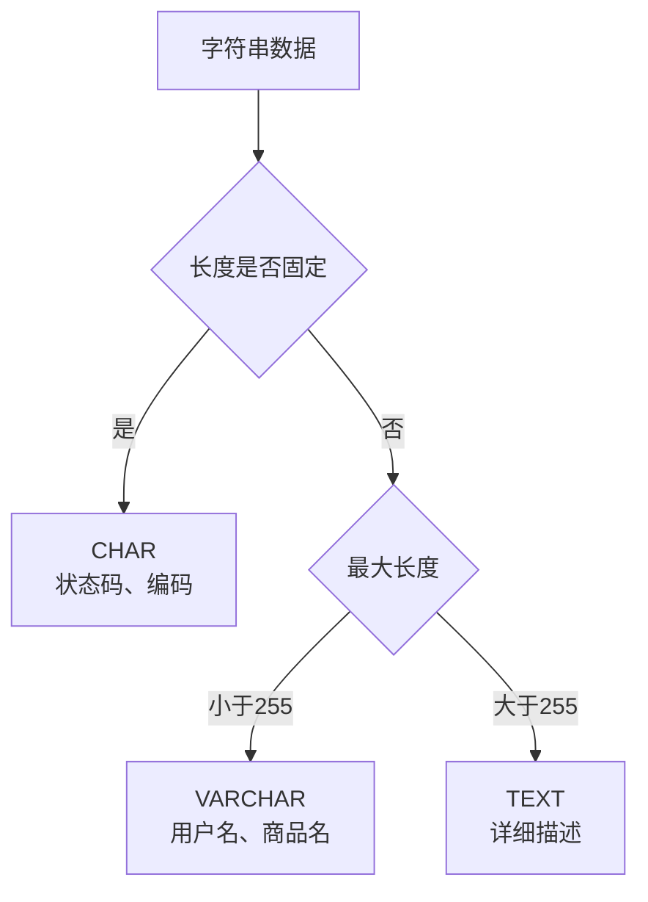

# MySQL基础-数据类型详解

## 业务场景引入

在构建电商平台时，数据类型选择直接影响存储效率和查询性能：
- **用户年龄**：使用TINYINT(0-255)而非INT节省存储空间
- **商品价格**：使用DECIMAL避免FLOAT精度丢失
- **订单状态**：使用ENUM提高数据一致性
- **商品属性**：使用JSON存储灵活的动态属性

## 数值类型选择策略

### 整数类型对比

| 类型 | 字节 | 无符号范围 | 适用场景 |
|------|------|------------|----------|
| TINYINT | 1 | 0-255 | 年龄、状态码 |
| SMALLINT | 2 | 0-65,535 | 分类ID |
| INT | 4 | 0-42亿 | 常规业务ID |
| BIGINT | 8 | 0-1844万万万万 | 大规模用户ID |

### 电商用户表设计实例

```sql
CREATE TABLE users (
    user_id BIGINT PRIMARY KEY AUTO_INCREMENT,           -- 大规模用户，使用BIGINT
    username VARCHAR(50) UNIQUE NOT NULL,
    age TINYINT UNSIGNED,                               -- 年龄0-255够用
    province_id SMALLINT UNSIGNED,                      -- 省份ID
    city_id MEDIUMINT UNSIGNED,                         -- 城市ID
    login_count INT UNSIGNED DEFAULT 0,                 -- 登录次数
    total_amount DECIMAL(12,2) DEFAULT 0.00,           -- 总消费金额，精确计算
    account_status TINYINT UNSIGNED DEFAULT 1,          -- 状态：1正常,2冻结
    created_at TIMESTAMP DEFAULT CURRENT_TIMESTAMP
) ENGINE=InnoDB DEFAULT CHARSET=utf8mb4;
```

### 金额计算最佳实践

```sql
-- ✅ 正确：使用DECIMAL存储金额
CREATE TABLE orders (
    order_id BIGINT PRIMARY KEY AUTO_INCREMENT,
    subtotal DECIMAL(10,2) NOT NULL,                    -- 商品小计
    shipping_fee DECIMAL(8,2) DEFAULT 0.00,            -- 运费
    discount_amount DECIMAL(8,2) DEFAULT 0.00,         -- 优惠金额
    total_amount DECIMAL(12,2) NOT NULL,               -- 总金额
    
    -- ❌ 错误：不要使用FLOAT存储金额
    -- price_float FLOAT,  -- 可能导致 99.99 变成 99.9899997
    
    payment_method ENUM('ALIPAY', 'WECHAT', 'UNION_PAY') NOT NULL
) ENGINE=InnoDB DEFAULT CHARSET=utf8mb4;
```

## 字符串类型应用

### VARCHAR vs TEXT vs CHAR选择



### 商品表设计实例

```sql
CREATE TABLE products (
    product_id BIGINT PRIMARY KEY AUTO_INCREMENT,
    product_code CHAR(12) UNIQUE NOT NULL,              -- 固定12位商品编码
    product_name VARCHAR(200) NOT NULL,                 -- 商品名称
    short_description VARCHAR(500),                     -- 短描述
    full_description TEXT,                              -- 详细描述
    
    -- JSON存储动态属性
    attributes JSON,                                    -- 商品属性
    -- 示例：{"color": "红色", "size": "XL", "material": "纯棉"}
    
    price DECIMAL(10,2) NOT NULL,
    status ENUM('DRAFT', 'PUBLISHED', 'SOLD_OUT') DEFAULT 'DRAFT',
    tags SET('热销', '新品', '特价', '推荐'),           -- 商品标签
    
    created_at TIMESTAMP DEFAULT CURRENT_TIMESTAMP,
    
    FULLTEXT INDEX ft_search (product_name, short_description)
) ENGINE=InnoDB DEFAULT CHARSET=utf8mb4;

-- JSON字段查询
SELECT product_id, 
       attributes->'$.color' AS color,
       attributes->'$.size' AS size
FROM products 
WHERE attributes->'$.color' = '"红色"';
```

## 日期时间类型

### 时间类型选择

| 类型 | 字节 | 范围 | 时区 | 适用场景 |
|------|------|------|------|----------|
| DATE | 3 | 1000-9999年 | 否 | 生日、有效期 |
| DATETIME | 8 | 1000-9999年 | 否 | 业务时间 |
| TIMESTAMP | 4 | 1970-2038年 | 是 | 系统时间 |
| TIME | 3 | -838:59:59到838:59:59 | 否 | 持续时间 |

### 订单时间管理实例

```sql
CREATE TABLE order_timeline (
    timeline_id BIGINT PRIMARY KEY AUTO_INCREMENT,
    order_id BIGINT NOT NULL,
    
    -- 业务时间使用DATETIME
    order_created_at DATETIME NOT NULL,                 -- 订单创建
    payment_deadline DATETIME,                          -- 支付截止
    paid_at DATETIME,                                   -- 支付完成
    shipped_at DATETIME,                               -- 发货时间
    delivered_at DATETIME,                             -- 签收时间
    
    -- 系统时间使用TIMESTAMP
    created_at TIMESTAMP DEFAULT CURRENT_TIMESTAMP,
    updated_at TIMESTAMP DEFAULT CURRENT_TIMESTAMP ON UPDATE CURRENT_TIMESTAMP,
    
    -- 时间计算
    payment_duration TIME,                             -- 支付耗时
    delivery_duration TIME,                            -- 配送耗时
    
    INDEX idx_order_id (order_id),
    INDEX idx_order_created (order_created_at)
) ENGINE=InnoDB DEFAULT CHARSET=utf8mb4;

-- 时间查询实例
-- 查询今日订单
SELECT COUNT(*) FROM orders WHERE DATE(created_at) = CURDATE();

-- 查询超时未支付订单
SELECT order_id FROM orders 
WHERE status = 'PENDING' 
  AND created_at < DATE_SUB(NOW(), INTERVAL 15 MINUTE);
```

## 枚举和集合类型

### ENUM状态管理

```sql
CREATE TABLE order_status_log (
    log_id BIGINT PRIMARY KEY AUTO_INCREMENT,
    order_id BIGINT NOT NULL,
    
    old_status ENUM('PENDING', 'PAID', 'SHIPPED', 'DELIVERED', 'CANCELLED'),
    new_status ENUM('PENDING', 'PAID', 'SHIPPED', 'DELIVERED', 'CANCELLED') NOT NULL,
    
    change_reason ENUM('USER_PAY', 'ADMIN_SHIP', 'USER_CANCEL', 'SYSTEM_AUTO') NOT NULL,
    
    created_at TIMESTAMP DEFAULT CURRENT_TIMESTAMP,
    
    INDEX idx_order_id (order_id),
    INDEX idx_new_status (new_status)
) ENGINE=InnoDB DEFAULT CHARSET=utf8mb4;
```

### SET权限管理

```sql
CREATE TABLE admin_users (
    admin_id BIGINT PRIMARY KEY AUTO_INCREMENT,
    username VARCHAR(50) UNIQUE NOT NULL,
    
    -- 使用SET存储多个权限
    permissions SET(
        'USER_READ', 'USER_WRITE',
        'PRODUCT_READ', 'PRODUCT_WRITE',
        'ORDER_READ', 'ORDER_WRITE',
        'FINANCE_READ', 'SYSTEM_CONFIG'
    ) DEFAULT '',
    
    status ENUM('ACTIVE', 'INACTIVE') DEFAULT 'ACTIVE',
    created_at TIMESTAMP DEFAULT CURRENT_TIMESTAMP
) ENGINE=InnoDB DEFAULT CHARSET=utf8mb4;

-- SET类型查询
SELECT admin_id, username FROM admin_users 
WHERE FIND_IN_SET('PRODUCT_WRITE', permissions) > 0;
```

## 数据类型优化建议

### 存储空间优化

```sql
-- 优化前：浪费存储空间
CREATE TABLE users_bad (
    user_id INT,                                        -- 4字节，但可能用BIGINT更好
    age INT,                                           -- 4字节，但TINYINT就够
    gender VARCHAR(10),                                -- 变长，但ENUM更好
    balance DOUBLE                                     -- 8字节，但DECIMAL更精确
);

-- 优化后：合理选择数据类型
CREATE TABLE users_good (
    user_id BIGINT,                                    -- 面向未来的扩展性
    age TINYINT UNSIGNED,                             -- 1字节，0-255够用
    gender ENUM('MALE', 'FEMALE', 'OTHER'),           -- 1字节，限制取值
    balance DECIMAL(10,2)                             -- 精确的金额计算
);
```

### 索引优化建议

```sql
-- 为常用查询字段建立索引
CREATE TABLE orders (
    order_id BIGINT PRIMARY KEY AUTO_INCREMENT,
    user_id BIGINT NOT NULL,
    order_status ENUM('PENDING', 'PAID', 'SHIPPED', 'DELIVERED') NOT NULL,
    total_amount DECIMAL(10,2) NOT NULL,
    created_at TIMESTAMP DEFAULT CURRENT_TIMESTAMP,
    
    -- 组合索引：状态+时间
    INDEX idx_status_created (order_status, created_at),
    -- 金额范围索引
    INDEX idx_amount_range (total_amount),
    -- 用户订单索引
    INDEX idx_user_orders (user_id, created_at)
) ENGINE=InnoDB DEFAULT CHARSET=utf8mb4;
```

## 性能监控与优化

```sql
-- 查看表大小和碎片
SELECT 
    table_name,
    ROUND(((data_length + index_length) / 1024 / 1024), 2) AS size_mb,
    ROUND((data_free / 1024 / 1024), 2) AS free_mb,
    ROUND((data_free / (data_length + index_length)) * 100, 2) AS fragmentation_percent
FROM information_schema.tables 
WHERE table_schema = 'ecommerce'
ORDER BY size_mb DESC;

-- 字符集和排序规则检查
SELECT 
    table_name,
    table_collation,
    column_name,
    data_type,
    character_set_name,
    collation_name
FROM information_schema.columns 
WHERE table_schema = 'ecommerce'
  AND data_type IN ('varchar', 'char', 'text')
ORDER BY table_name, ordinal_position;
```

## 总结与最佳实践

### 数据类型选择原则

1. **最小化原则**：选择能满足需求的最小数据类型
2. **精确性原则**：金额计算使用DECIMAL，避免FLOAT
3. **一致性原则**：相同性质字段使用相同数据类型
4. **扩展性原则**：预留未来增长空间，如用户ID使用BIGINT

### 常见误区避免

- ❌ 所有整数都用INT
- ❌ 金额使用FLOAT/DOUBLE
- ❌ 固定选项用VARCHAR而非ENUM
- ❌ 忽略字符集设置

合理的数据类型选择是数据库性能优化的基础，接下来我们将学习SQL语言基础和索引机制的应用。