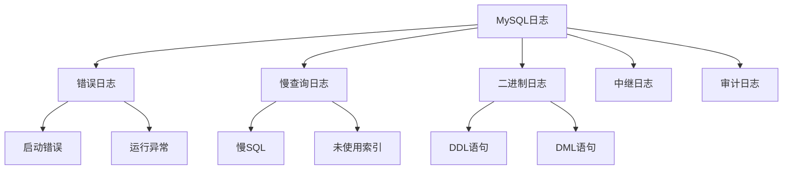

# MySQL问题排查-日志分析技巧

## 业务场景引入

MySQL日志分析是问题排查的重要手段：
- **错误日志**：诊断服务启动和运行问题
- **慢查询日志**：分析性能瓶颈
- **二进制日志**：数据恢复和主从同步问题
- **审计日志**：安全事件追踪

## MySQL日志类型

### 日志分类体系



## 错误日志分析

### 常见错误模式

```bash
#!/bin/bash
# 错误日志分析脚本

ERROR_LOG="/var/log/mysql/error.log"

analyze_error_log() {
    echo "=== MySQL错误日志分析 ==="
    
    if [ ! -f "$ERROR_LOG" ]; then
        echo "错误：日志文件不存在 $ERROR_LOG"
        return 1
    fi
    
    echo "日志文件: $ERROR_LOG"
    echo "文件大小: $(ls -lh $ERROR_LOG | awk '{print $5}')"
    
    # 1. 统计错误类型
    echo -e "\n1. 错误类型统计:"
    grep -i error "$ERROR_LOG" | \
        sed 's/.*\[ERROR\]/[ERROR]/' | \
        cut -d']' -f2 | \
        sort | uniq -c | sort -nr | head -10
    
    # 2. 最近的错误
    echo -e "\n2. 最近错误 (最后10条):"
    grep -i error "$ERROR_LOG" | tail -10
    
    # 3. 连接相关错误
    echo -e "\n3. 连接错误:"
    grep -i -E "(connection|aborted|timeout)" "$ERROR_LOG" | wc -l
    
    # 4. InnoDB相关错误
    echo -e "\n4. InnoDB错误:"
    grep -i innodb "$ERROR_LOG" | grep -i error | wc -l
}

# 实时监控错误日志
monitor_error_log() {
    echo "实时监控错误日志 (按Ctrl+C停止):"
    tail -f "$ERROR_LOG" | while read line; do
        if echo "$line" | grep -qi error; then
            echo "$(date): $line"
        fi
    done
}

case "${1:-analyze}" in
    "analyze") analyze_error_log ;;
    "monitor") monitor_error_log ;;
    *) echo "Usage: $0 {analyze|monitor}" ;;
esac
```

### 错误代码解读

```sql
-- 常见错误代码查询
SELECT 
    'Error 1045' as error_code,
    'Access denied for user' as description,
    '检查用户名密码和权限' as solution
UNION ALL
SELECT 
    'Error 2003',
    'Cannot connect to MySQL server',
    '检查服务状态和网络连接'
UNION ALL
SELECT 
    'Error 1064',
    'SQL syntax error', 
    '检查SQL语法'
UNION ALL
SELECT 
    'Error 1146',
    'Table does not exist',
    '确认表名和数据库'
UNION ALL
SELECT 
    'Error 1205',
    'Lock wait timeout exceeded',
    '检查长事务和锁冲突';
```

## 慢查询日志分析

### 慢查询配置

```sql
-- 启用慢查询日志
SET GLOBAL slow_query_log = 'ON';
SET GLOBAL long_query_time = 2;
SET GLOBAL log_queries_not_using_indexes = 'ON';

-- 查看慢查询配置
SHOW VARIABLES LIKE 'slow%';
SHOW VARIABLES LIKE 'long%';
```

### 慢查询分析工具

```python
#!/usr/bin/env python3
import re
import sys
from collections import defaultdict
from datetime import datetime

class SlowQueryAnalyzer:
    def __init__(self, log_file):
        self.log_file = log_file
        self.queries = []
    
    def parse_log(self):
        """解析慢查询日志"""
        with open(self.log_file, 'r') as f:
            content = f.read()
        
        # 按查询分割
        query_blocks = re.split(r'# Time:', content)[1:]
        
        for block in query_blocks:
            query_info = self.parse_query_block(block)
            if query_info:
                self.queries.append(query_info)
    
    def parse_query_block(self, block):
        """解析单个查询块"""
        lines = block.strip().split('\n')
        if len(lines) < 3:
            return None
        
        # 时间
        time_match = re.search(r'(\d{4}-\d{2}-\d{2}T\d{2}:\d{2}:\d{2})', lines[0])
        timestamp = time_match.group(1) if time_match else ''
        
        # 查询时间和锁时间
        query_time = 0
        lock_time = 0
        rows_sent = 0
        rows_examined = 0
        
        for line in lines:
            if line.startswith('# Query_time:'):
                match = re.search(r'Query_time: ([\d.]+).*Lock_time: ([\d.]+).*Rows_sent: (\d+).*Rows_examined: (\d+)', line)
                if match:
                    query_time = float(match.group(1))
                    lock_time = float(match.group(2))
                    rows_sent = int(match.group(3))
                    rows_examined = int(match.group(4))
        
        # SQL语句
        sql = ''
        for line in lines:
            if not line.startswith('#') and line.strip():
                sql += line + ' '
        
        return {
            'timestamp': timestamp,
            'query_time': query_time,
            'lock_time': lock_time,
            'rows_sent': rows_sent,
            'rows_examined': rows_examined,
            'sql': sql.strip()
        }
    
    def analyze(self):
        """分析慢查询"""
        if not self.queries:
            print("没有找到慢查询记录")
            return
        
        print(f"=== 慢查询分析报告 ===")
        print(f"总慢查询数: {len(self.queries)}")
        
        # 按查询时间排序
        sorted_queries = sorted(self.queries, key=lambda x: x['query_time'], reverse=True)
        
        print(f"\n最慢的5个查询:")
        for i, query in enumerate(sorted_queries[:5]):
            print(f"{i+1}. 执行时间: {query['query_time']:.2f}s")
            print(f"   扫描行数: {query['rows_examined']}")
            print(f"   SQL: {query['sql'][:100]}...")
            print()
        
        # 统计查询模式
        query_patterns = defaultdict(list)
        for query in self.queries:
            # 简化SQL模式
            pattern = re.sub(r'\b\d+\b', 'N', query['sql'])
            pattern = re.sub(r"'[^']*'", "'X'", pattern)
            query_patterns[pattern].append(query)
        
        print(f"查询模式统计 (TOP 5):")
        for i, (pattern, queries) in enumerate(sorted(query_patterns.items(), 
                                                    key=lambda x: len(x[1]), reverse=True)[:5]):
            avg_time = sum(q['query_time'] for q in queries) / len(queries)
            print(f"{i+1}. 出现次数: {len(queries)}, 平均时间: {avg_time:.2f}s")
            print(f"   模式: {pattern[:80]}...")
            print()

# 使用示例
if __name__ == "__main__":
    log_file = "/var/log/mysql/slow.log"
    analyzer = SlowQueryAnalyzer(log_file)
    analyzer.parse_log()
    analyzer.analyze()
```

## 二进制日志分析

### binlog事件分析

```bash
#!/bin/bash
# 二进制日志分析

MYSQL_DATA_DIR="/var/lib/mysql"

analyze_binlog() {
    local binlog_file=$1
    
    if [ -z "$binlog_file" ]; then
        echo "最新的binlog文件:"
        mysql -e "SHOW MASTER LOGS" | tail -5
        return
    fi
    
    echo "=== 分析 $binlog_file ==="
    
    # 1. 基本信息
    echo "1. 文件信息:"
    ls -lh "$MYSQL_DATA_DIR/$binlog_file"
    
    # 2. 事件统计
    echo -e "\n2. 事件类型统计:"
    mysqlbinlog "$MYSQL_DATA_DIR/$binlog_file" | \
        grep "^#.*end_log_pos" | \
        awk '{print $4}' | sort | uniq -c | sort -nr
    
    # 3. 最近事件
    echo -e "\n3. 最近10个事件:"
    mysqlbinlog --base64-output=DECODE-ROWS -v "$MYSQL_DATA_DIR/$binlog_file" | \
        grep -E "^#|^###" | tail -20
}

# 查找特定时间段的操作
find_operations() {
    local start_time=$1
    local end_time=$2
    local table_name=$3
    
    echo "=== 查找操作记录 ==="
    echo "时间范围: $start_time 到 $end_time"
    echo "表: $table_name"
    
    # 获取时间范围内的所有binlog
    mysql -e "SHOW BINARY LOGS" | awk '{print $1}' | grep -v Log_name | while read binlog; do
        echo "检查 $binlog..."
        
        mysqlbinlog \
            --start-datetime="$start_time" \
            --stop-datetime="$end_time" \
            --base64-output=DECODE-ROWS -v \
            "$MYSQL_DATA_DIR/$binlog" | \
            grep -A5 -B5 "$table_name" || true
    done
}

case "${1:-help}" in
    "analyze")
        analyze_binlog "$2"
        ;;
    "find")
        if [ $# -lt 3 ]; then
            echo "Usage: $0 find <start_time> <end_time> [table_name]"
            exit 1
        fi
        find_operations "$2" "$3" "$4"
        ;;
    *)
        echo "Binlog分析工具"
        echo "Usage: $0 {analyze|find}"
        ;;
esac
```

## 日志轮转管理

### 自动化日志管理

```bash
#!/bin/bash
# MySQL日志轮转管理

LOG_DIR="/var/log/mysql"
BACKUP_DIR="/backup/mysql_logs"
RETENTION_DAYS=30

rotate_logs() {
    echo "=== MySQL日志轮转 ==="
    
    # 1. 创建备份目录
    mkdir -p "$BACKUP_DIR/$(date +%Y%m)"
    
    # 2. 错误日志轮转
    if [ -f "$LOG_DIR/error.log" ]; then
        local error_size=$(stat -f%z "$LOG_DIR/error.log" 2>/dev/null || stat -c%s "$LOG_DIR/error.log")
        
        if [ "$error_size" -gt 104857600 ]; then  # 100MB
            echo "轮转错误日志..."
            mv "$LOG_DIR/error.log" "$BACKUP_DIR/$(date +%Y%m)/error_$(date +%Y%m%d_%H%M%S).log"
            mysqladmin flush-logs
        fi
    fi
    
    # 3. 慢查询日志轮转
    if [ -f "$LOG_DIR/slow.log" ]; then
        echo "轮转慢查询日志..."
        mv "$LOG_DIR/slow.log" "$BACKUP_DIR/$(date +%Y%m)/slow_$(date +%Y%m%d_%H%M%S).log"
        mysqladmin flush-logs
    fi
    
    # 4. 清理过期日志
    echo "清理过期日志 (${RETENTION_DAYS}天前)..."
    find "$BACKUP_DIR" -name "*.log" -mtime +${RETENTION_DAYS} -delete
    
    echo "日志轮转完成"
}

# 压缩旧日志
compress_old_logs() {
    echo "=== 压缩旧日志文件 ==="
    
    find "$BACKUP_DIR" -name "*.log" -mtime +7 -not -name "*.gz" | while read log_file; do
        echo "压缩: $log_file"
        gzip "$log_file"
    done
}

case "${1:-rotate}" in
    "rotate") rotate_logs ;;
    "compress") compress_old_logs ;;
    *) echo "Usage: $0 {rotate|compress}" ;;
esac
```

## 综合分析工具

### 日志统一分析

```python
#!/usr/bin/env python3
import os
import re
import json
from datetime import datetime, timedelta

class MySQLLogAnalyzer:
    def __init__(self, log_config):
        self.config = log_config
        self.analysis_result = {}
    
    def analyze_error_log(self):
        """分析错误日志"""
        error_log = self.config.get('error_log')
        if not os.path.exists(error_log):
            return
        
        with open(error_log, 'r') as f:
            lines = f.readlines()
        
        error_patterns = {
            'connection_errors': r'connection.*error|aborted.*connection',
            'innodb_errors': r'innodb.*error',
            'replication_errors': r'slave.*error|master.*error'
        }
        
        result = {}
        for pattern_name, pattern in error_patterns.items():
            count = sum(1 for line in lines if re.search(pattern, line, re.I))
            result[pattern_name] = count
        
        self.analysis_result['error_log'] = result
    
    def analyze_slow_log(self):
        """分析慢查询日志"""
        slow_log = self.config.get('slow_log')
        if not os.path.exists(slow_log):
            return
        
        with open(slow_log, 'r') as f:
            content = f.read()
        
        # 统计慢查询数量和平均时间
        query_times = re.findall(r'Query_time: ([\d.]+)', content)
        
        if query_times:
            times = [float(t) for t in query_times]
            result = {
                'total_queries': len(times),
                'avg_time': sum(times) / len(times),
                'max_time': max(times),
                'queries_over_10s': sum(1 for t in times if t > 10)
            }
        else:
            result = {'total_queries': 0}
        
        self.analysis_result['slow_log'] = result
    
    def generate_report(self):
        """生成分析报告"""
        self.analyze_error_log()
        self.analyze_slow_log()
        
        print("=== MySQL日志分析报告 ===")
        print(f"分析时间: {datetime.now()}")
        
        # 错误日志分析
        if 'error_log' in self.analysis_result:
            print("\n错误日志分析:")
            for error_type, count in self.analysis_result['error_log'].items():
                print(f"  {error_type}: {count}")
        
        # 慢查询分析
        if 'slow_log' in self.analysis_result:
            print("\n慢查询分析:")
            slow_data = self.analysis_result['slow_log']
            if slow_data['total_queries'] > 0:
                print(f"  总慢查询数: {slow_data['total_queries']}")
                print(f"  平均执行时间: {slow_data['avg_time']:.2f}秒")
                print(f"  最长执行时间: {slow_data['max_time']:.2f}秒")
                print(f"  超过10秒查询: {slow_data['queries_over_10s']}")
            else:
                print("  无慢查询记录")
        
        # 保存报告
        with open('/tmp/mysql_log_report.json', 'w') as f:
            json.dump(self.analysis_result, f, indent=2)

# 配置和使用
log_config = {
    'error_log': '/var/log/mysql/error.log',
    'slow_log': '/var/log/mysql/slow.log'
}

analyzer = MySQLLogAnalyzer(log_config)
analyzer.generate_report()
```

## 总结与最佳实践

### 日志分析要点

1. **定期检查**：建立日志检查机制
2. **模式识别**：识别常见错误模式
3. **趋势分析**：关注错误增长趋势
4. **自动化处理**：脚本化日志分析

### 关键技巧

- **日志轮转**：防止日志文件过大
- **关键字过滤**：快速定位问题
- **时间范围**：缩小问题范围
- **工具使用**：利用分析工具提高效率

通过系统化的日志分析，可以快速定位和解决MySQL问题。