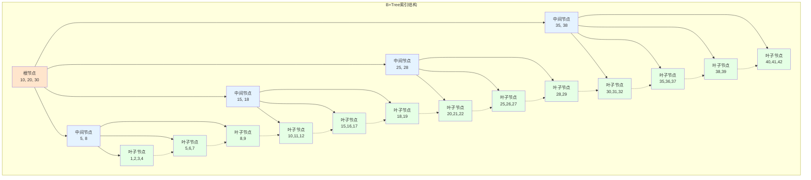
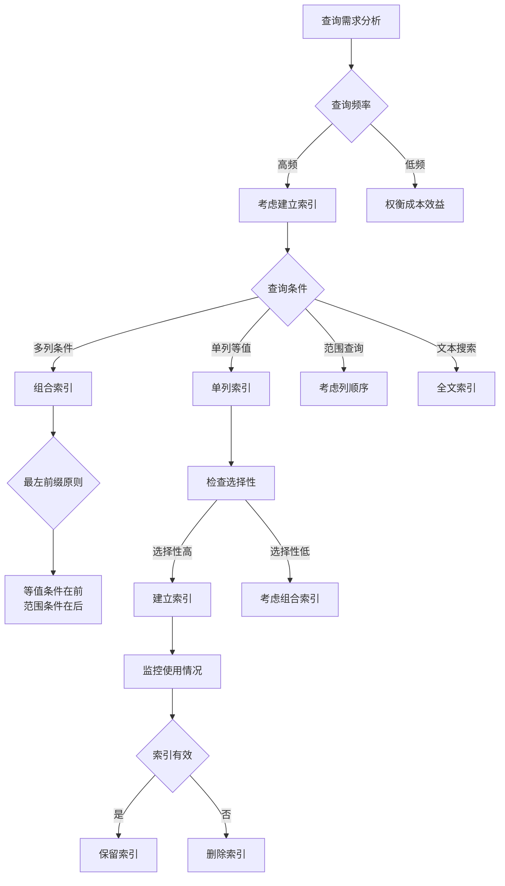

# 基础-索引机制

## 业务场景引入

在一个拥有百万用户的电商平台中，当用户搜索"红色连衣裙"时，系统需要在数百万商品中快速找到匹配结果。如果没有索引，数据库必须逐行扫描所有商品记录，这在大数据量下是灾难性的。

想象一下这些场景：
- **商品搜索**：用户输入关键词，需要毫秒级返回结果
- **订单查询**：根据订单号快速定位订单信息
- **用户登录**：通过邮箱或手机号验证用户身份
- **数据分析**：按时间范围统计销售数据

这些操作的高效执行都依赖于合理的索引设计。索引就像图书馆的目录卡片，帮助我们快速定位所需信息。

## 索引原理深度解析

### 索引数据结构

MySQL主要使用B+Tree作为索引数据结构：



### 聚簇索引vs非聚簇索引

在InnoDB存储引擎中：

```sql
-- 电商商品表设计示例
CREATE TABLE products (
    product_id BIGINT PRIMARY KEY AUTO_INCREMENT,    -- 聚簇索引（主键）
    sku VARCHAR(50) UNIQUE NOT NULL,                -- 唯一索引
    product_name VARCHAR(200) NOT NULL,             -- 普通索引候选
    category_id INT NOT NULL,                       -- 普通索引候选
    brand_id INT NOT NULL,                          -- 普通索引候选
    price DECIMAL(10,2) NOT NULL,                   -- 范围查询索引候选
    stock_quantity INT NOT NULL,                    -- 普通索引候选
    status ENUM('Active', 'Inactive', 'Deleted') DEFAULT 'Active',
    created_at TIMESTAMP DEFAULT CURRENT_TIMESTAMP,
    updated_at TIMESTAMP DEFAULT CURRENT_TIMESTAMP ON UPDATE CURRENT_TIMESTAMP,
    
    -- 主键自动创建聚簇索引
    -- PRIMARY KEY (product_id)  -- 聚簇索引
    
    -- 单列索引
    INDEX idx_sku (sku),                            -- 业务主键
    INDEX idx_category (category_id),               -- 分类查询
    INDEX idx_brand (brand_id),                     -- 品牌查询
    INDEX idx_price (price),                        -- 价格范围查询
    INDEX idx_status (status),                      -- 状态过滤
    INDEX idx_created_at (created_at),              -- 时间排序
    
    -- 组合索引
    INDEX idx_category_brand (category_id, brand_id),      -- 分类+品牌
    INDEX idx_status_price (status, price),                -- 状态+价格
    INDEX idx_category_status_price (category_id, status, price),  -- 多条件查询
    
    -- 全文索引
    FULLTEXT INDEX ft_product_name (product_name)
) ENGINE=InnoDB DEFAULT CHARSET=utf8mb4;
```

**聚簇索引特点**：
- 数据页按主键顺序物理存储
- 叶子节点直接存储完整行数据
- 一个表只能有一个聚簇索引

**非聚簇索引特点**：
- 叶子节点存储主键值（指向聚簇索引）
- 查询时可能需要回表操作
- 一个表可以有多个非聚簇索引

## 索引类型详解

### 单列索引

```sql
-- 用户表单列索引设计
CREATE TABLE users (
    user_id BIGINT PRIMARY KEY AUTO_INCREMENT,
    username VARCHAR(50) UNIQUE NOT NULL,
    email VARCHAR(100) UNIQUE NOT NULL,
    phone VARCHAR(20) UNIQUE,
    real_name VARCHAR(100),
    registration_date TIMESTAMP DEFAULT CURRENT_TIMESTAMP,
    last_login_at TIMESTAMP,
    is_active BOOLEAN DEFAULT TRUE,
    
    -- 单列索引设计
    INDEX idx_username (username),          -- 登录查询
    INDEX idx_email (email),                -- 邮箱登录
    INDEX idx_phone (phone),                -- 手机登录
    INDEX idx_registration_date (registration_date),  -- 注册时间统计
    INDEX idx_last_login (last_login_at),   -- 活跃度分析
    INDEX idx_is_active (is_active)         -- 状态过滤
) ENGINE=InnoDB DEFAULT CHARSET=utf8mb4;

-- 单列索引查询示例
-- ✅ 有效使用索引
SELECT user_id, username, email FROM users WHERE username = 'john_doe';
SELECT user_id, real_name FROM users WHERE email = 'john@example.com';
SELECT COUNT(*) FROM users WHERE registration_date >= '2024-01-01';

-- ❌ 无法使用索引的情况
SELECT * FROM users WHERE UPPER(username) = 'JOHN_DOE';  -- 函数计算
SELECT * FROM users WHERE username LIKE '%john%';        -- 前缀通配符
```

### 组合索引（复合索引）

组合索引遵循**最左前缀匹配原则**：

```sql
-- 订单表组合索引设计
CREATE TABLE orders (
    order_id BIGINT PRIMARY KEY AUTO_INCREMENT,
    user_id BIGINT NOT NULL,
    order_status ENUM('Pending', 'Paid', 'Shipped', 'Delivered', 'Cancelled') NOT NULL,
    payment_method ENUM('Alipay', 'WeChat', 'Credit_Card') NOT NULL,
    total_amount DECIMAL(10,2) NOT NULL,
    order_date TIMESTAMP DEFAULT CURRENT_TIMESTAMP,
    
    -- 组合索引设计（注意字段顺序很重要）
    INDEX idx_user_status_date (user_id, order_status, order_date),        -- 用户订单查询
    INDEX idx_status_date_amount (order_status, order_date, total_amount), -- 状态统计
    INDEX idx_date_status (order_date, order_status),                      -- 时间维度分析
    INDEX idx_payment_date (payment_method, order_date)                    -- 支付方式统计
) ENGINE=InnoDB DEFAULT CHARSET=utf8mb4;

-- 组合索引使用示例
-- ✅ 可以使用 idx_user_status_date 索引
SELECT * FROM orders WHERE user_id = 1001;                                    -- 使用第1列
SELECT * FROM orders WHERE user_id = 1001 AND order_status = 'Paid';         -- 使用前2列
SELECT * FROM orders WHERE user_id = 1001 AND order_status = 'Paid' AND order_date >= '2024-01-01';  -- 使用全部3列

-- ✅ 部分使用 idx_user_status_date 索引
SELECT * FROM orders WHERE user_id = 1001 AND order_date >= '2024-01-01';    -- 使用第1列，第3列范围查询

-- ❌ 无法使用 idx_user_status_date 索引
SELECT * FROM orders WHERE order_status = 'Paid';                            -- 缺少最左列
SELECT * FROM orders WHERE order_status = 'Paid' AND order_date >= '2024-01-01';  -- 缺少最左列
```

### 唯一索引

```sql
-- 用户认证相关唯一索引
CREATE TABLE user_accounts (
    account_id BIGINT PRIMARY KEY AUTO_INCREMENT,
    user_id BIGINT NOT NULL,
    
    -- 唯一索引确保数据唯一性
    username VARCHAR(50) NOT NULL,
    email VARCHAR(100) NOT NULL,
    phone VARCHAR(20),
    id_card VARCHAR(18),  -- 身份证号
    
    password_hash VARCHAR(255) NOT NULL,
    salt VARCHAR(32) NOT NULL,
    
    created_at TIMESTAMP DEFAULT CURRENT_TIMESTAMP,
    updated_at TIMESTAMP DEFAULT CURRENT_TIMESTAMP ON UPDATE CURRENT_TIMESTAMP,
    
    -- 唯一索引设计
    UNIQUE KEY uk_username (username),      -- 用户名唯一
    UNIQUE KEY uk_email (email),            -- 邮箱唯一
    UNIQUE KEY uk_phone (phone),            -- 手机号唯一（允许NULL）
    UNIQUE KEY uk_id_card (id_card),        -- 身份证唯一（允许NULL）
    UNIQUE KEY uk_user_id (user_id),        -- 关联用户唯一
    
    INDEX idx_created_at (created_at)
) ENGINE=InnoDB DEFAULT CHARSET=utf8mb4;

-- 唯一索引冲突处理
INSERT INTO user_accounts (user_id, username, email, password_hash, salt)
VALUES (1001, 'john_doe', 'john@example.com', 'hash123', 'salt123')
ON DUPLICATE KEY UPDATE
    password_hash = VALUES(password_hash),
    salt = VALUES(salt),
    updated_at = CURRENT_TIMESTAMP;
```

### 全文索引

```sql
-- 商品搜索全文索引
CREATE TABLE product_search (
    product_id BIGINT PRIMARY KEY,
    product_name VARCHAR(200) NOT NULL,
    brand_name VARCHAR(100),
    category_name VARCHAR(100),
    description TEXT,
    keywords VARCHAR(500),  -- 搜索关键词
    
    created_at TIMESTAMP DEFAULT CURRENT_TIMESTAMP,
    updated_at TIMESTAMP DEFAULT CURRENT_TIMESTAMP ON UPDATE CURRENT_TIMESTAMP,
    
    -- 全文索引（支持中文需要配置ngram）
    FULLTEXT INDEX ft_product_search (product_name, brand_name, description, keywords) WITH PARSER ngram,
    FULLTEXT INDEX ft_product_name (product_name) WITH PARSER ngram,
    FULLTEXT INDEX ft_description (description) WITH PARSER ngram
) ENGINE=InnoDB DEFAULT CHARSET=utf8mb4;

-- 全文索引查询
-- 自然语言模式
SELECT product_id, product_name, brand_name,
       MATCH(product_name, brand_name, description, keywords) AGAINST ('苹果手机' IN NATURAL LANGUAGE MODE) AS relevance_score
FROM product_search
WHERE MATCH(product_name, brand_name, description, keywords) AGAINST ('苹果手机' IN NATURAL LANGUAGE MODE)
ORDER BY relevance_score DESC;

-- 布尔模式
SELECT product_id, product_name, brand_name
FROM product_search
WHERE MATCH(product_name, brand_name, description, keywords) 
AGAINST ('+苹果 +手机 -华为' IN BOOLEAN MODE);

-- 查询扩展模式
SELECT product_id, product_name, brand_name
FROM product_search
WHERE MATCH(product_name, brand_name, description, keywords) 
AGAINST ('iPhone' WITH QUERY EXPANSION);
```

## 索引设计最佳实践

### 基于查询模式设计索引

```sql
-- 电商订单查询分析和索引设计
CREATE TABLE order_analysis (
    order_id BIGINT PRIMARY KEY AUTO_INCREMENT,
    user_id BIGINT NOT NULL,
    merchant_id BIGINT NOT NULL,
    order_status ENUM('Pending', 'Paid', 'Shipped', 'Delivered', 'Cancelled', 'Refunded') NOT NULL,
    payment_status ENUM('Unpaid', 'Paid', 'Failed', 'Refunded') NOT NULL,
    order_date TIMESTAMP NOT NULL,
    payment_date TIMESTAMP NULL,
    shipping_date TIMESTAMP NULL,
    total_amount DECIMAL(12,2) NOT NULL,
    
    -- 根据常见查询模式设计索引
    
    -- 1. 用户查询自己的订单（按时间倒序）
    INDEX idx_user_date_desc (user_id, order_date DESC),
    
    -- 2. 商家查询订单（按状态和时间）
    INDEX idx_merchant_status_date (merchant_id, order_status, order_date),
    
    -- 3. 支付状态查询
    INDEX idx_payment_status_date (payment_status, payment_date),
    
    -- 4. 订单状态统计（覆盖索引）
    INDEX idx_status_amount_date (order_status, total_amount, order_date),
    
    -- 5. 时间范围查询
    INDEX idx_order_date (order_date),
    
    -- 6. 金额范围查询
    INDEX idx_amount_range (total_amount)
) ENGINE=InnoDB DEFAULT CHARSET=utf8mb4;

-- 对应的查询语句
-- 查询1：用户订单列表
SELECT order_id, order_status, total_amount, order_date
FROM order_analysis 
WHERE user_id = 1001 
ORDER BY order_date DESC 
LIMIT 20;

-- 查询2：商家待发货订单
SELECT order_id, user_id, total_amount, order_date
FROM order_analysis 
WHERE merchant_id = 2001 
  AND order_status = 'Paid' 
ORDER BY order_date ASC;

-- 查询3：支付失败订单
SELECT COUNT(*), SUM(total_amount)
FROM order_analysis 
WHERE payment_status = 'Failed' 
  AND payment_date >= '2024-01-01';

-- 查询4：订单状态统计（使用覆盖索引）
SELECT order_status, COUNT(*), SUM(total_amount), AVG(total_amount)
FROM order_analysis 
WHERE order_date >= '2024-01-01'
GROUP BY order_status;
```

### 索引优化策略

```sql
-- 索引长度优化
CREATE TABLE user_profiles (
    profile_id BIGINT PRIMARY KEY AUTO_INCREMENT,
    user_id BIGINT NOT NULL,
    bio TEXT,
    signature VARCHAR(500),
    avatar_url VARCHAR(1000),  -- 很长的URL
    
    -- ✅ 使用前缀索引减少索引大小
    INDEX idx_signature_prefix (signature(100)),      -- 只索引前100个字符
    INDEX idx_avatar_url_prefix (avatar_url(200)),     -- 只索引前200个字符
    
    -- ❌ 不建议对整个长字段建索引
    -- INDEX idx_signature_full (signature),          -- 太长，浪费空间
    
    INDEX idx_user_id (user_id)
) ENGINE=InnoDB DEFAULT CHARSET=utf8mb4;

-- 检查前缀索引的区分度
SELECT 
    COUNT(DISTINCT LEFT(signature, 50)) / COUNT(*) AS prefix_50_selectivity,
    COUNT(DISTINCT LEFT(signature, 100)) / COUNT(*) AS prefix_100_selectivity,
    COUNT(DISTINCT LEFT(signature, 150)) / COUNT(*) AS prefix_150_selectivity,
    COUNT(DISTINCT signature) / COUNT(*) AS full_selectivity
FROM user_profiles 
WHERE signature IS NOT NULL;
```

### 避免索引失效

```sql
-- 常见索引失效情况和解决方案

-- ❌ 函数操作导致索引失效
SELECT * FROM orders WHERE YEAR(order_date) = 2024;
SELECT * FROM users WHERE UPPER(username) = 'ADMIN';

-- ✅ 改写为索引友好的查询
SELECT * FROM orders WHERE order_date >= '2024-01-01' AND order_date < '2025-01-01';
SELECT * FROM users WHERE username = 'admin';  -- 假设存储时已经标准化

-- ❌ 类型转换导致索引失效
SELECT * FROM orders WHERE order_id = '1001';  -- order_id是BIGINT，查询用字符串

-- ✅ 使用正确的数据类型
SELECT * FROM orders WHERE order_id = 1001;

-- ❌ OR条件可能导致索引失效
SELECT * FROM products WHERE category_id = 1 OR brand_id = 2;

-- ✅ 使用UNION替代OR（如果合适）
SELECT * FROM products WHERE category_id = 1
UNION
SELECT * FROM products WHERE brand_id = 2;

-- ❌ LIKE前缀通配符
SELECT * FROM products WHERE product_name LIKE '%手机%';

-- ✅ 使用全文索引或其他方案
SELECT * FROM products WHERE MATCH(product_name) AGAINST ('手机');
```

## 索引监控与优化

### 索引使用情况分析

```sql
-- 查看索引使用统计
SELECT 
    t.table_schema AS database_name,
    t.table_name,
    s.index_name,
    s.column_name,
    s.seq_in_index,
    s.cardinality,
    ROUND(s.cardinality / t.table_rows * 100, 2) AS selectivity_percent
FROM information_schema.statistics s
JOIN information_schema.tables t ON s.table_schema = t.table_schema AND s.table_name = t.table_name
WHERE t.table_schema = 'ecommerce'
  AND t.table_type = 'BASE TABLE'
ORDER BY t.table_name, s.index_name, s.seq_in_index;

-- 查看未使用的索引
SELECT 
    object_schema AS database_name,
    object_name AS table_name,
    index_name,
    COUNT_READ,
    COUNT_WRITE,
    COUNT_FETCH,
    COUNT_INSERT,
    COUNT_UPDATE,
    COUNT_DELETE
FROM performance_schema.table_io_waits_summary_by_index_usage
WHERE object_schema = 'ecommerce'
  AND index_name IS NOT NULL
  AND index_name != 'PRIMARY'
  AND COUNT_READ = 0
ORDER BY object_name, index_name;

-- 分析慢查询中的索引使用
SELECT 
    query_sample_text,
    exec_count,
    avg_timer_wait / 1000000000000 AS avg_exec_time_sec,
    rows_examined_avg,
    rows_sent_avg,
    tmp_tables_avg,
    sort_rows_avg
FROM performance_schema.events_statements_summary_by_digest
WHERE schema_name = 'ecommerce'
  AND avg_timer_wait / 1000000000000 > 1  -- 平均执行时间超过1秒
ORDER BY avg_timer_wait DESC
LIMIT 10;
```

### 索引维护操作

```sql
-- 重建索引统计信息
ANALYZE TABLE products, orders, users;

-- 优化表（整理碎片）
OPTIMIZE TABLE products;

-- 重建索引
ALTER TABLE products DROP INDEX idx_category_brand;
ALTER TABLE products ADD INDEX idx_category_brand (category_id, brand_id);

-- 在线DDL操作（MySQL 5.6+）
ALTER TABLE products 
ADD INDEX idx_price_stock (price, stock_quantity),
ALGORITHM=INPLACE, LOCK=NONE;

-- 查看表的碎片情况
SELECT 
    table_name,
    ROUND(((data_length + index_length) / 1024 / 1024), 2) AS total_size_mb,
    ROUND((data_free / 1024 / 1024), 2) AS free_space_mb,
    ROUND((data_free / (data_length + index_length)) * 100, 2) AS fragmentation_percent
FROM information_schema.tables
WHERE table_schema = 'ecommerce'
  AND data_free > 0
ORDER BY fragmentation_percent DESC;
```

## 索引设计决策树



## 总结与实战建议

### 索引设计黄金法则

1. **查询驱动原则**：根据实际查询模式设计索引，不要为了索引而索引
2. **最左前缀原则**：组合索引的字段顺序要符合查询需求
3. **覆盖索引优化**：让索引包含查询所需的所有字段，避免回表
4. **适度原则**：平衡查询性能和写入性能，避免过多索引

### 性能监控要点

```sql
-- 定期检查索引效果
-- 1. 慢查询分析
SHOW VARIABLES LIKE 'slow_query_log%';
SHOW VARIABLES LIKE 'long_query_time';

-- 2. 索引统计信息
SHOW INDEX FROM products;

-- 3. 查询执行计划
EXPLAIN FORMAT=JSON SELECT * FROM products WHERE category_id = 1 AND price > 100;
```

索引是数据库性能优化的核心工具，合理的索引设计能够显著提升查询效率。在下一章节中，我们将学习MySQL的事务处理机制。