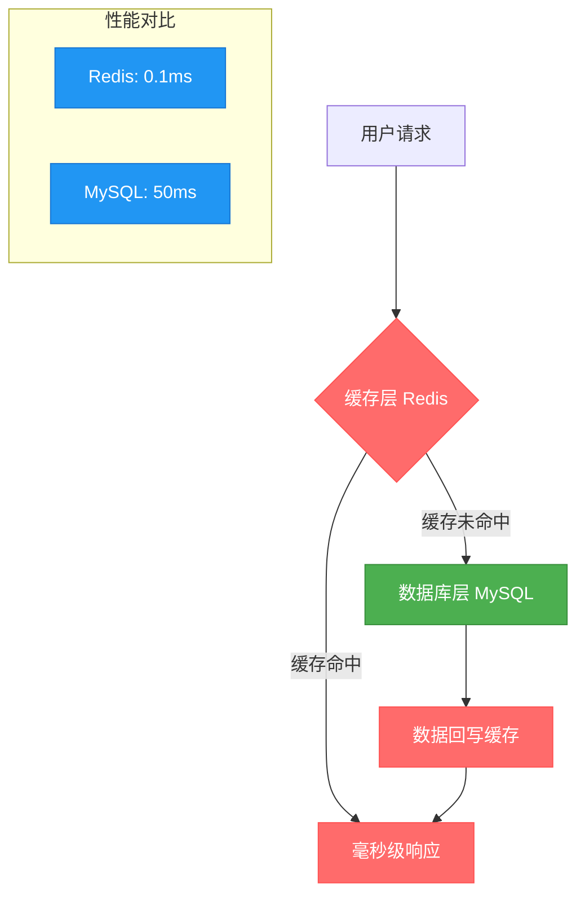
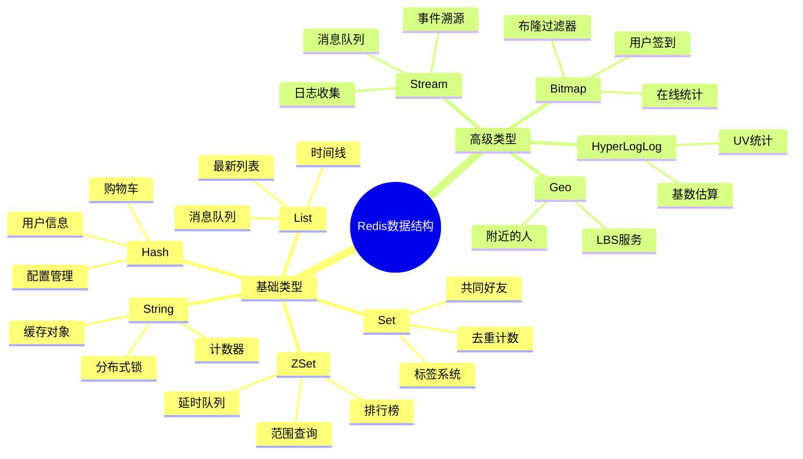
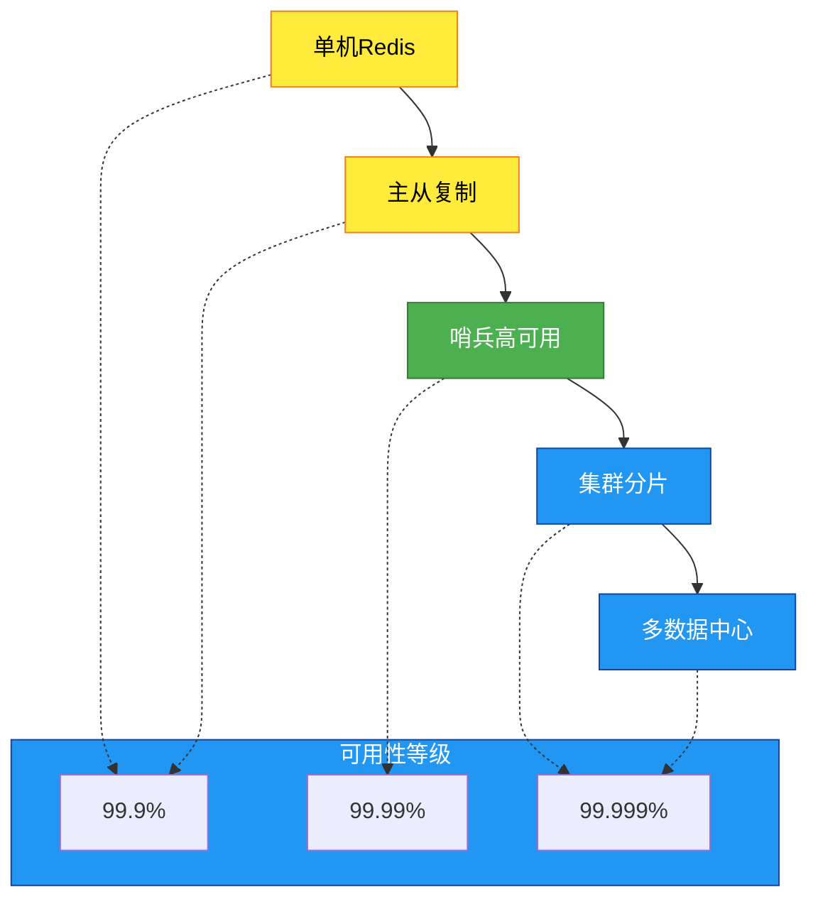

# 知识体系介绍

在当今互联网高并发、大数据的时代背景下，传统关系型数据库往往难以满足毫秒级响应和海量数据处理的需求。Redis作为一款卓越的内存数据库，以其独特的技术架构和丰富的应用场景，成为了现代分布式系统架构中的核心组件。

## 为什么Redis如此重要？

### 现代应用面临的挑战

想象一下双十一期间，淘宝需要处理数十万QPS的商品查询请求，如果每次都查询MySQL数据库，不仅响应时间无法满足用户体验要求，数据库服务器也会因为压力过大而崩溃。这就是传统架构面临的核心问题：

- **响应时间瓶颈**：关系型数据库磁盘IO延迟通常在几十毫秒级别
- **并发处理能力不足**：单台MySQL服务器很难支撑万级并发
- **扩展性限制**：垂直扩展成本高昂，水平扩展复杂度极高

### Redis的价值定位

Redis（Remote Dictionary Server）正是为解决这些痛点而诞生的技术方案：



**核心价值体现：**
- **极致性能**：基于内存存储，单实例可达10万+QPS
- **灵活架构**：支持多种数据结构，适配复杂业务场景
- **高可用保障**：完善的主从复制、哨兵、集群方案
- **开发效率**：简单易用的API，降低开发复杂度

## Redis技术知识体系构建

基于多年的实践经验和技术演进趋势，我将Redis知识体系划分为四个递进层次，每个层次都有其独特的学习重点和实践价值。

### 第一层：技术基础与核心原理

**学习目标**：理解Redis的设计思想和核心机制

这一层是整个Redis技术栈的根基，需要深入理解Redis为什么能够实现如此高的性能，以及其技术架构的设计哲学。

**核心知识点：**
- **基础概念深度解析**：Redis的定义、特征、与传统数据库的本质区别
- **性能密码解读**：单线程模型、内存管理、IO多路复用的技术原理
- **架构设计思想**：为什么选择单线程？如何保证数据安全性？

**实战思考**：
> 💡 **案例引导**：当你的电商网站商品详情页面需要承载10万QPS访问时，传统的"应用→MySQL"架构会发生什么？Redis如何优雅地解决这个问题？

### 第二层：数据结构与应用模式

**学习目标**：掌握Redis丰富数据结构的应用艺术

Redis之所以能够适配如此多样的业务场景，核心在于其提供了超越简单Key-Value的丰富数据结构。每种数据结构都有其独特的应用场景和性能特点。



**深度学习要点：**
- **数据结构选型策略**：不同业务场景下如何选择最优数据结构
- **底层实现原理**：SDS、跳跃表、压缩列表等核心数据结构
- **性能优化技巧**：如何避免大key问题，优化内存使用

**实战案例驱动**：
> 🎯 **真实场景**：如何用Redis ZSet实现一个支持千万级用户的游戏排行榜？既要保证实时性，又要控制内存消耗？

### 第三层：核心机制与进阶特性

**学习目标**：深入理解Redis的核心机制，掌握高级应用技巧

这一层涉及Redis的内部工作机制和高级特性，是从使用者向专家进阶的关键阶段。

**关键技术领域：**

| 技术领域 | 核心价值 | 应用场景 | 学习重点 |
|---------|----------|----------|----------|
| **持久化机制** | 数据安全保障 | 数据备份、灾难恢复 | RDB vs AOF选择策略 |
| **发布订阅** | 实时消息通信 | 系统解耦、事件广播 | 与消息队列的区别 |
| **Stream队列** | 可靠消息处理 | 日志收集、事件溯源 | 消费组管理机制 |
| **事务与脚本** | 原子性操作 | 复杂业务逻辑 | Lua脚本最佳实践 |

**技术深度探索：**
- **持久化策略选择**：如何在性能和数据安全之间找到平衡点
- **内存管理机制**：过期策略、内存淘汰算法的深度剖析
- **网络通信模型**：Redis如何实现高并发网络处理

**生产环境思考**：
> ⚠️ **关键决策**：当你的Redis实例内存使用率达到80%时，应该选择哪种内存淘汰策略？不同策略对业务的影响是什么？

### 第四层：高可用架构与集群技术

**学习目标**：构建企业级Redis高可用解决方案

这是Redis技术体系的最高层，涉及分布式系统设计和大规模集群运维，是Redis架构师必备的核心技能。

**架构演进路径：**



**核心架构能力：**

1. **主从复制体系**
   - 数据同步机制：全量复制 vs 增量复制
   - 读写分离策略：如何平衡性能和一致性
   - 故障恢复流程：数据完整性保障

2. **哨兵高可用方案**
   - 故障检测机制：主观下线 vs 客观下线
   - 自动故障转移：选主算法和切换流程
   - 脑裂防护：如何避免数据不一致

3. **集群分片技术**
   - 哈希槽分布：16384个槽位的设计原理
   - 扩容与缩容：在线迁移的技术挑战
   - 跨槽事务：分布式事务的解决方案

**企业级应用考量**：
> 🏗️ **架构决策**：你的Redis集群需要支撑1TB数据和100万QPS，应该如何设计分片策略？如何保证99.99%的可用性？

## 实战应用与最佳实践

### 缓存架构设计精髓

在实际生产环境中，Redis的应用远不止简单的get/set操作，而是需要针对业务特点设计合理的缓存架构。

**核心实践领域：**

1. **缓存模式设计**
   ```mermaid
   graph LR
       A[Cache-Aside] --> B[Read-Through]
       B --> C[Write-Through]
       C --> D[Write-Behind]
       
       subgraph "适用场景"
           E[读多写少]
           F[实时一致性]
           G[最终一致性]
           H[高写入性能]
       end
       
       A -.-> E
       B -.-> F
       C -.-> F
       D -.-> G
       D -.-> H
   ```

2. **典型问题解决方案**
   - **缓存雪崩**：大量key同时过期导致数据库压力激增
   - **缓存穿透**：恶意查询不存在的数据绕过缓存
   - **缓存击穿**：热点key过期瞬间大量请求击中数据库
   - **数据一致性**：缓存与数据库数据同步的技术挑战

3. **性能调优体系**
   - **内存优化**：合理的数据结构选择和过期策略
   - **网络优化**：连接池管理和批量操作
   - **监控体系**：关键指标监控和预警机制

### 技术选型与架构决策

**Redis vs 其他技术方案对比**

| 对比维度 | Redis | Memcached | 本地缓存 | 数据库 |
|----------|-------|-----------|----------|--------|
| **性能** | 极高 | 极高 | 最高 | 较低 |
| **功能性** | 丰富 | 简单 | 有限 | 完整 |
| **扩展性** | 优秀 | 良好 | 受限 | 复杂 |
| **可靠性** | 高 | 中等 | 低 | 最高 |
| **开发复杂度** | 中等 | 低 | 低 | 高 |

**业务场景最佳实践：**
> 🎯 **实战经验**：电商秒杀场景下，如何设计Redis缓存架构来支撑百万级并发？从库存预扣到订单处理，每个环节的技术方案都至关重要。

## 学习路径建议

### 入门阶段（1-2周）
- 理解Redis基本概念和应用价值
- 掌握5种基础数据结构的使用
- 完成基本的CRUD操作练习

### 进阶阶段（2-4周）
- 深入学习Redis内部机制
- 掌握持久化、发布订阅等高级特性
- 实践典型业务场景的解决方案

### 高级阶段（1-2月）
- 设计和实施高可用Redis集群
- 解决复杂的缓存架构问题
- 进行性能调优和故障排查

### 专家阶段（长期积累）
- 深度定制Redis解决方案
- 参与开源社区贡献
- 指导团队技术决策和架构设计

---

> 💡 **技术成长建议**：Redis技术的掌握不仅要理论扎实，更要在实际项目中不断实践。建议结合具体业务场景，从简单的缓存应用开始，逐步向复杂的分布式架构演进，在解决实际问题的过程中深化对Redis技术的理解。

