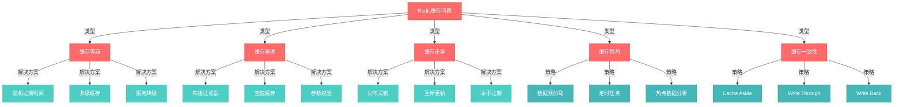
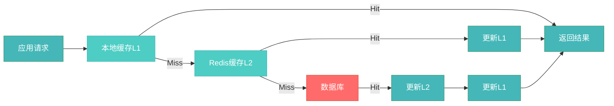

# 缓存问题雪崩穿透等

## 概述

> Redis 作为高性能缓存中间件，在分布式系统中扮演着重要角色。然而，在生产环境中，缓存系统往往会面临各种挑战性问题，如缓存雪崩、缓存穿透、缓存击穿等，这些问题如果处理不当，可能会对整个系统造成致命影响。

在高并发、大流量的系统中，缓存的重要性不言而喻。它不仅能够显著提升系统响应速度，减轻数据库压力，还能够提高系统的整体吞吐量。但是，正因为缓存的重要性，一旦出现问题，往往会产生连锁反应，导致整个服务不可用。

**常见的Redis缓存问题包括：**

- **缓存雪崩**：大量缓存在同一时间失效，导致请求直接打到数据库
- **缓存穿透**：大量请求查询不存在的数据，绕过缓存层直击数据库
- **缓存击穿**：热点数据失效时，大量并发请求同时访问数据库
- **缓存预热**：系统启动时如何有效加载缓存数据
- **缓存一致性**：缓存与数据库数据同步问题

本文将深入分析这些常见问题的产生原因、影响范围，并提供系统性的解决方案和最佳实践。通过学习本文，你将能够：

- 理解各种缓存问题的本质和产生机制
- 掌握针对性的解决方案和预防策略
- 学会设计高可用的缓存架构
- 了解缓存问题的监控和诊断方法



## 知识要点

### 1. 缓存雪崩（Cache Avalanche）

缓存雪崩是指在同一时间段内，大量缓存key同时失效或者Redis服务器宕机，导致大量请求直接访问数据库，从而给数据库带来巨大压力，引发数据库崩溃的情况。

#### 1.1 问题分析

**产生原因：**

1. **集中过期**：大量缓存数据设置了相同的过期时间，在某个时间点集中失效
2. **Redis宕机**：Redis服务器出现故障，所有缓存都不可用
3. **网络分区**：Redis与应用服务器之间网络中断，导致缓存不可访问
4. **大量热点数据同时失效**：特定业务场景下，大量相关数据同时失效

**影响范围：**

- 数据库压力骤增，可能导致数据库崩溃
- 系统响应时间大幅增加
- 用户体验严重下降，可能出现超时错误
- 服务器资源消耗大量增加（CPU、内存、网络）

#### 1.2 解决方案

**方案一：随机过期时间**

为缓存数据设置随机的过期时间，避免大量数据同时失效。

```java
/**
 * 随机过期时间缓存工具类
 */
public class RandomExpirationCacheUtil {
    
    private final RedisTemplate<String, Object> redisTemplate;
    private final Random random = new Random();
    
    public RandomExpirationCacheUtil(RedisTemplate<String, Object> redisTemplate) {
        this.redisTemplate = redisTemplate;
    }
    
    /**
     * 设置缓存，使用随机过期时间
     * @param key 缓存key
     * @param value 缓存值
     * @param baseTimeout 基础过期时间（秒）
     * @param randomRange 随机范围（秒）
     */
    public void setWithRandomExpiration(String key, Object value, 
                                       long baseTimeout, long randomRange) {
        // 在基础时间上加上随机时间
        long finalTimeout = baseTimeout + random.nextInt((int) randomRange);
        redisTemplate.opsForValue().set(key, value, finalTimeout, TimeUnit.SECONDS);
    }
    
    /**
     * 获取缓存数据，如果不存在则加载并设置随机过期
     */
    public <T> T getOrLoad(String key, Class<T> clazz, 
                          Supplier<T> dataLoader, 
                          long baseTimeout, long randomRange) {
        // 先从缓存获取
        Object cached = redisTemplate.opsForValue().get(key);
        if (cached != null) {
            return (T) cached;
        }
        
        // 缓存不存在，从数据源加载
        T data = dataLoader.get();
        if (data != null) {
            setWithRandomExpiration(key, data, baseTimeout, randomRange);
        }
        
        return data;
    }
}
```

**方案二：多级缓存架构**

构建多级缓存系统，包括本地缓存、Redis缓存和数据库，当一级缓存失效时，可以从下一级获取数据。



```java
/**
 * 多级缓存管理器
 */
@Component
public class MultiLevelCacheManager {
    
    private final Cache localCache; // 本地缓存（如Caffeine）
    private final RedisTemplate<String, Object> redisTemplate;
    private final RandomExpirationCacheUtil cacheUtil;
    
    public MultiLevelCacheManager(Cache localCache, 
                                 RedisTemplate<String, Object> redisTemplate) {
        this.localCache = localCache;
        this.redisTemplate = redisTemplate;
        this.cacheUtil = new RandomExpirationCacheUtil(redisTemplate);
    }
    
    /**
     * 获取数据，优先从本地缓存，其次Redis，最后数据库
     */
    public <T> T get(String key, Class<T> clazz, Supplier<T> dataLoader) {
        // L1: 本地缓存
        T localData = (T) localCache.getIfPresent(key);
        if (localData != null) {
            return localData;
        }
        
        // L2: Redis缓存
        Object redisData = redisTemplate.opsForValue().get(key);
        if (redisData != null) {
            // 更新本地缓存
            localCache.put(key, redisData);
            return (T) redisData;
        }
        
        // L3: 数据库
        T dbData = dataLoader.get();
        if (dbData != null) {
            // 更新所有级别缓存
            localCache.put(key, dbData);
            cacheUtil.setWithRandomExpiration(key, dbData, 3600, 300); // 1小时±5分钟
        }
        
        return dbData;
    }
    
    /**
     * 删除所有级别的缓存
     */
    public void evict(String key) {
        localCache.invalidate(key);
        redisTemplate.delete(key);
    }
}
```

**方案三：服务降级和熔断机制**

当检测到缓存雪崩时，开启服务降级和熔断机制，保护数据库不被击穿。

```java
/**
 * 缓存雪崩保护组件
 */
@Component
public class CacheAvalancheProtector {
    
    private final CircuitBreaker circuitBreaker;
    private final AtomicInteger requestCounter = new AtomicInteger(0);
    private final AtomicInteger errorCounter = new AtomicInteger(0);
    
    // 熔断器配置
    private static final int FAILURE_THRESHOLD = 50; // 失败阈值
    private static final int SUCCESS_THRESHOLD = 10; // 成功阈值
    private static final long TIMEOUT_DURATION = 60000; // 超时时间（毫秒）
    
    public CacheAvalancheProtector() {
        this.circuitBreaker = CircuitBreaker.ofDefaults("cache-avalanche");
        configureCircuitBreaker();
    }
    
    private void configureCircuitBreaker() {
        circuitBreaker.getEventPublisher()
            .onStateTransition(event -> {
                log.info("熔断器状态变化: {} -> {}", 
                        event.getStateTransition().getFromState(),
                        event.getStateTransition().getToState());
            });
    }
    
    /**
     * 受保护的数据库访问
     */
    public <T> T protectedDatabaseAccess(String key, Supplier<T> databaseQuery) {
        return circuitBreaker.executeSupplier(() -> {
            try {
                requestCounter.incrementAndGet();
                T result = databaseQuery.get();
                
                // 检查是否发生雪崩
                if (isAvalancheOccurred()) {
                    throw new CacheAvalancheException("检测到缓存雪崩，开启保护机制");
                }
                
                return result;
            } catch (Exception e) {
                errorCounter.incrementAndGet();
                throw e;
            }
        });
    }
    
    /**
     * 检查是否发生缓存雪崩
     */
    private boolean isAvalancheOccurred() {
        int totalRequests = requestCounter.get();
        int totalErrors = errorCounter.get();
        
        // 简单的雪崩检测逻辑：错误率超过50%且请求量超过100
        return totalRequests > 100 && (totalErrors * 1.0 / totalRequests) > 0.5;
    }
    
    /**
     * 获取降级数据
     */
    public <T> T getFallbackData(String key, Class<T> clazz) {
        // 返回默认值或缓存的静态数据
        log.warn("缓存雪崩保护激活，返回降级数据: {}", key);
        
        // 这里可以返回默认值或者静态数据
        if (clazz == String.class) {
            return (T) "DEFAULT_VALUE";
        } else if (clazz == List.class) {
            return (T) Collections.emptyList();
        }
        
        return null;
    }
}

/**
 * 缓存雪崩异常
 */
public class CacheAvalancheException extends RuntimeException {
    public CacheAvalancheException(String message) {
        super(message);
    }
}
```

**方案四：服务限流**

在缓存失效时，限制对数据库的访问量，防止数据库被击穿。

```java
/**
 * 基于令牌桶的限流器
 */
@Component
public class DatabaseRateLimiter {
    
    private final RateLimiter rateLimiter;
    
    public DatabaseRateLimiter() {
        // 每秒允许100个请求访问数据库
        this.rateLimiter = RateLimiter.create(100.0);
    }
    
    /**
     * 限流数据库访问
     */
    public <T> T limitedDatabaseAccess(String operation, Supplier<T> databaseQuery) {
        if (rateLimiter.tryAcquire(1, TimeUnit.SECONDS)) {
            try {
                return databaseQuery.get();
            } catch (Exception e) {
                log.error("数据库访问异常: {}", operation, e);
                throw e;
            }
        } else {
            log.warn("数据库访问被限流，操作: {}", operation);
            throw new RateLimitExceededException("数据库访问频率超限");
        }
    }
}

/**
 * 限流异常
 */
public class RateLimitExceededException extends RuntimeException {
    public RateLimitExceededException(String message) {
        super(message);
    }
}
```

### 2. 缓存穿透（Cache Penetration）

缓存穿透是指查询一个不存在的数据，由于缓存和数据库都没有该数据，每次查询都会直接访问数据库，失去了缓存的保护作用。

#### 2.1 问题分析

**产生原因：**
1. **恶意攻击**：故意查询不存在的数据，绕过缓存层
2. **业务逻辑问题**：查询参数错误或数据不存在
3. **系统bug**：程序逻辑错误导致查询无效数据

#### 2.2 解决方案

**方案一：布隆过滤器**

使用布隆过滤器预先存储所有可能存在的key，查询时先检查布隆过滤器。

```java
@Component
public class BloomFilterCache {
    
    private final BloomFilter<String> bloomFilter;
    private final RedisTemplate<String, Object> redisTemplate;
    
    public BloomFilterCache() {
        // 创建布隆过滤器，预期元素100万，误判率0.01%
        this.bloomFilter = BloomFilter.create(
            Funnels.stringFunnel(Charset.defaultCharset()), 
            1000000, 0.0001);
        this.redisTemplate = new RedisTemplate<>();
    }
    
    public <T> T getWithBloomFilter(String key, Supplier<T> dataLoader) {
        // 先检查布隆过滤器
        if (!bloomFilter.mightContain(key)) {
            return null; // 肯定不存在
        }
        
        // 可能存在，查询缓存
        Object cached = redisTemplate.opsForValue().get(key);
        if (cached != null) {
            return (T) cached;
        }
        
        // 查询数据库
        T data = dataLoader.get();
        if (data != null) {
            redisTemplate.opsForValue().set(key, data, 3600, TimeUnit.SECONDS);
        }
        
        return data;
    }
    
    public void addToBloomFilter(String key) {
        bloomFilter.put(key);
    }
}
```

**方案二：空值缓存**

将空查询结果也缓存起来，但设置较短的过期时间。

```java
@Component
public class NullValueCache {
    
    private static final String NULL_VALUE = "NULL";
    private final RedisTemplate<String, Object> redisTemplate;
    
    public <T> T getWithNullCache(String key, Supplier<T> dataLoader) {
        Object cached = redisTemplate.opsForValue().get(key);
        
        if (NULL_VALUE.equals(cached)) {
            return null; // 空值缓存
        }
        
        if (cached != null) {
            return (T) cached;
        }
        
        T data = dataLoader.get();
        if (data != null) {
            redisTemplate.opsForValue().set(key, data, 3600, TimeUnit.SECONDS);
        } else {
            // 缓存空值，较短过期时间
            redisTemplate.opsForValue().set(key, NULL_VALUE, 300, TimeUnit.SECONDS);
        }
        
        return data;
    }
}
```

### 3. 缓存击穿（Cache Breakdown）

缓存击穿是指某个热点key在失效的瞬间，大量并发请求同时访问这个key，导致所有请求都直接访问数据库。

#### 3.1 问题分析

**产生原因：**
1. **热点数据过期**：高频访问的key在过期瞬间被大量请求
2. **并发访问**：多个线程同时访问同一个key
3. **缓存重建耗时**：数据重建过程耗时较长

#### 3.2 解决方案

**方案一：分布式锁**

使用分布式锁保证只有一个线程去数据库加载数据。

```java
@Component
public class DistributedLockCache {
    
    private final RedisTemplate<String, Object> redisTemplate;
    private final StringRedisTemplate stringRedisTemplate;
    
    public <T> T getWithDistributedLock(String key, Supplier<T> dataLoader, 
                                       long lockTimeout, long cacheTimeout) {
        // 先查缓存
        Object cached = redisTemplate.opsForValue().get(key);
        if (cached != null) {
            return (T) cached;
        }
        
        String lockKey = "lock:" + key;
        String lockValue = UUID.randomUUID().toString();
        
        try {
            // 获取分布式锁
            Boolean acquired = stringRedisTemplate.opsForValue()
                .setIfAbsent(lockKey, lockValue, lockTimeout, TimeUnit.SECONDS);
                
            if (acquired != null && acquired) {
                // 获取锁成功，再次检查缓存
                cached = redisTemplate.opsForValue().get(key);
                if (cached != null) {
                    return (T) cached;
                }
                
                // 加载数据
                T data = dataLoader.get();
                if (data != null) {
                    redisTemplate.opsForValue().set(key, data, cacheTimeout, TimeUnit.SECONDS);
                }
                return data;
            } else {
                // 获取锁失败，等待后再查缓存
                Thread.sleep(100);
                return getWithDistributedLock(key, dataLoader, lockTimeout, cacheTimeout);
            }
        } catch (InterruptedException e) {
            Thread.currentThread().interrupt();
            return dataLoader.get();
        } finally {
            // 释放锁
            releaseLock(lockKey, lockValue);
        }
    }
    
    private void releaseLock(String lockKey, String lockValue) {
        String script = "if redis.call('get', KEYS[1]) == ARGV[1] then " +
                       "return redis.call('del', KEYS[1]) else return 0 end";
        stringRedisTemplate.execute(
            RedisScript.of(script, Long.class),
            Collections.singletonList(lockKey),
            lockValue
        );
    }
}
```

### 4. 缓存预热（Cache Warming）

缓存预热是指在系统启动时或在业务低峰期，提前将热点数据加载到缓存中，避免系统启动初期因缓存空白导致的大量数据库查询。

#### 4.1 问题分析

**需要预热的场景：**
1. **系统重启**：应用重启后缓存为空，需要重新加载数据
2. **新增节点**：集群扩容时新节点缓存为空
3. **热点数据变更**：业务规则变化导致热点数据发生变化
4. **定期刷新**：某些数据需要定期更新缓存

#### 4.2 解决方案

**方案一：启动时数据预加载**

```java
/**
 * 缓存预热服务
 */
@Component
public class CacheWarmupService {
    
    private final RedisTemplate<String, Object> redisTemplate;
    private final UserService userService;
    private final ProductService productService;
    
    @EventListener(ApplicationReadyEvent.class)
    public void warmupCache() {
        log.info("开始缓存预热...");
        
        CompletableFuture.allOf(
            CompletableFuture.runAsync(this::warmupUserCache),
            CompletableFuture.runAsync(this::warmupProductCache),
            CompletableFuture.runAsync(this::warmupConfigCache)
        ).join();
        
        log.info("缓存预热完成");
    }
    
    /**
     * 预热用户缓存
     */
    private void warmupUserCache() {
        try {
            // 加载热点用户数据
            List<User> hotUsers = userService.getHotUsers();
            for (User user : hotUsers) {
                String key = "user:" + user.getId();
                redisTemplate.opsForValue().set(key, user, 3600, TimeUnit.SECONDS);
            }
            log.info("用户缓存预热完成，加载了{}个用户", hotUsers.size());
        } catch (Exception e) {
            log.error("用户缓存预热失败", e);
        }
    }
    
    /**
     * 预热商品缓存
     */
    private void warmupProductCache() {
        try {
            // 分批加载商品数据
            int pageSize = 100;
            int pageNum = 0;
            List<Product> products;
            
            do {
                products = productService.getHotProducts(pageNum, pageSize);
                for (Product product : products) {
                    String key = "product:" + product.getId();
                    redisTemplate.opsForValue().set(key, product, 7200, TimeUnit.SECONDS);
                }
                pageNum++;
                Thread.sleep(100); // 避免对数据库造成过大压力
            } while (!products.isEmpty());
            
            log.info("商品缓存预热完成");
        } catch (Exception e) {
            log.error("商品缓存预热失败", e);
        }
    }
    
    /**
     * 预热配置缓存
     */
    private void warmupConfigCache() {
        try {
            Map<String, Object> configs = configService.getAllConfigs();
            configs.forEach((key, value) -> {
                redisTemplate.opsForValue().set("config:" + key, value, 1800, TimeUnit.SECONDS);
            });
            log.info("配置缓存预热完成，加载了{}个配置项", configs.size());
        } catch (Exception e) {
            log.error("配置缓存预热失败", e);
        }
    }
}
```

**方案二：定时任务预热**

```java
/**
 * 定时缓存预热任务
 */
@Component
public class ScheduledCacheWarmup {
    
    private final RedisTemplate<String, Object> redisTemplate;
    private final StatisticsService statisticsService;
    
    /**
     * 每天凌晨2点预热热点数据
     */
    @Scheduled(cron = "0 0 2 * * ?")
    public void dailyWarmup() {
        log.info("开始每日缓存预热");
        
        try {
            // 分析昨日热点数据
            List<String> hotKeys = statisticsService.getYesterdayHotKeys();
            
            // 并行预热
            hotKeys.parallelStream().forEach(this::warmupSingleKey);
            
            log.info("每日缓存预热完成，预热了{}个热点数据", hotKeys.size());
        } catch (Exception e) {
            log.error("每日缓存预热失败", e);
        }
    }
    
    /**
     * 预热单个key
     */
    private void warmupSingleKey(String key) {
        try {
            // 根据key类型获取数据
            Object data = loadDataByKey(key);
            if (data != null) {
                redisTemplate.opsForValue().set(key, data, 3600, TimeUnit.SECONDS);
            }
        } catch (Exception e) {
            log.warn("预热key失败: {}", key, e);
        }
    }
    
    private Object loadDataByKey(String key) {
        // 根据key前缀判断数据类型并加载
        if (key.startsWith("user:")) {
            String userId = key.substring(5);
            return userService.getUserById(userId);
        } else if (key.startsWith("product:")) {
            String productId = key.substring(8);
            return productService.getProductById(productId);
        }
        return null;
    }
}
```

### 5. 缓存一致性（Cache Consistency）

缓存一致性是指缓存中的数据与数据库中的数据保持同步的问题。当数据发生变更时，如何保证缓存和数据库的数据一致性是一个重要挑战。

#### 5.1 常见一致性策略

**策略一：Cache Aside（旁路缓存）**

这是最常用的缓存策略，读写操作都由应用程序控制。

```java
/**
 * Cache Aside 模式实现
 */
@Service
public class CacheAsideService {
    
    private final RedisTemplate<String, Object> redisTemplate;
    private final UserRepository userRepository;
    
    /**
     * 读取数据 - Cache Aside模式
     */
    public User getUser(String userId) {
        String key = "user:" + userId;
        
        // 1. 先从缓存读取
        User user = (User) redisTemplate.opsForValue().get(key);
        if (user != null) {
            return user;
        }
        
        // 2. 缓存未命中，从数据库读取
        user = userRepository.findById(userId);
        if (user != null) {
            // 3. 将数据写入缓存
            redisTemplate.opsForValue().set(key, user, 3600, TimeUnit.SECONDS);
        }
        
        return user;
    }
    
    /**
     * 更新数据 - Cache Aside模式
     */
    @Transactional
    public void updateUser(User user) {
        String key = "user:" + user.getId();
        
        // 1. 先更新数据库
        userRepository.save(user);
        
        // 2. 再删除缓存（而不是更新缓存）
        redisTemplate.delete(key);
    }
}
```

**策略二：Write Through（写穿）**

应用程序只操作缓存，缓存负责同步数据到数据库。

```java
/**
 * Write Through 模式实现
 */
@Component
public class WriteThroughCache {
    
    private final RedisTemplate<String, Object> redisTemplate;
    private final UserRepository userRepository;
    
    /**
     * 写穿模式 - 同时更新缓存和数据库
     */
    public void put(String key, User user) {
        try {
            // 1. 更新缓存
            redisTemplate.opsForValue().set(key, user, 3600, TimeUnit.SECONDS);
            
            // 2. 同步更新数据库
            userRepository.save(user);
            
        } catch (Exception e) {
            // 如果数据库更新失败，回滚缓存
            redisTemplate.delete(key);
            throw new RuntimeException("写穿操作失败", e);
        }
    }
    
    public User get(String key) {
        User user = (User) redisTemplate.opsForValue().get(key);
        if (user == null) {
            // 缓存未命中，从数据库加载
            String userId = key.substring(5); // 去掉"user:"前缀
            user = userRepository.findById(userId);
            if (user != null) {
                redisTemplate.opsForValue().set(key, user, 3600, TimeUnit.SECONDS);
            }
        }
        return user;
    }
}
```
```

    }
}
```

### 6. 监控与诊断

#### 4.1 关键指标监控

```java
@Component
public class CacheMetricsCollector {
    
    private final MeterRegistry meterRegistry;
    private final AtomicLong cacheHits = new AtomicLong(0);
    private final AtomicLong cacheMisses = new AtomicLong(0);
    private final AtomicLong cacheErrors = new AtomicLong(0);
    
    public CacheMetricsCollector(MeterRegistry meterRegistry) {
        this.meterRegistry = meterRegistry;
        registerMetrics();
    }
    
    private void registerMetrics() {
        Gauge.builder("cache.hit.rate")
            .register(meterRegistry, this, CacheMetricsCollector::getHitRate);
        
        Counter.builder("cache.requests")
            .tag("result", "hit")
            .register(meterRegistry);
            
        Counter.builder("cache.requests")
            .tag("result", "miss")
            .register(meterRegistry);
    }
    
    public double getHitRate() {
        long hits = cacheHits.get();
        long total = hits + cacheMisses.get();
        return total > 0 ? (double) hits / total : 0.0;
    }
    
    public void recordCacheHit() {
        cacheHits.incrementAndGet();
        meterRegistry.counter("cache.requests", "result", "hit").increment();
    }
    
    public void recordCacheMiss() {
        cacheMisses.incrementAndGet();
        meterRegistry.counter("cache.requests", "result", "miss").increment();
    }
}
```

### 5. 最佳实践

#### 5.1 缓存设计原则

1. **合理设置过期时间**：避免集中过期，使用随机过期时间
2. **多级缓存**：构建本地缓存 + Redis + 数据库的多级架构
3. **限流保护**：对数据库访问进行限流保护
4. **服务降级**：在缓存失效时提供降级服务
5. **监控告警**：实时监控缓存命中率、响应时间等指标

#### 5.2 性能优化建议

1. **合理选择数据结构**：根据业务场景选择合适的Redis数据结构
2. **批量操作**：使用pipeline、mget等批量操作减少网络开销
3. **连接池优化**：合理配置连接池参数
4. **内存优化**：监控内存使用，防止OOM
5. **网络优化**：Redis实例与应用服务尽量部署在同一机房

## 总结

Redis缓存问题是分布式系统中不可避免的挑战，但通过合理的架构设计和预防措施，可以有效减少问题的发生概率和影响范围。在实际应用中，建议：

1. **预防为主**：通过合理的缓存设计预防问题发生
2. **多重保护**：采用多种防护机制，提高系统健壮性
3. **实时监控**：建立完善的监控体系，及时发现问题
4. **快速响应**：制定应急预案，在问题发生时快速处理

理解和掌握这些缓存问题的解决方案，对于构建高可用、高性能的分布式系统至关重要。

## Redis缓存问题对比总结

为了更好地理解和区分各种Redis缓存问题，下面通过表格的形式对这些问题进行全面对比：

### 缓存问题对比表

| 问题类型 | 定义 | 产生原因 | 主要影响 | 常见解决方案 | 预防措施 |
|---------|------|----------|----------|-------------|----------|
| **缓存雪崩** | 大量缓存在同一时间失效或Redis宕机，导致请求直接打到数据库 | 1. 集中过期设置<br/>2. Redis服务器宕机<br/>3. 网络分区<br/>4. 大量热点数据同时失效 | 1. 数据库压力骤增<br/>2. 系统响应时间大幅增加<br/>3. 可能引发数据库崩溃<br/>4. 用户体验严重下降 | 1. **随机过期时间**：避免集中失效<br/>2. **多级缓存**：本地+Redis+DB<br/>3. **服务降级**：提供降级数据<br/>4. **限流保护**：控制数据库访问量 | 1. 合理设置过期时间<br/>2. 集群部署Redis<br/>3. 监控告警机制<br/>4. 应急预案制定 |
| **缓存穿透** | 查询不存在的数据，每次都绕过缓存直接访问数据库 | 1. 恶意攻击查询不存在数据<br/>2. 业务逻辑问题<br/>3. 程序bug导致无效查询<br/>4. 参数校验不严格 | 1. 失去缓存保护作用<br/>2. 数据库无效查询增加<br/>3. 系统资源浪费<br/>4. 可能被恶意利用攻击 | 1. **布隆过滤器**：预先过滤不存在的key<br/>2. **空值缓存**：缓存空结果，设置较短TTL<br/>3. **参数校验**：接口层严格校验<br/>4. **监控报警**：异常查询监控 | 1. 严格的参数校验<br/>2. 合理的接口设计<br/>3. 异常查询监控<br/>4. 访问频率限制 |
| **缓存击穿** | 热点数据失效瞬间，大量并发请求同时访问数据库 | 1. 热点key过期<br/>2. 高并发访问<br/>3. 缓存重建耗时<br/>4. 缺乏并发控制 | 1. 瞬间数据库压力激增<br/>2. 系统响应时间波动<br/>3. 可能引发局部故障<br/>4. 用户体验不稳定 | 1. **分布式锁**：互斥重建缓存<br/>2. **热点数据永不过期**：逻辑过期<br/>3. **异步更新**：后台更新热点数据<br/>4. **多副本缓存**：提高可用性 | 1. 识别热点数据<br/>2. 合理设置过期策略<br/>3. 预加载机制<br/>4. 并发控制设计 |
| **缓存预热** | 系统启动时主动加载热点数据到缓存，避免冷启动问题 | 1. 系统重启缓存为空<br/>2. 新增节点缓存为空<br/>3. 热点数据变更<br/>4. 定期数据刷新需求 | 1. 启动初期响应慢<br/>2. 数据库压力大<br/>3. 用户体验差<br/>4. 系统不稳定 | 1. **启动预加载**：ApplicationReady事件触发<br/>2. **定时任务**：定期分析热点数据<br/>3. **智能预热**：基于访问模式预测<br/>4. **渐进式加载**：分批次预热 | 1. 热点数据分析<br/>2. 预热策略制定<br/>3. 监控预热效果<br/>4. 动态调整机制 |
| **缓存一致性** | 缓存与数据库数据不一致，读取到过期或错误数据 | 1. 并发更新问题<br/>2. 更新顺序错误<br/>3. 网络异常导致部分失败<br/>4. 缺乏事务保证 | 1. 数据不一致<br/>2. 业务逻辑错误<br/>3. 用户看到脏数据<br/>4. 系统可靠性下降 | 1. **Cache Aside**：先更新DB再删缓存<br/>2. **Write Through**：同步更新缓存和DB<br/>3. **Write Back**：异步批量写回<br/>4. **消息队列**：最终一致性保证 | 1. 选择合适的一致性策略<br/>2. 事务设计<br/>3. 异常处理机制<br/>4. 监控数据一致性 |

### 问题严重程度对比

| 问题类型 | 影响范围 | 严重程度 | 发生频率 | 解决难度 | 预防难度 |
|---------|----------|----------|----------|----------|----------|
| **缓存雪崩** | 🔴 全系统 | 🔴 极高 | 🟡 中等 | 🟡 中等 | 🟢 较低 |
| **缓存穿透** | 🟡 局部影响 | 🟡 中等 | 🟡 中等 | 🟢 较低 | 🟢 较低 |
| **缓存击穿** | 🟡 局部影响 | 🟡 中等 | 🔴 较高 | 🟢 较低 | 🟡 中等 |
| **缓存预热** | 🟡 启动期影响 | 🟢 较低 | 🔴 高 | 🟢 较低 | 🟢 较低 |
| **缓存一致性** | 🟡 数据准确性 | 🟡 中等 | 🔴 高 | 🔴 较高 | 🔴 较高 |

### 选择建议

**根据业务场景选择合适的解决方案：**

1. **高并发电商系统**：
   - 重点防范：缓存雪崩、缓存击穿
   - 推荐方案：多级缓存 + 分布式锁 + 服务降级

2. **内容管理系统**：
   - 重点防范：缓存穿透、缓存一致性
   - 推荐方案：布隆过滤器 + Cache Aside模式

3. **实时数据系统**：
   - 重点防范：缓存一致性、缓存预热
   - 推荐方案：Write Through + 智能预热

4. **用户画像系统**：
   - 重点防范：缓存预热、缓存击穿
   - 推荐方案：定时预热 + 热点数据永不过期

### 最佳实践组合

**生产环境推荐的综合解决方案：**

```java
/**
 * 综合缓存解决方案
 */
@Component
public class ComprehensiveCacheManager {
    
    // 1. 多级缓存（防雪崩）
    private final MultiLevelCacheManager multiLevelCache;
    
    // 2. 布隆过滤器（防穿透）
    private final BloomFilterCache bloomFilterCache;
    
    // 3. 分布式锁（防击穿）
    private final DistributedLockCache distributedLockCache;
    
    // 4. 预热服务（缓存预热）
    private final CacheWarmupService warmupService;
    
    // 5. 一致性管理（保证一致性）
    private final CacheAsideService consistencyService;
    
    /**
     * 综合缓存获取方法
     */
    public <T> T getCachedData(String key, Class<T> clazz, Supplier<T> dataLoader) {
        // 1. 布隆过滤器检查（防穿透）
        if (!bloomFilterCache.mightContain(key)) {
            return null;
        }
        
        // 2. 多级缓存获取（防雪崩）
        T data = multiLevelCache.get(key, clazz, () -> {
            // 3. 分布式锁保护（防击穿）
            return distributedLockCache.getWithDistributedLock(key, dataLoader, 10, 3600);
        });
        
        return data;
    }
}
```

通过理解和应用这些解决方案，可以构建一个robust、高性能的Redis缓存系统，有效应对各种生产环境中的挑战。
```