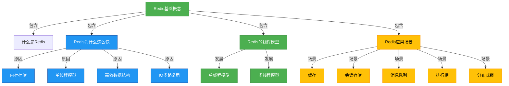
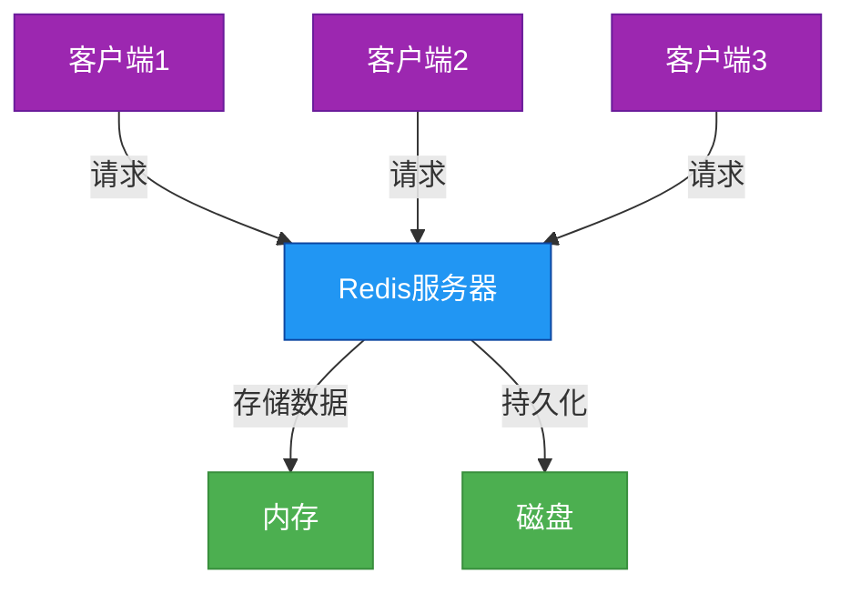
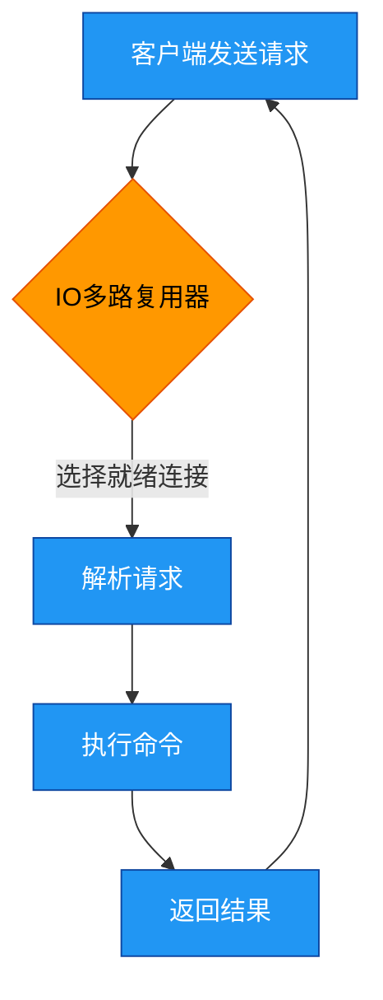
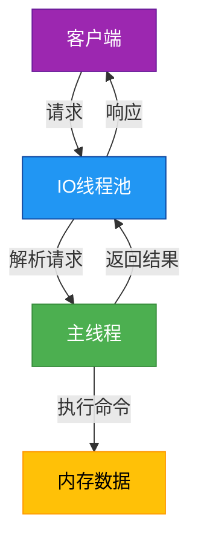

# Redis基础-概念

## 概述

Redis（Remote Dictionary Server）是一个开源的、高性能的键值对存储系统，它支持多种数据结构，如字符串、哈希、列表、集合、有序集合等。Redis以其卓越的性能、丰富的数据类型和灵活的使用方式，成为现代分布式系统中不可或缺的组件。

本章将围绕Redis的基础概念展开讨论，主要包括Redis的定义、Redis为什么这么快、Redis的单线程与多线程模型，以及Redis的实际应用场景等内容。通过本章的学习，你将对Redis有一个全面的认识，为后续深入学习Redis的数据结构、核心功能和应用实践奠定基础。



## 知识要点

### 1. 什么是Redis

Redis是一个基于内存的键值对存储系统，它支持多种数据结构，提供了丰富的操作命令。Redis最初由意大利开发者Salvatore Sanfilippo（别名antirez）创建，其名称Redis是Remote Dictionary Server的缩写。

**Redis的主要特点包括：**

- **基于内存存储**：Redis将数据存储在内存中，因此具有极高的读写性能（Redis读速度110000次/s,写速度81000次/s ）
- **支持多种数据结构**：除了基本的键值对，还支持字符串、哈希、列表、集合、有序集合等复杂数据结构
- **持久化机制**：支持RDB和AOF两种持久化方式，保证数据的安全性
- **支持主从复制**：可以实现数据的备份和读写分离
- **单线程模型**：Redis的核心操作是单线程的，但在最新版本中引入了多线程特性
- **支持事务**：可以保证一组命令的原子性执行

Redis的典型架构如下图所示：



### 2. Redis为什么这么快

Redis的高性能是其最显著的特点之一，它的读写速度可以达到每秒数十万次甚至更高。Redis为什么这么快呢？主要有以下几个原因：

#### 2.1 基于内存存储

Redis将所有数据都存储在内存中，这是Redis性能高的最主要原因。内存的读写速度远快于磁盘，因此Redis的响应时间可以达到微秒级别。

#### 2.2 单线程模型

Redis的核心操作采用单线程模型，这避免了多线程编程中的线程切换开销和锁竞争问题。单线程模型使得Redis的实现更加简单，也更容易保证数据的一致性。

#### 2.3 高效的数据结构

Redis针对不同的数据类型设计了高效的底层实现，例如：
- 字符串：使用简单动态字符串（SDS）实现，支持预分配空间，减少内存重分配次数
- 列表：使用双向链表或压缩列表实现，根据数据量自动选择最优结构
- 哈希：使用哈希表或压缩列表实现
- 集合：使用哈希表或整数集合实现
- 有序集合：使用跳跃表和哈希表实现

这些高效的数据结构使得Redis在处理各种操作时都能保持很高的性能。

#### 2.4 IO多路复用

IO多路复用简单来说就是，单线程处理多个客户端连接的网络读写请求，并且能够保证不会阻塞主流程的一种机制。

IO多路复用允许Redis在单线程的情况下高效地处理并发连接(多个客户端的连接请求)，避免了为每个连接创建一个线程带来的性能开销。

以下是Redis处理客户端请求的简化流程：



**为什么要有IO多路复用**
大家印象中的redis都是单线程的，没有加锁的操作，因此才会是redis这么快的原因其中之一。先暂且不说redis究竟是不是单线程，即便是单线程的，作为服务提供方，面对成百上千的客户端连接请求，读写操作，单线程是怎么做到高效的处理这些请求？单线程处理socket连接，面对客户端发送的指令如何处理？一个个轮询吗？明显是比较低效的操作，作为高效著称的redis肯定是不会用这么简单粗暴的方式去处理的。这里就引出一个解决方式IO多路复用。采用多个IO线程来处理网络请求，提高网络请求处理的并行度，对于读写操作命令Redis仍然使用单线程来处理。

### 3. Redis单线程与多线程

#### 3.1 为什么Redis是单线程

Redis最初设计为单线程模型，主要基于以下考虑：

1. **避免线程切换开销**：线程切换需要保存和恢复线程的上下文，这会带来一定的性能开销。单线程模型避免了这种开销。

2. **避免锁竞争问题**：多线程环境下需要使用锁来保证数据的一致性，这不仅会增加代码的复杂度，还会带来锁竞争的性能开销。单线程模型天然避免了这些问题。

3. **CPU不是Redis的瓶颈**：Redis的主要性能瓶颈是内存和网络带宽，而不是CPU。因此，单线程模型已经足够满足Redis的性能需求。

4. **简化实现**：单线程模型使得Redis的实现更加简单，更容易保证数据的一致性和正确性。

#### 3.2 为什么Redis又引入了多线程

虽然单线程模型为Redis带来了很多好处，但随着Redis的广泛应用和数据量的增长，单线程模型也逐渐显露出一些局限性。为了进一步提升Redis的性能，Redis在版本4.0和6.0中分别引入了多线程特性：

1. **版本4.0**：引入了多线程异步处理一些后台任务，如异步删除（unlink命令）、异步过期键清理等。这些操作不会阻塞主线程，从而提升了Redis的响应性能。

2. **版本6.0**：引入了多线程IO，用于处理网络IO操作。Redis 6.0仍然保持了命令执行的单线程模型，但将网络数据的读写操作交给了多个线程处理，从而充分利用多核CPU的优势，提升了Redis在高并发场景下的性能。

Redis 6.0的多线程模型如下图所示：



需要注意的是，尽管Redis引入了多线程特性，但它的核心命令执行仍然是单线程的，这保证了Redis的原子性和一致性。

### 4. Redis的实际应用场景

Redis凭借其高性能、丰富的数据结构和灵活的使用方式，被广泛应用于各种场景。

Redis常用的14个常见使用场景：


#### 4.1 缓存

缓存是Redis最常见的应用场景之一。由于Redis基于内存存储，读写速度极快，非常适合作为应用程序的缓存层。通过将热点数据存储在Redis中，可以大大减轻数据库的压力，提高应用程序的响应速度。

以下是一个使用Redis作为缓存的简单示例：

```java
/**
 * 使用Redis作为缓存的示例
 */
public class RedisCacheExample {
    
    private Jedis jedis;
    
    // 构造函数，初始化Jedis连接
    public RedisCacheExample() {
        this.jedis = new Jedis("localhost", 6379);
    }
    
    /**
     * 从缓存中获取数据，如果缓存不存在，则从数据库获取并放入缓存
     */
    public String getData(String key) {
        // 先从缓存中获取数据
        String value = jedis.get(key);
        
        if (value == null) {
            // 缓存未命中，从数据库获取数据
            value = fetchFromDatabase(key);
            
            // 将数据放入缓存，设置过期时间为1小时
            jedis.setex(key, 3600, value);
        }
        
        return value;
    }
    
    /**
     * 从数据库获取数据（模拟）
     */
    private String fetchFromDatabase(String key) {
        // 模拟数据库查询操作
        return "Data for " + key;
    }
}
```

#### 4.2 会话存储

在Web应用中，用户会话通常需要在多个请求之间保持状态。使用Redis存储会话数据，可以实现会话的分布式共享，同时利用Redis的过期机制实现会话的自动过期。

#### 4.3 消息队列

Redis的List数据结构可以用来实现简单的消息队列功能。通过lpush和rpop命令（或blpop和brpop命令），可以实现生产者-消费者模式的消息队列。此外，Redis 5.0引入的Stream数据结构提供了更强大的消息队列功能，支持消息持久化、消费确认、消费者组等特性。

#### 4.4 排行榜

Redis的ZSet（有序集合）数据结构非常适合实现排行榜功能。ZSet可以根据分数对元素进行排序，并且支持实时更新排名。例如，可以用ZSet实现游戏排行榜、热门文章排行榜等功能。

#### 4.5 计数器

Redis的原子递增和递减命令（incr、decr等）可以用来实现各种计数器功能，如网站访问量统计、文章阅读量统计、点赞数统计等。这些操作是原子的，不会出现并发问题。

#### 4.6 分布式锁

在分布式系统中，为了保证数据的一致性，常常需要使用分布式锁。Redis可以通过setnx命令（在键不存在时设置值）来实现分布式锁，结合过期时间可以避免锁永久占用的问题。

以下是一个使用Redis实现分布式锁的简单示例：

```java
/**
 * 使用Redis实现分布式锁的示例
 */
public class RedisLockExample {
    
    private Jedis jedis;
    
    // 构造函数，初始化Jedis连接
    public RedisLockExample() {
        this.jedis = new Jedis("localhost", 6379);
    }
    
    /**
     * 获取分布式锁
     * @param lockKey 锁的键名
     * @param requestId 请求ID，用于标识锁的持有者
     * @param expireTime 锁的过期时间（秒）
     * @return 是否获取成功
     */
    public boolean acquireLock(String lockKey, String requestId, int expireTime) {
        // 使用set命令的nx和ex选项，保证原子性地设置值和过期时间
        String result = jedis.set(lockKey, requestId, "NX", "EX", expireTime);
        return "OK".equals(result);
    }
    
    /**
     * 释放分布式锁
     * @param lockKey 锁的键名
     * @param requestId 请求ID，用于验证是否是锁的持有者
     * @return 是否释放成功
     */
    public boolean releaseLock(String lockKey, String requestId) {
        // 验证是否是锁的持有者，避免误释放其他客户端的锁
        if (requestId.equals(jedis.get(lockKey))) {
            jedis.del(lockKey);
            return true;
        }
        return false;
    }
}
```

#### 4.7 限流

Redis可以用来实现接口限流功能，防止系统被过多的请求压垮。常见的限流算法有令牌桶算法和漏桶算法，都可以通过Redis来实现。

#### 4.8 全局ID生成器

在分布式系统中，生成全局唯一ID是一个常见的需求。Redis的原子递增命令（incr）可以用来实现高性能的全局ID生成器。

#### 4.9 购物车

Redis的Hash数据结构非常适合实现购物车功能。可以使用用户ID作为键，商品ID和数量作为哈希字段和值，来存储用户的购物车信息。

#### 4.10 用户留存

使用Redis的Bitmap（位图）功能，可以高效地存储和统计用户的留存信息。例如，可以用位图记录用户每天的登录情况，然后通过位操作统计用户的日活、周活、月活等指标。

#### 4.11 位统计

Bitmap除了可以用于用户留存统计外，还可以用于各种位统计场景，如在线用户统计、签到统计等。Bitmap的存储空间非常节省，1000万用户的签到记录只需要约1.2MB的存储空间。

#### 4.12 数据共享

Redis可以作为分布式系统中的数据共享中心，用于存储和共享系统中的配置信息、热点数据等。

#### 4.13 附近的人

Redis的Geo（地理位置）功能可以用来实现"附近的人"等基于地理位置的服务。通过Geo相关命令，可以存储地理位置信息，并查询指定位置附近的其他位置。

#### 4.14 大数据计数

Redis的HyperLogLog数据结构可以用来进行大数据量的基数统计，如统计网站的独立访客数（UV）。HyperLogLog的特点是在保证一定精度的情况下，占用的内存非常小，即使统计数亿级别的数据，也只需要几MB的内存。

## 知识扩展

### 1. 设计思想

Redis的设计思想主要包括以下几个方面：

- **简单高效**：Redis的设计追求简单和高效，它的命令集简洁明了，实现代码也相对简单。
- **灵活的数据结构**：Redis支持多种数据结构，这使得它可以适应各种不同的应用场景。
- **性能优先**：Redis的设计始终将性能放在首位，通过内存存储、单线程模型、高效数据结构等手段，保证了极高的性能。
- **可靠性保证**：尽管Redis是基于内存的存储系统，但它通过持久化机制（RDB和AOF）保证了数据的可靠性。
- **可扩展性**：Redis支持主从复制、哨兵机制和集群技术，可以根据需求扩展系统的容量和性能。

### 2. 避坑指南

在使用Redis的过程中，需要注意以下几个常见的问题：

1. **内存溢出**：由于Redis是基于内存的存储系统，需要合理设置内存限制，并配置内存淘汰策略，避免内存溢出。

2. **持久化配置**：根据业务需求选择合适的持久化方式，并配置合理的持久化参数，在性能和数据安全性之间取得平衡。

3. **过期键处理**：Redis的过期键清理是惰性的，并且受内存淘汰策略影响。对于大量过期键的场景，需要注意可能的性能影响。

4. **分布式锁的安全性**：使用Redis实现分布式锁时，需要注意锁的过期时间设置、锁的释放条件等，避免锁失效或死锁问题。

5. **连接池管理**：在应用程序中使用Redis时，应该使用连接池管理Redis连接，避免频繁创建和关闭连接带来的性能开销。

6. **命令阻塞**：避免在Redis中执行耗时较长的命令（如keys *），这些命令可能会阻塞Redis的主线程，影响系统性能。

### 3. 深度思考题与回答

**深度思考题：** Redis的单线程模型和多线程模型各有什么优缺点？在什么场景下应该选择使用哪种模型？

**思考题回答：**

Redis的单线程模型和多线程模型各有其优缺点，适用于不同的场景：

单线程模型的优点：
- 实现简单，不需要处理线程同步问题
- 避免了线程切换和锁竞争带来的性能开销
- 保证了命令执行的原子性

单线程模型的缺点：
- 无法充分利用多核CPU的优势
- 对于耗时较长的命令（如大键的删除、复杂的聚合操作等），可能会阻塞主线程，影响系统的响应性能
- 在高并发场景下，网络IO可能成为性能瓶颈

多线程模型的优点：
- 可以充分利用多核CPU的优势，提高系统的吞吐量
- 将耗时的操作（如网络IO、异步删除等）交给专门的线程处理，减少对主线程的影响
- 在高并发场景下，可以提高系统的响应性能

多线程模型的缺点：
- 实现复杂，需要处理线程同步问题
- 可能引入线程切换和锁竞争带来的性能开销
- 对于需要保证原子性的操作，实现更加复杂

在选择使用哪种模型时，需要考虑以下因素：

- 如果应用场景中并发请求不是特别高，或者主要瓶颈在内存和网络带宽而不是CPU，那么单线程模型可能已经足够满足需求。
- 如果应用场景中并发请求非常高，或者存在大量的网络IO操作，那么Redis 6.0引入的多线程IO模型可能会带来明显的性能提升。
- 对于需要执行大量耗时操作的场景，可以考虑使用Redis 4.0引入的异步处理机制，或者在客户端进行分片，将请求分散到多个Redis实例。

总的来说，Redis的线程模型选择应该根据具体的应用场景和性能需求来决定。在实际应用中，还可以结合使用Redis的集群技术，通过水平扩展来提高系统的整体性能和可用性。