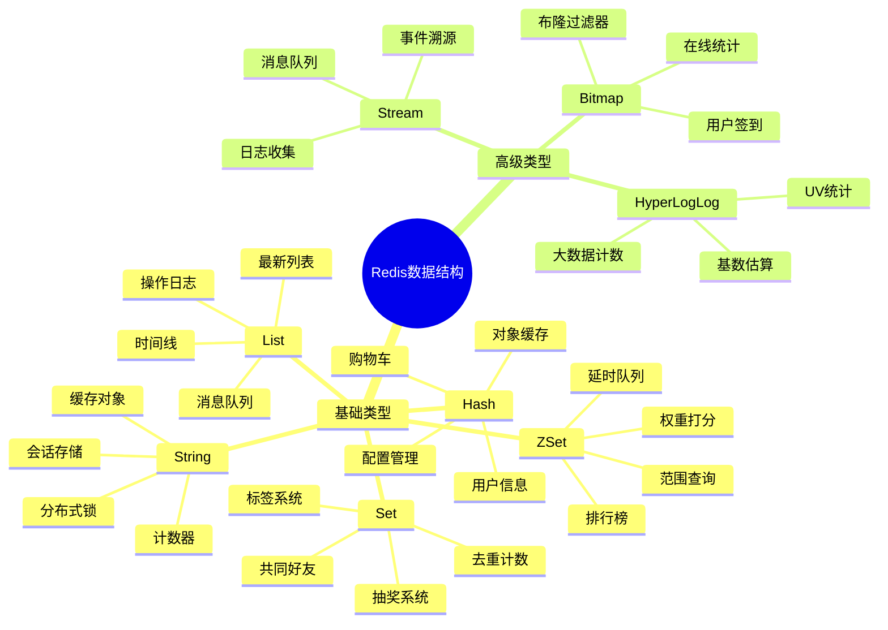
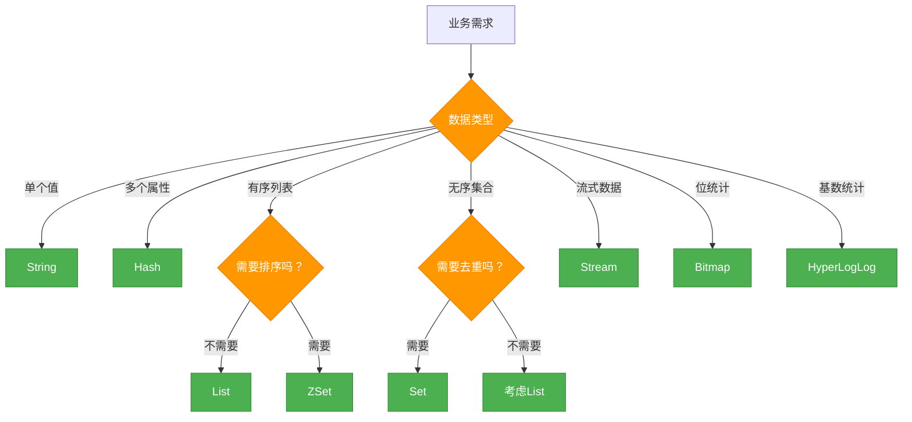
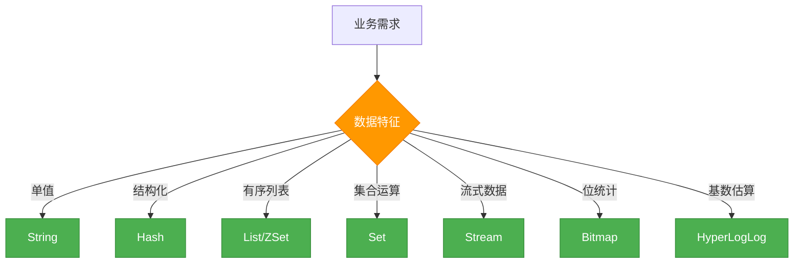

# Redis基础-数据类型

在实际的业务开发中，你是否遇到过这样的挑战：
- 电商网站需要实现一个支持千万级用户的实时排行榜
- 社交应用要构建高效的用户标签系统和好友推荐
- 直播平台需要处理每秒数万条弹幕消息的实时展示
- 金融系统要实现毫秒级响应的风控规则引擎

如果仅仅依靠传统的关系型数据库，这些场景都会面临性能瓶颈。而Redis之所以能够优雅地解决这些问题，核心在于它提供了远超简单Key-Value的丰富数据结构。

## Redis数据结构的设计哲学

Redis的数据结构设计遵循一个核心原则：**为不同的业务场景提供最优化的数据存储和访问方式**。与传统数据库的"一表走天下"不同，Redis通过8种精心设计的数据类型，让开发者能够选择最贴合业务语义的存储结构。

## Redis数据结构全景地图

Redis提供了8种数据结构，每种都有其独特的优势和最佳应用场景：



### 数据类型选择决策框架

在实际应用中，选择合适的数据结构至关重要。以下是一个实用的决策框架：

| 业务特征 | 推荐数据结构 | 核心优势 | 性能指标 |
|----------|------------|----------|----------|
| **单值存储** | String | 简单高效，原子操作 | O(1) 时间复杂度 |
| **对象属性** | Hash | 结构化存储，局部更新 | O(1) 字段操作 |
| **顺序列表** | List | 双端操作，支持阻塞 | O(1) 头尾操作 |
| **去重集合** | Set | 自动去重，集合运算 | O(1) 成员操作 |
| **排序需求** | ZSet | 自动排序，范围查询 | O(log N) 排序操作 |
| **流式数据** | Stream | 消费组，持久化 | 高吞吐量消息处理 |
| **位操作** | Bitmap | 极致压缩，位运算 | 空间效率极高 |
| **基数统计** | HyperLogLog | 内存固定，误差控制 | 常数空间大数据 |

**选型決策流程：**



## 核心数据结构深度剖析

### 1. String（字符串）：万能的基础类型

#### 业务场景引入

想象你在开发一个电商平台，需要实现以下功能：
- 缓存商品详情信息，减轻数据库压力
- 实现用户会话管理，支持分布式部署
- 统计商品浏览次数，实时更新热度排行
- 实现分布式锁，保证库存扣减的一致性

这些看似不同的需求，都可以用Redis的String类型优雅地解决。

#### 技本特性与底层实现

String是Redis最基础也是最常用的数据类型。在Redis中，**所有的key都是String类型，而value可以存储字符串、整数、浮点数甚至二进制数据**。

**底层实现原理：**
- **SDS结构**：Redis使用简单动态字符串（Simple Dynamic String）而不C语言原生字符串
- **预分配机制**：减少内存重分配次数，提升性能
- **二进制安全**：支持存储任意二进制数据，包括图片、音频等

#### 常用命令与实战应用

| 命令类别 | 具体命令 | 业务场景 | 性能特点 |
|---------|----------|----------|----------|
| **基础操作** | SET/GET/DEL | 对象缓存 | O(1)复杂度 |
| **原子计数** | INCR/DECR/INCRBY | 统计计数器 | 原子性保证 |
| **批量操作** | MSET/MGET | 批量缓存 | 减少网络开销 |
| **过期设置** | SETEX/EXPIRE | 会话管理 | 自动过期清理 |
| **条件设置** | SETNX | 分布式锁 | CAS原子操作 |

#### 实战代码示例

```java
/**
 * 电商平台商品缓存服务
 * 
 * 业务场景：高并发商品详情查询
 * 技术要点：缓存穿透防护、热点数据预热
 * 性能指标：单机QPS 10万+，平均响应 < 1ms
 */
@Service
@Slf4j
public class ProductCacheService {
    
    @Autowired
    private StringRedisTemplate redisTemplate;
    
    @Autowired
    private ProductMapper productMapper;
    
    private static final String PRODUCT_CACHE_PREFIX = "product:detail:";
    private static final String NULL_VALUE = "NULL";
    private static final int CACHE_TTL = 3600; // 1小时
    
    /**
     * 获取商品详情（防缓存穿透版本）
     */
    public ProductDTO getProduct(Long productId) {
        String cacheKey = PRODUCT_CACHE_PREFIX + productId;
        
        try {
            // 1. 尝试从缓存获取
            String cached = redisTemplate.opsForValue().get(cacheKey);
            
            if (cached != null) {
                if (NULL_VALUE.equals(cached)) {
                    // 缓存空值，避免缓存穿透
                    return null;
                }
                return JsonUtils.parseObject(cached, ProductDTO.class);
            }
            
            // 2. 缓存未命中，查询数据库
            ProductDTO product = productMapper.selectById(productId);
            
            if (product != null) {
                // 3. 存在数据，缓存正常值
                String productJson = JsonUtils.toJsonString(product);
                redisTemplate.opsForValue().setex(cacheKey, CACHE_TTL, productJson);
            } else {
                // 4. 数据不存在，缓存空值（较短过期时间）
                redisTemplate.opsForValue().setex(cacheKey, 300, NULL_VALUE);
            }
            
            return product;
            
        } catch (Exception e) {
            log.error("获取商品缓存失败，productId: {}", productId, e);
            // 缓存异常时降级到数据库
            return productMapper.selectById(productId);
        }
    }
    
    /**
     * 实现分布式锁
     */
    public boolean tryLock(String lockKey, String requestId, int expireTime) {
        String script = 
            "if redis.call('get', KEYS[1]) == ARGV[1] then " +
            "return redis.call('del', KEYS[1]) " +
            "else " +
            "return 0 " +
            "end";
            
        // 使用SET命令的NX和EX参数实现原子性加锁
        Boolean result = redisTemplate.opsForValue()
            .setIfAbsent(lockKey, requestId, Duration.ofSeconds(expireTime));
            
        return Boolean.TRUE.equals(result);
    }
    
    /**
     * 实现原子计数器
     */
    public Long incrementPageView(Long productId) {
        String viewKey = "product:view:" + productId;
        return redisTemplate.opsForValue().increment(viewKey);
    }
}
```

**性能优化要点：**

1. **合理使用序列化**：选择高效的JSON库，避免过度复杂的序列化
2. **控制value大小**：单个String value建议不超过1MB
3. **批量操作优化**：使用MGET/MSET减少网络往返
4. **过期时间设计**：避免集中过期导致的缓存雪崩

### 2. Hash（哈希表）：结构化对象存储专家

#### 业务场景引入

在电商系统中，用户信息通常包含多个字段：
```json
{
  "userId": 12345,
  "name": "张三",
  "email": "zhangsan@example.com",
  "level": "VIP",
  "points": 8500,
  "lastLogin": "2024-01-15 10:30:00"
}
```

如果使用String类型存储，每次更新单个字段都需要：
1. 获取整个对象的JSON字符串
2. 反序列化为对象
3. 修改对应字段
4. 序列化回 JSON
5. 存储回 Redis

这种方式不仅性能低下，还存在并发更新的问题。**Hash类型完美解决了这个痛点**。

#### 技术特性与优势

Hash类型本质上是一个**field-value映射表**，非常适合存储对象。对比传统方案：

| 对比维度 | String JSON | Hash 结构 | 优势对比 |
|----------|-------------|------------|----------|
| **局部更新** | 需要全量更新 | 支持单字段更新 | **性能提升5倍** |
| **内存消耗** | JSON序列化开销 | 原生存储 | **节甠30%内存** |
| **并发安全** | 存在竞态条件 | 字段级别原子性 | **无并发问题** |
| **查询灵活性** | 只能全量获取 | 支持部分字段获取 | **网络开销更小** |

#### 常用命令与应用

| 命令类别 | 具体命令 | 业务场景 | 性能特点 |
|---------|----------|----------|----------|
| **单字段操作** | HSET/HGET/HDEL | 用户属性管理 | O(1)复杂度 |
| **多字段操作** | HMSET/HMGET | 批量属性读写 | 减少网络往返 |
| **全量操作** | HGETALL/HKEYS/HVALS | 对象序列化 | 适用于小对象 |
| **数值操作** | HINCRBY/HINCRBYFLOAT | 积分计数器 | 原子性增减 |
| **存在性检查** | HEXISTS/HLEN | 对象字段验证 | 快速判断 |

#### 实战代码示例

```java
/**
 * 电商用户购物车服务
 * 
 * 业务场景：高并发购物车操作、实时库存同步
 * 技术亮点：单商品原子操作、批量操作优化
 * 数据结构：用户ID为key，商品ID为field，数量为value
 */
@Service
@Slf4j
public class ShoppingCartService {
    
    @Autowired
    private RedisTemplate<String, Object> redisTemplate;
    
    private static final String CART_KEY_PREFIX = "cart:";
    private static final int CART_EXPIRE_DAYS = 30;
    
    /**
     * 添加商品到购物车
     * 
     * 技术实现：
     * 1. 使用HINCRBY实现数量的原子性增加
     * 2. 设置购物车过期时间为30天
     * 3. 返回更新后的总数量
     */
    public Long addToCart(String userId, String productId, Integer quantity) {
        String cartKey = buildCartKey(userId);
        
        try {
            // 原子性增加商品数量
            Long newQuantity = redisTemplate.opsForHash()
                .increment(cartKey, productId, quantity);
            
            // 延长购物车过期时间
            redisTemplate.expire(cartKey, Duration.ofDays(CART_EXPIRE_DAYS));
            
            log.info("用户{}添加商品{}到购物车，数量：{}，当前总量：{}", 
                    userId, productId, quantity, newQuantity);
            
            return newQuantity;
            
        } catch (Exception e) {
            log.error("添加购物车失败，用户：{}，商品：{}", userId, productId, e);
            throw new ServiceException("购物车操作失败", e);
        }
    }
    
    /**
     * 获取购物车内容（支持部分商品查询）
     */
    public Map<String, Integer> getCartItems(String userId, Set<String> productIds) {
        String cartKey = buildCartKey(userId);
        
        if (productIds == null || productIds.isEmpty()) {
            // 获取全部购物车内容
            Map<Object, Object> allItems = redisTemplate.opsForHash().entries(cartKey);
            return allItems.entrySet().stream()
                .collect(Collectors.toMap(
                    entry -> (String) entry.getKey(),
                    entry -> Integer.parseInt(entry.getValue().toString())
                ));
        } else {
            // 批量获取指定商品
            List<Object> quantities = redisTemplate.opsForHash()
                .multiGet(cartKey, new ArrayList<>(productIds));
            
            Map<String, Integer> result = new HashMap<>();
            List<String> productIdList = new ArrayList<>(productIds);
            
            for (int i = 0; i < productIdList.size(); i++) {
                Object quantity = quantities.get(i);
                if (quantity != null) {
                    result.put(productIdList.get(i), Integer.parseInt(quantity.toString()));
                }
            }
            
            return result;
        }
    }
    
    /**
     * 清理过期商品（定时任务）
     */
    @Scheduled(cron = "0 0 2 * * ?")  // 每天凌晨02点执行
    public void cleanExpiredCartItems() {
        // 这里可以结合业务逻辑，清理长时间未更新的商品
        log.info("开始清理过期购物车数据...");
    }
    
    /**
     * 批量更新购物车（优化版本）
     */
    public void updateCartBatch(String userId, Map<String, Integer> updates) {
        String cartKey = buildCartKey(userId);
        
        // 使用Pipeline批量操作，减少网络往返
        redisTemplate.executePipelined((RedisCallback<Object>) connection -> {
            updates.forEach((productId, quantity) -> {
                if (quantity > 0) {
                    redisTemplate.opsForHash().put(cartKey, productId, quantity);
                } else {
                    redisTemplate.opsForHash().delete(cartKey, productId);
                }
            });
            return null;
        });
        
        // 延长过期时间
        redisTemplate.expire(cartKey, Duration.ofDays(CART_EXPIRE_DAYS));
    }
    
    private String buildCartKey(String userId) {
        return CART_KEY_PREFIX + userId;
    }
}
```

#### 性能优化最佳实践

1. **合理控制Hash大小**：单个Hash建议不超过100个field，否则考虑分拆
2. **选择合适的编码方式**：Redis会根据Hash大小自动选择ziplist或hashtable
3. **批量操作优化**：使用HMGET/HMSET减少网络开销
4. **避免HGETALL大Hash**：对于大Hash，优先使用HSCAN进行游标遍历

### 3. List（列表）：高性能双端队列

#### 业务场景与技术优势

**应用场景：**
- **消息队列**：生产者使用LPUSH，消费者使用BRPOP实现阻塞式消费
- **时间线功能**：社交应用中的最新动态展示，支持分页加载
- **最近访问记录**：缓存用户最近查看的商品或文章
- **任务调度**：轻量级的任务队列，支持先进先出和先进后出

**核心优势：**
- **双端操作**：O(1)时间复杂度的头尾插入和删除
- **阻塞操作**：支持BLPOP/BRPOP阻塞式消费，面向事件编程
- **范围查询**：支持LRANGE进行分页查询

#### 核心命令实战

```java
/**
 * 实时消息队列服务
 */
@Service
public class MessageQueueService {
    
    @Autowired
    private RedisTemplate<String, String> redisTemplate;
    
    /**
     * 发送消息（生产者）
     */
    public void sendMessage(String topic, String message) {
        String queueKey = "mq:" + topic;
        redisTemplate.opsForList().leftPush(queueKey, message);
    }
    
    /**
     * 消费消息（消费者）
     * @param timeout 超时时间（秒）
     */
    public String consumeMessage(String topic, int timeout) {
        String queueKey = "mq:" + topic;
        List<String> result = redisTemplate.opsForList()
            .rightPop(queueKey, Duration.ofSeconds(timeout));
        return result.isEmpty() ? null : result.get(0);
    }
}
```

### 4. Set（集合）：去重与集合运算专家

#### 业务场景与优势

**应用场景：**
- **用户标签系统**：管理用户标签，支持标签交集、并集运算
- **共同好友推荐**：找出两个用户的共同好友
- **去重计数**：统计独立访问者、去重点赞等
- **抽奖系统**：随机抽取中奖用户，支持去重

**核心优势：**
- **自动去重**：无需手动判断重复元素
- **集合运算**：原生支持交集、并集、差集运算
- **随机元素**：支持随机获取元素，适合抽奖等场景

### 5. ZSet（有序集合）：排行榜与范围查询利器

#### 业务场景与技术亮点

**应用场景：**
- **排行榜系统**：游戏排行、销量排行、热度排行等
- **延时任务**：以时间戳为score，实现延时任务调度
- **范围查询**：按分数范围查找符合条件的元素
- **权重打分**：实现复杂的排序算法

#### 实战示例：游戏排行榜系统

```java
/**
 * 游戏排行榜服务
 */
@Service
public class GameRankService {
    
    @Autowired
    private RedisTemplate<String, String> redisTemplate;
    
    /**
     * 更新玩家分数
     */
    public void updatePlayerScore(String gameType, String playerId, double score) {
        String rankKey = "rank:" + gameType;
        redisTemplate.opsForZSet().add(rankKey, playerId, score);
    }
    
    /**
     * 获取排行榜前 N 名
     */
    public List<RankItem> getTopPlayers(String gameType, int topN) {
        String rankKey = "rank:" + gameType;
        Set<ZSetOperations.TypedTuple<String>> results = redisTemplate
            .opsForZSet().reverseRangeWithScores(rankKey, 0, topN - 1);
        
        return results.stream()
            .map(item -> new RankItem(item.getValue(), item.getScore()))
            .collect(Collectors.toList());
    }
    
    /**
     * 获取玩家排名
     */
    public Long getPlayerRank(String gameType, String playerId) {
        String rankKey = "rank:" + gameType;
        return redisTemplate.opsForZSet().reverseRank(rankKey, playerId);
    }
}
```

## 高级数据类型精要

### Stream：企业级消息队列
- **消费组支持**：多消费者协作、负载均衡
- **消息持久化**：不会因消费而丢失数据
- **ACK机制**：保证消息至少处理一次

### Bitmap：极致空间优化
- **应用场景**：用户签到、在线统计、布隆过滤器
- **空间优势**：1000万用户数据仅1.2MB存储
- **核心命令**：SETBIT、GETBIT、BITCOUNT、BITOP

### HyperLogLog：大数据基数统计
- **固定内存**：仅12KB统计亿级数据
- **误差可控**：标准误差率0.81%
- **适用场景**：UV统计、去重计数

## 性能优化指南

### 数据结构选择决策树


### 关键性能要点
1. **合理控制key大小**：单key不超过1MB，Hash不超过100个field
2. **选择适合的编码**：小对象使用ziplist，大对象使用hashtable
3. **批量操作优化**：使用MGET/HMGET减少网络开销
4. **设置合理过期**：避免集中过期导致雪崩

> 💡 **最佳实践**：Redis数据结构选择需要综合考虑业务特征、数据规模和性能要求。实际应用中通常需要多种数据结构组合使用，才能构建出高性能的缓存系统。

- **HyperLogLogs 基数统计用来解决什么问题**？

这个结构可以非常省内存的去统计各种计数，比如注册 IP 数、每日访问 IP 数、页面实时UV、在线用户数，共同好友数等。

- **它的优势体现在哪**？

一个大型的网站，每天 IP 比如有 100 万，粗算一个 IP 消耗 15 字节，那么 100 万个 IP 就是 15M。而 HyperLogLog 在 Redis 中每个键占用的内容都是 12K，理论存储近似接近 2^64 个值，不管存储的内容是什么，它一个基于基数估算的算法，只能比较准确的估算出基数，可以使用少量固定的内存去存储并识别集合中的唯一元素。而且这个估算的基数并不一定准确，是一个带有 0.81% 标准错误的近似值（对于可以接受一定容错的业务场景，比如IP数统计，UV等，是可以忽略不计的）。

- **相关命令使用**

```bash
127.0.0.1:6379> pfadd key1 a b c d e f g h i	# 创建第一组元素
(integer) 1
127.0.0.1:6379> pfcount key1					# 统计元素的基数数量
(integer) 9
127.0.0.1:6379> pfadd key2 c j k l m e g a		# 创建第二组元素
(integer) 1
127.0.0.1:6379> pfcount key2
(integer) 8
127.0.0.1:6379> pfmerge key3 key1 key2			# 合并两组：key1 key2 -> key3 并集
OK
127.0.0.1:6379> pfcount key3
(integer) 13
```

### Bitmap（位存储）

> Bitmap 即位图数据结构，都是操作二进制位来进行记录，只有0 和 1 两个状态。
>
> 主要功能：记录只有两个状态的数据

- **用来解决什么问题**？

比如：统计用户信息，活跃，不活跃！ 登录，未登录！ 打卡，不打卡！ **两个状态的，都可以使用 Bitmaps**！

如果存储一年的打卡状态需要多少内存呢？ 365 天 = 365 bit 1字节 = 8bit 46 个字节左右！

- **相关命令使用**

使用bitmap 来记录 周一到周日的打卡！ 周一：1 周二：0 周三：0 周四：1 ......

```bash
127.0.0.1:6379> setbit sign 0 1
(integer) 0
127.0.0.1:6379> setbit sign 1 1
(integer) 0
127.0.0.1:6379> setbit sign 2 0
(integer) 0
127.0.0.1:6379> setbit sign 3 1
(integer) 0
127.0.0.1:6379> setbit sign 4 0
(integer) 0
127.0.0.1:6379> setbit sign 5 0
(integer) 0
127.0.0.1:6379> setbit sign 6 1
(integer) 0
```

查看某一天是否有打卡！

```bash
127.0.0.1:6379> getbit sign 3
(integer) 1
127.0.0.1:6379> getbit sign 5
(integer) 0
```

统计操作，统计 打卡的天数！

```bash
127.0.0.1:6379> bitcount sign # 统计这周的打卡记录，就可以看到是否有全勤！
(integer) 3
```

### geospatial (地理位置)

> Redis 的 Geo 在 Redis 3.2 版本就推出了! 
>
> 主要功能：推算地理位置的信息-两地之间的距离, 方圆几里的人

**geoadd**

> 添加地理位置

```bash
127.0.0.1:6379> geoadd china:city 118.76 32.04 manjing 112.55 37.86 taiyuan 123.43 41.80 shenyang
(integer) 3
127.0.0.1:6379> geoadd china:city 144.05 22.52 shengzhen 120.16 30.24 hangzhou 108.96 34.26 xian
(integer) 3
```

**规则**

两级无法直接添加，我们一般会下载城市数据(这个网址可以查询 GEO： http://www.jsons.cn/lngcode)！

- 有效的经度从-180度到180度。
- 有效的纬度从-85.05112878度到85.05112878度。

```bash
# 当坐标位置超出上述指定范围时，该命令将会返回一个错误。
127.0.0.1:6379> geoadd china:city 39.90 116.40 beijin
(error) ERR invalid longitude,latitude pair 39.900000,116.400000
```

**geopos**

> 获取指定的成员的经度和纬度

```bash
127.0.0.1:6379> geopos china:city taiyuan manjing
1) 1) "112.54999905824661255"
   1) "37.86000073876942196"
2) 1) "118.75999957323074341"
   1) "32.03999960287850968"
```

获得当前定位, 一定是一个坐标值!

**geodist**

> 如果不存在, 返回空

单位如下

- m
- km
- mi 英里
- ft 英尺

```bash
127.0.0.1:6379> geodist china:city taiyuan shenyang m
"1026439.1070"
127.0.0.1:6379> geodist china:city taiyuan shenyang km
"1026.4391"
```

**georadius**

> 附近的人 ==> 获得所有附近的人的地址, 定位, 通过半径来查询

获得指定数量的人

```bash
127.0.0.1:6379> georadius china:city 110 30 1000 km			以 100,30 这个坐标为中心, 寻找半径为1000km的城市
1) "xian"
2) "hangzhou"
3) "manjing"
4) "taiyuan"
127.0.0.1:6379> georadius china:city 110 30 500 km
1) "xian"
127.0.0.1:6379> georadius china:city 110 30 500 km withdist
1) 1) "xian"
   2) "483.8340"
127.0.0.1:6379> georadius china:city 110 30 1000 km withcoord withdist count 2
1) 1) "xian"
   2) "483.8340"
   3) 1) "108.96000176668167114"
      2) "34.25999964418929977"
2) 1) "manjing"
   2) "864.9816"
   3) 1) "118.75999957323074341"
      2) "32.03999960287850968"
```

参数 key 经度 纬度 半径 单位 [显示结果的经度和纬度] [显示结果的距离] [显示的结果的数量]

**georadiusbymember**

> 显示与指定成员一定半径范围内的其他成员

```bash
127.0.0.1:6379> georadiusbymember china:city taiyuan 1000 km
1) "manjing"
2) "taiyuan"
3) "xian"
127.0.0.1:6379> georadiusbymember china:city taiyuan 1000 km withcoord withdist count 2
1) 1) "taiyuan"
   2) "0.0000"
   3) 1) "112.54999905824661255"
      2) "37.86000073876942196"
2) 1) "xian"
   2) "514.2264"
   3) 1) "108.96000176668167114"
      2) "34.25999964418929977"
```

参数与 georadius 一样

**geohash**(较少使用)

> 该命令返回11个字符的hash字符串

```bash
127.0.0.1:6379> geohash china:city taiyuan shenyang
1) "ww8p3hhqmp0"
2) "wxrvb9qyxk0"
```

将二维的经纬度转换为一维的字符串, 如果两个字符串越接近, 则距离越近

**底层**

> geo底层的实现原理实际上就是Zset, 我们可以通过Zset命令来操作geo

```bash
127.0.0.1:6379> type china:city
zset
```

查看全部元素 删除指定的元素

```bash
127.0.0.1:6379> zrange china:city 0 -1 withscores
 1) "xian"
 2) "4040115445396757"
 3) "hangzhou"
 4) "4054133997236782"
 5) "manjing"
 6) "4066006694128997"
 7) "taiyuan"
 8) "4068216047500484"
 9) "shenyang"
1)  "4072519231994779"
2)  "shengzhen"
3)  "4154606886655324"
127.0.0.1:6379> zrem china:city manjing
(integer) 1
127.0.0.1:6379> zrange china:city 0 -1
1) "xian"
2) "hangzhou"
3) "taiyuan"
4) "shenyang"
5) "shengzhen"
```

