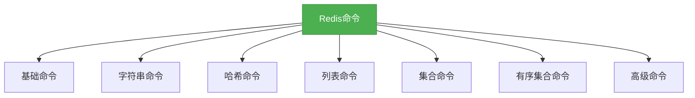

# 4. Redis命令参考
## 概述

Redis是一个基于内存的键值对数据库，提供了丰富的命令集来操作数据。本章节将详细介绍Redis的常用命令，包括基础命令、数据类型相关命令以及高级命令，帮助开发者快速掌握Redis的使用技巧。



## 知识要点

### 1. 基础命令

#### 1.1 连接命令

```redis
# 连接到Redis服务器
redis-cli -h host -p port -a password

# 切换数据库
SELECT index

# 查看当前数据库中的key数量
DBSIZE

# 清空当前数据库
FLUSHDB

# 清空所有数据库
FLUSHALL
```

#### 1.2 键命令

```redis
# 查看所有键
KEYS pattern

# 检查键是否存在
EXISTS key

# 删除键
DEL key1 key2 ...

# 重命名键
RENAME key newkey

# 查看键的类型
TYPE key

# 设置键的过期时间(秒)
EXPIRE key seconds

# 设置键的过期时间(毫秒)
PEXPIRE key milliseconds

# 查看键的剩余生存时间(秒)
TTL key

# 查看键的剩余生存时间(毫秒)
PTTL key

# 移除键的过期时间
PERSIST key
```

### 2. 字符串命令

```redis
# 设置键值
SET key value

# 设置键值及过期时间
SET key value EX seconds
SET key value PX milliseconds

# 获取键值
GET key

# 递增数值
INCR key

# 递减数值
DECR key

# 增加指定数值
INCRBY key increment

# 减少指定数值
DECRBY key decrement

# 追加字符串
APPEND key value

# 获取字符串长度
STRLEN key

# 获取子字符串
GETRANGE key start end

# 设置子字符串
SETRANGE key offset value
```

### 3. 哈希命令

```redis
# 设置哈希字段值
HSET key field value

# 获取哈希字段值
HGET key field

# 获取多个哈希字段值
HMGET key field1 field2 ...

# 设置多个哈希字段值
HMSET key field1 value1 field2 value2 ...

# 查看哈希中是否存在指定字段
HEXISTS key field

# 删除哈希中的字段
HDEL key field1 field2 ...

# 获取哈希中字段的数量
HLEN key

# 获取哈希中所有字段
HKEYS key

# 获取哈希中所有值
HVALS key

# 获取哈希中所有字段和值
HGETALL key

# 哈希字段值递增
HINCRBY key field increment
```

### 4. 列表命令

```redis
# 在列表头部添加元素
LPUSH key value1 value2 ...

# 在列表尾部添加元素
RPUSH key value1 value2 ...

# 在列表头部移除并返回元素
LPOP key

# 在列表尾部移除并返回元素
RPOP key

# 获取列表长度
LLEN key

# 获取列表指定范围内的元素
LRANGE key start stop

# 移除列表中指定值的元素
LREM key count value

# 截取列表
LTRIM key start stop

# 获取列表指定索引位置的元素
LINDEX key index

# 设置列表指定索引位置的元素
LSET key index value
```

### 5. 集合命令

```redis
# 向集合中添加元素
SADD key member1 member2 ...

# 从集合中移除元素
SREM key member1 member2 ...

# 查看集合中的元素
SMEMBERS key

# 检查元素是否在集合中
SISMEMBER key member

# 获取集合的大小
SCARD key

# 计算两个集合的交集
SINTER key1 key2

# 计算两个集合的并集
SUNION key1 key2

# 计算两个集合的差集
SDIFF key1 key2

# 随机获取集合中的一个元素
SRANDMEMBER key

# 随机移除并返回集合中的一个元素
SPOP key
```

### 6. 有序集合命令

```redis
# 向有序集合中添加元素
ZADD key score1 member1 score2 member2 ...

# 从有序集合中移除元素
ZREM key member1 member2 ...

# 获取有序集合的大小
ZCARD key

# 获取有序集合中指定范围内的元素
ZRANGE key start stop [WITHSCORES]

# 获取有序集合中指定分数范围内的元素
ZRANGEBYSCORE key min max [WITHSCORES] [LIMIT offset count]

# 获取元素在有序集合中的排名
ZRANK key member

# 获取元素在有序集合中的分数
ZSCORE key member

# 增加有序集合中元素的分数
ZINCRBY key increment member

# 计算两个有序集合的交集
ZINTERSTORE destination numkeys key1 key2 ... [WEIGHTS weight1 weight2 ...] [AGGREGATE SUM|MIN|MAX]

# 计算两个有序集合的并集
ZUNIONSTORE destination numkeys key1 key2 ... [WEIGHTS weight1 weight2 ...] [AGGREGATE SUM|MIN|MAX]
```

### 7. 高级命令

#### 7.1 事务命令

```redis
# 开始事务
MULTI

# 执行事务
EXEC

# 取消事务
DISCARD

# 监视键
WATCH key1 key2 ...

# 取消监视
UNWATCH
```

#### 7.2 持久化命令

```redis
# 同步保存数据到磁盘
SAVE

# 异步保存数据到磁盘
BGSAVE

# 查看AOF日志重写进度
BGREWRITEAOF

# 查看持久化信息
INFO persistence
```

#### 7.3 集群命令

```redis
# 查看节点信息
CLUSTER INFO

# 查看节点列表
CLUSTER NODES

# 创建集群
CLUSTER MEET ip port

# 分配槽位
CLUSTER ADDSLOTS slot1 slot2 ...

# 迁移槽位
CLUSTER SETSLOT slot IMPORTING node-id
```

## 知识扩展

### 1. 设计思想

Redis的命令设计遵循了以下原则：

1. **简洁明了**：命令名称通常是描述性的英文单词或缩写，易于记忆和使用。
2. **一致性**：相同类型的命令具有相似的格式和行为。
3. **高效性**：命令被设计为尽可能高效地执行，减少网络传输和内存使用。
4. **灵活性**：许多命令支持多种参数组合，以适应不同的使用场景。

### 2. 避坑指南

1. **KEYS命令慎用**：在生产环境中，应避免使用`KEYS *`命令，因为它会遍历所有键，可能导致Redis服务器阻塞。
2. **过期时间设置**：设置过期时间时，应根据业务需求合理设置，避免过短或过长的过期时间。
3. **事务注意事项**：Redis的事务不是原子的，如果其中一个命令失败，其他命令仍然会执行。
4. **内存管理**：应监控Redis的内存使用情况，避免内存溢出。
5. **批量操作**：对于大量数据的操作，应使用批量命令（如HMSET、MSET等），减少网络开销。

### 3. 深度思考题

1. 为什么Redis的命令通常是大写的？

   回答：Redis的命令通常是大写的，这是一种约定俗成的做法，有助于区分命令和参数。在实际使用中，Redis也支持小写命令，但大写命令更符合行业惯例。

2. 什么是Redis的惰性删除策略？

   回答：Redis的惰性删除策略是指，当数据到达过期时间时，不立即删除，而是等到下次访问该数据时才检查是否过期，如果已过期则删除。这种策略可以减少CPU的开销，但可能会导致内存占用过高。

3. 如何优化Redis的命令执行效率？

   回答：优化Redis的命令执行效率可以从以下几个方面入手：
   - 使用批量命令减少网络开销
   - 避免在Redis中执行复杂的计算
   - 合理设置过期时间
   - 使用管道（pipeline）技术减少网络往返次数
   - 优化数据结构选择，根据业务场景选择合适的数据类型

4. 什么是Redis的管道技术？

   回答：Redis的管道技术允许客户端一次性发送多个命令，而不需要等待每个命令的响应。这样可以减少网络往返次数，提高吞吐量。管道技术特别适合于需要执行大量命令的场景。