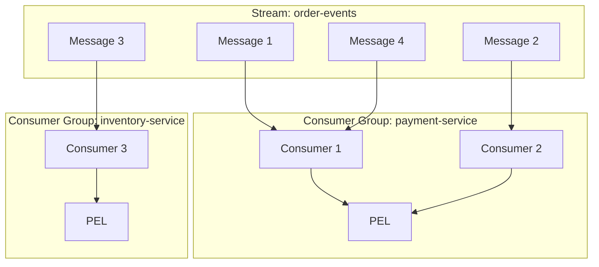
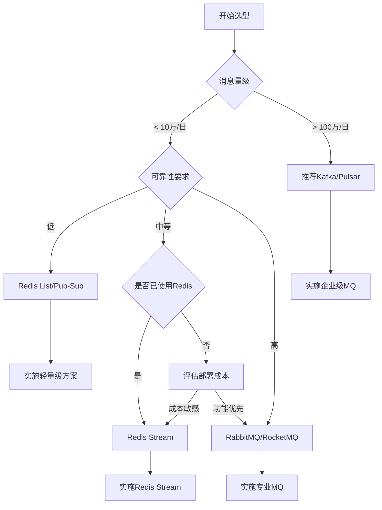

# 进阶-Stream消息队列

## 从一个真实问题开始

想象你正在构建一个电商平台的订单系统，需要处理以下业务流程：
1. 用户下单后，需要通知库存系统扣减库存
2. 同时通知支付系统创建支付单
3. 还要通知物流系统备货发货
4. 另外要给用户发送订单确认通知

传统的解决方案可能会遇到这些问题：
- **使用List实现的简单消息队列**：消息消费后就没有了，无法追溯历史
- **直接调用其他系统接口**：紧耦合，如果某个系统挂了整个流程就卡住了
- **使用专业消息队列如Kafka**：部署复杂，对于中小型应用来说过重

**Redis Stream完美解决了这些痛点**，它提供了介于简单消息队列和企业级消息中间件之间的完美平衡。

## Redis Stream技术特性深度剖析

### 与传统消息队列的对比

在深入Stream之前，让我们先了解Redis Stream相比其他消息队列方案的优势和定位：

| 对比维度 | Redis List | Redis Pub/Sub | Redis Stream | Kafka | RabbitMQ |
|----------|------------|---------------|--------------|-------|----------|
| **消息持久化** | 仅在内存中 | 不持久化 | 支持 | 支持 | 支持 |
| **消费组支持** | 不支持 | 不支持 | 支持 | 支持 | 支持 |
| **消息回放** | 不支持 | 不支持 | 支持 | 支持 | 支持 |
| **部署复杂度** | 无 | 无 | 无 | 高 | 中等 |
| **学习成本** | 低 | 低 | 中等 | 高 | 中等 |
| **性能表现** | 高 | 高 | 高 | 最高 | 中等 |
| **适用场景** | 简单任务队列 | 实时通知 | 中等复杂度业务 | 大数据量处理 | 企业级应用 |

### Stream的核心概念

**1. 消息ID设计**
Stream中每条消息都有一个全局唯一的ID，格式为`timestampInMillis-sequence`：
- 时间戳部分保证了消息的时间有序性
- 序列号部分解决了同一毫秒内多条消息的排序问题
- 支持时间回拨防护，保证ID的单调递增

**2. 消费组机制**


**3. PEL（Pending Entries List）机制**
- 记录已读取但未确认的消息
- 防止消费者崩溃导致消息丢失
- 支持消息转移和重试机制

## 实战案例：电商订单系统

### 系统架构设计

```java
/**
 * 订单事件处理服务
 * 使用Redis Stream实现事件驱动架构
 */
@Service
@Slf4j
public class OrderEventService {
    
    @Autowired
    private StringRedisTemplate redisTemplate;
    
    private static final String ORDER_STREAM = "order:events";
    private static final String PAYMENT_GROUP = "payment-service";
    private static final String INVENTORY_GROUP = "inventory-service";
    
    /**
     * 发布订单创建事件
     */
    public String publishOrderCreated(OrderCreatedEvent event) {
        Map<String, String> fields = new HashMap<>();
        fields.put("eventType", "ORDER_CREATED");
        fields.put("orderId", event.getOrderId().toString());
        fields.put("userId", event.getUserId().toString());
        fields.put("totalAmount", event.getTotalAmount().toString());
        fields.put("timestamp", Instant.now().toString());
        
        // 发布消息到Stream，返回消息ID
        RecordId recordId = redisTemplate.opsForStream()
            .add(ORDER_STREAM, fields);
            
        log.info("订单事件已发布: orderId={}, messageId={}", 
                event.getOrderId(), recordId.getValue());
        
        return recordId.getValue();
    }
    
    /**
     * 初始化消费组
     */
    @PostConstruct
    public void initConsumerGroups() {
        try {
            // 为支付服务创建消费组
            redisTemplate.opsForStream().createGroup(ORDER_STREAM, 
                ReadOffset.from("0-0"), PAYMENT_GROUP);
                
            // 为库存服务创建消费组
            redisTemplate.opsForStream().createGroup(ORDER_STREAM, 
                ReadOffset.from("0-0"), INVENTORY_GROUP);
                
        } catch (Exception e) {
            // 消费组已存在时会抛异常，忽略即可
            log.info("消费组初始化完成");
        }
    }
}
```

### 消费者实现

```java
/**
 * 支付服务消费者
 */
@Component
@Slf4j
public class PaymentEventConsumer {
    
    @Autowired
    private StringRedisTemplate redisTemplate;
    
    @Autowired
    private PaymentService paymentService;
    
    private static final String ORDER_STREAM = "order:events";
    private static final String PAYMENT_GROUP = "payment-service";
    private static final String CONSUMER_NAME = "payment-consumer-1";
    
    /**
     * 消费订单事件
     */
    @Scheduled(fixedDelay = 1000)
    public void consumeOrderEvents() {
        try {
            // 从消费组中读取消息
            List<MapRecord<String, Object, Object>> records = 
                redisTemplate.opsForStream().read(
                    Consumer.from(PAYMENT_GROUP, CONSUMER_NAME),
                    StreamReadOptions.empty().count(10).block(Duration.ofSeconds(2)),
                    StreamOffset.create(ORDER_STREAM, ReadOffset.lastConsumed())
                );
            
            for (MapRecord<String, Object, Object> record : records) {
                processOrderEvent(record);
            }
            
        } catch (Exception e) {
            log.error("消费订单事件失败", e);
        }
    }
    
    private void processOrderEvent(MapRecord<String, Object, Object> record) {
        try {
            String eventType = (String) record.getValue().get("eventType");
            
            if ("ORDER_CREATED".equals(eventType)) {
                String orderId = (String) record.getValue().get("orderId");
                String totalAmount = (String) record.getValue().get("totalAmount");
                
                // 处理支付逻辑
                paymentService.createPayment(Long.valueOf(orderId), 
                    new BigDecimal(totalAmount));
                
                // 确认消息已处理
                redisTemplate.opsForStream().acknowledge(ORDER_STREAM, 
                    PAYMENT_GROUP, record.getId());
                
                log.info("支付单创建成功: orderId={}, messageId={}", 
                        orderId, record.getId());
            }
            
        } catch (Exception e) {
            log.error("处理订单事件失败: messageId={}", record.getId(), e);
            // 这里可以实现重试逻辑或死信处理
        }
    }
}
```

### Stream的结构


- `Consumer Group` ：消费组，使用 XGROUP CREATE 命令创建，一个消费组有多个消费者(Consumer), 这些消费者之间是竞争关系。
- `last_delivered_id` ：游标，每个消费组会有个游标 last_delivered_id，任意一个消费者读取了消息都会使游标 last_delivered_id 往前移动。
- `pending_ids` ：消费者(Consumer)的状态变量，作用是维护消费者的未确认的 id。 pending_ids 记录了当前已经被客户端读取的消息，但是还没有 `ack` (Acknowledge character：确认字符）。如果客户端没有ack，这个变量里面的消息ID会越来越多，一旦某个消息被ack，它就开始减少。这个pending_ids变量在Redis官方被称之为PEL，也就是Pending Entries List，这是一个很核心的数据结构，它用来确保客户端至少消费了消息一次，而不会在网络传输的中途丢失了没处理。

此外我们还需要理解两点：

- `消息ID`: 消息ID的形式是timestampInMillis-sequence，例如1527846880572-5，它表示当前的消息在毫米时间戳1527846880572时产生，并且是该毫秒内产生的第5条消息。消息ID可以由服务器自动生成，也可以由客户端自己指定，但是形式必须是整数-整数，而且必须是后面加入的消息的ID要大于前面的消息ID。
- `消息内容`: 消息内容就是键值对，形如hash结构的键值对，这没什么特别之处。

消息队列相关命令：

- XADD - 添加消息到末尾
- XTRIM - 对流进行修剪，限制长度
- XDEL - 删除消息
- XLEN - 获取流包含的元素数量，即消息长度
- XRANGE - 获取消息列表，会自动过滤已经删除的消息
- XREVRANGE - 反向获取消息列表，ID 从大到小
- XREAD - 以阻塞或非阻塞方式获取消息列表

**消费组消费图**


- **创建消费组**

Stream通过xgroup create指令创建消费组(Consumer Group)，需要传递起始消息ID参数用来初始化last_delivered_id变量。

- **消费组消费**

Stream提供了xreadgroup指令可以进行消费组的组内消费，需要提供消费组名称、消费者名称和起始消息ID。它同xread一样，也可以阻塞等待新消息。读到新消息后，对应的消息ID就会进入消费者的PEL(正在处理的消息)结构里，客户端处理完毕后使用xack指令通知服务器，本条消息已经处理完毕，该消息ID就会从PEL中移除。

相关命令：

- XGROUP CREATE - 创建消费者组
- XREADGROUP GROUP - 读取消费者组中的消息
- XACK - 将消息标记为"已处理"
- XGROUP SETID - 为消费者组设置新的最后递送消息ID
- XGROUP DELCONSUMER - 删除消费者
- XGROUP DESTROY - 删除消费者组
- XPENDING - 显示待处理消息的相关信息
- XCLAIM - 转移消息的归属权

### 信息监控

Stream提供了XINFO来实现对服务器信息的监控，可以查询：

相关命令：

- XINFO - 查看流和消费者组的相关信息；
- XINFO GROUPS - 打印消费者组的信息；
- XINFO STREAM - 打印流信息


### 消息ID的设计是否考虑了时间回拨的问题？

为了保证消息是有序的，因此Redis生成的ID是单调递增有序的。由于ID中包含时间戳部分，为了避免服务器时间错误而带来的问题（例如服务器时间延后了），Redis的每个Stream类型数据都维护一个latest_generated_id属性，用于记录最后一个消息的ID。**若发现当前时间戳退后（小于latest_generated_id所记录的），则采用时间戳不变而序号递增的方案来作为新消息ID**（这也是序号为什么使用int64的原因，保证有足够多的的序号），从而保证ID的单调递增性质。

强烈建议使用Redis的方案生成消息ID，因为这种时间戳+序号的单调递增的ID方案，几乎可以满足你全部的需求。但同时，记住ID是支持自定义的，别忘了！

```sh
127.0.0.1:6379> EXEC
1) "1553441006884-0"
2) "1553441006884-1"
3) "1553441006884-2"
4) "1553441006884-3"
5) "1553441006884-4"
```

### 消费者崩溃带来的会不会消息丢失问题?

为了解决组内消息读取但处理期间消费者崩溃带来的消息丢失问题，STREAM 设计了 Pending 列表，用于记录读取但并未处理完毕的消息。命令XPENDIING 用来获消费组或消费内消费者的未处理完毕的消息。

每个Pending的消息有4个属性：

- 消息ID
- 所属消费者
- IDLE，已读取时长
- delivery counter，消息被读取次数

有了这样一个Pending机制，就意味着在某个消费者读取消息但未处理后，消息是不会丢失的。等待消费者再次上线后，可以读取该Pending列表，就可以继续处理该消息了，保证消息的有序和不丢失。

### 消费者彻底宕机后如何转移给其它消费者处理？

消息转移的操作时将某个消息转移到自己的Pending列表中。使用语法XCLAIM来实现，需要设置组、转移的目标消费者和消息ID，同时需要提供IDLE（已被读取时长），只有超过这个时长，才能被转移。

### 死信问题如何处理？

如果某个消息，不能被消费者处理，也就是不能被XACK，这是要长时间处于Pending列表中，即使被反复的转移给各个消费者也是如此。此时该消息的delivery counter就会累加，当累加到某个我们预设的临界值时，我们就认为是坏消息（也叫死信，DeadLetter，无法投递的消息），由于有了判定条件，我们将坏消息处理掉即可，删除即可。删除一个消息，使用XDEL语法。

### 流量控制与性能优化

在高并发场景下，我们需要考虑Stream的性能优化策略：

```java
/**
 * Stream性能优化配置
 */
@Configuration
public class StreamPerformanceConfig {
    
    /**
     * 配置多线程消费者池
 */
    @Bean
    public ThreadPoolExecutor streamConsumerPool() {
        return new ThreadPoolExecutor(
            5, // 核心线程数
            20, // 最大线程数
            60L, TimeUnit.SECONDS,
            new LinkedBlockingQueue<>(1000),
            new ThreadFactoryBuilder()
                .setNameFormat("stream-consumer-%d")
                .setDaemon(true)
                .build(),
            new ThreadPoolExecutor.CallerRunsPolicy()
        );
    }
}
```

**关键性能优化点：**

1. **批量消费**：使用`COUNT`参数一次读取多条消息
2. **合理设置阻塞时间**：避免CPU空转，推荐2-5秒
3. **消费组负载均衡**：多消费者实例分担处理压力
4. **及时ACK**：避免PEL积压导致内存占用
5. **监控指标**：关注消息堆积、处理延迟等关键指标

### 生产环境最佳实践

#### 消息设计原则

```java
/**
 * 标准化的事件消息格式
 */
public class StandardEventMessage {
    private String eventId;        // 业务事件ID
    private String eventType;      // 事件类型
    private String source;         // 事件源
    private Long timestamp;        // 事件时间戳
    private String version;        // 消息版本
    private Map<String, Object> data; // 业务数据
    private Map<String, String> metadata; // 元数据
}
```

#### 异常处理策略

```java
@Component
public class StreamExceptionHandler {
    
    /**
     * 死信处理机制
     */
    public void handleDeadLetterMessage(MapRecord<String, Object, Object> record) {
        // 1. 记录死信日志
        log.error("消息处理失败，转入死信队列: messageId={}", record.getId());
        
        // 2. 转存到死信Stream
        redisTemplate.opsForStream().add("dead-letter-queue", record.getValue());
        
        // 3. 发送告警通知
        alertService.sendDeadLetterAlert(record);
        
        // 4. ACK原消息
        redisTemplate.opsForStream().acknowledge(ORDER_STREAM, GROUP_NAME, record.getId());
    }
    
    /**
     * 重试机制
     */
    public boolean retryMessage(MapRecord<String, Object, Object> record, int maxRetries) {
        String retryKey = "retry:" + record.getId().getValue();
        Integer retryCount = (Integer) redisTemplate.opsForValue().get(retryKey);
        
        if (retryCount == null) {
            retryCount = 0;
        }
        
        if (retryCount >= maxRetries) {
            handleDeadLetterMessage(record);
            return false;
        }
        
        // 指数退避重试
        long delaySeconds = (long) Math.pow(2, retryCount);
        
        redisTemplate.opsForValue().set(retryKey, retryCount + 1, Duration.ofHours(24));
        
        // 延迟重试
        scheduleRetry(record, Duration.ofSeconds(delaySeconds));
        
        return true;
    }
}
```

### 监控与运维

```java
/**
 * Stream监控指标收集
 */
@Component
public class StreamMonitor {
    
    @Autowired
    private MeterRegistry meterRegistry;
    
    @Scheduled(fixedRate = 30000)
    public void collectStreamMetrics() {
        // 获取Stream信息
        StreamInfo streamInfo = redisTemplate.opsForStream()
            .info(ORDER_STREAM);
            
        // 记录消息总数
        meterRegistry.gauge("stream.message.count", streamInfo.getLength());
        
        // 记录消费组滞后情况
        StreamInfo.XInfoGroups groups = redisTemplate.opsForStream()
            .groups(ORDER_STREAM);
            
        for (StreamInfo.XInfoGroup group : groups) {
            long lag = streamInfo.getLength() - group.getLastDeliveredId().getSequence();
            meterRegistry.gauge("stream.consumer.lag", 
                Tags.of("group", group.getGroupName()), lag);
        }
    }
}
```

## Stream vs 传统消息队列选型指南

### 技术选型决策树



### 适用场景总结

**Redis Stream最适合的场景：**

✅ **中小型应用的事件驱动架构**
✅ **已有Redis基础设施的系统**  
✅ **对部署复杂度敏感的项目**
✅ **需要消息回放能力的业务**
✅ **开发团队Redis技能成熟**

**不建议使用Redis Stream的场景：**

❌ **超大消息量（>百万/日）**
❌ **强事务性要求**
❌ **复杂路由规则**
❌ **严格的消息顺序保证**
❌ **跨数据中心消息同步**

## 总结与展望

Redis Stream作为Redis生态中的消息队列解决方案，在**简单性**和**功能性**之间找到了很好的平衡点。它既避免了传统List/Pub-Sub方案的功能缺陷，又不像Kafka/RabbitMQ那样部署复杂。

对于大多数中小型应用来说，Redis Stream提供了一个**「刚好够用」**的消息队列能力，特别适合已经在使用Redis的团队快速构建事件驱动的架构。

但需要明确的是，如果你的业务对消息可靠性、性能、功能有更高要求，专业的消息队列中间件仍然是不可替代的选择。技术选型的核心在于找到**业务需求**、**技术复杂度**和**维护成本**之间的最佳平衡点。