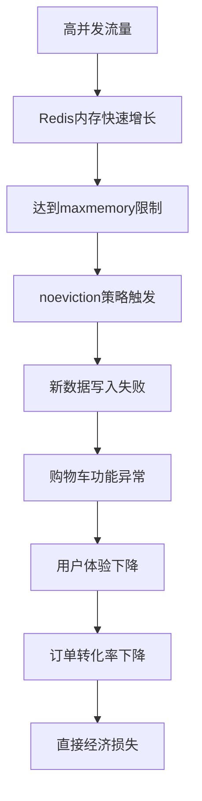
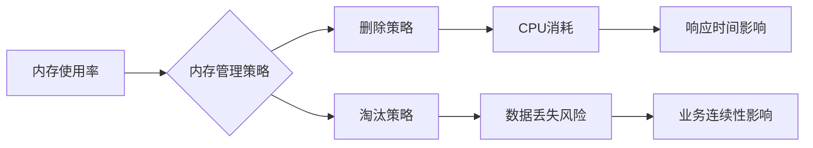
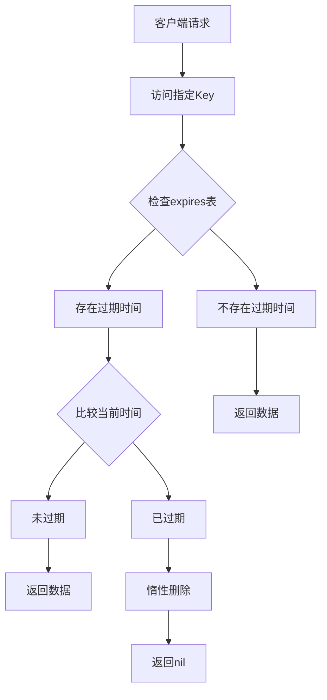

# Redis生产环境内存管理：数据过期与淘汰策略实战指南

## 1. 生产事故复盘：某电商平台Redis内存溢出事件

### 1.1 事故背景

2023年双11期间，某知名电商平台在流量高峰时段出现了严重的系统故障：

- **故障现象**：购物车功能无法正常使用，用户添加商品后数据丢失
- **影响范围**：影响约15万用户，持续时间45分钟
- **直接损失**：订单转化率下降23%，直接经济损失约280万
- **根本原因**：Redis集群内存使用率达到98%，触发OOM保护机制

### 1.2 技术分析

通过事后分析发现，问题的核心在于Redis内存管理策略配置不当：

```bash
# 事故时的Redis配置（错误配置）
maxmemory 8gb
maxmemory-policy noeviction  # 禁止数据淘汰
timeout 0                     # 永不超时
```

**问题分析**：
1. 购物车数据设置了7天过期时间，但删除策略配置错误
2. 用户行为数据无限制累积，占用大量内存
3. 缺乏有效的内存监控和预警机制
4. 数据淘汰策略设置为`noeviction`，导致新数据无法写入

### 1.3 业务影响链路分析



## 2. 业务挑战分析：购物车数据管理的核心问题

### 2.1 电商购物车场景特点

在电商系统中，购物车数据具有以下业务特征：

- **高频读写**：用户频繁增删改购物车商品，每秒数万次操作
- **数据时效性**：购物车数据在7天后自动清理，减少存储成本
- **内存敏感性**：需要在有限的内存空间内支持千万级用户
- **业务连续性**：不能因内存问题影响正常业务流程

### 2.2 核心挑战识别

通过对业务场景的深入分析，我们识别出以下核心挑战：

#### 2.2.1 内存使用效率问题

```java
// 问题案例：传统购物车实现（存在问题）
@Service
public class ShoppingCartService {
    
    @Autowired
    private RedisTemplate<String, Object> redisTemplate;
    
    // 问题：没有设置过期时间，导致数据累积
    public void addToCart(String userId, String productId, Integer quantity) {
        String cartKey = "cart:" + userId;
        Map<String, Object> productInfo = new HashMap<>();
        productInfo.put("productId", productId);
        productInfo.put("quantity", quantity);
        productInfo.put("addTime", System.currentTimeMillis());
        
        // 问题：没有设置 TTL
        redisTemplate.opsForHash().put(cartKey, productId, productInfo);
    }
}
```

#### 2.2.2 数据生命周期管理问题

```java
// 问题分析：不同类型数据的生命周期管理
public class DataLifecycleAnalysis {
    
    public void analyzeDataTypes() {
        // 1. 用户会话数据：30分钟过期
        // 2. 购物车数据：7天过期  
        // 3. 商品缓存：2小时过期
        // 4. 热点数据：永不过期（需要主动管理）
        
        // 问题：如何在内存有限的情况下平衡这些不同的需求？
    }
}
```

#### 2.2.3 性能与可用性平衡问题



## 3. Redis内存管理机制深度解析

### 3.1 数据过期机制实现原理

#### 3.1.1 过期数据存储结构

Redis中的过期数据管理采用了独立的存储结构设计：

```java
// Redis内部过期数据结构示意
public class RedisExpirationStructure {
    
    // 主数据存储区域
    private Map<String, Object> mainData;  // server.db[i].dict
    
    // 过期数据独立存储区域
    private Map<String, Long> expirationMap; // server.db[i].expires
    
    public void setKeyWithExpiration(String key, Object value, long ttlSeconds) {
        // 1. 存储主数据
        mainData.put(key, value);
        
        // 2. 存储过期时间戳
        long expireTime = System.currentTimeMillis() / 1000 + ttlSeconds;
        expirationMap.put(key, expireTime);
    }
    
    public int getTTL(String key) {
        Long expireTime = expirationMap.get(key);
        if (expireTime == null) {
            return mainData.containsKey(key) ? -1 : -2;  // -1:永不过期, -2:不存在
        }
        
        long currentTime = System.currentTimeMillis() / 1000;
        long ttl = expireTime - currentTime;
        return ttl > 0 ? (int) ttl : -2;  // -2:已过期
    }
}
```

#### 3.1.2 过期检测流程



## 4. 数据过期与删除策略实战应用

### 4.1 三种删除策略的业务场景对比

在实际的电商系统中，Redis采用了三种不同的删除策略来平衡性能与资源使用：

#### 4.1.1 定时删除策略（理论模型）

**优势与问题分析**：
- **优势**：内存即时释放，无不必要的内存占用
- **问题**：CPU开销巨大，一个电商平台1000万用户同时在线，需要同时维护数万个定时器
- **适用场景**：理论上可行，但生产环境不采用

#### 4.1.2 惰性删除策略（实际采用）

**业务影响分析**：
- **优势**：CPU开销小，只在访问时才检查
- **问题**：冷数据永不被访问，占用大量内存
- **业务场景**：适合热点数据，如用户会话、活跃购物车

#### 4.1.3 定期删除策略（生产采用）

**Redis内部实现机制**：
- 每秒执行server.hz次清理任务（默认10次）
- 随机抽取样本进行过期检测
- 根据过期数据比例动态调整清理频率
- 限制单次执行时间，避免阻塞主线程

## 5. 内存淘汰策略实战应用

### 5.1 淘汰策略概迵与场景分析

当Redis内存达到maxmemory限制时，需要通过淘汰策略释放空间。不同策略适合不同业务场景。

#### 5.1.1 业务数据分类

```java
// 电商平台数据类型分析
public enum DataType {
    HOT_DATA("volatile-lfu"),      // 热点数据：商品详情、促销信息
    USER_SESSION("volatile-lru"),  // 用户数据：购物车、会话信息
    CACHE_DATA("allkeys-lru"),     // 缓存数据：数据库查询结果
    COUNTER_DATA("noeviction");    // 计数器：不可丢失的数据
}
```

#### 5.1.2 主要淘汰策略对比

**针对过期数据的策略**：
- `volatile-lru`：淘汰最久未用的过期数据（推荐）
- `volatile-lfu`：淘汰使用频率最低的过期数据
- `volatile-ttl`：优先淘汰即将过期的数据
- `volatile-random`：随机淘汰过期数据

**针对所有数据的策略**：
- `allkeys-lru`：淘汰最久未用的任意数据（适合缓存）
- `allkeys-lfu`：淘汰使用频率最低的任意数据
- `allkeys-random`：随机淘汰任意数据

**禁止淘汰**：
- `noeviction`：禁止淘汰，内存满时返回OOM错误

### 5.2 生产环境配置实例

```yaml
# 电商平台推荐配置
redis:
  memory:
    maxmemory: 8gb
    maxmemory-policy: volatile-lru  # 针对过期数据采用LRU
    maxmemory-samples: 5            # 采样数量
  monitoring:
    memory-alert-threshold: 0.8   # 80%内存使用率预警
```

## 6. 监控与最佳实践

### 6.1 内存监控系统

```java
@Component
public class RedisMemoryMonitor {
    
    @Scheduled(fixedRate = 30000)
    public void monitorMemory() {
        Properties info = redisTemplate.execute((RedisCallback<Properties>) 
            connection -> connection.info("memory"));
        
        long usedMemory = Long.parseLong(info.getProperty("used_memory"));
        long maxMemory = Long.parseLong(info.getProperty("maxmemory"));
        double ratio = (double) usedMemory / maxMemory;
        
        if (ratio > 0.8) {
            alertService.sendAlert("内存使用率: " + (ratio * 100) + "%");
        }
    }
}
```

### 6.2 应急处理机制

```java
@Service
public class EmergencyHandler {
    
    public void handleMemoryPressure() {
        // 1. 清理过期数据
        cleanExpiredKeys();
        
        // 2. 调整淘汰策略
        adjustEvictionPolicy();
        
        // 3. 清理低优先级缓存
        cleanLowPriorityCache();
    }
}
```

## 7. 总结与建议

### 7.1 核心要点

1. **合理设置过期时间**：根据业务需求设置合适的TTL
2. **选择合适的淘汰策略**：根据数据类型选择策略
3. **建立监控预警**：实时监控内存使用情况
4. **定期性能调优**：根据监控数据调整配置

### 7.2 生产推荐配置

```bash
# Redis生产环境推荐配置
maxmemory 8gb
maxmemory-policy volatile-lru
maxmemory-samples 5
timeout 300
```

通过本文的学习，您应该能够：
- 理解Redis内存管理的核心原理
- 根据业务场景选择合适的配置策略
- 建立完善的监控和预警机制
- 遇到内存问题时能够快速定位和解决