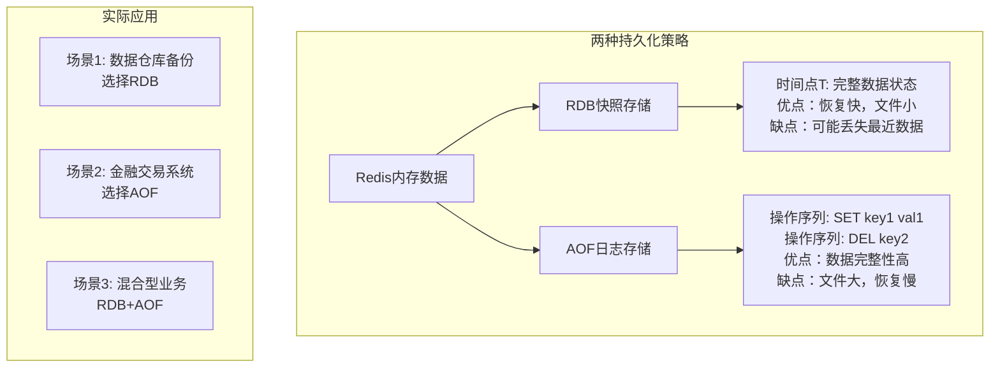

# 进阶-持久化机制

## 从生产事故说起

2019年某电商大促期间，凌晨2点，运维工程师收到紧急告警：Redis服务器因机房断电重启，但令人震惊的是，**几千万用户的购物车数据全部丢失了**！

这个真实事故暴露了一个严重问题：**Redis作为内存数据库，一旦断电重启，所有数据将灰飞烟灭**。想象一下用户第二天醒来发现购物车空了的愤怒，以及紧急从MySQL恢复数据时系统几近崩溃的惨状。

这就是为什么Redis持久化机制如此重要 - **它不是锦上添花的功能，而是生产环境的生命线**。

## 业务场景中的持久化需求分析

在不同的业务场景下，我们对数据持久化的要求完全不同：

### 场景一：电商购物车系统
- **数据特征**：频繁变更，用户体验敏感
- **丢失容忍度**：极低（用户购物车清空会导致投诉）
- **性能要求**：高并发读写
- **持久化策略**：需要实时或准实时持久化

### 场景二：网站访问计数器
- **数据特征**：高频更新，统计性质
- **丢失容忍度**：中等（短期数据丢失影响有限）
- **性能要求**：极高写入性能
- **持久化策略**：可定期快照

### 场景三：用户会话缓存
- **数据特征**：有时效性，可重新登录获取
- **丢失容忍度**：较高（用户重新登录即可）
- **性能要求**：快速读取
- **持久化策略**：可关闭或降低频率

**正是这些不同的需求，催生了Redis的两种主要持久化方案：RDB快照和AOF日志**。

## Redis持久化核心原理

### 持久化的本质思考

从计算机系统的角度看，数据持久化面临两个根本性选择：

**选择一：存储什么？**
- **存储结果**：记录某个时间点的完整数据状态（快照模式）
- **存储过程**：记录产生数据的所有操作命令（日志模式）

**选择二：何时存储？**
- **定期存储**：按时间间隔或条件触发（如每5分钟或1000次写操作）
- **实时存储**：每个操作后立即持久化
- **延迟存储**：批量异步写入

Redis巧妙地提供了两套互补的方案来解决这个问题：



### 两种持久化方案深度对比

| 维度 | RDB快照模式 | AOF日志模式 | 使用建议 |
|------|------------|------------|----------|
| **数据完整性** | ⚠️ 可能丢失快照间隔内的数据 | ✅ 最多丢失1秒数据 | 金融、电商选AOF |
| **文件大小** | ✅ 压缩效率高，文件小 | ⚠️ 记录所有操作，文件大 | 存储敏感选RDB |
| **恢复速度** | ✅ 直接加载，速度快 | ⚠️ 重放命令，速度慢 | 快速恢复选RDB |
| **系统开销** | ⚠️ fork进程时有短暂阻塞 | ✅ 持续写入，开销分散 | 高并发选AOF |
| **灾难恢复** | ✅ 适合定期备份 | ⚠️ 文件大，传输慢 | 跨机房备份选RDB |

## RDB快照持久化：摄影师的艺术

### RDB工作原理深度解析

想象RDB就像一个摄影师，定期对Redis的内存数据拍照。每次快照都完整记录那一刻的所有数据状态。

#### 命令详解与最佳实践

**1. 手动触发快照**

```bash
# 同步执行快照（生产环境慎用）
save

# 异步执行快照（推荐方式）
bgsave
```

**关键区别：**SAVE命令会阻塞主进程，而BGSAVE会创建子进程处理，主进程继续提供服务。

**生产环境配置示例：**

#### **redis.conf中配置RDB**

**快照周期**：内存快照虽然可以通过技术人员手动执行SAVE或BGSAVE命令来进行，但生产环境下多数情况都会设置其周期性执行条件。

- **Redis中默认的周期新设置**

  ```
  # 周期性执行条件的设置格式为
  save <seconds> <changes>
  
  # 默认的设置为：
  save 900 1
  save 300 10
  save 60 10000
  
  # 以下设置方式为关闭RDB快照功能
  save ""
  
  以上三项默认信息设置代表的意义是：如果900秒内有1条Key信息发生变化，则进行快照；如果300秒内有10条Key信息发生变化，则进行快照；如果60秒内有10000条Key信息发生变化，则进行快照。读者可以按照这个规则，根据自己的实际请求压力进行设置调整。
  ```


**在进行快照操作的这段时间，如果发生服务崩溃怎么办**？

在没有将数据全部写入到磁盘前，这次快照操作都不算成功。如果出现了服务崩溃的情况，将以上一次完整的RDB快照文件作为恢复内存数据的参考。也就是说，在快照操作过程中不能影响上一次的备份数据。Redis服务会在磁盘上创建一个临时文件进行数据操作，待操作成功后才会用这个临时文件替换掉上一次的备份。

#### **RDB优点：**

- RDB是一个紧凑压缩的二进制文件，存储效率较高
- RDB内部存储的是redis在某个时间点的数据快照，非常适合用于数据备份，全量复制等场景
- RDB恢复数据的速度要比AOF快很多
- 应用：服务器中每X小时执行bgsave备份，并将RDB文件拷贝到远程机器中，用于灾难恢复。

#### **RDB缺点**

- RDB方式无论是执行指令还是利用配置，无法做到实时持久化，具有较大的可能性丢失数据
- bgsave指令每次运行要执行fork操作创建子进程，要牺牲掉一些性能
- Redis的众多版本中未进行RDB文件格式的版本统一，有可能出现各版本服务之间数据格式无法兼容现象

针对RDB不适合实时持久化的问题，Redis提供了AOF持久化方式来解决

## 

### AOF文件存储

**AOF**(append only file)持久化：以独立日志的方式记录每次写命令，重启时再重新执行AOF文件中命令 达到恢复数据的目的。**与RDB相比可以简单理解为由记录数据改为记录数据产生的变化**

AOF的主要作用是解决了数据持久化的实时性，目前已经是Redis持久化的主流方式

**为什么要有AOF,这得从RDB的存储的弊端说起：**

- 存储数据量较大，效率较低，基于快照思想，每次读写都是全部数据，当数据量巨大时，效率非常低
- 大数据量下的IO性能较低
- 基于fork创建子进程，内存产生额外消耗
- 宕机带来的数据丢失风险

**那解决的思路是什么呢？**

- 不写全数据，仅记录部分数据
- 降低区分数据是否改变的难度，改记录数据为记录操作过程
- 对所有操作均进行记录，排除丢失数据的风险

#### AOF执行策略

AOF写数据三种策略(appendfsync)

- **always**(每次）：每次写入操作均同步到AOF文件中数据零误差，性能较低，不建议使用。


- **everysec**（每秒）：每秒将缓冲区中的指令同步到AOF文件中，在系统突然宕机的情况下丢失1秒内的数据 数据准确性较高，性能较高，建议使用，也是默认配置


- **no**（系统控制）：由操作系统控制每次同步到AOF文件的周期，每个写命令执行完，只是先把日志写到AOF文件的内存缓冲区，由操作系统决定何时将缓冲区内容写回磁盘，整体过程不可控


**什么叫AOF重写？**

随着命令不断写入AOF，文件会越来越大，为了解决这个问题，Redis引入了AOF重写机制压缩文件体积。AOF文件重 写是将Redis进程内的数据转化为写命令同步到新AOF文件的过程。简单说就是将对同一个数据的若干个条命令执行结果转化成最终结果数据对应的指令进行记录。

**AOF重写作用**

- 降低磁盘占用量，提高磁盘利用率
- 提高持久化效率，降低持久化写时间，提高IO性能
- 降低数据恢复用时，提高数据恢复效率

**AOF重写规则**

- 进程内具有时效性的数据，并且数据已超时将不再写入文件


- 非写入类的无效指令将被忽略，只保留最终数据的写入命令

  如del key1、 hdel key2、srem key3、set key4 111、set key4 222等

  如select指令虽然不更改数据，但是更改了数据的存储位置，此类命令同样需要记录

- 对同一数据的多条写命令合并为一条命令

如lpushlist1 a、lpush list1 b、lpush list1 c可以转化为：lpush list1 a b c。

为防止数据量过大造成客户端缓冲区溢出，对list、set、hash、zset等类型，每条指令最多写入64个元素

```
手动重写：
bgrewriteaof
```


#### **redis.conf中配置AOF**

默认情况下，Redis是没有开启AOF的，可以通过配置redis.conf文件来开启AOF持久化，关于AOF的配置如下：

```sh
# appendonly参数开启AOF持久化
appendonly no

# AOF持久化的文件名，默认是appendonly.aof
appendfilename "appendonly.aof"

# AOF文件的保存位置和RDB文件的位置相同，都是通过dir参数设置的
dir ./

# 同步策略
# appendfsync always
appendfsync everysec
# appendfsync no

# aof重写期间是否同步
no-appendfsync-on-rewrite no

# 重写触发配置
auto-aof-rewrite-percentage 100
auto-aof-rewrite-min-size 64mb

# 加载aof出错如何处理
aof-load-truncated yes

# 文件重写策略
aof-rewrite-incremental-fsync yes
```

#### AOF重写示例图


- **AOF重写会阻塞吗**？

AOF重写过程是由后台进程bgrewriteaof来完成的。主线程fork出后台的bgrewriteaof子进程，fork会把主线程的内存拷贝一份给bgrewriteaof子进程，这里面就包含了数据库的最新数据。然后，bgrewriteaof子进程就可以在不影响主线程的情况下，逐一把拷贝的数据写成操作，记入重写日志。

所以aof在重写时，在fork进程时是会阻塞住主线程的。

- **AOF日志何时会重写**？

有两个配置项控制AOF重写的触发：

`auto-aof-rewrite-min-size`:表示运行AOF重写时文件的最小大小，默认为64MB。

`auto-aof-rewrite-percentage`:这个值的计算方式是，当前aof文件大小和上一次重写后aof文件大小的差值，再除以上一次重写后aof文件大小。也就是当前aof文件比上一次重写后aof文件的增量大小，和上一次重写后aof文件大小的比值。

- **重写日志时，有新数据写入咋整**？

重写过程总结为：“一个拷贝，两处日志”。在fork出子进程时的拷贝，以及在重写时，如果有新数据写入，主线程就会将命令记录到两个aof日志内存缓冲区中。如果AOF写回策略配置的是always，则直接将命令写回旧的日志文件，并且保存一份命令至AOF重写缓冲区，这些操作对新的日志文件是不存在影响的。（旧的日志文件：主线程使用的日志文件，新的日志文件：bgrewriteaof进程使用的日志文件）

而在bgrewriteaof子进程完成会日志文件的重写操作后，会提示主线程已经完成重写操作，主线程会将AOF重写缓冲中的命令追加到新的日志文件后面。这时候在高并发的情况下，AOF重写缓冲区积累可能会很大，这样就会造成阻塞，Redis后来通过Linux管道技术让aof重写期间就能同时进行回放，这样aof重写结束后只需回放少量剩余的数据即可。

最后通过修改文件名的方式，保证文件切换的原子性。

在AOF重写日志期间发生宕机的话，因为日志文件还没切换，所以恢复数据时，用的还是旧的日志文件。

- **为什么AOF重写不复用原AOF日志**？

两方面原因：

1. 父子进程写同一个文件会产生竞争问题，影响父进程的性能。
2. 如果AOF重写过程中失败了，相当于污染了原本的AOF文件，无法做恢复数据使用。

## 

#### RDB与AOF对比（优缺点）

| 持久化方式   | RDB                | AOF                |
| ------------ | ------------------ | ------------------ |
| 占用存储空间 | 小（数据级：压缩） | 大（指令级：重写） |
| 存储速度     | 慢                 | 快                 |
| 恢复速度     | 快                 | 慢                 |
| 数据安全性   | 会丢失数据         | 依据策略决定       |
| 资源消耗     | 高/重量级          | 低/轻量级          |
| 启动优先级   | 低                 | 高                 |

#### RDB与AOF应用场景

RDB与AOF的选择之惑

- 对数据非常敏感，建议使用默认的AOF持久化方案

AOF持久化策略使用everysecond，每秒钟fsync一次。该策略redis仍可以保持很好的处理性能，当出 现问题时，最多丢失0-1秒内的数据。

注意：由于AOF文件存储体积较大，且恢复速度较慢

- 数据呈现阶段有效性，建议使用RDB持久化方案

数据可以良好的做到阶段内无丢失（该阶段是开发者或运维人员手工维护的），且恢复速度较快，阶段 点数据恢复通常采用RDB方案

注意：利用RDB实现紧凑的数据持久化会使Redis降的很低，慎重总结：


**综合比对**

- RDB与AOF的选择实际上是在做一种权衡，每种都有利有弊
- 如不能承受数分钟以内的数据丢失，对业务数据非常敏感，选用AOF
- 如能承受数分钟以内的数据丢失，且追求大数据集的恢复速度，选用RDB
- 灾难恢复选用RDB
- 双保险策略，同时开启 RDB和 AOF，重启后，Redis优先使用 AOF 来恢复数据，降低丢失数据的量


## RDB和AOF混合方式（4.0版本)

> Redis 4.0 中提出了一个**混合使用 AOF 日志和内存快照**的方法。简单来说，内存快照以一定的频率执行，在两次快照之间，使用 AOF 日志记录这期间的所有命令操作。

这样一来，快照不用很频繁地执行，这就避免了频繁 fork 对主线程的影响。而且，AOF 日志也只用记录两次快照间的操作，也就是说，不需要记录所有操作了，因此，就不会出现文件过大的情况了，也可以避免重写开销。

如下图所示，T1 和 T2 时刻的修改，用 AOF 日志记录，等到第二次做全量快照时，就可以清空 AOF 日志，因为此时的修改都已经记录到快照中了，恢复时就不再用日志了。


这个方法既能享受到 RDB 文件快速恢复的好处，又能享受到 AOF 只记录操作命令的简单优势, 实际环境中用的很多。

## 从持久化中恢复数据

> 数据的备份、持久化做完了，我们如何从这些持久化文件中恢复数据呢？如果一台服务器上有既有RDB文件，又有AOF文件，该加载谁呢？


- redis重启时判断是否开启aof，如果开启了aof，那么就优先加载aof文件；
- 如果aof存在，那么就去加载aof文件，加载成功的话redis重启成功，如果aof文件加载失败，那么会打印日志表示启动失败，此时可以去修复aof文件后重新启动；
- 若aof文件不存在，那么redis就会转而去加载rdb文件，如果rdb文件不存在，redis直接启动成功；
- 如果rdb文件存在就会去加载rdb文件恢复数据，如加载失败则打印日志提示启动失败，如加载成功，那么redis重启成功，且使用rdb文件恢复数据；

那么为什么会优先加载AOF呢？因为AOF保存的数据更完整，通过上面的分析我们知道AOF基本上最多损失1s的数据。

## 性能与实践

通过上面的分析，我们都知道RDB的快照、AOF的重写都需要fork，这是一个重量级操作，会对Redis造成阻塞。因此为了不影响Redis主进程响应，我们需要尽可能降低阻塞。

- 降低fork的频率，比如可以手动来触发RDB生成快照、与AOF重写；
- 控制Redis最大使用内存，防止fork耗时过长；
- 使用更牛逼的硬件；
- 合理配置Linux的内存分配策略，避免因为物理内存不足导致fork失败。

在线上我们到底该怎么做？我提供一些自己的实践经验。

- 如果Redis中的数据并不是特别敏感或者可以通过其它方式重写生成数据，可以关闭持久化，如果丢失数据可以通过其它途径补回；
- 自己制定策略定期检查Redis的情况，然后可以手动触发备份、重写数据；
- 单机如果部署多个实例，要防止多个机器同时运行持久化、重写操作，防止出现内存、CPU、IO资源竞争，让持久化变为串行；
- 可以加入主从机器，利用一台从机器进行备份处理，其它机器正常响应客户端的命令；
- RDB持久化与AOF持久化可以同时存在，配合使用。

