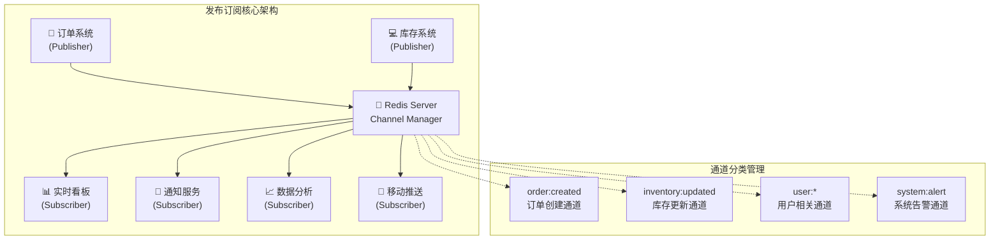

# 进阶-发布订阅模式

## 从业务痛点开始

在构建现代应用系统时，我们经常遇到这样的场景：

**场景1：电商平台实时库存同步**
> 用户在手机App下单成功后，需要实时通知PC端、小程序、第三方平台等多个客户端更新库存显示。传统的轮询方式延迟高、资源消耗大。

**场景2：在线协作文档系统**  
> 多人编辑同一文档时，一个用户的修改需要实时推送给其他所有在线用户。如果用数据库存储+定时拉取，会产生明显的延迟和不一致。

**场景3：金融交易系统风控告警**
> 当检测到异常交易时，需要同时通知风控系统、客服系统、短信服务等多个下游服务进行处理。

**传统解决方案的问题：**
- **轮询机制**：延迟高、资源浪费、服务器压力大
- **长连接推送**：连接管理复杂、服务重启时连接丢失
- **消息队列**：部署复杂、对小型应用过重
- **数据库变更监听**：性能开销大、实时性不够

**Redis Pub/Sub完美解决这些痛点**，提供了轻量级、高性能的实时消息分发能力。

## Redis发布订阅核心原理

### 发布订阅模式架构解析



### 两种订阅模式深度对比

| 特性维度 | Channel订阅 | Pattern订阅 | 实际应用建议 |
|---------|-------------|-------------|-------------|
| **精确匹配** | ✅ 订阅指定通道 | ❌ 通配符匹配 | 固定业务用Channel |
| **灵活性** | ⭐⭐ | ⭐⭐⭐⭐⭐ | 动态场景用Pattern |
| **性能开销** | ⭐⭐⭐⭐⭐ | ⭐⭐⭐ | 高并发优选Channel |
| **维护复杂度** | ⭐⭐ | ⭐⭐⭐⭐ | 团队技能考虑 |
| **典型场景** | 订单状态变更 | 用户行为追踪 | 按需选择 |

## 核心命令与实战应用

### 基础命令掌握

```bash
# 发布消息
PUBLISH channel message

# 订阅通道
SUBSCRIBE channel [channel ...]

# 模式订阅（支持通配符）
PSUBSCRIBE pattern [pattern ...]

# 取消订阅
UNSUBSCRIBE [channel ...]
PUNSUBSCRIBE [pattern ...]

# 查看活跃通道
PUBSUB CHANNELS [pattern]

# 查看通道订阅者数量
PUBSUB NUMSUB [channel ...]
```

### 实战演示：电商库存实时同步

**1. 发布库存变更消息**
```bash
# 商品ID 12345 库存减少到 87 件
127.0.0.1:6379> PUBLISH inventory:12345 '{"productId":12345,"stock":87,"timestamp":1640995200}'
(integer) 3  # 表示有3个订阅者收到了这条消息
```

**2. 多渠道订阅库存更新**
```bash
# 客户端1：移动App订阅特定商品
127.0.0.1:6379> SUBSCRIBE inventory:12345
Reading messages... (press Ctrl-C to quit)
1) "subscribe"     # 消息类型：订阅确认  
2) "inventory:12345" # 通道名称
3) (integer) 1      # 当前通道订阅者数量

# 客户端2：管理后台使用模式订阅所有库存变更
127.0.0.1:6379> PSUBSCRIBE inventory:*
Reading messages... (press Ctrl-C to quit)
1) "psubscribe"    # 模式订阅确认
2) "inventory:*"   # 订阅的模式
3) (integer) 1     # 当前模式订阅数量
```


### 模式订阅高级应用

模式订阅支持通配符，适合动态场景：

```bash
# 订阅所有用户相关事件
PSUBSCRIBE user:*

# 下面这些事件都会被捕获：
PUBLISH user:123:login '{"userId":123,"action":"login"}'
PUBLISH user:456:purchase '{"userId":456,"orderId":789}'
```

## Spring Boot集成实战

在实际项目中，我们通常会使用 Spring Boot 集成 Redis 发布订阅功能。下面是一个完整的实现示例：

#### （1）添加依赖配置

首先，我们需要在 `pom.xml` 中添加必要的依赖：

```xml
<dependencies>
    <dependency>
        <groupId>org.springframework.boot</groupId>
        <artifactId>spring-boot-starter-web</artifactId>
    </dependency>
    <dependency>
        <groupId>org.springframework.boot</groupId>
        <artifactId>spring-boot-starter-data-redis</artifactId>
    </dependency>
    <!-- 使用Lettuce连接池 -->
    <dependency>
        <groupId>org.apache.commons</groupId>
        <artifactId>commons-pool2</artifactId>
    </dependency>
</dependencies>
```

然后，在 `application.yml` 中配置 Redis 连接信息：

```yaml
spring:
  redis:
    # 地址
    host: localhost
    # 端口，默认为6379
    port: 6379
    # 数据库索引
    database: 1
    # 密码(如没有密码请注释掉)
#    password: 
    # 连接超时时间
    timeout: 10s
    # 是否开启ssl
    ssl: false
    lettuce:
      pool:
        # 连接池最大连接数
        max-active: 200
        # 连接池最大阻塞等待时间（使用负值表示没有限制）
        max-wait: -1ms
        # 连接池中的最大空闲连接
        max-idle: 10
        # 连接池中的最小空闲连接
        min-idle: 0
```

#### （2）创建消息接收者

消息接收者负责处理接收到的消息，需要实现 `MessageListener` 接口：

```java
package cn.devops.demo;

import lombok.extern.slf4j.Slf4j;
import org.jetbrains.annotations.NotNull;
import org.springframework.data.redis.connection.Message;
import org.springframework.data.redis.connection.MessageListener;
import org.springframework.stereotype.Component;

/**
 * 订阅者-监听消息
 * @author ldf
 */
@Slf4j
@Component
public class MessageReceiver implements MessageListener {
 
    @Override
    public void onMessage(Message message, @NotNull byte[] pattern) {
        //消息通道
        String channel = new String(message.getChannel());
        //消息内容
        String messageBody = new String(message.getBody());
        // 消息订阅的匹配规则，如 new PatternTopic("test-*") 中的 test-*
        String msgPattern = new String(pattern);
        log.info("接收消息: channel={} body={} pattern={} ", channel, messageBody, msgPattern);
        // 这里处理接收的消息
        // 实际应用中，我们可以根据不同的通道和消息内容执行不同的业务逻辑
        handleMessage(channel, messageBody);
    }
    
    /**
     * 根据通道和消息内容处理业务逻辑
     */
    private void handleMessage(String channel, String messageBody) {
        // 示例：根据不同通道处理不同业务
        if (channel.contains("schedule")) {
            // 处理调度相关消息
            log.info("处理调度任务消息: {}", messageBody);
            // 执行具体的业务逻辑...
        } else if (channel.contains("notify")) {
            // 处理通知相关消息
            log.info("处理通知消息: {}", messageBody);
            // 执行具体的业务逻辑...
        }
    }
}
```

#### （3）配置 Redis 消息监听器

我们需要配置 Redis 消息监听器容器来连接 Redis 服务器并监听指定的通道：

```java
package cn.devops.configuration;

import cn.devops.demo.MessageReceiver;
import org.springframework.cache.annotation.EnableCaching;
import org.springframework.cache.concurrent.ConcurrentMapCacheManager;
import org.springframework.context.annotation.Bean;
import org.springframework.context.annotation.Configuration;
import org.springframework.data.redis.connection.RedisConnectionFactory;
import org.springframework.data.redis.core.RedisTemplate;
import org.springframework.data.redis.listener.PatternTopic;
import org.springframework.data.redis.listener.RedisMessageListenerContainer;
import org.springframework.data.redis.listener.adapter.MessageListenerAdapter;
import org.springframework.data.redis.serializer.JdkSerializationRedisSerializer;
import org.springframework.data.redis.serializer.StringRedisSerializer;

/**
 * Redis配置类
 * @author ldf
 */
@EnableCaching
@Configuration
public class RedisConfig {
    /**
     * 创建并配置ConcurrentMapCacheManager缓存管理器Bean
     * 配置完成后，可以通过 Spring Cache 的注解来使用本地缓存
     * @return ConcurrentMapCacheManager 缓存管理器实例
     */
    @Bean
    public ConcurrentMapCacheManager cacheManager() {
        // 创建ConcurrentMapCacheManager实例并指定默认缓存名称
        return new ConcurrentMapCacheManager("defaultCache"); // 指定缓存名
    }

   /**
     * 创建并配置RedisTemplate实例
     *
     * @param connectionFactory Redis连接工厂，用于创建Redis连接
     * @return 配置好的RedisTemplate实例，用于操作Redis数据库
     */
    @Bean
    public RedisTemplate<String, Object> redisTemplate(RedisConnectionFactory connectionFactory) {
        RedisTemplate<String, Object> template = new RedisTemplate<>();
        template.setConnectionFactory(connectionFactory);

        // 配置序列化器
        template.setKeySerializer(new StringRedisSerializer()); // 设置key的序列化器为StringRedisSerializer
        template.setValueSerializer(new StringRedisSerializer()); // 设置value的序列化器为StringRedisSerializer
        template.setHashKeySerializer(new StringRedisSerializer()); // 设置hash key的序列化器为StringRedisSerializer
        template.setHashValueSerializer(new JdkSerializationRedisSerializer()); // 设置hash value的序列化器为JdkSerializationRedisSerializer不能改为StringRedisSerializer

        template.afterPropertiesSet(); // 初始化RedisTemplate
        return template;
    }


    /**
     * 创建并配置消息监听器适配器Bean
     *
     * @param receiver 消息接收器实例，用于处理接收到的消息
     * @return 配置好的消息监听器适配器实例
     */
    @Bean
    public MessageListenerAdapter listenerAdapter(MessageReceiver receiver) {
        return new MessageListenerAdapter(receiver);
    }

    /**
     * 创建Redis消息监听容器Bean
     *
     * @param connectionFactory Redis连接工厂，用于建立与Redis服务器的连接
     * @param listenerAdapter 消息监听适配器，用于处理接收到的Redis消息
     * @return 配置好的Redis消息监听容器实例
     */
    @Bean
    public RedisMessageListenerContainer redisMessageListenerContainer(RedisConnectionFactory connectionFactory, MessageListenerAdapter listenerAdapter) {
        // 创建Redis消息监听容器实例
        RedisTemplate<String, Object> template = new RedisTemplate<>();
        template.setConnectionFactory(connectionFactory);
        
        RedisMessageListenerContainer container = new RedisMessageListenerContainer();
        container.setConnectionFactory(connectionFactory);
        // 添加消息监听器，监听模式为"schedule-flush-valid-status-job"的channel主题消息
        container.addMessageListener(listenerAdapter, new PatternTopic("schedule-flush-valid-status-job"));
        // 可以添加多个监听器和通道
        // container.addMessageListener(listenerAdapter, new PatternTopic("notify-*"));
        return container;
    }

}
```

#### （4）创建消息发布者

消息发布者用于向指定通道发送消息：

```java
package cn.devops.demo;

import org.springframework.data.redis.core.StringRedisTemplate;
import org.springframework.stereotype.Component;

/**
 * 发布者-发布消息
 * @author ldf
 */
@Component
public class MessagePublisher {

    private final StringRedisTemplate redisTemplate;

    public MessagePublisher(StringRedisTemplate redisTemplate) {
        this.redisTemplate = redisTemplate;
    }

    /**
     * 向指定通道发布消息
     * @param channel 通道名称
     * @param message 消息内容
     */
    public void publish(String channel, String message) {
        redisTemplate.convertAndSend(channel, message);
        // 记录发布日志
        System.out.println("已发布消息到通道 " + channel + ": " + message);
    }
    
}
```

### 3. 发布订阅模式的实际应用场景

Redis 发布订阅模式在实际项目中有很多应用场景，下面列举几个常见的例子：

#### （1）实时通知系统

在电商网站中，当用户下单成功后，可以通过 Redis 发布订阅模式向相关系统发送通知，如库存系统、物流系统、短信服务等。

```java
// 示例：订单成功后的消息发布
@Service
public class OrderService {
    
    @Autowired
    private MessagePublisher messagePublisher;
    
    public void createOrder(Order order) {
        // 保存订单信息
        saveOrder(order);
        
        // 发布订单创建成功消息
        String orderJson = convertOrderToJson(order);
        messagePublisher.publish("order-created", orderJson);
        
        // 发布库存扣减消息
        messagePublisher.publish("inventory-deduct", orderJson);
        
        // 发布通知消息
        messagePublisher.publish("notification-send", orderJson);
    }
}
```

#### （2）分布式系统中的服务协调

在分布式系统中，多个服务实例之间需要进行协调时，可以使用 Redis 发布订阅模式。例如，当某个服务实例更新了配置信息后，可以通过发布订阅模式通知其他所有实例刷新配置。

#### （3）日志系统

可以使用 Redis 发布订阅模式实现一个简单的分布式日志收集系统，各服务实例将日志发布到指定通道，然后由专门的日志收集服务订阅这些通道并将日志存储到持久化存储中。

## 知识扩展

### 1. Redis 发布订阅的设计思想

Redis 发布订阅模式的设计思想主要基于以下几点：

- **简单高效**：Redis 发布订阅实现简单，消息传递高效，适合实时性要求较高的场景。
- **松耦合**：发布者和订阅者之间没有直接依赖，通过通道进行解耦，提高了系统的可扩展性。
- **多播通信**：支持一个消息发送给多个接收者，实现了高效的多播通信机制。

### 2. 避坑指南

在使用 Redis 发布订阅模式时，需要注意以下几点：

- **消息不持久化**：Redis 发布订阅的消息不会持久化，如果订阅者离线，在其离线期间的消息将丢失。如果需要可靠的消息传递，应考虑使用 Redis Stream 或专业的消息队列如 Kafka、RabbitMQ 等。

- **消息堆积问题**：如果订阅者处理消息的速度慢于消息产生的速度，可能会导致消息堆积。在高并发场景下，需要合理设计消息处理机制，避免消息堆积。

- **连接稳定性**：订阅者需要保持与 Redis 服务器的长连接，如果连接断开，需要重新订阅。在 Spring Boot 中，RedisMessageListenerContainer 已经处理了连接断开后的重连逻辑。

- **通道命名规范**：为了避免通道名称冲突，建议使用有意义的命名规范，如 `系统名-模块名-功能名`。

### 3. 深度思考题

**深度思考题：** Redis 发布订阅模式与其他消息队列（如 Kafka、RabbitMQ）相比有哪些优缺点？在什么场景下应该选择 Redis 发布订阅？

**思考题回答：**

**Redis 发布订阅的优点：**

1. **简单易用**：Redis 发布订阅 API 简单直观，容易理解和使用。
2. **高性能**：Redis 作为内存数据库，消息传递速度非常快。
3. **轻量级**：如果系统已经在使用 Redis，不需要额外部署其他消息队列服务。
4. **实时性好**：适合对实时性要求高的场景。

**Redis 发布订阅的缺点：**

1. **消息不持久化**：如果订阅者离线或 Redis 服务器重启，消息将丢失。
2. **没有消息确认机制**：无法保证消息被订阅者成功接收和处理。
3. **没有消息堆积处理**：如果订阅者处理速度慢，可能导致消息积压甚至丢失。
4. **不支持复杂的消息路由**：与专业消息队列相比，功能较为简单。

**适合使用 Redis 发布订阅的场景：**

1. **实时通知**：如用户操作提醒、系统状态变更通知等。
2. **事件广播**：需要将事件广播给多个接收者的场景。
3. **临时数据传输**：不需要持久化的临时数据传输。
4. **低可靠性要求**：对消息可靠性要求不高的场景。

如果业务场景对消息可靠性要求高、需要持久化、消息堆积处理等高级特性，建议使用专业的消息队列如 Kafka、RabbitMQ 等。

