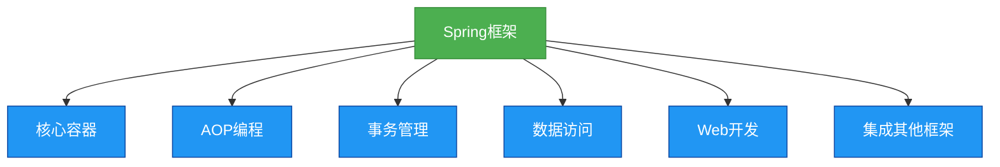

# 1. Spring框架概述

## 概述
Spring是一个开源的轻量级Java开发框架，它简化了企业级应用程序的开发。Spring的核心是控制反转(IoC)和面向切面编程(AOP)，它提供了全面的基础设施支持，包括数据访问、事务管理、Web开发等。

## 知识要点
### 1. Spring的核心特性
- **控制反转(IoC)**: 传统的Java应用程序中，对象的创建和依赖关系由应用程序自身管理，而在Spring中，这些由Spring容器管理。
- **面向切面编程(AOP)**: 允许将横切关注点（如日志、事务）从业务逻辑中分离出来。
- **轻量级**: Spring的核心JAR文件很小，不会给应用程序带来额外的负担。
- **非侵入性**: 应用程序代码不需要实现Spring特定的接口。
- **可测试性**: Spring的设计使得测试变得容易。
- **模块化**: Spring由多个模块组成，可以根据需要选择使用。

### 2. Spring的历史
- 2002年，Rod Johnson发布了《Expert One-On-One J2EE Design and Development》一书，其中包含了Spring的早期思想。
- 2003年，Spring框架正式发布。
- 随着时间的推移，Spring不断发展，现在已经成为Java开发中最受欢迎的框架之一。

### 3. Spring的整体架构
- **核心容器**: 包含BeanFactory和ApplicationContext，负责对象的创建和管理。
- **AOP模块**: 提供面向切面编程的支持。
- **事务模块**: 提供声明式事务管理的支持。
- **数据访问模块**: 提供对JDBC、ORM框架等的支持。
- **Web模块**: 提供对Web开发的支持。
- **集成模块**: 提供与其他框架的集成支持。

## 知识扩展
### 设计思想
Spring的设计思想是简化Java开发，它通过以下方式实现:
- 提供一个统一的编程模型
- 消除样板代码
- 促进良好的编程实践
- 提供对第三方框架的集成支持

### 避坑指南
- 不要过度使用Spring的特性，保持代码简洁。
- 注意版本兼容性问题，不同版本的Spring可能有不同的API。
- 避免在XML配置文件中放入过多的配置，考虑使用Java配置。

### 深度思考题
**深度思考题:** Spring的控制反转(IoC)和依赖注入(DI)有什么区别？
**思考题回答:** 控制反转是一种设计原则，它将对象的创建和管理从应用程序转移到框架；而依赖注入是实现控制反转的一种方式，它通过构造函数、setter方法或字段注入依赖对象。

**深度思考题:** 为什么说Spring是轻量级的？
**思考题回答:** Spring的核心JAR文件很小（大约1MB左右），而且它不需要任何特殊的容器就可以运行，此外，Spring的非侵入性设计也使得应用程序不会依赖于Spring的特定API。