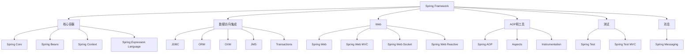
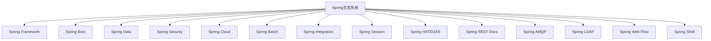

# Spring框架概述

## 什么是Spring框架

Spring框架是一个开源的Java平台应用程序框架和控制反转容器。它由Rod Johnson在2003年首次发布，旨在解决企业级Java开发中的复杂性问题。

Spring框架的核心特性包括：
- **控制反转（IoC）**：通过依赖注入实现对象之间的解耦
- **面向切面编程（AOP）**：提供声明式事务管理等功能
- **容器管理**：统一管理应用程序对象的生命周期
- **事务管理**：提供声明式和编程式事务管理
- **数据访问**：简化数据库访问操作
- **Web开发**：提供MVC框架用于Web应用开发

## Spring框架的历史发展

Spring框架的发展历程：
1. **2003年**：Rod Johnson发布Spring框架1.0版本
2. **2004年**：Spring 1.0正式发布
3. **2006年**：Spring 2.0引入了新的特性和改进
4. **2009年**：Spring 3.0支持Java 5特性
5. **2013年**：Spring 4.0支持Java 8和WebSocket
6. **2017年**：Spring 5.0引入响应式编程支持
7. **至今**：Spring Framework持续更新，支持最新的Java特性和云原生应用开发

## Spring框架的架构

Spring框架采用分层架构，由多个模块组成，每个模块都有特定的功能：

```mermaid
graph TB
    A[Spring Framework] --> B[核心容器]
    A --> C[数据访问/集成]
    A --> D[Web]
    A --> E[AOP和工具]
    A --> F[测试]
    A --> G[消息]
    
    B --> B1[Spring Core]
    B --> B2[Spring Beans]
    B --> B3[Spring Context]
    B --> B4[Spring Expression Language]
    
    C --> C1[JDBC]
    C --> C2[ORM]
    C --> C3[OXM]
    C --> C4[JMS]
    C --> C5[Transactions]
    
    D --> D1[Spring Web]
    D --> D2[Spring Web MVC]
    D --> D3[Spring Web Socket]
    D --> D4[Spring Web Reactive]
    
    E --> E1[Spring AOP]
    E --> E2[Aspects]
    E --> E3[Instrumentation]
    
    F --> F1[Spring Test]
    F --> F2[Spring Test MVC]
    
    G --> G1[Spring Messaging]
```

## Spring生态系统

Spring不仅仅是一个框架，更是一个庞大的生态系统，包括：

```mermaid
graph TB
    A[Spring生态系统] --> B[Spring Framework]
    A --> C[Spring Boot]
    A --> D[Spring Data]
    A --> E[Spring Security]
    A --> F[Spring Cloud]
    A --> G[Spring Batch]
    A --> H[Spring Integration]
    A --> I[Spring Session]
    A --> J[Spring HATEOAS]
    A --> K[Spring REST Docs]
    A --> L[Spring AMQP]
    A --> M[Spring LDAP]
    A --> N[Spring Web Flow]
    A --> O[Spring Shell]
```

## Spring框架的优势

1. **轻量级**：Spring框架是非侵入性的，对领域模型没有要求
2. **控制反转**：通过IoC容器管理对象依赖关系，降低组件间的耦合度
3. **面向切面编程**：提供声明式服务，如事务管理、安全等
4. **容器服务**：Spring容器负责创建、配置和管理对象的生命周期
5. **框架集成**：与其他主流框架无缝集成
6. **丰富的功能**：提供全面的企业级应用开发功能

## 学习路线

学习Spring框架的建议路径：
1. 理解Spring核心概念（IoC、AOP）
2. 掌握Spring容器和Bean管理
3. 学习数据访问和事务管理
4. 掌握Web开发技术
5. 了解安全框架和测试框架
6. 学习Spring Boot简化开发