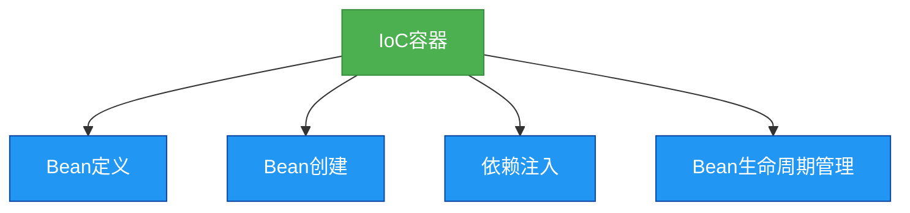

# 2. Spring IOC与DI详解

## 概述
控制反转(IoC)和依赖注入(DI)是Spring框架的核心概念。IoC是一种设计原则，它将对象的创建和管理从应用程序转移到框架；而DI是实现IoC的一种方式，它通过构造函数、setter方法或字段注入依赖对象。



## 知识要点
### 1. IoC容器
- **BeanFactory**: 是IoC容器的基本接口，提供了获取bean、检查bean是否存在等基本功能。
- **ApplicationContext**: 是BeanFactory的子接口，提供了更多的功能，如国际化支持、事件传播等。
- **常见的ApplicationContext实现**: ClassPathXmlApplicationContext、FileSystemXmlApplicationContext、AnnotationConfigApplicationContext等。

### 2. 依赖注入的方式
- **构造函数注入**: 通过构造函数的参数注入依赖对象。
- **Setter方法注入**: 通过setter方法注入依赖对象。
- **字段注入**: 直接在字段上使用@Autowired注解注入依赖对象。

### 3. 代码示例
#### 构造函数注入
```java
public class UserService {
    private UserDao userDao;

    // 构造函数注入
    public UserService(UserDao userDao) {
        this.userDao = userDao;
    }

    public void saveUser() {
        userDao.save();
    }
}
```

#### Setter方法注入
```java
public class UserService {
    private UserDao userDao;

    // Setter方法注入
    public void setUserDao(UserDao userDao) {
        this.userDao = userDao;
    }

    public void saveUser() {
        userDao.save();
    }
}
```

#### 字段注入
```java
public class UserService {
    // 字段注入
    @Autowired
    private UserDao userDao;

    public void saveUser() {
        userDao.save();
    }
}
```

### 4. Bean的作用域
- **singleton**: 默认值，整个应用程序中只有一个bean实例。
- **prototype**: 每次请求都会创建一个新的bean实例。
- **request**: 每个HTTP请求创建一个新的bean实例，仅在Web应用中有效。
- **session**: 每个HTTP会话创建一个新的bean实例，仅在Web应用中有效。
- **global-session**: 每个全局HTTP会话创建一个新的bean实例，仅在Portlet应用中有效。

## 知识扩展
### 设计思想
IoC的设计思想是解耦，它通过将对象的创建和管理从应用程序转移到框架，使得应用程序更加关注业务逻辑，而不是对象的创建和管理。

### 避坑指南
- 尽量使用构造函数注入，因为它可以确保依赖对象在实例化时就被注入。
- 避免循环依赖，即两个或多个对象相互依赖。
- 注意bean的作用域，避免在多线程环境下使用不正确的作用域。

### 深度思考题
**深度思考题:** 构造函数注入和Setter方法注入各有什么优缺点？
**思考题回答:** 构造函数注入的优点是可以确保依赖对象在实例化时就被注入，缺点是当依赖对象较多时，构造函数会变得很长；Setter方法注入的优点是可以在实例化后再注入依赖对象，缺点是不能确保依赖对象在实例化时就被注入。

**深度思考题:** 什么是循环依赖？Spring是如何解决循环依赖的？
**思考题回答:** 循环依赖是指两个或多个对象相互依赖，例如A依赖于B，B又依赖于A。Spring通过三级缓存机制解决循环依赖，具体来说，Spring会先创建bean的实例，然后再注入依赖对象。