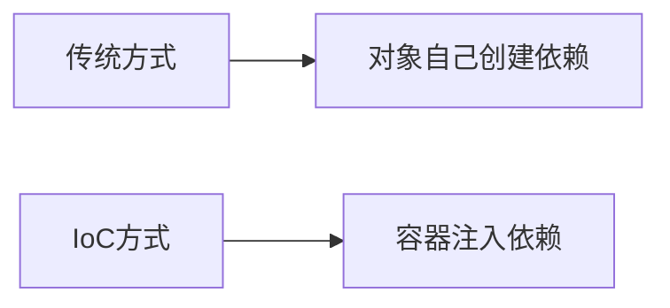
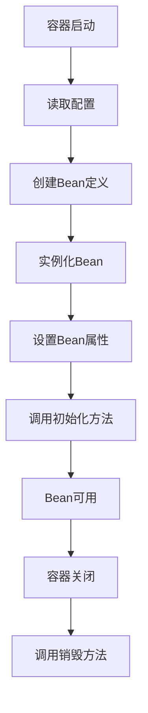
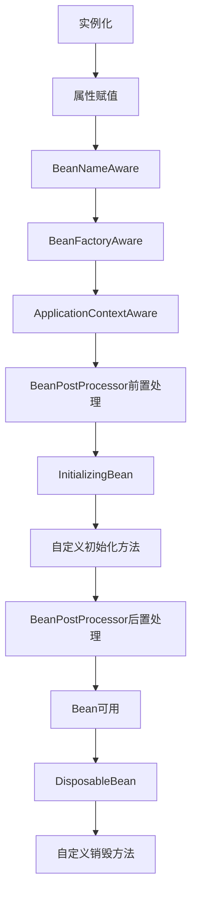

# Spring IoC与DI详解

## 控制反转（IoC）概念

控制反转（Inversion of Control，IoC）是Spring框架的核心概念之一。传统的程序设计中，对象的创建和依赖关系由程序代码直接管理，而在IoC模式下，对象的创建和依赖关系的管理被反转给了外部容器。

### 传统方式 vs IoC方式


```mermaid
graph LR
    A[传统方式] --> B[对象自己创建依赖]
    C[IoC方式] --> D[容器注入依赖]
```

在传统方式中，对象需要自己创建和管理依赖对象，这导致了代码的紧耦合。而在IoC方式中，依赖关系由容器管理并注入到对象中，实现了松耦合。

## 依赖注入（DI）详解

依赖注入（Dependency Injection，DI）是实现IoC的一种具体方式。通过DI，对象的依赖关系由容器在运行时动态注入，而不是由对象自己创建。

### DI的三种方式

1. **构造器注入**：通过构造函数注入依赖
2. **Setter注入**：通过setter方法注入依赖
3. **字段注入**：通过反射直接注入依赖

### 构造器注入示例

```java
public class UserService {
    private UserRepository userRepository;
    
    // 构造器注入
    public UserService(UserRepository userRepository) {
        this.userRepository = userRepository;
    }
    
    public void saveUser(User user) {
        userRepository.save(user);
    }
}
```

### Setter注入示例

```java
public class UserService {
    private UserRepository userRepository;
    
    // Setter注入
    public void setUserRepository(UserRepository userRepository) {
        this.userRepository = userRepository;
    }
    
    public void saveUser(User user) {
        userRepository.save(user);
    }
}
```

### 字段注入示例

```java
public class UserService {
    // 字段注入
    @Autowired
    private UserRepository userRepository;
    
    public void saveUser(User user) {
        userRepository.save(user);
    }
}
```

## Spring IoC容器

Spring提供了两种主要的IoC容器实现：

### BeanFactory

BeanFactory是Spring框架最核心的接口，提供了基本的IoC功能：

```java
// 创建BeanFactory容器
BeanFactory factory = new XmlBeanFactory(new ClassPathResource("beans.xml"));

// 获取Bean实例
UserService userService = (UserService) factory.getBean("userService");
```

### ApplicationContext

ApplicationContext是BeanFactory的子接口，提供了更多企业级功能：

```java
// 创建ApplicationContext容器
ApplicationContext context = new ClassPathXmlApplicationContext("beans.xml");

// 获取Bean实例
UserService userService = context.getBean(UserService.class);
```

### 容器的生命周期


```mermaid
graph TB
    A[容器启动] --> B[读取配置]
    B --> C[创建Bean定义]
    C --> D[实例化Bean]
    D --> E[设置Bean属性]
    E --> F[调用初始化方法]
    F --> G[Bean可用]
    G --> H[容器关闭]
    H --> I[调用销毁方法]
```

## Bean的作用域

Spring支持多种Bean作用域：

1. **singleton**：单例模式（默认）
2. **prototype**：原型模式
3. **request**：每个HTTP请求创建一个实例
4. **session**：每个HTTP Session创建一个实例
5. **application**：每个ServletContext创建一个实例
6. **websocket**：每个WebSocket创建一个实例

### 作用域配置示例

```xml
<!-- XML配置方式 -->
<bean id="userService" class="com.example.UserService" scope="singleton"/>

<!-- 注解配置方式 -->
@Scope("prototype")
@Component
public class UserService {
    // ...
}
```

## Bean的生命周期

Spring Bean的生命周期包括以下几个阶段：


```mermaid
graph TB
    A[实例化] --> B[属性赋值]
    B --> C[BeanNameAware]
    C --> D[BeanFactoryAware]
    D --> E[ApplicationContextAware]
    E --> F[BeanPostProcessor前置处理]
    F --> G[InitializingBean]
    G --> H[自定义初始化方法]
    H --> I[BeanPostProcessor后置处理]
    I --> J[Bean可用]
    J --> K[DisposableBean]
    K --> L[自定义销毁方法]
```

### 生命周期回调示例

```java
public class UserService implements InitializingBean, DisposableBean {
    @Override
    public void afterPropertiesSet() throws Exception {
        // 初始化回调
        System.out.println("UserService初始化完成");
    }
    
    @Override
    public void destroy() throws Exception {
        // 销毁回调
        System.out.println("UserService销毁");
    }
    
    @PostConstruct
    public void postConstruct() {
        // JSR-250注解初始化
        System.out.println("UserService @PostConstruct");
    }
    
    @PreDestroy
    public void preDestroy() {
        // JSR-250注解销毁
        System.out.println("UserService @PreDestroy");
    }
}
```

## 自动装配

Spring提供了多种自动装配方式：

### @Autowired注解

```java
@Service
public class UserService {
    // 按类型自动装配
    @Autowired
    private UserRepository userRepository;
    
    // 按名称自动装配
    @Autowired
    @Qualifier("mysqlUserRepository")
    private UserRepository specificUserRepository;
}
```

### @Resource注解

```java
@Service
public class UserService {
    // 按名称自动装配
    @Resource(name = "userRepository")
    private UserRepository userRepository;
    
    // 按类型自动装配
    @Resource(type = UserRepository.class)
    private UserRepository userRepositoryByType;
}
```

## 配置方式对比

Spring提供了多种配置方式：

| 配置方式 | 优点 | 缺点 |
|---------|------|------|
| XML配置 | 配置集中，易于管理 | 配置冗长，类型不安全 |
| 注解配置 | 简洁，类型安全 | 配置分散，不易管理 |
| Java配置 | 类型安全，易于重构 | 需要编译才能生效 |

### Java配置示例

```java
@Configuration
@ComponentScan(basePackages = "com.example")
public class AppConfig {
    
    @Bean
    public UserRepository userRepository() {
        return new UserRepositoryImpl();
    }
    
    @Bean
    public UserService userService() {
        return new UserService(userRepository());
    }
}
```

通过以上内容，我们可以全面了解Spring的IoC和DI机制，这是Spring框架的核心基础，掌握这些概念对于深入学习Spring至关重要。