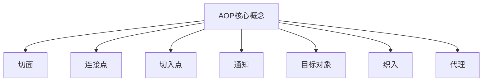

# Spring AOP编程

## 什么是AOP

面向切面编程（Aspect-Oriented Programming，AOP）是Spring框架的另一个核心特性。AOP通过预编译方式和运行期动态代理实现程序功能的统一维护，是OOP（面向对象编程）的有益补充。

### AOP的核心概念



1. **切面（Aspect）**：横切关注点的模块化，包含通知和切入点
2. **连接点（Join Point）**：程序执行过程中的某个点，如方法调用或异常处理
3. **切入点（Pointcut）**：匹配连接点的谓词，决定哪些连接点会被通知
4. **通知（Advice）**：在特定连接点执行的代码
5. **目标对象（Target Object）**：被一个或多个切面通知的对象
6. **织入（Weaving）**：将切面应用到目标对象以创建新代理对象的过程
7. **引入（Introduction）**：为类添加新方法或属性
8. **代理（Proxy）**：向目标对象应用通知后创建的对象

## AOP通知类型

Spring AOP支持五种类型的通知：

### 1. 前置通知（Before Advice）

在目标方法执行之前执行的通知：

```java
@Aspect
@Component
public class LoggingAspect {
    
    @Before("execution(* com.example.service.*.*(..))")
    public void beforeAdvice(JoinPoint joinPoint) {
        System.out.println("方法执行前: " + joinPoint.getSignature().getName());
    }
}
```

### 2. 后置通知（After Advice）

在目标方法执行之后执行的通知（无论是否抛出异常）：

```java
@Aspect
@Component
public class LoggingAspect {
    
    @After("execution(* com.example.service.*.*(..))")
    public void afterAdvice(JoinPoint joinPoint) {
        System.out.println("方法执行后: " + joinPoint.getSignature().getName());
    }
}
```

### 3. 返回通知（After Returning Advice）

在目标方法成功执行后执行的通知：

```java
@Aspect
@Component
public class LoggingAspect {
    
    @AfterReturning(pointcut = "execution(* com.example.service.*.*(..))", 
                   returning = "result")
    public void afterReturningAdvice(JoinPoint joinPoint, Object result) {
        System.out.println("方法返回值: " + result);
    }
}
```

### 4. 异常通知（After Throwing Advice）

在目标方法抛出异常后执行的通知：

```java
@Aspect
@Component
public class LoggingAspect {
    
    @AfterThrowing(pointcut = "execution(* com.example.service.*.*(..))", 
                   throwing = "ex")
    public void afterThrowingAdvice(JoinPoint joinPoint, Exception ex) {
        System.out.println("方法抛出异常: " + ex.getMessage());
    }
}
```

### 5. 环绕通知（Around Advice）

围绕目标方法执行的通知，可以控制方法是否执行：

```java
@Aspect
@Component
public class LoggingAspect {
    
    @Around("execution(* com.example.service.*.*(..))")
    public Object aroundAdvice(ProceedingJoinPoint joinPoint) throws Throwable {
        long startTime = System.currentTimeMillis();
        System.out.println("方法开始执行: " + joinPoint.getSignature().getName());
        
        try {
            Object result = joinPoint.proceed();
            return result;
        } finally {
            long endTime = System.currentTimeMillis();
            System.out.println("方法执行结束，耗时: " + (endTime - startTime) + "ms");
        }
    }
}
```

## 切入点表达式

切入点表达式用于定义哪些连接点会被通知：

### 常用切入点表达式

1. **execution**：匹配方法执行连接点
2. **within**：匹配指定类型内的方法执行
3. **this**：匹配实现了指定接口的目标对象方法
4. **target**：匹配指定类型的实例方法
5. **args**：匹配参数类型匹配的方法

### execution表达式详解

```java
// 匹配任何返回值，com.example.service包下任何类的任何方法
@Pointcut("execution(* com.example.service.*.*(..))")

// 匹配返回UserService的任何方法
@Pointcut("execution(com.example.service.UserService *(..))")

// 匹配UserService类中的getUser方法
@Pointcut("execution(* com.example.service.UserService.getUser(..))")

// 匹配以save开头的方法
@Pointcut("execution(* save*(..))")
```

## AOP配置方式

### 基于注解的配置

```java
@Configuration
@EnableAspectJAutoProxy
@ComponentScan(basePackages = "com.example")
public class AopConfig {
    // 配置类
}

@Aspect
@Component
public class TransactionAspect {
    
    @Pointcut("execution(* com.example.service.*.*(..))")
    public void serviceLayer() {}
    
    @Before("serviceLayer()")
    public void beginTransaction() {
        System.out.println("开启事务");
    }
    
    @After("serviceLayer()")
    public void commitTransaction() {
        System.out.println("提交事务");
    }
}
```

### 基于XML的配置

```xml
<aop:config>
    <aop:aspect id="transactionAspect" ref="transactionAspectBean">
        <aop:pointcut id="serviceLayer" 
                     expression="execution(* com.example.service.*.*(..))"/>
        <aop:before pointcut-ref="serviceLayer" method="beginTransaction"/>
        <aop:after pointcut-ref="serviceLayer" method="commitTransaction"/>
    </aop:aspect>
</aop:config>
```

## AOP实际应用

### 事务管理

```java
@Aspect
@Component
public class TransactionAspect {
    
    @Around("@annotation(org.springframework.transaction.annotation.Transactional)")
    public Object manageTransaction(ProceedingJoinPoint joinPoint) throws Throwable {
        // 开启事务
        System.out.println("开启事务");
        
        try {
            Object result = joinPoint.proceed();
            // 提交事务
            System.out.println("提交事务");
            return result;
        } catch (Exception e) {
            // 回滚事务
            System.out.println("回滚事务");
            throw e;
        }
    }
}
```

### 性能监控

```java
@Aspect
@Component
public class PerformanceMonitorAspect {
    
    private static final Logger logger = LoggerFactory.getLogger(PerformanceMonitorAspect.class);
    
    @Around("execution(* com.example.service.*.*(..))")
    public Object monitorPerformance(ProceedingJoinPoint joinPoint) throws Throwable {
        long startTime = System.currentTimeMillis();
        
        try {
            return joinPoint.proceed();
        } finally {
            long endTime = System.currentTimeMillis();
            long duration = endTime - startTime;
            
            logger.info("方法 {} 执行耗时: {} ms", 
                       joinPoint.getSignature().toShortString(), duration);
        }
    }
}
```

### 权限检查

```java
@Aspect
@Component
public class SecurityAspect {
    
    @Before("@annotation(com.example.annotation.RequirePermission)")
    public void checkPermission(JoinPoint joinPoint) {
        // 获取方法上的注解
        MethodSignature signature = (MethodSignature) joinPoint.getSignature();
        RequirePermission annotation = signature.getMethod()
                                              .getAnnotation(RequirePermission.class);
        
        String requiredPermission = annotation.value();
        
        // 检查当前用户是否具有所需权限
        if (!hasPermission(requiredPermission)) {
            throw new SecurityException("权限不足");
        }
    }
    
    private boolean hasPermission(String permission) {
        // 实际权限检查逻辑
        return true;
    }
}
```

## AOP代理机制

Spring AOP使用两种代理机制：

### JDK动态代理

当目标对象实现了接口时，Spring使用JDK动态代理：

```java
public interface UserService {
    void saveUser(User user);
}

public class UserServiceImpl implements UserService {
    @Override
    public void saveUser(User user) {
        // 业务逻辑
    }
}
```

### CGLIB代理

当目标对象没有实现接口时，Spring使用CGLIB代理：

```java
public class UserService {
    public void saveUser(User user) {
        // 业务逻辑
    }
}
```

### 代理配置

```java
@Configuration
@EnableAspectJAutoProxy(proxyTargetClass = true) // 强制使用CGLIB代理
public class AopConfig {
    // 配置
}
```

通过以上内容，我们可以全面了解Spring AOP的原理和应用。AOP是Spring框架的重要组成部分，通过横切关注点的分离，使得代码更加模块化和易于维护。