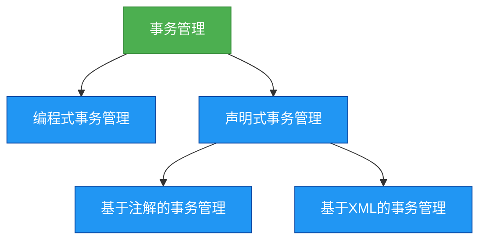

# 4. Spring事务管理

## 概述
事务管理是企业级应用程序开发中不可或缺的一部分，它确保了数据的一致性和完整性。Spring提供了强大的事务管理支持，包括编程式事务管理和声明式事务管理。



## 知识要点
### 1. 事务的基本概念
- **事务**: 是一组原子性的操作，要么全部执行成功，要么全部执行失败。
- **ACID特性**: 原子性(Atomicity)、一致性(Consistency)、隔离性(Isolation)和持久性(Durability)。
- **事务的隔离级别**: 读未提交(Read Uncommitted)、读提交(Read Committed)、可重复读(Repeatable Read)和串行化(Serializable)。
- **事务的传播行为**: 定义了当一个事务方法调用另一个事务方法时，事务如何传播。

### 2. 编程式事务管理
- 使用TransactionTemplate或PlatformTransactionManager手动管理事务。
- 优点是可以更精细地控制事务，但缺点是代码会变得更加复杂。

### 3. 声明式事务管理
- 基于AOP实现，通过注解或XML配置来管理事务。
- 优点是代码更加简洁，但缺点是不能像编程式事务管理那样精细地控制事务。

### 4. 代码示例
#### 基于注解的事务管理
```java
@Service
public class UserService {
    @Autowired
    private UserDao userDao;

    // 声明式事务管理
    @Transactional
    public void saveUser(User user) {
        userDao.save(user);
    }
}
```

#### 启用事务管理
```java
@Configuration
@EnableTransactionManagement
public class AppConfig {
    @Bean
    public DataSource dataSource() {
        // 配置数据源
        return new DriverManagerDataSource();
    }

    @Bean
    public PlatformTransactionManager transactionManager(DataSource dataSource) {
        return new DataSourceTransactionManager(dataSource);
    }
}
```

#### 编程式事务管理
```java
@Service
public class UserService {
    @Autowired
    private UserDao userDao;

    @Autowired
    private TransactionTemplate transactionTemplate;

    // 编程式事务管理
    public void saveUser(User user) {
        transactionTemplate.execute(new TransactionCallbackWithoutResult() {
            @Override
            protected void doInTransactionWithoutResult(TransactionStatus status) {
                userDao.save(user);
            }
        });
    }
}
```

### 5. 事务的隔离级别和传播行为
- **隔离级别**: 决定了事务之间的隔离程度，避免了脏读、不可重复读和幻读等问题。
- **传播行为**: 定义了当一个事务方法调用另一个事务方法时，事务如何传播，如REQUIRED、SUPPORTS、MANDATORY等。

## 知识扩展
### 设计思想
Spring的事务管理设计思想是简化事务管理，它通过提供声明式事务管理，使得开发者可以专注于业务逻辑，而不是事务管理的细节。

### 避坑指南
- 尽量使用声明式事务管理，因为它更加简洁。
- 注意事务的边界，避免将不必要的操作包含在事务中。
- 注意事务的隔离级别和传播行为的选择，避免出现并发问题。
- 避免在事务中执行耗时的操作，因为这会导致数据库连接被长时间占用。

### 深度思考题
**深度思考题:** 声明式事务管理和编程式事务管理各有什么优缺点？
**思考题回答:** 声明式事务管理的优点是代码更加简洁，缺点是不能像编程式事务管理那样精细地控制事务；编程式事务管理的优点是可以更精细地控制事务，缺点是代码会变得更加复杂。

**深度思考题:** 什么是事务的传播行为？Spring支持哪些传播行为？
**思考题回答:** 事务的传播行为定义了当一个事务方法调用另一个事务方法时，事务如何传播。Spring支持以下传播行为：
- REQUIRED: 如果当前没有事务，就创建一个新事务；如果当前有事务，就加入到这个事务中。
- SUPPORTS: 如果当前有事务，就加入到这个事务中；如果当前没有事务，就以非事务的方式执行。
- MANDATORY: 如果当前有事务，就加入到这个事务中；如果当前没有事务，就抛出异常。
- REQUIRES_NEW: 无论当前是否有事务，都创建一个新的事务。
- NOT_SUPPORTED: 以非事务的方式执行，如果当前有事务，就暂停这个事务。
- NEVER: 以非事务的方式执行，如果当前有事务，就抛出异常。
- NESTED: 如果当前有事务，就创建一个嵌套的事务；如果当前没有事务，就创建一个新事务。