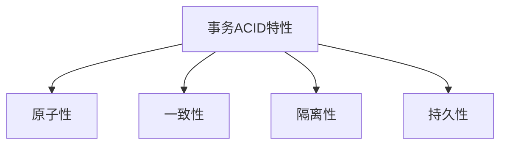

# Spring事务管理

## 事务基础概念

事务是数据库操作的最小工作单元，是一系列数据库操作的集合，这些操作要么全部执行成功，要么全部执行失败。事务具有ACID特性：


```mermaid
graph TB
    A[事务ACID特性] --> B[原子性]
    A --> C[一致性]
    A --> D[隔离性]
    A --> E[持久性]
```

1. **原子性（Atomicity）**：事务是最小的执行单位，不允许分割，事务中的操作要么全部完成，要么全部不执行
2. **一致性（Consistency）**：事务必须使数据库从一个一致性状态变换到另一个一致性状态
3. **隔离性（Isolation）**：多个事务并发执行时，一个事务的执行不应影响其他事务的执行
4. **持久性（Durability）**：事务一旦提交，对数据库的改变是永久性的

## Spring事务管理模型

Spring提供了两种事务管理方式：

### 编程式事务管理

通过TransactionTemplate或PlatformTransactionManager手动管理事务：

```java
@Service
public class UserService {
    
    @Autowired
    private PlatformTransactionManager transactionManager;
    
    public void saveUser(User user) {
        TransactionTemplate transactionTemplate = new TransactionTemplate(transactionManager);
        
        transactionTemplate.execute(new TransactionCallbackWithoutResult() {
            @Override
            protected void doInTransactionWithoutResult(TransactionStatus status) {
                try {
                    // 数据库操作
                    userRepository.save(user);
                    userProfileRepository.save(user.getProfile());
                } catch (Exception e) {
                    // 回滚事务
                    status.setRollbackOnly();
                    throw e;
                }
            }
        });
    }
}
```

### 声明式事务管理

通过注解或XML配置管理事务，是Spring推荐的方式：

```java
@Service
@Transactional
public class UserService {
    
    public void saveUser(User user) {
        // 数据库操作，自动进行事务管理
        userRepository.save(user);
        userProfileRepository.save(user.getProfile());
    }
}
```

## 事务属性详解

### 传播行为（Propagation）

传播行为定义了事务方法被另一个事务方法调用时，事务如何传播：

```java
@Service
public class UserService {
    
    // REQUIRED：如果当前存在事务，则加入该事务；如果当前没有事务，则创建一个新的事务
    @Transactional(propagation = Propagation.REQUIRED)
    public void saveUser(User user) {
        // 业务逻辑
    }
    
    // REQUIRES_NEW：创建一个新的事务，如果当前存在事务，则把当前事务挂起
    @Transactional(propagation = Propagation.REQUIRES_NEW)
    public void updateUser(User user) {
        // 业务逻辑
    }
    
    // SUPPORTS：如果当前存在事务，则加入该事务；如果当前没有事务，则以非事务方式执行
    @Transactional(propagation = Propagation.SUPPORTS)
    public void queryUser(Long userId) {
        // 查询操作
    }
}
```

常用传播行为：
- **REQUIRED**（默认）：支持当前事务，如果当前没有事务则新建事务
- **SUPPORTS**：支持当前事务，如果当前没有事务则以非事务方式执行
- **MANDATORY**：支持当前事务，如果当前没有事务则抛出异常
- **REQUIRES_NEW**：新建事务，如果当前有事务则挂起当前事务
- **NOT_SUPPORTED**：以非事务方式执行，如果当前有事务则挂起当前事务
- **NEVER**：以非事务方式执行，如果当前有事务则抛出异常
- **NESTED**：如果当前存在事务，则在嵌套事务内执行；如果当前没有事务，则创建新事务

### 隔离级别（Isolation）

隔离级别定义了一个事务可能受其他并发事务影响的程度：

```java
@Service
public class UserService {
    
    // DEFAULT：使用数据库默认的隔离级别
    @Transactional(isolation = Isolation.DEFAULT)
    public User findUser(Long userId) {
        return userRepository.findById(userId);
    }
    
    // READ_COMMITTED：读已提交，避免脏读
    @Transactional(isolation = Isolation.READ_COMMITTED)
    public void updateUser(User user) {
        userRepository.save(user);
    }
    
    // REPEATABLE_READ：可重复读，避免脏读和不可重复读
    @Transactional(isolation = Isolation.REPEATABLE_READ)
    public List<User> findAllUsers() {
        return userRepository.findAll();
    }
    
    // SERIALIZABLE：串行化，避免所有并发问题
    @Transactional(isolation = Isolation.SERIALIZABLE)
    public void batchUpdate(List<User> users) {
        userRepository.saveAll(users);
    }
}
```

隔离级别说明：
- **DEFAULT**：使用底层数据库的默认隔离级别
- **READ_UNCOMMITTED**：读未提交，可能出现脏读、不可重复读、幻读
- **READ_COMMITTED**：读已提交，避免脏读，可能出现不可重复读、幻读
- **REPEATABLE_READ**：可重复读，避免脏读、不可重复读，可能出现幻读
- **SERIALIZABLE**：串行化，避免所有并发问题，性能最差

### 回滚规则（Rollback Rules）

定义哪些异常会导致事务回滚：

```java
@Service
public class UserService {
    
    // 默认情况下，RuntimeException和Error会导致回滚
    @Transactional
    public void saveUser(User user) {
        userRepository.save(user);
        if (user.getAge() < 0) {
            throw new IllegalArgumentException("年龄不能为负数");
        }
    }
    
    // 指定特定异常回滚
    @Transactional(rollbackFor = {IOException.class, SQLException.class})
    public void importUsers(File file) throws IOException, SQLException {
        // 文件导入逻辑
    }
    
    // 指定特定异常不回滚
    @Transactional(noRollbackFor = BusinessException.class)
    public void processUser(User user) {
        // 业务处理逻辑
    }
}
```

### 超时设置（Timeout）

事务超时时间，超过指定时间自动回滚：

```java
@Service
public class UserService {
    
    // 设置事务超时时间为30秒
    @Transactional(timeout = 30)
    public void batchProcessUsers(List<User> users) {
        // 批量处理用户，可能耗时较长
        for (User user : users) {
            processUser(user);
        }
    }
}
```

### 只读事务（Read Only）

优化只读操作的性能：

```java
@Service
public class UserService {
    
    // 只读事务，优化查询性能
    @Transactional(readOnly = true)
    public List<User> findAllUsers() {
        return userRepository.findAll();
    }
    
    @Transactional(readOnly = true)
    public User findUserById(Long userId) {
        return userRepository.findById(userId).orElse(null);
    }
}
```

## 事务配置方式

### 基于注解的配置

```java
@Configuration
@EnableTransactionManagement
public class TransactionConfig {
    
    @Bean
    public PlatformTransactionManager transactionManager(DataSource dataSource) {
        return new DataSourceTransactionManager(dataSource);
    }
}
```

### 基于XML的配置

```xml
<!-- 启用注解事务 -->
<tx:annotation-driven transaction-manager="transactionManager"/>

<!-- 配置事务管理器 -->
<bean id="transactionManager" 
      class="org.springframework.jdbc.datasource.DataSourceTransactionManager">
    <property name="dataSource" ref="dataSource"/>
</bean>
```

### 全局事务配置

```java
@Configuration
@EnableTransactionManagement
public class GlobalTransactionConfig {
    
    @Bean
    public PlatformTransactionManager transactionManager(DataSource dataSource) {
        DataSourceTransactionManager transactionManager = new DataSourceTransactionManager();
        transactionManager.setDataSource(dataSource);
        return transactionManager;
    }
    
    // 配置事务模板
    @Bean
    public TransactionTemplate transactionTemplate(PlatformTransactionManager transactionManager) {
        TransactionTemplate transactionTemplate = new TransactionTemplate(transactionManager);
        transactionTemplate.setIsolationLevel(TransactionDefinition.ISOLATION_DEFAULT);
        transactionTemplate.setPropagationBehavior(TransactionDefinition.PROPAGATION_REQUIRED);
        return transactionTemplate;
    }
}
```

## 事务最佳实践

### 1. 合理使用事务传播行为

```java
@Service
public class OrderService {
    
    @Autowired
    private UserService userService;
    
    @Transactional
    public void createOrder(Order order) {
        // 在同一事务中执行
        userService.saveUser(order.getUser());
        
        // 保存订单
        orderRepository.save(order);
    }
}
```

### 2. 避免事务范围过大

```java
@Service
public class UserService {
    
    // 不推荐：事务范围过大
    @Transactional
    public void processAllUsers() {
        List<User> users = findAllUsers(); // 查询操作不需要事务
        for (User user : users) {
            updateUser(user); // 只有这个操作需要事务
        }
    }
    
    // 推荐：缩小事务范围
    public void processAllUsers() {
        List<User> users = findAllUsers(); // 非事务查询
        for (User user : users) {
            updateUserInTransaction(user); // 事务操作
        }
    }
    
    @Transactional
    private void updateUserInTransaction(User user) {
        updateUser(user);
    }
}
```

### 3. 正确处理异常

```java
@Service
public class UserService {
    
    @Transactional
    public void saveUser(User user) {
        try {
            userRepository.save(user);
            // 发送通知
            notificationService.sendNotification(user);
        } catch (NotificationException e) {
            // 通知发送失败不应该影响用户保存
            log.warn("通知发送失败", e);
            // 不重新抛出异常
        }
    }
}
```

### 4. 使用只读事务优化查询

```java
@Service
@Transactional(readOnly = true)
public class UserService {
    
    public List<User> findAllUsers() {
        return userRepository.findAll();
    }
    
    public User findUserById(Long userId) {
        return userRepository.findById(userId).orElse(null);
    }
    
    @Transactional // 覆盖类级别的只读设置
    public void saveUser(User user) {
        userRepository.save(user);
    }
}
```

### 5. 事务与缓存结合使用

```java
@Service
public class UserService {
    
    @Cacheable("users")
    @Transactional(readOnly = true)
    public User findUserById(Long userId) {
        return userRepository.findById(userId).orElse(null);
    }
    
    @CacheEvict(value = "users", key = "#user.id")
    @Transactional
    public void updateUser(User user) {
        userRepository.save(user);
    }
}
```

## 事务陷阱与注意事项

### 1. 同一类中方法调用事务失效

```java
@Service
public class UserService {
    
    // 事务失效：同类方法调用不会经过代理
    public void processUser(User user) {
        saveUser(user); // 这个调用不会触发事务
    }
    
    @Transactional
    public void saveUser(User user) {
        userRepository.save(user);
    }
    
    // 解决方案1：注入自身
    @Autowired
    private UserService self;
    
    public void processUserWithSelf(User user) {
        self.saveUser(user); // 通过代理调用，事务生效
    }
    
    // 解决方案2：分离到不同类
    @Autowired
    private UserSaveService userSaveService;
    
    public void processUserWithService(User user) {
        userSaveService.saveUser(user); // 事务生效
    }
}
```

### 2. 异常被捕获导致事务不回滚

```java
@Service
public class UserService {
    
    @Transactional
    public void saveUser(User user) {
        try {
            userRepository.save(user);
            throw new RuntimeException("模拟异常");
        } catch (RuntimeException e) {
            // 异常被捕获，事务不会回滚
            log.error("保存用户失败", e);
        }
    }
    
    // 正确做法：重新抛出异常或标记回滚
    @Transactional
    public void saveUserCorrect(User user) {
        try {
            userRepository.save(user);
            throw new RuntimeException("模拟异常");
        } catch (RuntimeException e) {
            log.error("保存用户失败", e);
            // 方法1：重新抛出异常
            throw e;
            // 方法2：标记回滚
            // TransactionAspectSupport.currentTransactionStatus().setRollbackOnly();
        }
    }
}
```

通过以上内容，我们可以全面了解Spring事务管理的各个方面，包括基础概念、配置方式、最佳实践以及常见陷阱。正确使用Spring事务管理能够保证数据的一致性和完整性。