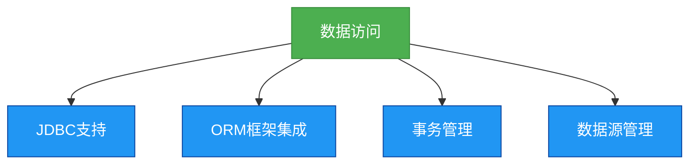

# 5. Spring数据访问

## 概述
数据访问是企业级应用程序开发中的重要部分，Spring提供了全面的数据访问支持，包括对JDBC、ORM框架（如Hibernate、MyBatis）等的支持。Spring的数据访问模块简化了数据访问的过程，使得开发者可以专注于业务逻辑，而不是数据访问的细节。



## 知识要点
### 1. JDBC支持
- **JdbcTemplate**: 是Spring提供的一个JDBC模板类，它简化了JDBC的使用。
- **NamedParameterJdbcTemplate**: 是JdbcTemplate的扩展，它支持命名参数。
- **SimpleJdbcInsert**和**SimpleJdbcCall**: 简化了插入和存储过程的调用。

### 2. ORM框架集成
- **Hibernate**: 是一个流行的ORM框架，Spring提供了对Hibernate的集成支持。
- **MyBatis**: 是另一个流行的ORM框架，Spring也提供了对MyBatis的集成支持。
- **JPA**: 是Java持久化API，Spring提供了对JPA的集成支持。

### 3. 代码示例
#### JdbcTemplate的使用
```java
@Service
public class UserService {
    @Autowired
    private JdbcTemplate jdbcTemplate;

    public void saveUser(User user) {
        jdbcTemplate.update("INSERT INTO user (name, age) VALUES (?, ?)", user.getName(), user.getAge());
    }

    public User getUserById(int id) {
        return jdbcTemplate.queryForObject("SELECT * FROM user WHERE id = ?", new Object[]{id}, new BeanPropertyRowMapper<>(User.class));
    }
}
```

#### 配置数据源
```java
@Configuration
public class DataSourceConfig {
    @Bean
    public DataSource dataSource() {
        DriverManagerDataSource dataSource = new DriverManagerDataSource();
        dataSource.setDriverClassName("com.mysql.jdbc.Driver");
        dataSource.setUrl("jdbc:mysql://localhost:3306/test");
        dataSource.setUsername("root");
        dataSource.setPassword("password");
        return dataSource;
    }

    @Bean
    public JdbcTemplate jdbcTemplate(DataSource dataSource) {
        return new JdbcTemplate(dataSource);
    }
}
```

#### MyBatis的集成
```java
@Configuration
@MapperScan("com.example.mapper")
public class MyBatisConfig {
    @Bean
    public SqlSessionFactory sqlSessionFactory(DataSource dataSource) throws Exception {
        SqlSessionFactoryBean factoryBean = new SqlSessionFactoryBean();
        factoryBean.setDataSource(dataSource);
        return factoryBean.getObject();
    }
}
```

### 4. 数据源管理
- **DataSource**: 是JDBC的标准接口，它提供了获取数据库连接的方法。
- **Spring提供的DataSource实现**: 包括DriverManagerDataSource、SimpleDriverDataSource、ComboPooledDataSource等。
- **连接池**: 是一种优化数据库连接使用的技术，它可以重用数据库连接，避免频繁地创建和关闭连接。

## 知识扩展
### 设计思想
Spring的数据访问设计思想是简化数据访问，它通过提供模板类（如JdbcTemplate）和集成支持（如对Hibernate、MyBatis的集成），使得开发者可以专注于业务逻辑，而不是数据访问的细节。

### 避坑指南
- 尽量使用Spring提供的模板类（如JdbcTemplate），而不是直接使用JDBC。
- 注意连接池的配置，避免连接池过小或过大。
- 注意事务的边界，避免将不必要的操作包含在事务中。
- 避免在数据访问层中包含业务逻辑，保持数据访问层的简洁。

### 深度思考题
**深度思考题:** 为什么说JdbcTemplate简化了JDBC的使用？
**思考题回答:** JdbcTemplate简化了JDBC的使用，因为它处理了JDBC的样板代码（如创建连接、创建语句、关闭连接等），使得开发者可以专注于SQL查询和结果处理。此外，JdbcTemplate还处理了异常，使得开发者不需要手动捕获和处理SQL异常。

**深度思考题:** 什么是连接池？它有什么优点？
**思考题回答:** 连接池是一种优化数据库连接使用的技术，它可以重用数据库连接，避免频繁地创建和关闭连接。连接池的优点包括：
- 提高性能：避免频繁地创建和关闭连接。
- 资源管理：控制数据库连接的数量，避免资源浪费。
- 稳定性：避免因数据库连接过多而导致的数据库服务器崩溃。