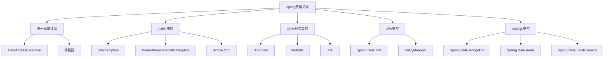

# Spring数据访问

## Spring数据访问概述

Spring的数据访问模块提供了统一的数据访问异常体系和多种数据访问技术的集成支持。它简化了数据访问代码的编写，提供了声明式事务管理，并统一了各种数据访问技术的异常处理。

### Spring数据访问架构


```mermaid
graph TB
    A[Spring数据访问] --> B[统一异常体系]
    A --> C[JDBC支持]
    A --> D[ORM框架集成]
    A --> E[JPA支持]
    A --> F[NoSQL支持]
    
    B --> B1[DataAccessException]
    B --> B2[转换器]
    
    C --> C1[JdbcTemplate]
    C --> C2[NamedParameterJdbcTemplate]
    C --> C3[SimpleJdbc]
    
    D --> D1[Hibernate]
    D --> D2[MyBatis]
    D --> D3[JDO]
    
    E --> E1[Spring Data JPA]
    E --> E2[EntityManager]
    
    F --> F1[Spring Data MongoDB]
    F --> F2[Spring Data Redis]
    F --> F3[Spring Data Elasticsearch]
```

## Spring JDBC支持

Spring JDBC提供了对原生JDBC的封装，大大简化了JDBC代码的编写。

### JdbcTemplate核心类

```java
@Repository
public class UserDao {
    
    @Autowired
    private JdbcTemplate jdbcTemplate;
    
    // 查询单个对象
    public User findById(Long id) {
        String sql = "SELECT id, name, email FROM user WHERE id = ?";
        return jdbcTemplate.queryForObject(sql, new Object[]{id}, new UserRowMapper());
    }
    
    // 查询列表
    public List<User> findAll() {
        String sql = "SELECT id, name, email FROM user";
        return jdbcTemplate.query(sql, new UserRowMapper());
    }
    
    // 插入数据
    public int insert(User user) {
        String sql = "INSERT INTO user (name, email) VALUES (?, ?)";
        return jdbcTemplate.update(sql, user.getName(), user.getEmail());
    }
    
    // 更新数据
    public int update(User user) {
        String sql = "UPDATE user SET name = ?, email = ? WHERE id = ?";
        return jdbcTemplate.update(sql, user.getName(), user.getEmail(), user.getId());
    }
    
    // 删除数据
    public int delete(Long id) {
        String sql = "DELETE FROM user WHERE id = ?";
        return jdbcTemplate.update(sql, id);
    }
}
```

### RowMapper实现

```java
public class UserRowMapper implements RowMapper<User> {
    
    @Override
    public User mapRow(ResultSet rs, int rowNum) throws SQLException {
        User user = new User();
        user.setId(rs.getLong("id"));
        user.setName(rs.getString("name"));
        user.setEmail(rs.getString("email"));
        return user;
    }
}
```

### NamedParameterJdbcTemplate

使用命名参数替代位置参数，提高SQL可读性：

```java
@Repository
public class UserDao {
    
    @Autowired
    private NamedParameterJdbcTemplate namedParameterJdbcTemplate;
    
    public List<User> findByNameAndEmail(String name, String email) {
        String sql = "SELECT id, name, email FROM user WHERE name = :name AND email = :email";
        
        MapSqlParameterSource params = new MapSqlParameterSource();
        params.addValue("name", name);
        params.addValue("email", email);
        
        return namedParameterJdbcTemplate.query(sql, params, new UserRowMapper());
    }
    
    public int batchInsert(List<User> users) {
        String sql = "INSERT INTO user (name, email) VALUES (:name, :email)";
        
        SqlParameterSource[] batch = users.stream()
            .map(user -> {
                MapSqlParameterSource params = new MapSqlParameterSource();
                params.addValue("name", user.getName());
                params.addValue("email", user.getEmail());
                return params;
            })
            .toArray(SqlParameterSource[]::new);
            
        return namedParameterJdbcTemplate.batchUpdate(sql, batch);
    }
}
```

## 数据源配置

### 基于HikariCP的配置

```java
@Configuration
public class DataSourceConfig {
    
    @Bean
    @ConfigurationProperties(prefix = "spring.datasource")
    public DataSource dataSource() {
        return DataSourceBuilder.create().type(HikariDataSource.class).build();
    }
    
    @Bean
    public JdbcTemplate jdbcTemplate(DataSource dataSource) {
        return new JdbcTemplate(dataSource);
    }
    
    @Bean
    public NamedParameterJdbcTemplate namedParameterJdbcTemplate(DataSource dataSource) {
        return new NamedParameterJdbcTemplate(dataSource);
    }
}
```

### 配置文件

```yaml
spring:
  datasource:
    url: jdbc:mysql://localhost:3306/testdb
    username: root
    password: password
    driver-class-name: com.mysql.cj.jdbc.Driver
    hikari:
      maximum-pool-size: 20
      minimum-idle: 5
      connection-timeout: 30000
      idle-timeout: 600000
      max-lifetime: 1800000
```

## Spring事务与JDBC集成

```java
@Service
public class UserService {
    
    @Autowired
    private UserDao userDao;
    
    @Transactional
    public void saveUser(User user) {
        // 插入用户
        userDao.insert(user);
        
        // 插入用户配置
        UserConfig config = new UserConfig();
        config.setUserId(user.getId());
        config.setTheme("default");
        userConfigDao.insert(config);
    }
    
    @Transactional(readOnly = true)
    public User findUserWithConfig(Long userId) {
        User user = userDao.findById(userId);
        if (user != null) {
            UserConfig config = userConfigDao.findByUserId(userId);
            user.setConfig(config);
        }
        return user;
    }
}
```

## ORM框架集成

### Hibernate集成

```java
@Configuration
@EnableTransactionManagement
public class HibernateConfig {
    
    @Bean
    public LocalSessionFactoryBean sessionFactory(DataSource dataSource) {
        LocalSessionFactoryBean sessionFactory = new LocalSessionFactoryBean();
        sessionFactory.setDataSource(dataSource);
        sessionFactory.setPackagesToScan("com.example.entity");
        sessionFactory.setHibernateProperties(hibernateProperties());
        return sessionFactory;
    }
    
    @Bean
    public HibernateTransactionManager transactionManager(LocalSessionFactoryBean sessionFactory) {
        HibernateTransactionManager txManager = new HibernateTransactionManager();
        txManager.setSessionFactory(sessionFactory.getObject());
        return txManager;
    }
    
    private Properties hibernateProperties() {
        Properties properties = new Properties();
        properties.put("hibernate.dialect", "org.hibernate.dialect.MySQL8Dialect");
        properties.put("hibernate.hbm2ddl.auto", "update");
        properties.put("hibernate.show_sql", "true");
        properties.put("hibernate.format_sql", "true");
        return properties;
    }
}
```

### Hibernate DAO实现

```java
@Repository
public class UserDao {
    
    @Autowired
    private SessionFactory sessionFactory;
    
    public User findById(Long id) {
        return sessionFactory.getCurrentSession().get(User.class, id);
    }
    
    public void save(User user) {
        sessionFactory.getCurrentSession().saveOrUpdate(user);
    }
    
    public void delete(User user) {
        sessionFactory.getCurrentSession().delete(user);
    }
    
    public List<User> findAll() {
        return sessionFactory.getCurrentSession()
            .createQuery("FROM User", User.class)
            .list();
    }
}
```

## Spring Data JPA

Spring Data JPA进一步简化了JPA的使用：

### 实体类定义

```java
@Entity
@Table(name = "user")
public class User {
    
    @Id
    @GeneratedValue(strategy = GenerationType.IDENTITY)
    private Long id;
    
    @Column(nullable = false)
    private String name;
    
    @Column(unique = true)
    private String email;
    
    @CreationTimestamp
    private LocalDateTime createdAt;
    
    @UpdateTimestamp
    private LocalDateTime updatedAt;
    
    // getters and setters
}
```

### Repository接口

```java
@Repository
public interface UserRepository extends JpaRepository<User, Long> {
    
    // 方法名查询
    List<User> findByName(String name);
    
    User findByEmail(String email);
    
    List<User> findByNameContainingIgnoreCase(String name);
    
    // 使用@Query注解
    @Query("SELECT u FROM User u WHERE u.name = ?1 AND u.email = ?2")
    List<User> findByNameAndEmail(String name, String email);
    
    @Query("SELECT u FROM User u WHERE u.createdAt > :date")
    List<User> findCreatedAfter(@Param("date") LocalDateTime date);
    
    // 更新查询
    @Modifying
    @Transactional
    @Query("UPDATE User u SET u.name = :name WHERE u.id = :id")
    int updateUserName(@Param("id") Long id, @Param("name") String name);
}
```

### 分页和排序

```java
@Service
public class UserService {
    
    @Autowired
    private UserRepository userRepository;
    
    public Page<User> findUsersWithPagination(int page, int size) {
        Pageable pageable = PageRequest.of(page, size, Sort.by("createdAt").descending());
        return userRepository.findAll(pageable);
    }
    
    public List<User> findUsersSorted() {
        return userRepository.findAll(Sort.by("name").ascending());
    }
}
```

## NoSQL数据访问

### Spring Data MongoDB

```java
@Document(collection = "users")
public class User {
    
    @Id
    private String id;
    
    private String name;
    
    private String email;
    
    private List<Address> addresses;
    
    // getters and setters
}

@Repository
public interface UserRepository extends MongoRepository<User, String> {
    
    List<User> findByName(String name);
    
    User findByEmail(String email);
    
    @Query("{'addresses.city': ?0}")
    List<User> findByCity(String city);
}
```

### Spring Data Redis

```java
@Configuration
@EnableRedisRepositories
public class RedisConfig {
    
    @Bean
    public LettuceConnectionFactory redisConnectionFactory() {
        return new LettuceConnectionFactory(
            new RedisStandaloneConfiguration("localhost", 6379));
    }
    
    @Bean
    public RedisTemplate<String, Object> redisTemplate() {
        RedisTemplate<String, Object> template = new RedisTemplate<>();
        template.setConnectionFactory(redisConnectionFactory());
        template.setKeySerializer(new StringRedisSerializer());
        template.setValueSerializer(new GenericJackson2JsonRedisSerializer());
        return template;
    }
}

@Repository
public class UserCacheRepository {
    
    @Autowired
    private RedisTemplate<String, Object> redisTemplate;
    
    public void saveUser(User user) {
        redisTemplate.opsForValue().set("user:" + user.getId(), user, Duration.ofHours(1));
    }
    
    public User getUser(Long userId) {
        return (User) redisTemplate.opsForValue().get("user:" + userId);
    }
    
    public void deleteUser(Long userId) {
        redisTemplate.delete("user:" + userId);
    }
}
```

## 数据访问异常处理

Spring提供了统一的数据访问异常体系：

```java
@ControllerAdvice
public class DataAccessExceptionHandler {
    
    @ExceptionHandler(DataAccessException.class)
    public ResponseEntity<String> handleDataAccessException(DataAccessException e) {
        // 记录日志
        log.error("数据访问异常", e);
        
        // 返回友好的错误信息
        return ResponseEntity.status(HttpStatus.INTERNAL_SERVER_ERROR)
            .body("数据访问失败，请稍后重试");
    }
    
    @ExceptionHandler(EmptyResultDataAccessException.class)
    public ResponseEntity<String> handleEmptyResultException(EmptyResultDataAccessException e) {
        return ResponseEntity.status(HttpStatus.NOT_FOUND)
            .body("未找到指定数据");
    }
}
```

## 连接池监控

```java
@Component
public class DataSourceMonitor {
    
    @Autowired
    private HikariDataSource dataSource;
    
    @Scheduled(fixedRate = 30000) // 每30秒执行一次
    public void monitorConnectionPool() {
        HikariPoolMXBean poolBean = dataSource.getHikariPoolMXBean();
        
        log.info("连接池状态 - 活跃连接数: {}, 空闲连接数: {}, 等待连接数: {}", 
                poolBean.getActiveConnections(),
                poolBean.getIdleConnections(),
                poolBean.getThreadsAwaitingConnection());
    }
}
```

通过以上内容，我们可以全面了解Spring数据访问的各种技术，包括JDBC支持、ORM框架集成、Spring Data项目以及NoSQL数据库的访问方式。Spring的数据访问模块大大简化了数据访问代码的编写，提供了统一的异常处理和事务管理支持。