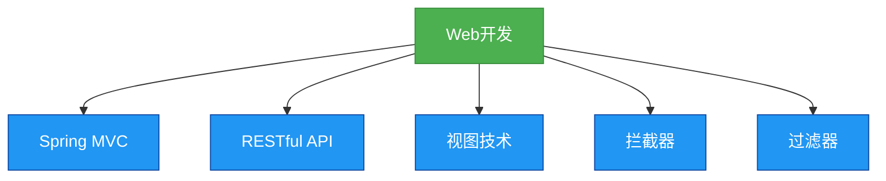

# 6. Spring Web开发

## 概述
Web开发是Java应用程序开发中的重要部分，Spring提供了强大的Web开发支持，包括Spring MVC、RESTful API开发等。Spring的Web开发模块简化了Web应用程序的开发过程，使得开发者可以专注于业务逻辑，而不是Web开发的细节。



## 知识要点
### 1. Spring MVC
- **Spring MVC**: 是Spring提供的一个Web MVC框架，它基于MVC设计模式。
- **核心组件**: 包括DispatcherServlet、Controller、Model、View、ViewResolver等。
- **工作流程**: 客户端请求 -> DispatcherServlet -> 处理器映射 -> 控制器 -> 模型和视图 -> 视图解析器 -> 视图 -> 响应。

### 2. RESTful API开发
- **REST**: 是一种软件架构风格，它定义了一组约束条件和原则。
- **RESTful API**: 是遵循REST原则的API，它使用HTTP方法来操作资源。
- **Spring的REST支持**: 包括@RestController、@RequestMapping、@GetMapping、@PostMapping等注解。

### 3. 代码示例
#### 控制器的定义
```java
@Controller
@RequestMapping("/users")
public class UserController {
    @Autowired
    private UserService userService;

    @GetMapping
    public String getUserList(Model model) {
        model.addAttribute("users", userService.getAllUsers());
        return "user/list";
    }

    @GetMapping("/{id}")
    public String getUserById(@PathVariable int id, Model model) {
        model.addAttribute("user", userService.getUserById(id));
        return "user/detail";
    }
}
```

#### RESTful API的定义
```java
@RestController
@RequestMapping("/api/users")
public class UserRestController {
    @Autowired
    private UserService userService;

    @GetMapping
    public List<User> getUserList() {
        return userService.getAllUsers();
    }

    @GetMapping("/{id}")
    public User getUserById(@PathVariable int id) {
        return userService.getUserById(id);
    }

    @PostMapping
    public User createUser(@RequestBody User user) {
        userService.saveUser(user);
        return user;
    }

    @PutMapping("/{id}")
    public User updateUser(@PathVariable int id, @RequestBody User user) {
        user.setId(id);
        userService.updateUser(user);
        return user;
    }

    @DeleteMapping("/{id}")
    public void deleteUser(@PathVariable int id) {
        userService.deleteUser(id);
    }
}
```

#### 配置Spring MVC
```java
@Configuration
@EnableWebMvc
public class WebConfig implements WebMvcConfigurer {
    @Bean
    public ViewResolver viewResolver() {
        InternalResourceViewResolver viewResolver = new InternalResourceViewResolver();
        viewResolver.setPrefix("/WEB-INF/views/");
        viewResolver.setSuffix(".jsp");
        return viewResolver;
    }

    @Override
    public void addResourceHandlers(ResourceHandlerRegistry registry) {
        registry.addResourceHandler("/resources/**").addResourceLocations("/resources/");
    }
}
```

### 4. 拦截器和过滤器
- **拦截器**: 是Spring MVC提供的一个组件，它可以在请求处理之前和之后执行。
- **过滤器**: 是Servlet规范提供的一个组件，它可以在请求到达Servlet之前和响应离开Servlet之后执行。
- **Spring的拦截器支持**: 包括HandlerInterceptor接口和WebMvcConfigurer的addInterceptors方法。

## 知识扩展
### 设计思想
Spring的Web开发设计思想是简化Web应用程序的开发，它通过提供Spring MVC框架和RESTful API支持，使得开发者可以专注于业务逻辑，而不是Web开发的细节。

### 避坑指南
- 尽量使用Spring MVC提供的注解（如@Controller、@RequestMapping等），而不是手动配置。
- 注意请求映射的精度，避免出现模糊的请求映射。
- 注意拦截器的执行顺序，特别是当有多个拦截器时。
- 避免在控制器中包含过多的业务逻辑，保持控制器的简洁。

### 深度思考题
**深度思考题:** 什么是MVC设计模式？Spring MVC是如何实现MVC设计模式的？
**思考题回答:** MVC设计模式是一种软件架构模式，它将应用程序分为三个部分：模型(Model)、视图(View)和控制器(Controller)。模型负责数据和业务逻辑，视图负责显示界面，控制器负责处理用户输入和更新模型及视图。Spring MVC通过DispatcherServlet、Controller、Model、View等组件实现了MVC设计模式。

**深度思考题:** 拦截器和过滤器有什么区别？
**思考题回答:** 拦截器和过滤器的区别包括：
- 拦截器是Spring MVC提供的，而过滤器是Servlet规范提供的。
- 拦截器可以在请求处理之前和之后执行，而过滤器可以在请求到达Servlet之前和响应离开Servlet之后执行。
- 拦截器可以访问Spring的上下文和bean，而过滤器不能。
- 拦截器只能处理Spring MVC的请求，而过滤器可以处理所有的请求。