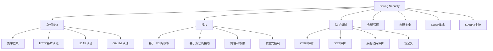
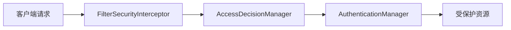

# Spring Security安全框架

## Spring Security概述

Spring Security是一个功能强大且高度可定制的身份验证和访问控制框架，是Spring生态系统中用于保护应用程序的实际标准。它专注于为Java应用程序提供全面的安全服务。

### Spring Security核心特性



## 核心概念

### 安全拦截器

Spring Security通过一系列安全拦截器来保护应用程序：



### 核心组件

1. **SecurityContextHolder**：持有安全上下文信息
2. **SecurityContext**：包含当前用户的认证信息
3. **Authentication**：表示认证信息
4. **GrantedAuthority**：授予的权限
5. **UserDetails**：用户详细信息
6. **UserDetailsService**：加载用户详细信息的服务

## 基本配置

### XML配置方式

```xml
<http auto-config="true">
    <intercept-url pattern="/admin/**" access="ROLE_ADMIN" />
    <intercept-url pattern="/user/**" access="ROLE_USER" />
    <intercept-url pattern="/**" access="permitAll" />
    
    <form-login login-page="/login" 
                default-target-url="/home"
                authentication-failure-url="/login?error" />
    <logout logout-success-url="/login?logout" />
</http>

<authentication-manager>
    <authentication-provider>
        <user-service>
            <user name="user" password="password" authorities="ROLE_USER" />
            <user name="admin" password="admin" authorities="ROLE_ADMIN,ROLE_USER" />
        </user-service>
    </authentication-provider>
</authentication-manager>
```

### Java配置方式

```java
@Configuration
@EnableWebSecurity
public class SecurityConfig extends WebSecurityConfigurerAdapter {
    
    @Override
    protected void configure(HttpSecurity http) throws Exception {
        http
            .authorizeRequests()
                .antMatchers("/admin/**").hasRole("ADMIN")
                .antMatchers("/user/**").hasRole("USER")
                .antMatchers("/", "/home", "/register").permitAll()
                .anyRequest().authenticated()
                .and()
            .formLogin()
                .loginPage("/login")
                .defaultSuccessUrl("/home")
                .failureUrl("/login?error")
                .permitAll()
                .and()
            .logout()
                .logoutSuccessUrl("/login?logout")
                .permitAll();
    }
    
    @Override
    protected void configure(AuthenticationManagerBuilder auth) throws Exception {
        auth.inMemoryAuthentication()
            .withUser("user").password("{noop}password").roles("USER")
            .and()
            .withUser("admin").password("{noop}admin").roles("ADMIN", "USER");
    }
}
```

## 身份验证

### 内存认证

```java
@Configuration
@EnableWebSecurity
public class SecurityConfig extends WebSecurityConfigurerAdapter {
    
    @Override
    protected void configure(AuthenticationManagerBuilder auth) throws Exception {
        auth.inMemoryAuthentication()
            .withUser("user")
                .password("{noop}password")
                .roles("USER")
            .and()
            .withUser("admin")
                .password("{noop}admin")
                .roles("USER", "ADMIN");
    }
}
```

### JDBC认证

```java
@Configuration
@EnableWebSecurity
public class SecurityConfig extends WebSecurityConfigurerAdapter {
    
    @Autowired
    private DataSource dataSource;
    
    @Override
    protected void configure(AuthenticationManagerBuilder auth) throws Exception {
        auth.jdbcAuthentication()
            .dataSource(dataSource)
            .usersByUsernameQuery(
                "select username,password,enabled from users where username=?")
            .authoritiesByUsernameQuery(
                "select username,authority from authorities where username=?");
    }
}
```

### 自定义UserDetailsService

```java
@Service
public class CustomUserDetailsService implements UserDetailsService {
    
    @Autowired
    private UserRepository userRepository;
    
    @Override
    public UserDetails loadUserByUsername(String username) throws UsernameNotFoundException {
        User user = userRepository.findByUsername(username);
        if (user == null) {
            throw new UsernameNotFoundException("用户不存在: " + username);
        }
        
        return org.springframework.security.core.userdetails.User.builder()
            .username(user.getUsername())
            .password(user.getPassword())
            .authorities(getAuthorities(user))
            .accountExpired(false)
            .accountLocked(false)
            .credentialsExpired(false)
            .disabled(!user.isEnabled())
            .build();
    }
    
    private Collection<? extends GrantedAuthority> getAuthorities(User user) {
        return user.getRoles().stream()
            .map(role -> new SimpleGrantedAuthority("ROLE_" + role.getName()))
            .collect(Collectors.toList());
    }
}
```

### 密码加密

```java
@Configuration
public class SecurityConfig {
    
    @Bean
    public PasswordEncoder passwordEncoder() {
        return new BCryptPasswordEncoder();
    }
    
    @Bean
    public UserDetailsService userDetailsService() {
        PasswordEncoder encoder = passwordEncoder();
        
        UserDetails user = User.builder()
            .username("user")
            .password(encoder.encode("password"))
            .roles("USER")
            .build();
            
        return new InMemoryUserDetailsManager(user);
    }
}
```

## 授权管理

### 基于URL的授权

```java
@Configuration
@EnableWebSecurity
public class SecurityConfig extends WebSecurityConfigurerAdapter {
    
    @Override
    protected void configure(HttpSecurity http) throws Exception {
        http
            .authorizeRequests()
                .antMatchers("/public/**").permitAll()
                .antMatchers("/user/**").hasRole("USER")
                .antMatchers("/admin/**").hasRole("ADMIN")
                .antMatchers("/db/**").access("hasRole('ADMIN') and hasRole('DBA')")
                .anyRequest().authenticated();
    }
}
```

### 基于方法的授权

```java
@Service
public class UserService {
    
    @PreAuthorize("hasRole('USER')")
    public List<User> getAllUsers() {
        return userRepository.findAll();
    }
    
    @PreAuthorize("#userId == authentication.principal.id or hasRole('ADMIN')")
    public User getUserById(Long userId) {
        return userRepository.findById(userId);
    }
    
    @PreAuthorize("hasPermission(#user, 'write')")
    public void updateUser(User user) {
        userRepository.save(user);
    }
    
    @Secured("ROLE_ADMIN")
    public void deleteUser(Long userId) {
        userRepository.deleteById(userId);
    }
}

@Configuration
@EnableGlobalMethodSecurity(prePostEnabled = true, securedEnabled = true)
public class MethodSecurityConfig extends GlobalMethodSecurityConfiguration {
    // 配置
}
```

### 自定义权限表达式

```java
@Component("userSecurity")
public class UserSecurityExpression {
    
    public boolean isOwner(Authentication authentication, Long userId) {
        // 检查当前用户是否是资源的所有者
        UserDetails userDetails = (UserDetails) authentication.getPrincipal();
        // 实现具体的检查逻辑
        return true;
    }
}

// 在方法上使用自定义表达式
@PreAuthorize("@userSecurity.isOwner(authentication, #userId)")
public User getUserProfile(Long userId) {
    return userRepository.findById(userId);
}
```

## 防护机制

### CSRF保护

```java
@Configuration
@EnableWebSecurity
public class SecurityConfig extends WebSecurityConfigurerAdapter {
    
    @Override
    protected void configure(HttpSecurity http) throws Exception {
        http
            .csrf()
                .csrfTokenRepository(CookieCsrfTokenRepository.withHttpOnlyFalse())
                .and()
            .authorizeRequests()
                .anyRequest().authenticated();
    }
}
```

Thymeleaf模板中的CSRF令牌：

```html
<form action="/users" method="post">
    <input type="hidden" 
           th:name="${_csrf.parameterName}" 
           th:value="${_csrf.token}"/>
    <!-- 表单内容 -->
    <input type="submit" value="提交"/>
</form>
```

### 安全头配置

```java
@Configuration
@EnableWebSecurity
public class SecurityConfig extends WebSecurityConfigurerAdapter {
    
    @Override
    protected void configure(HttpSecurity http) throws Exception {
        http
            .headers()
                .frameOptions().deny()
                .and()
                .contentTypeOptions().and()
                .httpStrictTransportSecurity(hstsConfig -> 
                    hstsConfig.maxAgeInSeconds(31536000).includeSubdomains(true))
                .and()
            .authorizeRequests()
                .anyRequest().authenticated();
    }
}
```

## 会话管理

### 会话固定攻击防护

```java
@Configuration
@EnableWebSecurity
public class SecurityConfig extends WebSecurityConfigurerAdapter {
    
    @Override
    protected void configure(HttpSecurity http) throws Exception {
        http
            .sessionManagement()
                .sessionFixation().migrateSession()
                .maximumSessions(1)
                .maxSessionsPreventsLogin(false)
                .expiredUrl("/login?expired");
    }
}
```

### 并发会话控制

```java
@Configuration
@EnableWebSecurity
public class SecurityConfig extends WebSecurityConfigurerAdapter {
    
    @Override
    protected void configure(HttpSecurity http) throws Exception {
        http
            .sessionManagement()
                .maximumSessions(2)
                .maxSessionsPreventsLogin(true)
                .sessionRegistry(sessionRegistry());
    }
    
    @Bean
    public SessionRegistry sessionRegistry() {
        return new SessionRegistryImpl();
    }
    
    @Bean
    public HttpSessionEventPublisher httpSessionEventPublisher() {
        return new HttpSessionEventPublisher();
    }
}
```

## Remember-Me持久化登录

### 基于Token的Remember-Me

```java
@Configuration
@EnableWebSecurity
public class SecurityConfig extends WebSecurityConfigurerAdapter {
    
    @Override
    protected void configure(HttpSecurity http) throws Exception {
        http
            .authorizeRequests()
                .anyRequest().authenticated()
                .and()
            .formLogin()
                .and()
            .rememberMe()
                .key("uniqueAndSecret")
                .tokenValiditySeconds(86400); // 24小时
    }
}
```

### 基于数据库的Remember-Me

```java
@Configuration
@EnableWebSecurity
public class SecurityConfig extends WebSecurityConfigurerAdapter {
    
    @Autowired
    private DataSource dataSource;
    
    @Override
    protected void configure(HttpSecurity http) throws Exception {
        http
            .rememberMe()
                .rememberMeServices(persistentTokenBasedRememberMeServices())
                .key("uniqueAndSecret");
    }
    
    @Bean
    public PersistentTokenBasedRememberMeServices persistentTokenBasedRememberMeServices() {
        PersistentTokenBasedRememberMeServices services = 
            new PersistentTokenBasedRememberMeServices("uniqueAndSecret", 
                                                     userDetailsService(), 
                                                     jdbcTokenRepository());
        services.setTokenValiditySeconds(86400);
        return services;
    }
    
    @Bean
    public PersistentTokenRepository jdbcTokenRepository() {
        JdbcTokenRepositoryImpl tokenRepository = new JdbcTokenRepositoryImpl();
        tokenRepository.setDataSource(dataSource);
        return tokenRepository;
    }
}
```

## OAuth2集成

### OAuth2客户端配置

```java
@Configuration
@EnableWebSecurity
public class SecurityConfig extends WebSecurityConfigurerAdapter {
    
    @Override
    protected void configure(HttpSecurity http) throws Exception {
        http
            .authorizeRequests()
                .antMatchers("/", "/login**", "/error**").permitAll()
                .anyRequest().authenticated()
                .and()
            .oauth2Login()
                .loginPage("/login")
                .defaultSuccessUrl("/home")
                .failureUrl("/login?error=true");
    }
}

@Configuration
@EnableOAuth2Client
public class OAuth2Config {
    
    @Bean
    public OAuth2RestTemplate oauth2RestTemplate(OAuth2ClientContext oauth2ClientContext,
                                               OAuth2ProtectedResourceDetails details) {
        return new OAuth2RestTemplate(details, oauth2ClientContext);
    }
}
```

### OAuth2资源服务器配置

```java
@Configuration
@EnableWebSecurity
@EnableResourceServer
public class ResourceServerConfig extends ResourceServerConfigurerAdapter {
    
    @Override
    public void configure(HttpSecurity http) throws Exception {
        http
            .authorizeRequests()
                .antMatchers("/api/public/**").permitAll()
                .antMatchers("/api/user/**").hasRole("USER")
                .antMatchers("/api/admin/**").hasRole("ADMIN")
                .anyRequest().authenticated();
    }
    
    @Override
    public void configure(ResourceServerSecurityConfigurer resources) throws Exception {
        resources.resourceId("resource-server");
    }
}
```

## 自定义认证过滤器

### 自定义认证过滤器实现

```java
public class CustomAuthenticationFilter extends UsernamePasswordAuthenticationFilter {
    
    private AuthenticationManager authenticationManager;
    
    public CustomAuthenticationFilter(AuthenticationManager authenticationManager) {
        this.authenticationManager = authenticationManager;
        setFilterProcessesUrl("/api/login");
    }
    
    @Override
    public Authentication attemptAuthentication(HttpServletRequest request,
                                              HttpServletResponse response) {
        try {
            LoginRequest loginRequest = new ObjectMapper()
                .readValue(request.getInputStream(), LoginRequest.class);
            
            return authenticationManager.authenticate(
                new UsernamePasswordAuthenticationToken(
                    loginRequest.getUsername(),
                    loginRequest.getPassword(),
                    new ArrayList<>())
            );
        } catch (IOException e) {
            throw new RuntimeException(e);
        }
    }
    
    @Override
    protected void successfulAuthentication(HttpServletRequest request,
                                          HttpServletResponse response,
                                          FilterChain chain,
                                          Authentication authResult) throws IOException {
        String token = JWT.create()
            .withSubject(((User) authResult.getPrincipal()).getUsername())
            .withExpiresAt(new Date(System.currentTimeMillis() + 86400000))
            .sign(Algorithm.HMAC512("secret".getBytes()));
        
        response.addHeader("Authorization", "Bearer " + token);
    }
}
```

### 注册自定义过滤器

```java
@Configuration
@EnableWebSecurity
public class SecurityConfig extends WebSecurityConfigurerAdapter {
    
    @Override
    protected void configure(HttpSecurity http) throws Exception {
        http
            .csrf().disable()
            .authorizeRequests()
                .anyRequest().authenticated()
                .and()
            .addFilter(new CustomAuthenticationFilter(authenticationManager()))
            .sessionManagement().sessionCreationPolicy(SessionCreationPolicy.STATELESS);
    }
    
    @Override
    @Bean
    public AuthenticationManager authenticationManagerBean() throws Exception {
        return super.authenticationManagerBean();
    }
}
```

## 异常处理

### 自定义认证入口点

```java
@Component
public class CustomAuthenticationEntryPoint implements AuthenticationEntryPoint {
    
    @Override
    public void commence(HttpServletRequest request,
                        HttpServletResponse response,
                        AuthenticationException authException) throws IOException {
        response.setStatus(HttpStatus.UNAUTHORIZED.value());
        response.setContentType("application/json");
        response.getWriter().write("{\"error\": \"未授权访问\"}");
    }
}
```

### 自定义访问拒绝处理器

```java
@Component
public class CustomAccessDeniedHandler implements AccessDeniedHandler {
    
    @Override
    public void handle(HttpServletRequest request,
                      HttpServletResponse response,
                      AccessDeniedException accessDeniedException) throws IOException {
        response.setStatus(HttpStatus.FORBIDDEN.value());
        response.setContentType("application/json");
        response.getWriter().write("{\"error\": \"访问被拒绝\"}");
    }
}
```

## 测试安全配置

### 安全集成测试

```java
@SpringBootTest
@AutoConfigureTestDatabase(replace = AutoConfigureTestDatabase.Replace.NONE)
class SecurityIntegrationTest {
    
    @Autowired
    private TestRestTemplate restTemplate;
    
    @Test
    void shouldAccessPublicEndpointWithoutAuthentication() {
        ResponseEntity<String> response = restTemplate.getForEntity(
            "/api/public/info", String.class);
        assertThat(response.getStatusCode()).isEqualTo(HttpStatus.OK);
    }
    
    @Test
    void shouldNotAccessProtectedEndpointWithoutAuthentication() {
        ResponseEntity<String> response = restTemplate.getForEntity(
            "/api/users", String.class);
        assertThat(response.getStatusCode()).isEqualTo(HttpStatus.UNAUTHORIZED);
    }
}
```

### Web层安全测试

```java
@WebMvcTest(UserController.class)
class UserControllerSecurityTest {
    
    @Autowired
    private MockMvc mockMvc;
    
    @MockBean
    private UserService userService;
    
    @Test
    void shouldReturnUnauthorizedForProtectedEndpoint() throws Exception {
        mockMvc.perform(get("/api/users"))
                .andExpect(status().isUnauthorized());
    }
    
    @Test
    @WithMockUser(roles = "USER")
    void shouldReturnUsersForAuthenticatedUser() throws Exception {
        when(userService.getAllUsers()).thenReturn(Collections.emptyList());
        
        mockMvc.perform(get("/api/users"))
                .andExpect(status().isOk());
    }
}
```

## 最佳实践

### 1. 安全配置分离

```java
@Configuration
@EnableWebSecurity
public class WebSecurityConfig extends WebSecurityConfigurerAdapter {
    
    @Configuration
    @Order(1)
    public static class ApiWebSecurityConfigurationAdapter extends WebSecurityConfigurerAdapter {
        
        @Override
        protected void configure(HttpSecurity http) throws Exception {
            http
                .antMatcher("/api/**")
                .authorizeRequests()
                    .antMatchers("/api/public/**").permitAll()
                    .antMatchers("/api/user/**").hasRole("USER")
                    .anyRequest().authenticated();
        }
    }
    
    @Configuration
    @Order(2)
    public static class FormLoginWebSecurityConfigurerAdapter extends WebSecurityConfigurerAdapter {
        
        @Override
        protected void configure(HttpSecurity http) throws Exception {
            http
                .authorizeRequests()
                    .anyRequest().authenticated()
                    .and()
                .formLogin()
                    .loginPage("/login")
                    .permitAll();
        }
    }
}
```

### 2. 密码安全策略

```java
@Configuration
public class PasswordConfig {
    
    @Bean
    public PasswordEncoder passwordEncoder() {
        return new BCryptPasswordEncoder(12); // 使用强度为12的BCrypt
    }
}
```

### 3. 安全日志记录

```java
@Component
public class SecurityEventListener {
    
    private static final Logger logger = LoggerFactory.getLogger(SecurityEventListener.class);
    
    @EventListener
    public void handleAuthenticationSuccess(AuthenticationSuccessEvent event) {
        String username = event.getAuthentication().getPrincipal().toString();
        logger.info("用户 {} 登录成功", username);
    }
    
    @EventListener
    public void handleAuthenticationFailure(AbstractAuthenticationFailureEvent event) {
        String username = event.getAuthentication().getPrincipal().toString();
        logger.warn("用户 {} 登录失败: {}", username, event.getException().getMessage());
    }
}
```

通过以上内容，我们可以全面了解Spring Security的各个方面，包括身份验证、授权管理、防护机制、会话管理、Remember-Me功能、OAuth2集成、自定义过滤器以及测试等。Spring Security提供了强大的安全功能，能够有效保护应用程序免受各种安全威胁。