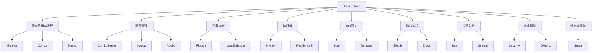
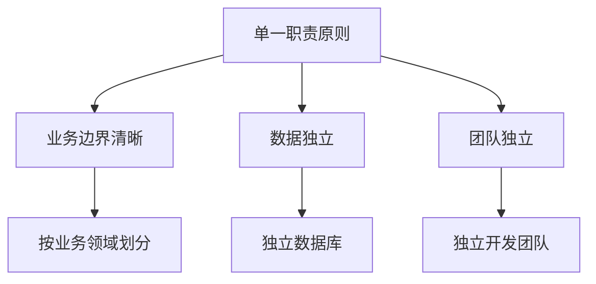

# Spring Cloud微服务

## Spring Cloud概述

Spring Cloud是一系列框架的有序集合，它利用Spring Boot的开发便利性巧妙地简化了分布式系统基础设施的开发，如服务发现注册、配置中心、智能路由、消息总线、负载均衡、断路器、数据监控等。Spring Cloud为开发者提供了在分布式系统中快速构建一些常见模式的工具。

### Spring Cloud核心组件



## 服务注册与发现

### Eureka Server

Eureka是Netflix开源的服务发现框架，Spring Cloud对其进行了封装。

#### Eureka Server配置

```xml
<dependency>
    <groupId>org.springframework.cloud</groupId>
    <artifactId>spring-cloud-starter-netflix-eureka-server</artifactId>
</dependency>
```

```java
@SpringBootApplication
@EnableEurekaServer
public class EurekaServerApplication {
    public static void main(String[] args) {
        SpringApplication.run(EurekaServerApplication.class, args);
    }
}
```

```yaml
# application.yml
server:
  port: 8761

eureka:
  instance:
    hostname: localhost
  client:
    register-with-eureka: false
    fetch-registry: false
    service-url:
      defaultZone: http://${eureka.instance.hostname}:${server.port}/eureka/
      
spring:
  application:
    name: eureka-server
```

#### Eureka Client配置

```xml
<dependency>
    <groupId>org.springframework.cloud</groupId>
    <artifactId>spring-cloud-starter-netflix-eureka-client</artifactId>
</dependency>
```

```java
@SpringBootApplication
@EnableEurekaClient
public class UserServiceApplication {
    public static void main(String[] args) {
        SpringApplication.run(UserServiceApplication.class, args);
    }
}
```

```yaml
# application.yml
server:
  port: 8081

spring:
  application:
    name: user-service

eureka:
  client:
    service-url:
      defaultZone: http://localhost:8761/eureka/
  instance:
    prefer-ip-address: true
    instance-id: ${spring.cloud.client.ip-address}:${server.port}
```

### Consul集成

Consul是HashiCorp开源的服务发现和配置工具。

```xml
<dependency>
    <groupId>org.springframework.cloud</groupId>
    <artifactId>spring-cloud-starter-consul-discovery</artifactId>
</dependency>
```

```yaml
# application.yml
spring:
  cloud:
    consul:
      host: localhost
      port: 8500
      discovery:
        service-name: user-service
        instance-id: user-service-${server.port}
        prefer-ip-address: true
```

### Nacos集成

Nacos是阿里巴巴开源的动态服务发现、配置管理和服务管理平台。

```xml
<dependency>
    <groupId>com.alibaba.cloud</groupId>
    <artifactId>spring-cloud-starter-alibaba-nacos-discovery</artifactId>
</dependency>
```

```yaml
# application.yml
spring:
  cloud:
    nacos:
      discovery:
        server-addr: localhost:8848
        service: user-service
```

## 配置管理

### Spring Cloud Config Server

Config Server为分布式系统提供外部化配置支持。

```xml
<dependency>
    <groupId>org.springframework.cloud</groupId>
    <artifactId>spring-cloud-config-server</artifactId>
</dependency>
```

```java
@SpringBootApplication
@EnableConfigServer
public class ConfigServerApplication {
    public static void main(String[] args) {
        SpringApplication.run(ConfigServerApplication.class, args);
    }
}
```

基于Git的配置：

```yaml
# application.yml
server:
  port: 8888

spring:
  cloud:
    config:
      server:
        git:
          uri: https://github.com/username/config-repo
          search-paths: '{application}'
          username: your-username
          password: your-password
          
management:
  endpoints:
    web:
      exposure:
        include: "*"
```

### Config Client配置

```xml
<dependency>
    <groupId>org.springframework.cloud</groupId>
    <artifactId>spring-cloud-starter-config</artifactId>
</dependency>
<dependency>
    <groupId>org.springframework.boot</groupId>
    <artifactId>spring-boot-starter-actuator</artifactId>
</dependency>
```

```yaml
# bootstrap.yml
spring:
  application:
    name: user-service
  cloud:
    config:
      uri: http://localhost:8888
      profile: dev
      label: main
```

```yaml
# application.yml
management:
  endpoints:
    web:
      exposure:
        include: refresh
```

### 配置刷新

```java
@RestController
@RefreshScope
public class ConfigController {
    
    @Value("${app.message:Hello World}")
    private String message;
    
    @GetMapping("/message")
    public String getMessage() {
        return message;
    }
}
```

## 负载均衡

### Ribbon负载均衡

Ribbon是Netflix开源的客户端负载均衡器。

```xml
<dependency>
    <groupId>org.springframework.cloud</groupId>
    <artifactId>spring-cloud-starter-netflix-ribbon</artifactId>
</dependency>
```

```java
@Configuration
public class RibbonConfig {
    
    @Bean
    @LoadBalanced
    public RestTemplate restTemplate() {
        return new RestTemplate();
    }
}

@Service
public class UserServiceClient {
    
    @Autowired
    private RestTemplate restTemplate;
    
    public User getUserById(Long id) {
        String url = "http://user-service/users/" + id;
        return restTemplate.getForObject(url, User.class);
    }
}
```

### Spring Cloud LoadBalancer

Spring Cloud LoadBalancer是Spring Cloud提供的负载均衡器。

```xml
<dependency>
    <groupId>org.springframework.cloud</groupId>
    <artifactId>spring-cloud-starter-loadbalancer</artifactId>
</dependency>
```

```java
@Configuration
public class LoadBalancerConfig {
    
    @Bean
    @LoadBalanced
    public RestTemplate restTemplate() {
        return new RestTemplate();
    }
}

@Service
public class UserServiceClient {
    
    @Autowired
    private RestTemplate restTemplate;
    
    public User getUserById(Long id) {
        String url = "http://user-service/users/" + id;
        return restTemplate.getForObject(url, User.class);
    }
}
```

### 自定义负载均衡策略

```java
@Configuration
public class CustomLoadBalancerConfig {
    
    @Bean
    public ReactorLoadBalancer<ServiceInstance> randomLoadBalancer(
            Environment environment,
            LoadBalancerClientFactory loadBalancerClientFactory) {
        String name = environment.getProperty(LoadBalancerClientFactory.PROPERTY_NAME);
        return new RandomLoadBalancer(
            loadBalancerClientFactory.getLazyProvider(name, ServiceInstanceListSupplier.class),
            name);
    }
}
```

## 熔断器

### Hystrix熔断器

Hystrix是Netflix开源的容错库。

```xml
<dependency>
    <groupId>org.springframework.cloud</groupId>
    <artifactId>spring-cloud-starter-netflix-hystrix</artifactId>
</dependency>
```

```java
@SpringBootApplication
@EnableCircuitBreaker
public class Application {
    public static void main(String[] args) {
        SpringApplication.run(Application.class, args);
    }
}

@Service
public class UserServiceClient {
    
    @HystrixCommand(fallbackMethod = "getUserFallback")
    public User getUserById(Long id) {
        String url = "http://user-service/users/" + id;
        return restTemplate.getForObject(url, User.class);
    }
    
    public User getUserFallback(Long id) {
        // 降级处理
        return new User(-1L, "默认用户", "default@example.com");
    }
}
```

### Resilience4j熔断器

Resilience4j是新一代的容错库。

```xml
<dependency>
    <groupId>org.springframework.cloud</groupId>
    <artifactId>spring-cloud-starter-circuitbreaker-resilience4j</artifactId>
</dependency>
```

```java
@Service
public class UserServiceClient {
    
    @Autowired
    private CircuitBreakerFactory circuitBreakerFactory;
    
    public User getUserById(Long id) {
        return circuitBreakerFactory.create("user-service")
            .run(() -> {
                String url = "http://user-service/users/" + id;
                return restTemplate.getForObject(url, User.class);
            }, throwable -> {
                // 熔断降级处理
                return new User(-1L, "默认用户", "default@example.com");
            });
    }
}
```

## API网关

### Zuul网关

Zuul是Netflix开源的API网关。

```xml
<dependency>
    <groupId>org.springframework.cloud</groupId>
    <artifactId>spring-cloud-starter-netflix-zuul</artifactId>
</dependency>
```

```java
@SpringBootApplication
@EnableZuulProxy
public class ZuulGatewayApplication {
    public static void main(String[] args) {
        SpringApplication.run(ZuulGatewayApplication.class, args);
    }
}
```

```yaml
# application.yml
spring:
  application:
    name: zuul-gateway

server:
  port: 8080

zuul:
  routes:
    user-service:
      path: /api/users/**
      serviceId: user-service
    order-service:
      path: /api/orders/**
      serviceId: order-service
      
  # 禁用重试
  retryable: false
  
  # 路由前缀去除
  prefix: /api
  strip-prefix: true
```

### Spring Cloud Gateway

Spring Cloud Gateway是Spring Cloud提供的新一代API网关。

```xml
<dependency>
    <groupId>org.springframework.cloud</groupId>
    <artifactId>spring-cloud-starter-gateway</artifactId>
</dependency>
```

```java
@SpringBootApplication
@EnableDiscoveryClient
public class GatewayApplication {
    public static void main(String[] args) {
        SpringApplication.run(GatewayApplication.class, args);
    }
}
```

```yaml
# application.yml
server:
  port: 8080

spring:
  application:
    name: api-gateway
  cloud:
    gateway:
      routes:
        - id: user-service
          uri: lb://user-service
          predicates:
            - Path=/api/users/**
          filters:
            - StripPrefix=2
        - id: order-service
          uri: lb://order-service
          predicates:
            - Path=/api/orders/**
          filters:
            - StripPrefix=2
      default-filters:
        - AddResponseHeader=X-Response-Default-Red, default-header
```

### 自定义网关过滤器

```java
@Component
public class CustomGlobalFilter implements GlobalFilter, Ordered {
    
    private static final Logger logger = LoggerFactory.getLogger(CustomGlobalFilter.class);
    
    @Override
    public Mono<Void> filter(ServerWebExchange exchange, GatewayFilterChain chain) {
        ServerHttpRequest request = exchange.getRequest();
        logger.info("请求路径: {}", request.getPath());
        
        // 添加请求头
        ServerHttpRequest modifiedRequest = request.mutate()
            .header("X-Request-Red", "blue")
            .build();
            
        ServerWebExchange modifiedExchange = exchange.mutate()
            .request(modifiedRequest)
            .build();
            
        return chain.filter(modifiedExchange);
    }
    
    @Override
    public int getOrder() {
        return -1;
    }
}
```

## 链路追踪

### Sleuth集成

Sleuth为Spring Cloud应用提供分布式追踪解决方案。

```xml
<dependency>
    <groupId>org.springframework.cloud</groupId>
    <artifactId>spring-cloud-starter-sleuth</artifactId>
</dependency>
```

```yaml
# application.yml
spring:
  sleuth:
    sampler:
      probability: 1.0
```

### Zipkin集成

Zipkin是分布式追踪系统。

```xml
<dependency>
    <groupId>org.springframework.cloud</groupId>
    <artifactId>spring-cloud-sleuth-zipkin</artifactId>
</dependency>
```

```yaml
# application.yml
spring:
  zipkin:
    base-url: http://localhost:9411
  sleuth:
    sampler:
      probability: 1.0
```

### 链路追踪使用

```java
@RestController
public class UserController {
    
    private static final Logger logger = LoggerFactory.getLogger(UserController.class);
    
    @Autowired
    private UserServiceClient userServiceClient;
    
    @GetMapping("/users/{id}")
    public User getUser(@PathVariable Long id) {
        logger.info("开始获取用户信息: id={}", id);
        User user = userServiceClient.getUserById(id);
        logger.info("用户信息获取完成: user={}", user);
        return user;
    }
}
```

## 消息总线

### Spring Cloud Bus

Spring Cloud Bus用于传播集群状态变化。

```xml
<dependency>
    <groupId>org.springframework.cloud</groupId>
    <artifactId>spring-cloud-starter-bus-amqp</artifactId>
</dependency>
```

```yaml
# application.yml
spring:
  rabbitmq:
    host: localhost
    port: 5672
    username: guest
    password: guest
    
management:
  endpoints:
    web:
      exposure:
        include: bus-refresh
```

### 配置刷新广播

```bash
# 刷新所有服务实例的配置
curl -X POST http://localhost:8080/actuator/bus-refresh
```

## 安全控制

### OAuth2集成

```xml
<dependency>
    <groupId>org.springframework.cloud</groupId>
    <artifactId>spring-cloud-starter-oauth2</artifactId>
</dependency>
```

```java
@Configuration
@EnableResourceServer
public class ResourceServerConfig extends ResourceServerConfigurerAdapter {
    
    @Override
    public void configure(HttpSecurity http) throws Exception {
        http
            .authorizeRequests()
                .antMatchers("/api/public/**").permitAll()
                .antMatchers("/api/user/**").hasRole("USER")
                .antMatchers("/api/admin/**").hasRole("ADMIN")
                .anyRequest().authenticated();
    }
}
```

### JWT令牌验证

```java
@Configuration
@EnableWebSecurity
@EnableResourceServer
public class JwtResourceServerConfig extends ResourceServerConfigurerAdapter {
    
    @Override
    public void configure(ResourceServerSecurityConfigurer resources) throws Exception {
        resources.resourceId("user-service");
    }
    
    @Override
    public void configure(HttpSecurity http) throws Exception {
        http
            .authorizeRequests()
                .antMatchers("/api/public/**").permitAll()
                .anyRequest().authenticated();
    }
}
```

## 分布式事务

### Seata集成

Seata是阿里巴巴开源的分布式事务解决方案。

```xml
<dependency>
    <groupId>com.alibaba.cloud</groupId>
    <artifactId>spring-cloud-starter-alibaba-seata</artifactId>
</dependency>
```

```yaml
# application.yml
seata:
  enabled: true
  application-id: ${spring.application.name}
  tx-service-group: my-tx-group
  service:
    vgroup-mapping:
      my-tx-group: default
```

```java
@Service
public class OrderService {
    
    @Autowired
    private OrderRepository orderRepository;
    
    @Autowired
    private AccountServiceClient accountServiceClient;
    
    @GlobalTransactional
    public void createOrder(Order order) {
        // 创建订单
        orderRepository.save(order);
        
        // 扣减账户余额
        accountServiceClient.deductBalance(order.getUserId(), order.getAmount());
        
        // 其他业务逻辑
    }
}
```

## 微服务最佳实践

### 服务拆分原则



### API设计规范

```java
@RestController
@RequestMapping("/api/users")
@Api(tags = "用户管理")
public class UserController {
    
    @GetMapping("/{id}")
    @ApiOperation("根据ID获取用户")
    @ApiParam(name = "id", value = "用户ID", required = true)
    public ResponseEntity<User> getUserById(@PathVariable Long id) {
        User user = userService.findById(id);
        if (user != null) {
            return ResponseEntity.ok(user);
        } else {
            return ResponseEntity.notFound().build();
        }
    }
    
    @PostMapping
    @ApiOperation("创建用户")
    public ResponseEntity<User> createUser(@Valid @RequestBody CreateUserRequest request) {
        User user = userService.createUser(request);
        return ResponseEntity.status(HttpStatus.CREATED).body(user);
    }
}
```

### 异常处理统一

```java
@RestControllerAdvice
public class GlobalExceptionHandler {
    
    @ExceptionHandler(UserNotFoundException.class)
    public ResponseEntity<ErrorResponse> handleUserNotFoundException(UserNotFoundException e) {
        ErrorResponse error = new ErrorResponse("USER_NOT_FOUND", e.getMessage());
        return ResponseEntity.status(HttpStatus.NOT_FOUND).body(error);
    }
    
    @ExceptionHandler(ValidationException.class)
    public ResponseEntity<ErrorResponse> handleValidationException(ValidationException e) {
        ErrorResponse error = new ErrorResponse("VALIDATION_ERROR", e.getMessage());
        return ResponseEntity.badRequest().body(error);
    }
}
```

### 服务监控

```java
@Component
public class ServiceMetrics {
    
    private final MeterRegistry meterRegistry;
    
    public ServiceMetrics(MeterRegistry meterRegistry) {
        this.meterRegistry = meterRegistry;
    }
    
    public void recordUserCreation() {
        Counter.builder("user.creation")
            .description("用户创建次数")
            .register(meterRegistry)
            .increment();
    }
    
    public void recordApiLatency(String apiName, long latency) {
        Timer.builder("api.latency")
            .description("API响应时间")
            .tag("api", apiName)
            .register(meterRegistry)
            .record(latency, TimeUnit.MILLISECONDS);
    }
}
```

### 配置管理

```yaml
# bootstrap.yml
spring:
  application:
    name: user-service
  profiles:
    active: ${SPRING_PROFILES_ACTIVE:dev}
  cloud:
    config:
      uri: ${CONFIG_SERVER_URI:http://localhost:8888}
      fail-fast: true
      retry:
        initial-interval: 2000
        max-attempts: 10
        multiplier: 2.0
```

### 健康检查

```java
@Component
public class CustomHealthIndicator implements HealthIndicator {
    
    @Autowired
    private DatabaseService databaseService;
    
    @Autowired
    private CacheService cacheService;
    
    @Override
    public Health health() {
        if (checkDependencies()) {
            return Health.up()
                .withDetail("database", "OK")
                .withDetail("cache", "OK")
                .build();
        } else {
            return Health.down()
                .withDetail("database", databaseService.isHealthy() ? "OK" : "DOWN")
                .withDetail("cache", cacheService.isHealthy() ? "OK" : "DOWN")
                .build();
        }
    }
    
    private boolean checkDependencies() {
        return databaseService.isHealthy() && cacheService.isHealthy();
    }
}
```

通过以上内容，我们可以全面了解Spring Cloud微服务的各个方面，包括服务注册与发现、配置管理、负载均衡、熔断器、API网关、链路追踪、消息总线、安全控制、分布式事务以及微服务最佳实践等。Spring Cloud为构建分布式系统提供了完整的解决方案，使得微服务架构的实现变得更加简单和标准化。