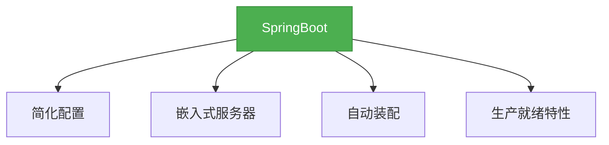

# 1. SpringBoot概述与入门

## 一、概述

SpringBoot是由Pivotal团队提供的框架，用于简化Spring应用的初始搭建以及开发过程。它使用"约定大于配置"的理念，让开发者可以专注于业务逻辑而不是配置文件。



## 二、知识要点

### 1. SpringBoot的核心特性

- **简化配置**：告别繁琐的XML配置，使用注解和properties/yaml文件进行配置
- **嵌入式服务器**：内置Tomcat、Jetty、Undertow等服务器，无需单独部署
- **自动装配**：根据引入的依赖自动配置Spring应用
- **生产就绪特性**：提供指标、健康检查和外部配置等特性
- **无代码生成和XML配置**：完全基于Java代码和注解

### 2. 第一个SpringBoot应用

```java
// 主启动类
@SpringBootApplication
public class Application {
    public static void main(String[] args) {
        SpringApplication.run(Application.class, args);
    }
}

// 控制器
@RestController
public class HelloController {
    @RequestMapping("/hello")
    public String hello() {
        return "Hello, SpringBoot!";
    }
}
```

### 3. 项目结构

```
src
├── main
│   ├── java
│   │   └── com
│   │       └── example
│   │           └── demo
│   │               ├── Application.java
│   │               └── controller
│   │                   └── HelloController.java
│   └── resources
│       ├── application.properties
│       ├── static
│       └── templates
└── test
    └── java
        └── com
            └── example
                └── demo
                    └── ApplicationTests.java
```

### 4. 依赖管理

SpringBoot使用父项目进行依赖管理，指定了常用依赖的版本号，避免版本冲突。

```xml
<parent>
    <groupId>org.springframework.boot</groupId>
    <artifactId>spring-boot-starter-parent</artifactId>
    <version>2.7.5</version>
</parent>

<dependencies>
    <dependency>
        <groupId>org.springframework.boot</groupId>
        <artifactId>spring-boot-starter-web</artifactId>
    </dependency>
    <dependency>
        <groupId>org.springframework.boot</groupId>
        <artifactId>spring-boot-starter-test</artifactId>
        <scope>test</scope>
    </dependency>
</dependencies>
```

## 三、知识扩展

### 1. 设计思想

- **约定大于配置**：通过默认配置减少开发者的配置工作
- **开箱即用**：提供各种 starters 依赖，引入即可使用
- **微服务友好**：非常适合构建微服务架构
- **持续集成友好**：支持自动化测试和构建

### 2. 避坑指南

- 不要随意修改SpringBoot父项目的版本，可能导致依赖冲突
- 不要忽略application.properties/yaml文件的缩进和格式
- 不要在主启动类所在包的上层放置其他类，可能导致扫描不到
- 不要忘记添加@SpringBootApplication注解

### 3. 深度思考题

**思考题:** SpringBoot和Spring有什么区别？
** 回答:** Spring是一个开源的轻量级Java开发框架，提供了IOC和AOP等核心特性。而SpringBoot是基于Spring的框架，它简化了Spring应用的初始搭建和开发过程，提供了自动装配、嵌入式服务器等特性，让开发者可以更专注于业务逻辑。

** 思考题:** 什么是SpringBoot的starter？
** 回答:** SpringBoot的starter是一组预配置的依赖，它包含了某个功能所需的所有依赖，例如spring-boot-starter-web包含了web开发所需的所有依赖。引入starter后，SpringBoot会自动配置相关的组件。