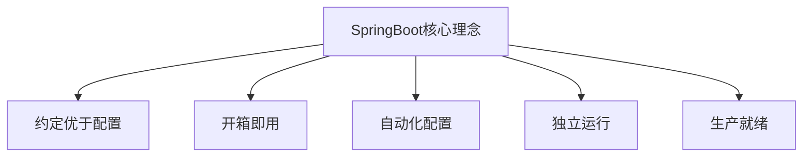
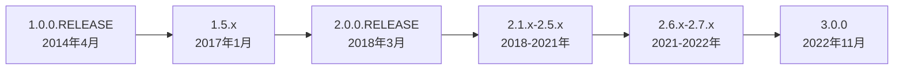
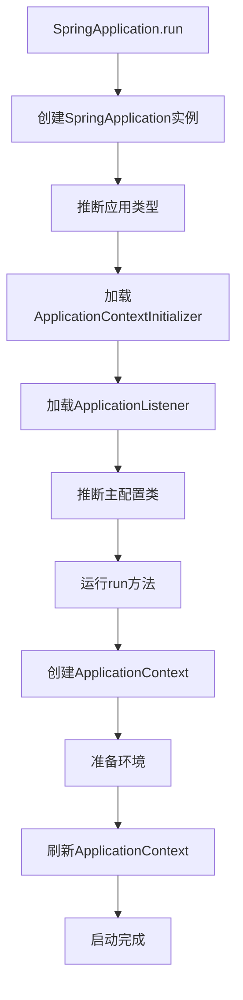
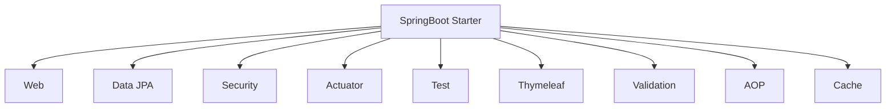
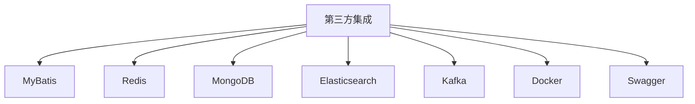

# SpringBoot概述与入门

## 什么是SpringBoot

Spring Boot是由Pivotal团队提供的全新框架，其设计目的是用来简化Spring应用的初始搭建以及开发过程。该框架使用了特定的方式来进行配置，从而使开发人员不再需要定义样板化的配置。

### SpringBoot的核心理念

Spring Boot的核心理念是"约定优于配置"（Convention over Configuration），通过提供一系列默认配置和自动配置机制，让开发者能够快速启动和运行Spring应用程序。


```mermaid
graph TB
    A[SpringBoot核心理念] --> B[约定优于配置]
    A --> C[开箱即用]
    A --> D[自动化配置]
    A --> E[独立运行]
    A --> F[生产就绪]
```

## SpringBoot的主要特性

### 1. 自动配置（Auto Configuration）

Spring Boot会根据类路径中的依赖自动配置应用程序：

```java
@SpringBootApplication
public class Application {
    public static void main(String[] args) {
        // Spring Boot会自动配置Web服务器、数据源等
        SpringApplication.run(Application.class, args);
    }
}
```

### 2. 起步依赖（Starter Dependencies）

Spring Boot提供了各种"starter"依赖，简化了Maven/Gradle配置：

```xml
<!-- Web开发起步依赖 -->
<dependency>
    <groupId>org.springframework.boot</groupId>
    <artifactId>spring-boot-starter-web</artifactId>
</dependency>

<!-- 数据访问起步依赖 -->
<dependency>
    <groupId>org.springframework.boot</groupId>
    <artifactId>spring-boot-starter-data-jpa</artifactId>
</dependency>

<!-- 测试起步依赖 -->
<dependency>
    <groupId>org.springframework.boot</groupId>
    <artifactId>spring-boot-starter-test</artifactId>
    <scope>test</scope>
</dependency>
```

### 3. 内嵌服务器（Embedded Servers）

Spring Boot内置了Tomcat、Jetty、Undertow等Web服务器：

```java
@RestController
public class HelloController {
    
    @GetMapping("/hello")
    public String hello() {
        return "Hello, Spring Boot!";
    }
}
```

### 4. 生产就绪特性（Production-ready Features）

Spring Boot Actuator提供了监控和管理功能：

```yaml
# application.yml
management:
  endpoints:
    web:
      exposure:
        include: "*"
  endpoint:
    health:
      show-details: always
```

### 5. 无代码生成和XML配置

Spring Boot尽量减少代码生成和XML配置，通过注解和Java配置实现：

```java
@Configuration
public class AppConfig {
    
    @Bean
    public UserService userService() {
        return new UserServiceImpl();
    }
}
```

## SpringBoot的发展历程

### 版本演进


```mermaid
graph LR
    A[1.0.0.RELEASE<br/>2014年4月] --> B[1.5.x<br/>2017年1月]
    B --> C[2.0.0.RELEASE<br/>2018年3月]
    C --> D[2.1.x-2.5.x<br/>2018-2021年]
    D --> E[2.6.x-2.7.x<br/>2021-2022年]
    E --> F[3.0.0<br/>2022年11月]
```

### 重要版本特性

1. **Spring Boot 1.x**：奠定了自动配置和起步依赖的基础
2. **Spring Boot 2.x**：
   - 基于Spring Framework 5.x
   - 支持响应式编程
   - 支持Java 9+
3. **Spring Boot 3.x**：
   - 基于Spring Framework 6.x
   - 支持Java 17+
   - 支持Jakarta EE 9+

## SpringBoot项目结构

### 标准目录结构

```
src
├── main
│   ├── java
│   │   └── com
│   │       └── example
│   │           └── demo
│   │               ├── DemoApplication.java
│   │               ├── controller
│   │               ├── service
│   │               ├── repository
│   │               └── model
│   └── resources
│       ├── application.yml
│       ├── static
│       └── templates
└── test
    └── java
        └── com
            └── example
                └── demo
```

### 核心文件说明

1. **DemoApplication.java**：应用程序入口类
2. **application.yml**：配置文件
3. **static/**：静态资源目录
4. **templates/**：模板文件目录

## SpringBoot核心注解

### @SpringBootApplication

这是Spring Boot最重要的注解，它是一个组合注解：

```java
@SpringBootApplication
public class Application {
    public static void main(String[] args) {
        SpringApplication.run(Application.class, args);
    }
}

// 等价于以下三个注解的组合：
// @SpringBootConfiguration
// @EnableAutoConfiguration
// @ComponentScan
```

### 其他重要注解

```java
// 标识配置类
@Configuration

// 启用组件扫描
@ComponentScan

// 启用自动配置
@EnableAutoConfiguration

// 标识REST控制器
@RestController

// 标识服务层组件
@Service

// 标识数据访问层组件
@Repository

// 标识配置属性
@ConfigurationProperties(prefix = "app")
```

## SpringBoot配置文件

### application.yml

```yaml
# 服务器配置
server:
  port: 8080
  servlet:
    context-path: /api

# 数据源配置
spring:
  datasource:
    url: jdbc:mysql://localhost:3306/testdb
    username: root
    password: password
    driver-class-name: com.mysql.cj.jdbc.Driver
  
  # JPA配置
  jpa:
    hibernate:
      ddl-auto: update
    show-sql: true
    
  # Redis配置
  redis:
    host: localhost
    port: 6379

# 自定义配置
app:
  name: My Application
  version: 1.0.0
```

### 配置文件加载顺序

```mermaid
graph TB
    A[命令行参数] --> B[ServletConfig初始化参数]
    B --> C[ServletContext初始化参数]
    C --> D[JRAS属性]
    D --> E[系统环境变量]
    E --> F[RandomValuePropertySource]
    F --> G[jar包外的application-{profile}.properties]
    G --> H[jar包内的application-{profile}.properties]
    H --> I[jar包外的application.properties]
    I --> J[jar包内的application.properties]
```

## SpringBoot启动过程

### 启动流程


```mermaid
graph TB
    A[SpringApplication.run] --> B[创建SpringApplication实例]
    B --> C[推断应用类型]
    C --> D[加载ApplicationContextInitializer]
    D --> E[加载ApplicationListener]
    E --> F[推断主配置类]
    F --> G[运行run方法]
    G --> H[创建ApplicationContext]
    H --> I[准备环境]
    I --> J[刷新ApplicationContext]
    J --> K[启动完成]
```

### 启动类示例

```java
@SpringBootApplication
public class Application {
    
    public static void main(String[] args) {
        // 启动Spring Boot应用
        SpringApplication app = new SpringApplication(Application.class);
        app.setBannerMode(Banner.Mode.OFF); // 关闭Banner
        app.run(args);
    }
}
```

## SpringBoot开发环境搭建

### Maven配置

```xml
<?xml version="1.0" encoding="UTF-8"?>
<project xmlns="http://maven.apache.org/POM/4.0.0">
    <modelVersion>4.0.0</modelVersion>
    
    <parent>
        <groupId>org.springframework.boot</groupId>
        <artifactId>spring-boot-starter-parent</artifactId>
        <version>3.1.0</version>
        <relativePath/>
    </parent>
    
    <groupId>com.example</groupId>
    <artifactId>demo</artifactId>
    <version>0.0.1-SNAPSHOT</version>
    <name>demo</name>
    
    <properties>
        <java.version>17</java.version>
    </properties>
    
    <dependencies>
        <dependency>
            <groupId>org.springframework.boot</groupId>
            <artifactId>spring-boot-starter-web</artifactId>
        </dependency>
    </dependencies>
    
    <build>
        <plugins>
            <plugin>
                <groupId>org.springframework.boot</groupId>
                <artifactId>spring-boot-maven-plugin</artifactId>
            </plugin>
        </plugins>
    </build>
</project>
```

### Gradle配置

```gradle
plugins {
    id 'org.springframework.boot' version '3.1.0'
    id 'io.spring.dependency-management' version '1.1.0'
    id 'java'
}

group = 'com.example'
version = '0.0.1-SNAPSHOT'
sourceCompatibility = '17'

dependencies {
    implementation 'org.springframework.boot:spring-boot-starter-web'
    testImplementation 'org.springframework.boot:spring-boot-starter-test'
}

test {
    useJUnitPlatform()
}
```

## 第一个SpringBoot应用

### 创建简单的Web应用

```java
@SpringBootApplication
public class HelloApplication {
    public static void main(String[] args) {
        SpringApplication.run(HelloApplication.class, args);
    }
}

@RestController
class HelloController {
    
    @GetMapping("/hello")
    public String hello() {
        return "Hello, Spring Boot!";
    }
    
    @GetMapping("/user/{name}")
    public Map<String, String> getUser(@PathVariable String name) {
        Map<String, String> response = new HashMap<>();
        response.put("message", "Hello, " + name + "!");
        response.put("timestamp", new Date().toString());
        return response;
    }
}
```

### 运行应用

```bash
# Maven方式运行
./mvnw spring-boot:run

# Gradle方式运行
./gradlew bootRun

# 打包后运行
./mvnw clean package
java -jar target/demo-0.0.1-SNAPSHOT.jar
```

## SpringBoot生态系统

### 官方Starter


```mermaid
graph TB
    A[SpringBoot Starter] --> B[Web]
    A --> C[Data JPA]
    A --> D[Security]
    A --> E[Actuator]
    A --> F[Test]
    A --> G[Thymeleaf]
    A --> H[Validation]
    A --> I[AOP]
    A --> J[Cache]
```

### 第三方集成


```mermaid
graph TB
    A[第三方集成] --> B[MyBatis]
    A --> C[Redis]
    A --> D[MongoDB]
    A --> E[Elasticsearch]
    A --> F[Kafka]
    A --> G[Docker]
    A --> H[Swagger]
```

通过以上内容，我们可以全面了解Spring Boot的核心概念、特性和使用方法。Spring Boot通过简化配置和提供开箱即用的功能，大大提高了Spring应用的开发效率。