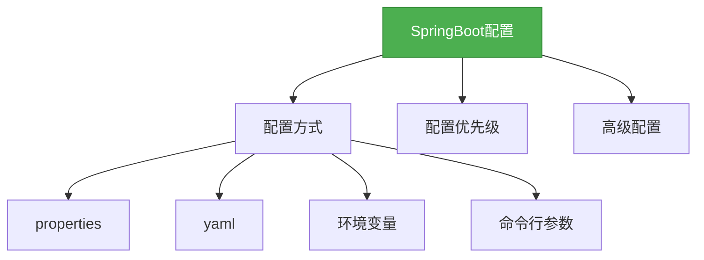

# 2. SpringBoot配置详解

## 一、概述

SpringBoot提供了多种配置方式，让开发者可以灵活地配置应用。本章节将详细介绍SpringBoot的配置方式、配置优先级以及一些高级配置技巧。



## 二、知识要点

### 1. 配置文件类型

#### 1.1 properties配置

```properties
# 应用名称
spring.application.name=demo
# 服务器端口
server.port=8080
# 数据库配置
spring.datasource.url=jdbc:mysql://localhost:3306/test
spring.datasource.username=root
spring.datasource.password=123456
```

#### 1.2 yaml配置

```yaml
spring:
  application:
    name: demo
  datasource:
    url: jdbc:mysql://localhost:3306/test
    username: root
    password: 123456
server:
  port: 8080
```

### 2. 配置优先级

SpringBoot的配置优先级从高到低依次为：

1. 命令行参数
2. 环境变量
3. 系统属性
4. 应用内的application.properties/yaml文件
5. 应用内的application-{profile}.properties/yaml文件
6. 外部的application.properties/yaml文件
7. 外部的application-{profile}.properties/yaml文件

### 3. 配置 Profiles

Profiles允许我们在不同的环境下使用不同的配置。

```yaml
# application-dev.yaml
spring:
  datasource:
    url: jdbc:mysql://localhost:3306/dev

# application-prod.yaml
spring:
  datasource:
    url: jdbc:mysql://localhost:3306/prod
```

激活Profiles的方式：

- 命令行参数: `--spring.profiles.active=dev`
- 环境变量: `SPRING_PROFILES_ACTIVE=dev`
- 配置文件: `spring.profiles.active=dev`

### 4. 读取配置

在代码中读取配置的方式：

```java
// 方式1: @Value注解
@RestController
public class ConfigController {
    @Value("${spring.application.name}")
    private String appName;

    @RequestMapping("/appName")
    public String getAppName() {
        return appName;
    }
}

// 方式2: @ConfigurationProperties注解
@ConfigurationProperties(prefix = "spring.datasource")
@Component
public class DataSourceProperties {
    private String url;
    private String username;
    private String password;

    // 省略getter和setter方法
}
```

## 三、知识扩展

### 1. 设计思想

- **统一配置管理**：集中管理所有配置，避免分散配置
- **环境隔离**：通过Profiles实现不同环境的配置隔离
- **灵活扩展**：支持多种配置方式，满足不同场景的需求
- **类型安全**：通过@ConfigurationProperties提供类型安全的配置读取

### 2. 避坑指南

- 不要在配置文件中硬编码敏感信息，如密码、密钥等
- 不要忽略配置文件的缩进，尤其是yaml文件
- 不要使用相同的配置键在不同的配置文件中，可能导致优先级问题
- 不要忘记在生产环境中关闭开发环境的配置

### 3. 深度思考题

** 思考题:** 如何在SpringBoot中实现配置的热更新？
** 回答:** 可以通过Spring Cloud Config或者SpringBoot的actuator endpoints来实现配置的热更新。Spring Cloud Config可以集中管理配置，并支持配置的动态更新；而SpringBoot的actuator endpoints中的/refresh端点可以刷新配置。

** 思考题:** 如何加密配置文件中的敏感信息？
** 回答:** 可以使用SpringBoot的encryption/decryption功能，通过在配置文件中使用加密后的字符串，并配置相应的密钥来实现敏感信息的加密。