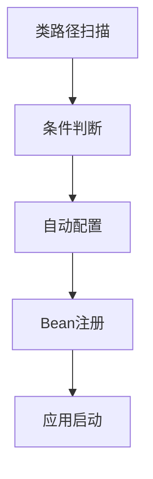

# SpringBoot自动装配原理

## 自动装配概述

自动装配（Auto Configuration）是Spring Boot最核心的特性之一，它能够根据类路径中的依赖自动配置Spring应用程序。开发者只需添加相应的起步依赖，Spring Boot就会自动完成大部分配置工作。

### 自动装配的核心思想



Spring Boot通过以下步骤实现自动装配：
1. 扫描类路径中的依赖
2. 根据条件注解判断是否需要自动配置
3. 自动注册相应的Bean
4. 完成应用程序的配置

## @EnableAutoConfiguration注解

[@EnableAutoConfiguration](file:///Users/ldf/app/docs/src/main/java/com/example/demo/DemoApplication.java#L10-L10)是启用自动装配的核心注解：

```java
@SpringBootApplication
public class Application {
    public static void main(String[] args) {
        SpringApplication.run(Application.class, args);
    }
}

// @SpringBootApplication是一个组合注解，包含：
// @SpringBootConfiguration
// @EnableAutoConfiguration
// @ComponentScan
```

### @EnableAutoConfiguration的实现

```java
@Target(ElementType.TYPE)
@Retention(RetentionPolicy.RUNTIME)
@Documented
@Inherited
@AutoConfigurationPackage
@Import(AutoConfigurationImportSelector.class)
public @interface EnableAutoConfiguration {
    
    String ENABLED_OVERRIDE_PROPERTY = "spring.boot.enableautoconfiguration";
    
    Class<?>[] exclude() default {};
    
    String[] excludeName() default {};
}
```

## 自动配置导入选择器

[AutoConfigurationImportSelector](file:///Users/ldf/app/docs/src/main/java/com/example/demo/DemoApplication.java#L10-L10)是自动装配的核心实现类：

```java
public class AutoConfigurationImportSelector implements DeferredImportSelector, BeanClassLoaderAware, 
    ResourceLoaderAware, BeanFactoryAware, EnvironmentAware, Ordered {
    
    @Override
    public String[] selectImports(AnnotationMetadata annotationMetadata) {
        if (!isEnabled(annotationMetadata)) {
            return NO_IMPORTS;
        }
        AutoConfigurationEntry autoConfigurationEntry = getAutoConfigurationEntry(annotationMetadata);
        return StringUtils.toStringArray(autoConfigurationEntry.getConfigurations());
    }
    
    protected AutoConfigurationEntry getAutoConfigurationEntry(AnnotationMetadata annotationMetadata) {
        if (!isEnabled(annotationMetadata)) {
            return EMPTY_ENTRY;
        }
        AnnotationAttributes attributes = getAttributes(annotationMetadata);
        List<String> configurations = getCandidateConfigurations(annotationMetadata, attributes);
        configurations = removeDuplicates(configurations);
        Set<String> exclusions = getExclusions(annotationMetadata, attributes);
        checkExcludedClasses(configurations, exclusions);
        configurations.removeAll(exclusions);
        configurations = getConfigurationClassFilter().filter(configurations);
        fireAutoConfigurationImportEvents(configurations, exclusions);
        return new AutoConfigurationEntry(configurations, exclusions);
    }
}
```

## spring.factories机制

Spring Boot通过[META-INF/spring.factories](file:///Users/ldf/app/docs/src/main/resources/META-INF/spring.factories)文件定义自动配置类：

```properties
# spring.factories
org.springframework.boot.autoconfigure.EnableAutoConfiguration=\
org.springframework.boot.autoconfigure.admin.SpringApplicationAdminJmxAutoConfiguration,\
org.springframework.boot.autoconfigure.aop.AopAutoConfiguration,\
org.springframework.boot.autoconfigure.amqp.RabbitAutoConfiguration,\
org.springframework.boot.autoconfigure.batch.BatchAutoConfiguration,\
org.springframework.boot.autoconfigure.cache.CacheAutoConfiguration,\
org.springframework.boot.autoconfigure.couchbase.CouchbaseAutoConfiguration,\
org.springframework.boot.autoconfigure.data.jpa.JpaRepositoriesAutoConfiguration,\
org.springframework.boot.autoconfigure.jdbc.DataSourceAutoConfiguration,\
org.springframework.boot.autoconfigure.web.servlet.DispatcherServletAutoConfiguration,\
org.springframework.boot.autoconfigure.web.servlet.ServletWebServerFactoryAutoConfiguration
```

## 条件注解

条件注解是自动装配的关键，它们决定配置类是否被应用：

### 常用条件注解

```java
// 类条件注解
@ConditionalOnClass({DataSource.class, EmbeddedDatabaseType.class})
@ConditionalOnMissingClass({"org.springframework.jdbc.datasource.DataSourceTransactionManager"})

// Bean条件注解
@ConditionalOnBean(DataSource.class)
@ConditionalOnMissingBean(DataSource.class)

// 属性条件注解
@ConditionalOnProperty(name = "spring.datasource.type")
@ConditionalOnExpression("${spring.datasource.initialize:true}")

// 资源条件注解
@ConditionalOnResource(resources = "classpath:application.properties")

// Web应用条件注解
@ConditionalOnWebApplication
@ConditionalOnNotWebApplication

// Java版本条件注解
@ConditionalOnJava(JavaVersion.EIGHT)
```

### 条件注解示例

```java
@Configuration
@ConditionalOnClass({DataSource.class, EmbeddedDatabaseType.class})
@ConditionalOnMissingBean(DataSource.class)
@EnableConfigurationProperties(DataSourceProperties.class)
public class DataSourceAutoConfiguration {
    
    @Bean
    @ConditionalOnProperty(name = "spring.datasource.type")
    public DataSource dataSource(DataSourceProperties properties) {
        return properties.initializeDataSourceBuilder().build();
    }
}
```

## 自动配置类示例

### Web自动配置

```java
@Configuration
@ConditionalOnWebApplication(type = Type.SERVLET)
@ConditionalOnClass({ Servlet.class, DispatcherServlet.class, WebMvcConfigurer.class })
@ConditionalOnMissingBean(WebMvcConfigurationSupport.class)
@AutoConfigureOrder(Ordered.HIGHEST_PRECEDENCE + 10)
@AutoConfigureAfter({ DispatcherServletAutoConfiguration.class, 
                     TaskExecutionAutoConfiguration.class, 
                     ValidationAutoConfiguration.class })
public class WebMvcAutoConfiguration {
    
    @Bean
    @ConditionalOnMissingBean(HiddenHttpMethodFilter.class)
    @ConditionalOnProperty(prefix = "spring.mvc.hiddenmethod.filter", name = "enabled")
    public OrderedHiddenHttpMethodFilter hiddenHttpMethodFilter() {
        return new OrderedHiddenHttpMethodFilter();
    }
    
    @Configuration
    @EnableConfigurationProperties(WebMvcProperties.class)
    public static class EnableWebMvcConfiguration extends DelegatingWebMvcConfiguration {
        
        @Bean
        @ConditionalOnMissingBean(RequestContextListener.class)
        @ConditionalOnWebApplication(type = Type.SERVLET)
        public RequestContextListener requestContextListener() {
            return new RequestContextListener();
        }
    }
}
```

### 数据源自动配置

```java
@Configuration
@ConditionalOnClass({ DataSource.class, EmbeddedDatabaseType.class })
@ConditionalOnMissingBean(type = "javax.sql.DataSource", value = DataSource.class)
@EnableConfigurationProperties(DataSourceProperties.class)
@Import({ DataSourcePoolMetadataProvidersConfiguration.class, 
         DataSourceInitializationConfiguration.class })
public class DataSourceAutoConfiguration {
    
    @Bean
    @ConditionalOnMissingBean(DataSource.class)
    public DataSource dataSource(DataSourceProperties properties) {
        return properties.initializeDataSourceBuilder().build();
    }
    
    @Configuration
    @ConditionalOnProperty(name = "spring.datasource.schema")
    protected static class DataSourceSchemaCreatedPublisher {
        
        @EventListener
        public void onApplicationEvent(DataSourceInitializedEvent event) {
            // 数据源初始化事件处理
        }
    }
}
```

## 自定义自动配置

### 创建自动配置类

```java
@Configuration
@ConditionalOnClass(UserService.class)
@EnableConfigurationProperties(UserProperties.class)
public class UserAutoConfiguration {
    
    @Autowired
    private UserProperties userProperties;
    
    @Bean
    @ConditionalOnMissingBean
    public UserService userService() {
        UserService userService = new UserServiceImpl();
        userService.setDefaultName(userProperties.getDefaultName());
        return userService;
    }
    
    @Bean
    @ConditionalOnMissingBean
    @ConditionalOnProperty(name = "user.cache.enabled", havingValue = "true")
    public UserCache userCache() {
        return new UserCache();
    }
}
```

### 配置属性类

```java
@ConfigurationProperties(prefix = "user")
public class UserProperties {
    
    private String defaultName = "Anonymous";
    private int maxRetries = 3;
    private boolean cacheEnabled = false;
    
    // getters and setters
    public String getDefaultName() {
        return defaultName;
    }
    
    public void setDefaultName(String defaultName) {
        this.defaultName = defaultName;
    }
    
    public int getMaxRetries() {
        return maxRetries;
    }
    
    public void setMaxRetries(int maxRetries) {
        this.maxRetries = maxRetries;
    }
    
    public boolean isCacheEnabled() {
        return cacheEnabled;
    }
    
    public void setCacheEnabled(boolean cacheEnabled) {
        this.cacheEnabled = cacheEnabled;
    }
}
```

### 注册自动配置

在[META-INF/spring.factories](file:///Users/ldf/app/docs/src/main/resources/META-INF/spring.factories)中注册自动配置类：

```properties
# META-INF/spring.factories
org.springframework.boot.autoconfigure.EnableAutoConfiguration=\
com.example.autoconfigure.UserAutoConfiguration
```

### 使用自定义自动配置

```xml
<!-- pom.xml -->
<dependency>
    <groupId>com.example</groupId>
    <artifactId>user-spring-boot-starter</artifactId>
    <version>1.0.0</version>
</dependency>
```

```yaml
# application.yml
user:
  default-name: "Spring Boot User"
  max-retries: 5
  cache:
    enabled: true
```

```java
@RestController
public class UserController {
    
    @Autowired
    private UserService userService; // 自动配置的Bean
    
    @GetMapping("/user")
    public String getUser() {
        return userService.getDefaultName();
    }
}
```

## 自动装配调试

### 启用调试日志

```yaml
# application.yml
debug: true

logging:
  level:
    org.springframework.boot.autoconfigure: DEBUG
```

### 查看自动配置报告

```bash
# 启动应用时添加--debug参数
java -jar app.jar --debug

# 或者在application.properties中添加
debug=true
```

### 使用Actuator查看配置

添加Actuator依赖：

```xml
<dependency>
    <groupId>org.springframework.boot</groupId>
    <artifactId>spring-boot-starter-actuator</artifactId>
</dependency>
```

配置端点：

```yaml
# application.yml
management:
  endpoints:
    web:
      exposure:
        include: autoconfig,beans,conditions
```

访问自动配置信息：

```bash
# 查看自动配置报告
curl http://localhost:8080/actuator/conditions

# 查看已注册的Bean
curl http://localhost:8080/actuator/beans
```

## 自动装配最佳实践

### 1. 合理使用条件注解

```java
@Configuration
@ConditionalOnClass({RedisTemplate.class, RedisConnectionFactory.class})
@ConditionalOnMissingBean(RedisTemplate.class)
public class RedisAutoConfiguration {
    
    @Bean
    @ConditionalOnMissingBean(name = "redisTemplate")
    public RedisTemplate<Object, Object> redisTemplate(RedisConnectionFactory redisConnectionFactory) {
        RedisTemplate<Object, Object> template = new RedisTemplate<>();
        template.setConnectionFactory(redisConnectionFactory);
        return template;
    }
}
```

### 2. 提供合理的默认配置

```java
@ConfigurationProperties(prefix = "app.cache")
public class CacheProperties {
    
    private long ttl = 3600L; // 默认1小时
    private int maxSize = 1000; // 默认最大1000条
    private boolean enabled = true; // 默认启用
    
    // getters and setters
}
```

### 3. 支持配置覆盖

```java
@Configuration
public class CacheAutoConfiguration {
    
    @Bean
    @ConditionalOnMissingBean
    public CacheService cacheService(CacheProperties properties) {
        CacheService cacheService = new CacheServiceImpl();
        cacheService.setTtl(properties.getTtl());
        cacheService.setMaxSize(properties.getMaxSize());
        return cacheService;
    }
    
    // 允许用户自定义Bean覆盖默认配置
    @Bean
    @ConditionalOnMissingBean
    public CacheManager cacheManager() {
        return new DefaultCacheManager();
    }
}
```

### 4. 文档化配置属性

```java
/**
 * 缓存配置属性
 */
@ConfigurationProperties(prefix = "app.cache")
public class CacheProperties {
    
    /**
     * 缓存过期时间（秒）
     * 默认值：3600（1小时）
     */
    private long ttl = 3600L;
    
    /**
     * 缓存最大条目数
     * 默认值：1000
     */
    private int maxSize = 1000;
    
    /**
     * 是否启用缓存
     * 默认值：true
     */
    private boolean enabled = true;
    
    // getters and setters
}
```

通过以上内容，我们可以全面了解Spring Boot自动装配的原理和实现机制。自动装配通过条件注解、spring.factories机制和自动配置类，实现了根据类路径依赖自动配置应用程序的功能，大大简化了Spring应用的配置工作。