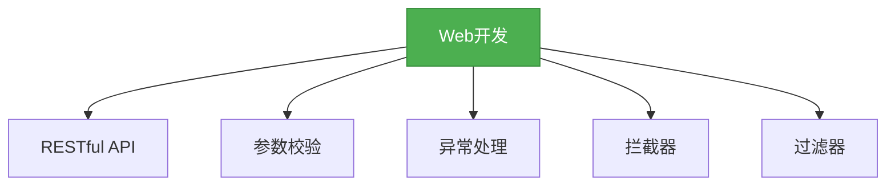

# 4. SpringBoot Web开发

## 一、概述

SpringBoot提供了强大的Web开发支持，包括RESTful API、参数校验、异常处理等特性。本章节将详细介绍SpringBoot的Web开发相关知识，帮助开发者快速构建Web应用。



## 二、知识要点

### 1. RESTful API

RESTful API是一种设计风格，它使用HTTP方法来表示对资源的操作。

```java
@RestController
@RequestMapping("/users")
public class UserController {
    @Autowired
    private UserService userService;

    // 获取所有用户
    @GetMapping
    public List<User> getAllUsers() {
        return userService.getAllUsers();
    }

    // 获取单个用户
    @GetMapping("/{id}")
    public User getUserById(@PathVariable Long id) {
        return userService.getUserById(id);
    }

    // 创建用户
    @PostMapping
    public User createUser(@RequestBody User user) {
        return userService.createUser(user);
    }

    // 更新用户
    @PutMapping("/{id}")
    public User updateUser(@PathVariable Long id, @RequestBody User user) {
        user.setId(id);
        return userService.updateUser(user);
    }

    // 删除用户
    @DeleteMapping("/{id}")
    public void deleteUser(@PathVariable Long id) {
        userService.deleteUser(id);
    }
}
```

### 2. 参数校验

SpringBoot支持JSR-380规范的参数校验。

```java
// 添加依赖
<dependency>
    <groupId>org.springframework.boot</groupId>
    <artifactId>spring-boot-starter-validation</artifactId>
</dependency>

// 实体类
public class User {
    @NotNull(message = "id不能为空")
    private Long id;

    @NotBlank(message = "用户名不能为空")
    @Size(min = 2, max = 20, message = "用户名长度必须在2-20之间")
    private String name;

    @Min(value = 18, message = "年龄必须大于等于18")
    private Integer age;

    // 省略getter和setter方法
}

// 控制器
@RestController
@RequestMapping("/users")
public class UserController {
    @PostMapping
    public User createUser(@Valid @RequestBody User user) {
        // 业务逻辑
        return user;
    }
}
```

### 3. 异常处理

SpringBoot提供了@ControllerAdvice和@ExceptionHandler注解来统一处理异常。

```java
@ControllerAdvice
public class GlobalExceptionHandler {
    @ExceptionHandler(Exception.class)
    public ResponseEntity<ErrorResult> handleException(Exception e) {
        ErrorResult errorResult = new ErrorResult();
        errorResult.setCode(500);
        errorResult.setMessage(e.getMessage());
        return ResponseEntity.status(500).body(errorResult);
    }

    @ExceptionHandler(MethodArgumentNotValidException.class)
    public ResponseEntity<ErrorResult> handleMethodArgumentNotValidException(MethodArgumentNotValidException e) {
        ErrorResult errorResult = new ErrorResult();
        errorResult.setCode(400);
        errorResult.setMessage(e.getBindingResult().getAllErrors().get(0).getDefaultMessage());
        return ResponseEntity.status(400).body(errorResult);
    }
}

public class ErrorResult {
    private Integer code;
    private String message;

    // 省略getter和setter方法
}
```

### 4. 拦截器

SpringBoot提供了HandlerInterceptor接口来实现拦截器。

```java
public class LoginInterceptor implements HandlerInterceptor {
    @Override
    public boolean preHandle(HttpServletRequest request, HttpServletResponse response, Object handler) throws Exception {
        // 检查用户是否登录
        String token = request.getHeader("token");
        if (token == null || !token.equals("admin")) {
            response.setStatus(401);
            return false;
        }
        return true;
    }
}

@Configuration
public class WebConfig implements WebMvcConfigurer {
    @Override
    public void addInterceptors(InterceptorRegistry registry) {
        registry.addInterceptor(new LoginInterceptor())
                .addPathPatterns("/**")
                .excludePathPatterns("/login");
    }
}
```

## 三、知识扩展

### 1. 设计思想

- **简洁性**：通过注解简化Web开发的配置
- **一致性**：遵循RESTful API的设计风格
- **可扩展性**：通过拦截器和过滤器提供灵活的扩展机制
- **健壮性**：通过参数校验和异常处理提高应用的健壮性

### 2. 避坑指南

- 不要忽略参数校验，可能导致数据不一致
- 不要忘记处理异常，可能导致应用崩溃
- 不要在拦截器中做过重的操作，可能影响性能
- 不要忽略HTTP方法的正确使用，GET用于获取资源，POST用于创建资源，PUT用于更新资源，DELETE用于删除资源

### 3. 深度思考题

** 思考题:** 如何实现跨域访问？
** 回答:** 可以通过@CrossOrigin注解或者WebMvcConfigurer的addCorsMappings方法来实现跨域访问。例如：

```java
// 方式1: @CrossOrigin注解
@RestController
@RequestMapping("/users")
@CrossOrigin
public class UserController {
    // 控制器方法
}

// 方式2: WebMvcConfigurer的addCorsMappings方法
@Configuration
public class WebConfig implements WebMvcConfigurer {
    @Override
    public void addCorsMappings(CorsRegistry registry) {
        registry.addMapping("/**")
                .allowedOrigins("*")
                .allowedMethods("GET", "POST", "PUT", "DELETE")
                .allowedHeaders("*");
    }
}
```

** 思考题:** 如何实现文件上传？
** 回答:** 可以通过MultipartFile接口来实现文件上传。例如：

```java
@RestController
@RequestMapping("/files")
public class FileController {
    @PostMapping("/upload")
    public String uploadFile(@RequestParam("file") MultipartFile file) throws IOException {
        // 保存文件
        String filePath = "/path/to/save/" + file.getOriginalFilename();
        file.transferTo(new File(filePath));
        return "文件上传成功: " + filePath;
    }
}
```

然后在application.properties中配置文件上传的相关参数：

```properties
# 最大文件大小
spring.servlet.multipart.max-file-size=10MB
# 最大请求大小
spring.servlet.multipart.max-request-size=100MB
```