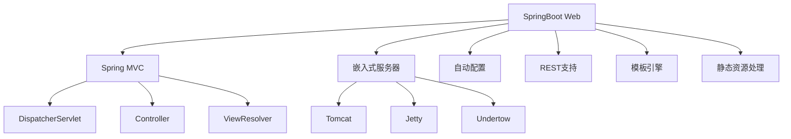

# SpringBoot Web开发

## SpringBoot Web开发概述

Spring Boot为Web开发提供了全面的支持，通过[spring-boot-starter-web](file:///Users/ldf/app/docs/pom.xml#L38-L42)起步依赖，可以快速构建Web应用程序。它集成了Spring MVC、Tomcat（或其他嵌入式Web服务器）以及相关的自动配置。

### Web开发核心组件


```mermaid
graph TB
    A[SpringBoot Web] --> B[Spring MVC]
    A --> C[嵌入式服务器]
    A --> D[自动配置]
    A --> E[REST支持]
    A --> F[模板引擎]
    A --> G[静态资源处理]
    
    B --> B1[DispatcherServlet]
    B --> B2[Controller]
    B --> B3[ViewResolver]
    
    C --> C1[Tomcat]
    C --> C2[Jetty]
    C --> C3[Undertow]
```

## 创建Web应用程序

### 添加起步依赖

```xml
<dependency>
    <groupId>org.springframework.boot</groupId>
    <artifactId>spring-boot-starter-web</artifactId>
</dependency>
```

### 基本Web控制器

```java
@RestController
public class HelloController {
    
    @GetMapping("/hello")
    public String hello() {
        return "Hello, Spring Boot!";
    }
    
    @GetMapping("/greeting")
    public Map<String, String> greeting(@RequestParam(defaultValue = "World") String name) {
        Map<String, String> response = new HashMap<>();
        response.put("message", "Hello, " + name + "!");
        response.put("timestamp", LocalDateTime.now().toString());
        return response;
    }
}
```

### 启动类

```java
@SpringBootApplication
public class WebApplication {
    public static void main(String[] args) {
        SpringApplication.run(WebApplication.class, args);
    }
}
```

## RESTful API开发

### REST控制器

```java
@RestController
@RequestMapping("/api/users")
public class UserController {
    
    @Autowired
    private UserService userService;
    
    // 获取所有用户
    @GetMapping
    public ResponseEntity<List<User>> getAllUsers() {
        List<User> users = userService.findAll();
        return ResponseEntity.ok(users);
    }
    
    // 根据ID获取用户
    @GetMapping("/{id}")
    public ResponseEntity<User> getUserById(@PathVariable Long id) {
        User user = userService.findById(id);
        if (user != null) {
            return ResponseEntity.ok(user);
        } else {
            return ResponseEntity.notFound().build();
        }
    }
    
    // 创建用户
    @PostMapping
    public ResponseEntity<User> createUser(@Valid @RequestBody User user) {
        User savedUser = userService.save(user);
        return ResponseEntity.status(HttpStatus.CREATED).body(savedUser);
    }
    
    // 更新用户
    @PutMapping("/{id}")
    public ResponseEntity<User> updateUser(@PathVariable Long id, 
                                         @Valid @RequestBody User user) {
        user.setId(id);
        User updatedUser = userService.update(user);
        if (updatedUser != null) {
            return ResponseEntity.ok(updatedUser);
        } else {
            return ResponseEntity.notFound().build();
        }
    }
    
    // 删除用户
    @DeleteMapping("/{id}")
    public ResponseEntity<Void> deleteUser(@PathVariable Long id) {
        userService.delete(id);
        return ResponseEntity.noContent().build();
    }
}
```

### 请求参数处理

```java
@RestController
@RequestMapping("/api/search")
public class SearchController {
    
    // 查询参数
    @GetMapping("/users")
    public Page<User> searchUsers(@RequestParam(required = false) String name,
                                 @RequestParam(defaultValue = "0") int page,
                                 @RequestParam(defaultValue = "10") int size) {
        return userService.findByName(name, PageRequest.of(page, size));
    }
    
    // 路径变量
    @GetMapping("/users/{userId}/orders/{orderId}")
    public Order getOrder(@PathVariable Long userId, @PathVariable Long orderId) {
        return orderService.findByUserIdAndOrderId(userId, orderId);
    }
    
    // 请求头
    @GetMapping("/info")
    public Map<String, String> getInfo(@RequestHeader("User-Agent") String userAgent,
                                      @RequestHeader(value = "Authorization", required = false) String auth) {
        Map<String, String> info = new HashMap<>();
        info.put("userAgent", userAgent);
        info.put("auth", auth);
        return info;
    }
    
    // Cookie
    @GetMapping("/profile")
    public String getProfile(@CookieValue("sessionId") String sessionId) {
        return "Session ID: " + sessionId;
    }
}
```

## 数据验证

### Bean Validation

```java
public class User {
    
    @NotNull(message = "用户ID不能为空")
    private Long id;
    
    @NotBlank(message = "用户名不能为空")
    @Size(min = 2, max = 20, message = "用户名长度必须在2-20之间")
    private String name;
    
    @NotNull(message = "邮箱不能为空")
    @Email(message = "邮箱格式不正确")
    private String email;
    
    @Min(value = 0, message = "年龄不能小于0")
    @Max(value = 150, message = "年龄不能大于150")
    private Integer age;
    
    @Pattern(regexp = "^1[3-9]\\d{9}$", message = "手机号格式不正确")
    private String phone;
    
    // getters and setters
}
```

### 控制器中的验证

```java
@RestController
@RequestMapping("/api/users")
public class UserController {
    
    @PostMapping
    public ResponseEntity<User> createUser(@Valid @RequestBody User user,
                                         BindingResult result) {
        if (result.hasErrors()) {
            List<String> errors = result.getFieldErrors().stream()
                .map(FieldError::getDefaultMessage)
                .collect(Collectors.toList());
            return ResponseEntity.badRequest().body(null);
        }
        
        User savedUser = userService.save(user);
        return ResponseEntity.status(HttpStatus.CREATED).body(savedUser);
    }
    
    @PutMapping("/{id}")
    public ResponseEntity<User> updateUser(@PathVariable Long id,
                                         @Valid @RequestBody User user,
                                         BindingResult result) {
        if (result.hasErrors()) {
            List<String> errors = result.getFieldErrors().stream()
                .map(FieldError::getDefaultMessage)
                .collect(Collectors.toList());
            return ResponseEntity.badRequest().body(null);
        }
        
        user.setId(id);
        User updatedUser = userService.update(user);
        return ResponseEntity.ok(updatedUser);
    }
}
```

### 全局异常处理

```java
@RestControllerAdvice
public class GlobalExceptionHandler {
    
    @ExceptionHandler(MethodArgumentNotValidException.class)
    public ResponseEntity<Map<String, String>> handleValidationExceptions(
            MethodArgumentNotValidException ex) {
        Map<String, String> errors = new HashMap<>();
        ex.getBindingResult().getAllErrors().forEach((error) -> {
            String fieldName = ((FieldError) error).getField();
            String errorMessage = error.getDefaultMessage();
            errors.put(fieldName, errorMessage);
        });
        return ResponseEntity.badRequest().body(errors);
    }
    
    @ExceptionHandler(ConstraintViolationException.class)
    public ResponseEntity<Map<String, String>> handleConstraintViolationException(
            ConstraintViolationException ex) {
        Map<String, String> errors = new HashMap<>();
        ex.getConstraintViolations().forEach(violation -> {
            String propertyPath = violation.getPropertyPath().toString();
            String message = violation.getMessage();
            errors.put(propertyPath, message);
        });
        return ResponseEntity.badRequest().body(errors);
    }
}
```

## 模板引擎集成

### Thymeleaf集成

添加依赖：

```xml
<dependency>
    <groupId>org.springframework.boot</groupId>
    <artifactId>spring-boot-starter-thymeleaf</artifactId>
</dependency>
```

控制器：

```java
@Controller
public class HomeController {
    
    @Autowired
    private UserService userService;
    
    @GetMapping("/")
    public String home(Model model) {
        List<User> users = userService.findAll();
        model.addAttribute("users", users);
        model.addAttribute("title", "用户管理");
        return "index";
    }
    
    @GetMapping("/users/{id}")
    public String userDetails(@PathVariable Long id, Model model) {
        User user = userService.findById(id);
        model.addAttribute("user", user);
        return "user/detail";
    }
}
```

Thymeleaf模板：

```html
<!DOCTYPE html>
<html xmlns:th="http://www.thymeleaf.org">
<head>
    <meta charset="UTF-8">
    <title th:text="${title}">用户管理</title>
    <link href="/css/bootstrap.min.css" rel="stylesheet">
</head>
<body>
    <div class="container">
        <h1 th:text="${title}">用户管理</h1>
        
        <table class="table table-striped">
            <thead>
                <tr>
                    <th>ID</th>
                    <th>姓名</th>
                    <th>邮箱</th>
                    <th>操作</th>
                </tr>
            </thead>
            <tbody>
                <tr th:each="user : ${users}">
                    <td th:text="${user.id}"></td>
                    <td th:text="${user.name}"></td>
                    <td th:text="${user.email}"></td>
                    <td>
                        <a th:href="@{/users/{id}(id=${user.id})}" class="btn btn-info btn-sm">查看</a>
                        <a th:href="@{/users/{id}/edit(id=${user.id})}" class="btn btn-primary btn-sm">编辑</a>
                    </td>
                </tr>
            </tbody>
        </table>
        
        <a href="/users/new" class="btn btn-success">创建用户</a>
    </div>
</body>
</html>
```

## 静态资源处理

### 静态资源目录

Spring Boot默认从以下位置提供静态资源：

```
src/
└── main/
    └── resources/
        ├── static/
        ├── public/
        ├── resources/
        └── META-INF/resources/
```

### 自定义静态资源配置

```java
@Configuration
public class WebConfig implements WebMvcConfigurer {
    
    @Override
    public void addResourceHandlers(ResourceHandlerRegistry registry) {
        registry.addResourceHandler("/uploads/**")
                .addResourceLocations("file:uploads/");
        
        registry.addResourceHandler("/assets/**")
                .addResourceLocations("classpath:/assets/");
    }
}
```

### 配置文件方式

```yaml
# application.yml
spring:
  web:
    resources:
      static-locations: classpath:/static/,file:./uploads/
      cache:
        period: 3600
```

## 文件上传

### 配置文件上传

```yaml
# application.yml
spring:
  servlet:
    multipart:
      enabled: true
      max-file-size: 10MB
      max-request-size: 10MB
      file-size-threshold: 2KB
      location: /tmp
```

### 文件上传控制器

```java
@RestController
@RequestMapping("/api/files")
public class FileUploadController {
    
    @Value("${upload.path:./uploads}")
    private String uploadPath;
    
    @PostMapping("/upload")
    public ResponseEntity<Map<String, String>> uploadFile(@RequestParam("file") MultipartFile file) {
        if (file.isEmpty()) {
            return ResponseEntity.badRequest().body(Map.of("error", "请选择文件"));
        }
        
        try {
            // 创建上传目录
            Path uploadDir = Paths.get(uploadPath);
            if (!Files.exists(uploadDir)) {
                Files.createDirectories(uploadDir);
            }
            
            // 保存文件
            String fileName = System.currentTimeMillis() + "_" + file.getOriginalFilename();
            Path filePath = uploadDir.resolve(fileName);
            Files.copy(file.getInputStream(), filePath, StandardCopyOption.REPLACE_EXISTING);
            
            Map<String, String> response = new HashMap<>();
            response.put("fileName", fileName);
            response.put("filePath", filePath.toString());
            response.put("size", String.valueOf(file.getSize()));
            
            return ResponseEntity.ok(response);
        } catch (IOException e) {
            return ResponseEntity.status(HttpStatus.INTERNAL_SERVER_ERROR)
                .body(Map.of("error", "文件上传失败: " + e.getMessage()));
        }
    }
    
    @GetMapping("/download/{fileName}")
    public ResponseEntity<Resource> downloadFile(@PathVariable String fileName) {
        try {
            Path filePath = Paths.get(uploadPath).resolve(fileName);
            Resource resource = new UrlResource(filePath.toUri());
            
            if (resource.exists()) {
                return ResponseEntity.ok()
                    .header(HttpHeaders.CONTENT_DISPOSITION, 
                           "attachment; filename=\"" + resource.getFilename() + "\"")
                    .body(resource);
            } else {
                return ResponseEntity.notFound().build();
            }
        } catch (MalformedURLException e) {
            return ResponseEntity.status(HttpStatus.INTERNAL_SERVER_ERROR).build();
        }
    }
}
```

## CORS配置

### 全局CORS配置

```java
@Configuration
public class WebConfig implements WebMvcConfigurer {
    
    @Override
    public void addCorsMappings(CorsRegistry registry) {
        registry.addMapping("/api/**")
                .allowedOrigins("http://localhost:3000", "https://app.example.com")
                .allowedMethods("GET", "POST", "PUT", "DELETE", "OPTIONS")
                .allowedHeaders("*")
                .allowCredentials(true)
                .maxAge(3600);
    }
}
```

### 控制器级别CORS

```java
@RestController
@RequestMapping("/api/users")
@CrossOrigin(origins = "http://localhost:3000")
public class UserController {
    
    @GetMapping
    public List<User> getAllUsers() {
        return userService.findAll();
    }
    
    @CrossOrigin(origins = "http://admin.example.com")
    @PostMapping
    public User createUser(@RequestBody User user) {
        return userService.save(user);
    }
}
```

### 配置文件方式

```yaml
# application.yml
spring:
  web:
    cors:
      allowed-origins: 
        - "http://localhost:3000"
        - "https://app.example.com"
      allowed-methods: 
        - "GET"
        - "POST"
        - "PUT"
        - "DELETE"
      allowed-headers: "*"
      allow-credentials: true
```

## 拦截器

### 自定义拦截器

```java
@Component
public class LoggingInterceptor implements HandlerInterceptor {
    
    private static final Logger logger = LoggerFactory.getLogger(LoggingInterceptor.class);
    
    @Override
    public boolean preHandle(HttpServletRequest request, 
                           HttpServletResponse response, 
                           Object handler) throws Exception {
        logger.info("请求开始: {} {} from {}", 
                   request.getMethod(), 
                   request.getRequestURI(), 
                   request.getRemoteAddr());
        request.setAttribute("startTime", System.currentTimeMillis());
        return true;
    }
    
    @Override
    public void postHandle(HttpServletRequest request, 
                          HttpServletResponse response, 
                          Object handler, 
                          ModelAndView modelAndView) throws Exception {
        long startTime = (Long) request.getAttribute("startTime");
        long endTime = System.currentTimeMillis();
        logger.info("请求处理完成，耗时: {} ms", (endTime - startTime));
    }
    
    @Override
    public void afterCompletion(HttpServletRequest request, 
                              HttpServletResponse response, 
                              Object handler, 
                              Exception ex) throws Exception {
        logger.info("请求结束: {} {} - Status: {}", 
                   request.getMethod(), 
                   request.getRequestURI(), 
                   response.getStatus());
        if (ex != null) {
            logger.error("请求处理异常", ex);
        }
    }
}
```

### 注册拦截器

```java
@Configuration
public class WebConfig implements WebMvcConfigurer {
    
    @Autowired
    private LoggingInterceptor loggingInterceptor;
    
    @Autowired
    private AuthenticationInterceptor authenticationInterceptor;
    
    @Override
    public void addInterceptors(InterceptorRegistry registry) {
        registry.addInterceptor(loggingInterceptor)
                .addPathPatterns("/api/**")
                .excludePathPatterns("/api/public/**");
                
        registry.addInterceptor(authenticationInterceptor)
                .addPathPatterns("/api/secure/**");
    }
}
```

## 异常处理

### 全局异常处理器

```java
@RestControllerAdvice
public class GlobalExceptionHandler {
    
    private static final Logger logger = LoggerFactory.getLogger(GlobalExceptionHandler.class);
    
    @ExceptionHandler(UserNotFoundException.class)
    public ResponseEntity<ErrorResponse> handleUserNotFoundException(UserNotFoundException e) {
        logger.warn("用户未找到: {}", e.getUserId());
        ErrorResponse error = new ErrorResponse("USER_NOT_FOUND", "用户未找到: " + e.getUserId());
        return ResponseEntity.status(HttpStatus.NOT_FOUND).body(error);
    }
    
    @ExceptionHandler(ValidationException.class)
    public ResponseEntity<ErrorResponse> handleValidationException(ValidationException e) {
        logger.warn("验证失败: {}", e.getMessage());
        ErrorResponse error = new ErrorResponse("VALIDATION_ERROR", e.getMessage());
        return ResponseEntity.badRequest().body(error);
    }
    
    @ExceptionHandler(Exception.class)
    public ResponseEntity<ErrorResponse> handleGenericException(Exception e) {
        logger.error("系统错误", e);
        ErrorResponse error = new ErrorResponse("INTERNAL_ERROR", "系统内部错误");
        return ResponseEntity.status(HttpStatus.INTERNAL_SERVER_ERROR).body(error);
    }
}

// 错误响应类
public class ErrorResponse {
    private String code;
    private String message;
    private LocalDateTime timestamp;
    
    public ErrorResponse(String code, String message) {
        this.code = code;
        this.message = message;
        this.timestamp = LocalDateTime.now();
    }
    
    // getters and setters
}
```

## Web安全

### Spring Security集成

添加依赖：

```xml
<dependency>
    <groupId>org.springframework.boot</groupId>
    <artifactId>spring-boot-starter-security</artifactId>
</dependency>
```

基本安全配置：

```java
@Configuration
@EnableWebSecurity
public class SecurityConfig {
    
    @Bean
    public SecurityFilterChain filterChain(HttpSecurity http) throws Exception {
        http
            .authorizeHttpRequests(authz -> authz
                .requestMatchers("/api/public/**").permitAll()
                .requestMatchers("/api/secure/**").authenticated()
                .anyRequest().authenticated()
            )
            .httpBasic(withDefaults())
            .formLogin(withDefaults());
        return http.build();
    }
    
    @Bean
    public UserDetailsService userDetailsService() {
        UserDetails user = User.withDefaultPasswordEncoder()
            .username("user")
            .password("password")
            .roles("USER")
            .build();
            
        UserDetails admin = User.withDefaultPasswordEncoder()
            .username("admin")
            .password("admin")
            .roles("USER", "ADMIN")
            .build();
            
        return new InMemoryUserDetailsManager(user, admin);
    }
}
```

## 测试Web应用

### Web层测试

```java
@WebMvcTest(UserController.class)
class UserControllerTest {
    
    @Autowired
    private MockMvc mockMvc;
    
    @MockBean
    private UserService userService;
    
    @Test
    void shouldReturnAllUsers() throws Exception {
        List<User> users = Arrays.asList(
            new User(1L, "张三", "zhangsan@example.com"),
            new User(2L, "李四", "lisi@example.com")
        );
        
        when(userService.findAll()).thenReturn(users);
        
        mockMvc.perform(get("/api/users"))
            .andExpect(status().isOk())
            .andExpect(jsonPath("$", hasSize(2)))
            .andExpect(jsonPath("$[0].name", is("张三")))
            .andExpect(jsonPath("$[1].name", is("李四")));
    }
    
    @Test
    void shouldCreateUser() throws Exception {
        User user = new User(1L, "王五", "wangwu@example.com");
        
        when(userService.save(any(User.class))).thenReturn(user);
        
        mockMvc.perform(post("/api/users")
            .contentType(MediaType.APPLICATION_JSON)
            .content("{\"name\":\"王五\",\"email\":\"wangwu@example.com\"}"))
            .andExpect(status().isCreated())
            .andExpect(jsonPath("$.id", is(1)))
            .andExpect(jsonPath("$.name", is("王五")));
    }
}
```

### 集成测试

```java
@SpringBootTest
@AutoConfigureTestDatabase(replace = AutoConfigureTestDatabase.Replace.NONE)
@TestPropertySource(locations = "classpath:application-test.properties")
class UserIntegrationTest {
    
    @Autowired
    private TestRestTemplate restTemplate;
    
    @Test
    void shouldCreateAndRetrieveUser() {
        // 创建用户
        User newUser = new User();
        newUser.setName("测试用户");
        newUser.setEmail("test@example.com");
        
        ResponseEntity<User> createResponse = restTemplate.postForEntity(
            "/api/users", newUser, User.class);
        
        assertThat(createResponse.getStatusCode()).isEqualTo(HttpStatus.CREATED);
        assertThat(createResponse.getBody()).isNotNull();
        assertThat(createResponse.getBody().getId()).isNotNull();
        
        // 获取用户
        Long userId = createResponse.getBody().getId();
        ResponseEntity<User> getResponse = restTemplate.getForEntity(
            "/api/users/" + userId, User.class);
        
        assertThat(getResponse.getStatusCode()).isEqualTo(HttpStatus.OK);
        assertThat(getResponse.getBody().getName()).isEqualTo("测试用户");
    }
}
```

通过以上内容，我们可以全面了解Spring Boot Web开发的各个方面，包括RESTful API开发、数据验证、模板引擎集成、静态资源处理、文件上传、CORS配置、拦截器、异常处理、安全配置和测试等。Spring Boot为Web开发提供了全面的支持，让开发者能够快速构建功能丰富的Web应用程序。