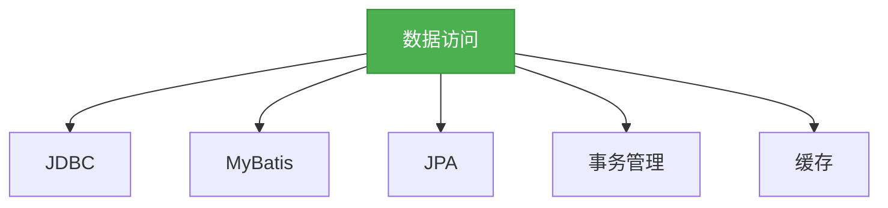

# 5. SpringBoot数据访问

## 一、概述

SpringBoot提供了强大的数据访问支持，包括JDBC、MyBatis、JPA等。本章节将详细介绍SpringBoot的数据访问相关知识，帮助开发者快速集成各种数据访问技术。



## 二、知识要点

### 1. JDBC

SpringBoot提供了spring-boot-starter-jdbc依赖来简化JDBC的使用。

```xml
<!-- 添加依赖 -->
<dependency>
    <groupId>org.springframework.boot</groupId>
    <artifactId>spring-boot-starter-jdbc</artifactId>
</dependency>
<dependency>
    <groupId>mysql</groupId>
    <artifactId>mysql-connector-java</artifactId>
</dependency>
```

```java
// 配置数据源
@Configuration
public class DataSourceConfig {
    @Bean
    @ConfigurationProperties(prefix = "spring.datasource")
    public DataSource dataSource() {
        return DataSourceBuilder.create().build();
    }
}

// 使用JdbcTemplate
@Service
public class UserService {
    @Autowired
    private JdbcTemplate jdbcTemplate;

    public List<User> getAllUsers() {
        return jdbcTemplate.query("select * from user", new BeanPropertyRowMapper<>(User.class));
    }

    public User getUserById(Long id) {
        return jdbcTemplate.queryForObject("select * from user where id = ?", new BeanPropertyRowMapper<>(User.class), id);
    }

    public int createUser(User user) {
        return jdbcTemplate.update("insert into user(name, age) values(?, ?)", user.getName(), user.getAge());
    }

    public int updateUser(User user) {
        return jdbcTemplate.update("update user set name = ?, age = ? where id = ?", user.getName(), user.getAge(), user.getId());
    }

    public int deleteUser(Long id) {
        return jdbcTemplate.update("delete from user where id = ?", id);
    }
}
```

### 2. MyBatis

SpringBoot提供了spring-boot-starter-mybatis依赖来简化MyBatis的使用。

```xml
<!-- 添加依赖 -->
<dependency>
    <groupId>org.springframework.boot</groupId>
    <artifactId>spring-boot-starter-mybatis</artifactId>
</dependency>
<dependency>
    <groupId>mysql</groupId>
    <artifactId>mysql-connector-java</artifactId>
</dependency>
```

```java
// 配置MyBatis
@Configuration
@MapperScan("com.example.demo.mapper")
public class MyBatisConfig {
}

// Mapper接口
public interface UserMapper {
    List<User> getAllUsers();
    User getUserById(Long id);
    int createUser(User user);
    int updateUser(User user);
    int deleteUser(Long id);
}

// Mapper XML
<?xml version="1.0" encoding="UTF-8" ?>
<!DOCTYPE mapper PUBLIC "-//mybatis.org//DTD Mapper 3.0//EN" "http://mybatis.org/dtd/mybatis-3-mapper.dtd">
<mapper namespace="com.example.demo.mapper.UserMapper">
    <select id="getAllUsers" resultType="com.example.demo.entity.User">
        select * from user
    </select>
    <select id="getUserById" resultType="com.example.demo.entity.User">
        select * from user where id = #{id}
    </select>
    <insert id="createUser" parameterType="com.example.demo.entity.User">
        insert into user(name, age) values(#{name}, #{age})
    </insert>
    <update id="updateUser" parameterType="com.example.demo.entity.User">
        update user set name = #{name}, age = #{age} where id = #{id}
    </update>
    <delete id="deleteUser" parameterType="java.lang.Long">
        delete from user where id = #{id}
    </delete>
</mapper>

// 服务层
@Service
public class UserService {
    @Autowired
    private UserMapper userMapper;

    public List<User> getAllUsers() {
        return userMapper.getAllUsers();
    }

    // 其他方法类似
}
```

### 3. JPA

SpringBoot提供了spring-boot-starter-data-jpa依赖来简化JPA的使用。

```xml
<!-- 添加依赖 -->
<dependency>
    <groupId>org.springframework.boot</groupId>
    <artifactId>spring-boot-starter-data-jpa</artifactId>
</dependency>
<dependency>
    <groupId>mysql</groupId>
    <artifactId>mysql-connector-java</artifactId>
</dependency>
```

```java
// 实体类
@Entity
@Table(name = "user")
public class User {
    @Id
    @GeneratedValue(strategy = GenerationType.IDENTITY)
    private Long id;

    private String name;

    private Integer age;

    // 省略getter和setter方法
}

// Repository接口
public interface UserRepository extends JpaRepository<User, Long> {
    List<User> findByName(String name);
    List<User> findByAgeGreaterThan(Integer age);
}

// 服务层
@Service
public class UserService {
    @Autowired
    private UserRepository userRepository;

    public List<User> getAllUsers() {
        return userRepository.findAll();
    }

    public User getUserById(Long id) {
        return userRepository.findById(id).orElse(null);
    }

    public User createUser(User user) {
        return userRepository.save(user);
    }

    public User updateUser(User user) {
        return userRepository.save(user);
    }

    public void deleteUser(Long id) {
        userRepository.deleteById(id);
    }
}
```

### 4. 事务管理

SpringBoot提供了@Transactional注解来简化事务管理。

```java
@Service
public class UserService {
    @Autowired
    private UserRepository userRepository;

    @Transactional
    public void createAndUpdate(User user1, User user2) {
        userRepository.save(user1);
        // 模拟异常
        if (user2.getName().equals("error")) {
            throw new RuntimeException("模拟异常");
        }
        userRepository.save(user2);
    }
}
```

## 三、知识扩展

### 1. 设计思想

- **简化集成**：通过starter依赖简化各种数据访问技术的集成
- **一致性**：提供一致的编程模型，减少学习成本
- **可扩展性**：支持多种数据访问技术，满足不同场景的需求
- **声明式事务**：通过注解简化事务管理

### 2. 避坑指南

- 不要忽略事务的隔离级别和传播特性，可能导致数据不一致
- 不要在非公共方法上使用@Transactional注解，可能导致事务不生效
- 不要忽略数据库连接池的配置，可能影响性能
- 不要忘记关闭数据库连接，可能导致资源泄漏

### 3. 深度思考题

** 思考题:** 如何配置数据库连接池？
** 回答:** 可以通过application.properties或application.yaml文件来配置数据库连接池。例如：

```properties
# 配置连接池类型
spring.datasource.type=com.zaxxer.hikari.HikariDataSource
# 配置连接池大小
spring.datasource.hikari.minimum-idle=5
spring.datasource.hikari.maximum-pool-size=10
# 配置连接超时时间
spring.datasource.hikari.connection-timeout=30000
```

** 思考题:** 如何实现多数据源？
** 回答:** 可以通过配置多个DataSource来实现多数据源。例如：

```java
@Configuration
public class DataSourceConfig {
    @Bean
    @ConfigurationProperties(prefix = "spring.datasource.primary")
    public DataSource primaryDataSource() {
        return DataSourceBuilder.create().build();
    }

    @Bean
    @ConfigurationProperties(prefix = "spring.datasource.secondary")
    public DataSource secondaryDataSource() {
        return DataSourceBuilder.create().build();
    }
}
```

然后在application.properties中配置两个数据源的相关参数：

```properties
# 主数据源
spring.datasource.primary.url=jdbc:mysql://localhost:3306/test1
spring.datasource.primary.username=root
spring.datasource.primary.password=123456
# 从数据源
spring.datasource.secondary.url=jdbc:mysql://localhost:3306/test2
spring.datasource.secondary.username=root
spring.datasource.secondary.password=123456
```

然后可以通过@Qualifier注解来指定使用哪个数据源。