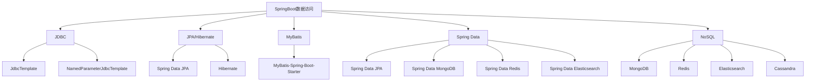

# SpringBoot数据访问

## SpringBoot数据访问概述

Spring Boot为数据访问提供了全面的支持，通过各种起步依赖简化了数据访问层的配置和开发。它支持关系型数据库、NoSQL数据库以及各种数据访问技术。

### 数据访问技术栈


```mermaid
graph TB
    A[SpringBoot数据访问] --> B[JDBC]
    A --> C[JPA/Hibernate]
    A --> D[MyBatis]
    A --> E[Spring Data]
    A --> F[NoSQL]
    
    B --> B1[JdbcTemplate]
    B --> B2[NamedParameterJdbcTemplate]
    
    C --> C1[Spring Data JPA]
    C --> C2[Hibernate]
    
    D --> D1[MyBatis-Spring-Boot-Starter]
    
    E --> E1[Spring Data JPA]
    E --> E2[Spring Data MongoDB]
    E --> E3[Spring Data Redis]
    E --> E4[Spring Data Elasticsearch]
    
    F --> F1[MongoDB]
    F --> F2[Redis]
    F --> F3[Elasticsearch]
    F --> F4[Cassandra]
```

## JDBC数据访问

### 添加JDBC起步依赖

```xml
<dependency>
    <groupId>org.springframework.boot</groupId>
    <artifactId>spring-boot-starter-jdbc</artifactId>
</dependency>
<dependency>
    <groupId>mysql</groupId>
    <artifactId>mysql-connector-java</artifactId>
    <scope>runtime</scope>
</dependency>
```

### 配置数据源

```yaml
# application.yml
spring:
  datasource:
    url: jdbc:mysql://localhost:3306/testdb
    username: root
    password: password
    driver-class-name: com.mysql.cj.jdbc.Driver
    hikari:
      maximum-pool-size: 20
      minimum-idle: 5
      connection-timeout: 30000
      idle-timeout: 600000
      max-lifetime: 1800000
```

### 使用JdbcTemplate

```java
@Repository
public class UserDao {
    
    @Autowired
    private JdbcTemplate jdbcTemplate;
    
    // 查询单个对象
    public User findById(Long id) {
        String sql = "SELECT id, name, email FROM user WHERE id = ?";
        return jdbcTemplate.queryForObject(sql, new Object[]{id}, new UserRowMapper());
    }
    
    // 查询列表
    public List<User> findAll() {
        String sql = "SELECT id, name, email FROM user";
        return jdbcTemplate.query(sql, new UserRowMapper());
    }
    
    // 插入数据
    public int insert(User user) {
        String sql = "INSERT INTO user (name, email) VALUES (?, ?)";
        return jdbcTemplate.update(sql, user.getName(), user.getEmail());
    }
    
    // 更新数据
    public int update(User user) {
        String sql = "UPDATE user SET name = ?, email = ? WHERE id = ?";
        return jdbcTemplate.update(sql, user.getName(), user.getEmail(), user.getId());
    }
    
    // 删除数据
    public int delete(Long id) {
        String sql = "DELETE FROM user WHERE id = ?";
        return jdbcTemplate.update(sql, id);
    }
    
    // 批量操作
    public int[] batchInsert(List<User> users) {
        String sql = "INSERT INTO user (name, email) VALUES (?, ?)";
        return jdbcTemplate.batchUpdate(sql, users, users.size(),
            (PreparedStatement ps, User user) -> {
                ps.setString(1, user.getName());
                ps.setString(2, user.getEmail());
            });
    }
}

// RowMapper实现
class UserRowMapper implements RowMapper<User> {
    @Override
    public User mapRow(ResultSet rs, int rowNum) throws SQLException {
        User user = new User();
        user.setId(rs.getLong("id"));
        user.setName(rs.getString("name"));
        user.setEmail(rs.getString("email"));
        return user;
    }
}
```

## JPA数据访问

### 添加JPA起步依赖

```xml
<dependency>
    <groupId>org.springframework.boot</groupId>
    <artifactId>spring-boot-starter-data-jpa</artifactId>
</dependency>
```

### 实体类定义

```java
@Entity
@Table(name = "user")
public class User {
    
    @Id
    @GeneratedValue(strategy = GenerationType.IDENTITY)
    private Long id;
    
    @Column(nullable = false, length = 50)
    private String name;
    
    @Column(unique = true, nullable = false)
    private String email;
    
    @Column(name = "created_at")
    @CreationTimestamp
    private LocalDateTime createdAt;
    
    @Column(name = "updated_at")
    @UpdateTimestamp
    private LocalDateTime updatedAt;
    
    // 构造函数、getters和setters
    public User() {}
    
    public User(String name, String email) {
        this.name = name;
        this.email = email;
    }
    
    // getters and setters
}
```

### Repository接口

```java
@Repository
public interface UserRepository extends JpaRepository<User, Long> {
    
    // 方法名查询
    List<User> findByName(String name);
    
    User findByEmail(String email);
    
    List<User> findByNameContainingIgnoreCase(String name);
    
    // 使用@Query注解
    @Query("SELECT u FROM User u WHERE u.name = ?1 AND u.email = ?2")
    List<User> findByNameAndEmail(String name, String email);
    
    @Query("SELECT u FROM User u WHERE u.createdAt > :date")
    List<User> findCreatedAfter(@Param("date") LocalDateTime date);
    
    // 更新查询
    @Modifying
    @Transactional
    @Query("UPDATE User u SET u.name = :name WHERE u.id = :id")
    int updateUserName(@Param("id") Long id, @Param("name") String name);
    
    // 分页查询
    @Query("SELECT u FROM User u WHERE u.name LIKE %:keyword%")
    Page<User> findByNameKeyword(@Param("keyword") String keyword, Pageable pageable);
}
```

### Service层实现

```java
@Service
@Transactional
public class UserService {
    
    @Autowired
    private UserRepository userRepository;
    
    public List<User> findAll() {
        return userRepository.findAll();
    }
    
    public User findById(Long id) {
        return userRepository.findById(id).orElse(null);
    }
    
    public User findByEmail(String email) {
        return userRepository.findByEmail(email);
    }
    
    public User save(User user) {
        return userRepository.save(user);
    }
    
    public User update(User user) {
        if (userRepository.existsById(user.getId())) {
            return userRepository.save(user);
        }
        return null;
    }
    
    public void delete(Long id) {
        userRepository.deleteById(id);
    }
    
    public Page<User> findByName(String name, Pageable pageable) {
        return userRepository.findByNameKeyword(name, pageable);
    }
}
```

## MyBatis数据访问

### 添加MyBatis起步依赖

```xml
<dependency>
    <groupId>org.mybatis.spring.boot</groupId>
    <artifactId>mybatis-spring-boot-starter</artifactId>
    <version>3.0.2</version>
</dependency>
```

### 配置MyBatis

```yaml
# application.yml
mybatis:
  mapper-locations: classpath:mapper/*.xml
  type-aliases-package: com.example.entity
  configuration:
    map-underscore-to-camel-case: true
    cache-enabled: true
```

### Mapper接口

```java
@Mapper
public interface UserMapper {
    
    @Select("SELECT id, name, email FROM user WHERE id = #{id}")
    User findById(Long id);
    
    @Select("SELECT id, name, email FROM user")
    List<User> findAll();
    
    @Insert("INSERT INTO user(name, email) VALUES(#{name}, #{email})")
    @Options(useGeneratedKeys = true, keyProperty = "id")
    int insert(User user);
    
    @Update("UPDATE user SET name = #{name}, email = #{email} WHERE id = #{id}")
    int update(User user);
    
    @Delete("DELETE FROM user WHERE id = #{id}")
    int delete(Long id);
    
    // 复杂查询
    @Select("SELECT u.id, u.name, u.email, p.title as profileTitle " +
            "FROM user u LEFT JOIN user_profile p ON u.id = p.user_id " +
            "WHERE u.name LIKE CONCAT('%', #{keyword}, '%')")
    List<UserProfileDto> searchUsersWithProfile(@Param("keyword") String keyword);
}
```

### XML映射文件

```xml
<!-- src/main/resources/mapper/UserMapper.xml -->
<?xml version="1.0" encoding="UTF-8"?>
<!DOCTYPE mapper PUBLIC "-//mybatis.org//DTD Mapper 3.0//EN" 
    "http://mybatis.org/dtd/mybatis-3-mapper.dtd">
<mapper namespace="com.example.mapper.UserMapper">
    
    <resultMap id="UserResultMap" type="com.example.entity.User">
        <id property="id" column="id"/>
        <result property="name" column="name"/>
        <result property="email" column="email"/>
    </resultMap>
    
    <select id="findUsersWithOrders" resultMap="UserResultMap">
        SELECT u.id, u.name, u.email
        FROM user u
        WHERE u.created_at > #{startDate}
        ORDER BY u.created_at DESC
    </select>
    
    <select id="findUserStatistics" resultType="map">
        SELECT 
            COUNT(*) as totalUsers,
            COUNT(CASE WHEN created_at >= DATE_SUB(NOW(), INTERVAL 1 MONTH) THEN 1 END) as newUsers
        FROM user
    </select>
    
</mapper>
```

## Spring Data JPA高级特性

### 审计功能

```java
@Entity
@EntityListeners(AuditingEntityListener.class)
public class User {
    
    @Id
    @GeneratedValue(strategy = GenerationType.IDENTITY)
    private Long id;
    
    private String name;
    
    private String email;
    
    @CreatedDate
    private LocalDateTime createdAt;
    
    @LastModifiedDate
    private LocalDateTime updatedAt;
    
    @CreatedBy
    private String createdBy;
    
    @LastModifiedBy
    private String updatedBy;
    
    // getters and setters
}

@Configuration
@EnableJpaAuditing
public class JpaConfig {
    // 配置
}
```

### 自定义查询

```java
@Repository
public interface UserRepository extends JpaRepository<User, Long>, UserRepositoryCustom {
    
    // 使用Specification进行动态查询
    default List<User> findUsersByCriteria(String name, String email) {
        return findAll((root, query, criteriaBuilder) -> {
            List<Predicate> predicates = new ArrayList<>();
            
            if (name != null && !name.isEmpty()) {
                predicates.add(criteriaBuilder.like(root.get("name"), "%" + name + "%"));
            }
            
            if (email != null && !email.isEmpty()) {
                predicates.add(criteriaBuilder.like(root.get("email"), "%" + email + "%"));
            }
            
            return criteriaBuilder.and(predicates.toArray(new Predicate[0]));
        });
    }
}

// 自定义Repository实现
public interface UserRepositoryCustom {
    List<UserStatisticsDto> getUserStatistics();
}

@Repository
public class UserRepositoryImpl implements UserRepositoryCustom {
    
    @PersistenceContext
    private EntityManager entityManager;
    
    @Override
    public List<UserStatisticsDto> getUserStatistics() {
        String jpql = "SELECT new com.example.dto.UserStatisticsDto(" +
                     "COUNT(u), " +
                     "COUNT(CASE WHEN u.createdAt >= :lastMonth THEN 1 END)) " +
                     "FROM User u";
        
        TypedQuery<UserStatisticsDto> query = entityManager.createQuery(jpql, UserStatisticsDto.class);
        query.setParameter("lastMonth", LocalDateTime.now().minusMonths(1));
        
        return query.getResultList();
    }
}
```

## 事务管理

### 声明式事务

```java
@Service
public class UserService {
    
    @Autowired
    private UserRepository userRepository;
    
    @Autowired
    private UserProfileRepository userProfileRepository;
    
    @Transactional
    public User createUserWithProfile(User user, UserProfile profile) {
        User savedUser = userRepository.save(user);
        profile.setUserId(savedUser.getId());
        userProfileRepository.save(profile);
        return savedUser;
    }
    
    @Transactional(readOnly = true)
    public List<User> findAllUsers() {
        return userRepository.findAll();
    }
    
    @Transactional(rollbackFor = Exception.class)
    public void batchUpdateUsers(List<User> users) throws Exception {
        for (User user : users) {
            userRepository.save(user);
            // 如果发生异常，整个事务会回滚
        }
    }
}
```

### 编程式事务

```java
@Service
public class UserService {
    
    @Autowired
    private PlatformTransactionManager transactionManager;
    
    public void saveUserProgrammatically(User user) {
        TransactionTemplate transactionTemplate = new TransactionTemplate(transactionManager);
        
        transactionTemplate.execute(status -> {
            try {
                userRepository.save(user);
                // 其他业务逻辑
                return null;
            } catch (Exception e) {
                status.setRollbackOnly();
                throw new RuntimeException(e);
            }
        });
    }
}
```

## 数据库迁移

### Flyway集成

添加依赖：

```xml
<dependency>
    <groupId>org.flywaydb</groupId>
    <artifactId>flyway-core</artifactId>
</dependency>
```

配置：

```yaml
# application.yml
spring:
  flyway:
    enabled: true
    locations: classpath:db/migration
    baseline-on-migrate: true
```

迁移脚本：

```sql
-- src/main/resources/db/migration/V1__Create_user_table.sql
CREATE TABLE user (
    id BIGINT AUTO_INCREMENT PRIMARY KEY,
    name VARCHAR(50) NOT NULL,
    email VARCHAR(100) NOT NULL UNIQUE,
    created_at TIMESTAMP DEFAULT CURRENT_TIMESTAMP,
    updated_at TIMESTAMP DEFAULT CURRENT_TIMESTAMP ON UPDATE CURRENT_TIMESTAMP
);

-- src/main/resources/db/migration/V2__Create_user_profile_table.sql
CREATE TABLE user_profile (
    id BIGINT AUTO_INCREMENT PRIMARY KEY,
    user_id BIGINT NOT NULL,
    title VARCHAR(100),
    bio TEXT,
    FOREIGN KEY (user_id) REFERENCES user(id)
);
```

## 连接池配置

### HikariCP配置

```yaml
# application.yml
spring:
  datasource:
    hikari:
      pool-name: HikariPool-1
      maximum-pool-size: 20
      minimum-idle: 5
      connection-timeout: 30000
      idle-timeout: 600000
      max-lifetime: 1800000
      leak-detection-threshold: 60000
```

### 连接池监控

```java
@Component
public class DataSourceMonitor {
    
    @Autowired
    private HikariDataSource dataSource;
    
    @Scheduled(fixedRate = 30000) // 每30秒执行一次
    public void monitorConnectionPool() {
        HikariPoolMXBean poolBean = dataSource.getHikariPoolMXBean();
        
        log.info("连接池状态 - 活跃连接数: {}, 空闲连接数: {}, 等待连接数: {}", 
                poolBean.getActiveConnections(),
                poolBean.getIdleConnections(),
                poolBean.getThreadsAwaitingConnection());
    }
}
```

## 多数据源配置

### 配置多个数据源

```java
@Configuration
public class DataSourceConfig {
    
    @Bean
    @Primary
    @ConfigurationProperties("spring.datasource.primary")
    public DataSource primaryDataSource() {
        return DataSourceBuilder.create().build();
    }
    
    @Bean
    @ConfigurationProperties("spring.datasource.secondary")
    public DataSource secondaryDataSource() {
        return DataSourceBuilder.create().build();
    }
}

@Configuration
@EnableJpaRepositories(
    basePackages = "com.example.repository.primary",
    entityManagerFactoryRef = "primaryEntityManagerFactory",
    transactionManagerRef = "primaryTransactionManager"
)
public class PrimaryDataSourceConfig {
    
    @Autowired
    @Qualifier("primaryDataSource")
    private DataSource primaryDataSource;
    
    @Bean
    @Primary
    public LocalContainerEntityManagerFactoryBean primaryEntityManagerFactory() {
        LocalContainerEntityManagerFactoryBean em = new LocalContainerEntityManagerFactoryBean();
        em.setDataSource(primaryDataSource);
        em.setPackagesToScan("com.example.entity.primary");
        
        HibernateJpaVendorAdapter vendorAdapter = new HibernateJpaVendorAdapter();
        em.setJpaVendorAdapter(vendorAdapter);
        
        return em;
    }
    
    @Bean
    @Primary
    public PlatformTransactionManager primaryTransactionManager() {
        JpaTransactionManager transactionManager = new JpaTransactionManager();
        transactionManager.setEntityManagerFactory(primaryEntityManagerFactory().getObject());
        return transactionManager;
    }
}
```

配置文件：

```yaml
# application.yml
spring:
  datasource:
    primary:
      url: jdbc:mysql://localhost:3306/primary_db
      username: root
      password: password
      driver-class-name: com.mysql.cj.jdbc.Driver
    secondary:
      url: jdbc:mysql://localhost:3306/secondary_db
      username: root
      password: password
      driver-class-name: com.mysql.cj.jdbc.Driver
```

## 缓存集成

### Spring Cache集成

```java
@Service
public class UserService {
    
    @Autowired
    private UserRepository userRepository;
    
    @Cacheable(value = "users", key = "#id")
    public User findById(Long id) {
        return userRepository.findById(id).orElse(null);
    }
    
    @CacheEvict(value = "users", key = "#user.id")
    public User save(User user) {
        return userRepository.save(user);
    }
    
    @CacheEvict(value = "users", key = "#id")
    public void delete(Long id) {
        userRepository.deleteById(id);
    }
    
    @CacheEvict(value = "users", allEntries = true)
    public void clearAllUsersCache() {
        // 清除所有用户缓存
    }
}
```

### Redis缓存配置

```yaml
# application.yml
spring:
  cache:
    type: redis
  redis:
    host: localhost
    port: 6379
    timeout: 2000ms
```

```java
@Configuration
@EnableCaching
public class CacheConfig {
    
    @Bean
    public RedisCacheManager cacheManager(RedisConnectionFactory connectionFactory) {
        RedisCacheConfiguration config = RedisCacheConfiguration.defaultCacheConfig()
            .entryTtl(Duration.ofHours(1))
            .serializeKeysWith(RedisSerializationContext.SerializationPair
                .fromSerializer(new StringRedisSerializer()))
            .serializeValuesWith(RedisSerializationContext.SerializationPair
                .fromSerializer(new GenericJackson2JsonRedisSerializer()));
        
        return RedisCacheManager.builder(connectionFactory)
            .cacheDefaults(config)
            .build();
    }
}
```

## 测试数据访问层

### Repository测试

```java
@DataJpaTest
class UserRepositoryTest {
    
    @Autowired
    private TestEntityManager entityManager;
    
    @Autowired
    private UserRepository userRepository;
    
    @Test
    void shouldFindUserByEmail() {
        // 准备测试数据
        User user = new User("张三", "zhangsan@example.com");
        entityManager.persistAndFlush(user);
        
        // 执行测试
        User found = userRepository.findByEmail("zhangsan@example.com");
        
        // 验证结果
        assertThat(found).isNotNull();
        assertThat(found.getName()).isEqualTo("张三");
    }
    
    @Test
    void shouldFindUsersByNameContaining() {
        // 准备测试数据
        entityManager.persist(new User("张三", "zhangsan@example.com"));
        entityManager.persist(new User("张四", "zhangsi@example.com"));
        entityManager.persist(new User("李四", "lisi@example.com"));
        entityManager.flush();
        
        // 执行测试
        List<User> users = userRepository.findByNameContainingIgnoreCase("张");
        
        // 验证结果
        assertThat(users).hasSize(2);
        assertThat(users).extracting(User::getName)
            .containsExactlyInAnyOrder("张三", "张四");
    }
}
```

### 集成测试

```java
@SpringBootTest
@TestPropertySource(locations = "classpath:application-test.properties")
class UserServiceIntegrationTest {
    
    @Autowired
    private UserService userService;
    
    @Autowired
    private UserRepository userRepository;
    
    @Test
    @Transactional
    @Rollback
    void shouldCreateUserWithProfile() {
        // 准备测试数据
        User user = new User("测试用户", "test@example.com");
        UserProfile profile = new UserProfile();
        profile.setTitle("测试职位");
        
        // 执行测试
        User savedUser = userService.createUserWithProfile(user, profile);
        
        // 验证结果
        assertThat(savedUser.getId()).isNotNull();
        assertThat(savedUser.getName()).isEqualTo("测试用户");
        
        // 验证数据库状态
        User foundUser = userRepository.findById(savedUser.getId()).orElse(null);
        assertThat(foundUser).isNotNull();
        assertThat(foundUser.getEmail()).isEqualTo("test@example.com");
    }
}
```

通过以上内容，我们可以全面了解Spring Boot数据访问的各个方面，包括JDBC、JPA、MyBatis、事务管理、数据库迁移、多数据源配置、缓存集成和测试等。Spring Boot通过起步依赖和自动配置，大大简化了数据访问层的开发工作。