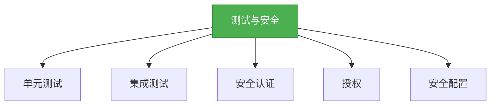

# 6. SpringBoot测试与安全

## 一、概述

SpringBoot提供了强大的测试和安全支持，包括单元测试、集成测试、安全认证和授权等。本章节将详细介绍SpringBoot的测试和安全相关知识，帮助开发者构建健壮、安全的应用。



## 二、知识要点

### 1. 单元测试

SpringBoot提供了spring-boot-starter-test依赖来简化单元测试的使用。

```xml
<!-- 添加依赖 -->
<dependency>
    <groupId>org.springframework.boot</groupId>
    <artifactId>spring-boot-starter-test</artifactId>
    <scope>test</scope>
</dependency>
```

```java
// 单元测试
@SpringBootTest
public class UserServiceTest {
    @Autowired
    private UserService userService;

    @Test
    public void testGetAllUsers() {
        List<User> users = userService.getAllUsers();
        Assert.assertNotNull(users);
    }

    @Test
    public void testGetUserById() {
        User user = userService.getUserById(1L);
        Assert.assertNotNull(user);
    }
}
```

### 2. 集成测试

SpringBoot支持集成测试，可以测试整个应用的功能。

```java
// 集成测试
@SpringBootTest(webEnvironment = SpringBootTest.WebEnvironment.RANDOM_PORT)
public class UserControllerTest {
    @Autowired
    private TestRestTemplate restTemplate;

    @Test
    public void testGetAllUsers() {
        ResponseEntity<List<User>> response = restTemplate.exchange(
                "/users",
                HttpMethod.GET,
                null,
                new ParameterizedTypeReference<List<User>>() {}
        );
        Assert.assertEquals(HttpStatus.OK, response.getStatusCode());
        Assert.assertNotNull(response.getBody());
    }

    @Test
    public void testCreateUser() {
        User user = new User();
        user.setName("test");
        user.setAge(20);
        ResponseEntity<User> response = restTemplate.postForEntity(
                "/users",
                user,
                User.class
        );
        Assert.assertEquals(HttpStatus.OK, response.getStatusCode());
        Assert.assertNotNull(response.getBody());
    }
}
```

### 3. 安全认证

SpringBoot提供了spring-boot-starter-security依赖来简化安全认证的使用。

```xml
<!-- 添加依赖 -->
<dependency>
    <groupId>org.springframework.boot</groupId>
    <artifactId>spring-boot-starter-security</artifactId>
</dependency>
```

```java
// 安全配置
@Configuration
@EnableWebSecurity
public class SecurityConfig extends WebSecurityConfigurerAdapter {
    @Override
    protected void configure(HttpSecurity http) throws Exception {
        http
                .authorizeRequests()
                .antMatchers("/public/**").permitAll()
                .anyRequest().authenticated()
                .and()
                .formLogin()
                .and()
                .httpBasic();
    }

    @Override
    protected void configure(AuthenticationManagerBuilder auth) throws Exception {
        auth
                .inMemoryAuthentication()
                .withUser("admin").password("123456").roles("ADMIN")
                .and()
                .withUser("user").password("123456").roles("USER");
    }

    @Bean
    public PasswordEncoder passwordEncoder() {
        return NoOpPasswordEncoder.getInstance();
    }
}
```

### 4. 授权

SpringBoot支持基于角色的授权。

```java
@RestController
@RequestMapping("/admin")
public class AdminController {
    @PreAuthorize("hasRole('ADMIN')")
    @GetMapping
    public String admin() {
        return "Admin Page";
    }
}

@RestController
@RequestMapping("/user")
public class UserController {
    @PreAuthorize("hasRole('USER')")
    @GetMapping
    public String user() {
        return "User Page";
    }
}
```

## 三、知识扩展

### 1. 设计思想

- **简化测试**：通过starter依赖简化测试的配置和使用
- **全面测试**：支持单元测试和集成测试，确保应用的质量
- **安全第一**：提供强大的安全认证和授权机制
- **可定制性**：支持自定义安全配置，满足不同场景的需求

### 2. 避坑指南

- 不要忽略测试，可能导致应用存在潜在的bug
- 不要使用弱密码，可能导致安全漏洞
- 不要忽略安全配置，可能导致未授权访问
- 不要在生产环境中禁用安全措施，可能导致安全风险

### 3. 深度思考题

** 思考题:** 如何实现基于JWT的认证？
** 回答:** 可以通过以下步骤实现基于JWT的认证：
1. 添加JWT的依赖
2. 创建JWT的工具类，用于生成和解析JWT
3. 创建认证过滤器，用于验证JWT
4. 配置安全配置，启用JWT认证

```xml
<!-- 添加依赖 -->
<dependency>
    <groupId>io.jsonwebtoken</groupId>
    <artifactId>jjwt</artifactId>
    <version>0.9.1</version>
</dependency>
```

```java
// JWT工具类
public class JwtUtils {
    private static final String SECRET = "secret";
    private static final long EXPIRATION = 3600000; // 1小时

    public static String generateToken(String username) {
        return Jwts.builder()
                .setSubject(username)
                .setExpiration(new Date(System.currentTimeMillis() + EXPIRATION))
                .signWith(SignatureAlgorithm.HS512, SECRET)
                .compact();
    }

    public static String getUsernameFromToken(String token) {
        return Jwts.parser()
                .setSigningKey(SECRET)
                .parseClaimsJws(token)
                .getBody()
                .getSubject();
    }

    public static boolean validateToken(String token) {
        try {
            Jwts.parser().setSigningKey(SECRET).parseClaimsJws(token);
            return true;
        } catch (Exception e) {
            return false;
        }
    }
}

// 认证过滤器
public class JwtAuthenticationFilter extends OncePerRequestFilter {
    @Override
    protected void doFilterInternal(HttpServletRequest request, HttpServletResponse response, FilterChain filterChain) throws ServletException, IOException {
        String token = request.getHeader("Authorization");
        if (token != null && token.startsWith("Bearer ")) {
            token = token.substring(7);
            if (JwtUtils.validateToken(token)) {
                String username = JwtUtils.getUsernameFromToken(token);
                UsernamePasswordAuthenticationToken authentication = new UsernamePasswordAuthenticationToken(username, null, null);
                SecurityContextHolder.getContext().setAuthentication(authentication);
            }
        }
        filterChain.doFilter(request, response);
    }
}

// 安全配置
@Configuration
@EnableWebSecurity
public class SecurityConfig extends WebSecurityConfigurerAdapter {
    @Override
    protected void configure(HttpSecurity http) throws Exception {
        http
                .csrf().disable()
                .authorizeRequests()
                .antMatchers("/login").permitAll()
                .anyRequest().authenticated()
                .and()
                .addFilterBefore(new JwtAuthenticationFilter(), UsernamePasswordAuthenticationFilter.class);
    }
}

// 登录控制器
@RestController
public class LoginController {
    @PostMapping("/login")
    public String login(@RequestBody User user) {
        // 验证用户
        if (user.getUsername().equals("admin") && user.getPassword().equals("123456")) {
            return JwtUtils.generateToken(user.getUsername());
        }
        return "登录失败";
    }
}
```

** 思考题:** 如何实现测试覆盖率的统计？
** 回答:** 可以使用Jacoco插件来实现测试覆盖率的统计。在pom.xml文件中添加Jacoco插件的配置，然后运行mvn clean test jacoco:report命令，就可以生成测试覆盖率的报告。