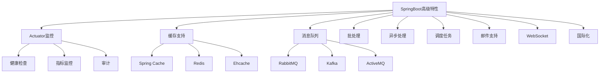

# SpringBoot高级特性

## SpringBoot高级特性概述

Spring Boot除了基础的自动配置和起步依赖外，还提供了许多高级特性，包括Actuator监控、缓存支持、消息队列集成、批处理、异步处理、调度任务等。这些特性使得Spring Boot成为一个功能完备的企业级开发框架。

### 高级特性概览



## Actuator监控

### 添加Actuator依赖

```xml
<dependency>
    <groupId>org.springframework.boot</groupId>
    <artifactId>spring-boot-starter-actuator</artifactId>
</dependency>
```

### 基本配置

```yaml
# application.yml
management:
  endpoints:
    web:
      exposure:
        include: "*"
  endpoint:
    health:
      show-details: always
  server:
    port: 8081 # 管理端点使用不同端口
```

### 常用端点

```bash
# 健康检查
curl http://localhost:8080/actuator/health

# 应用信息
curl http://localhost:8080/actuator/info

# 配置属性
curl http://localhost:8080/actuator/configprops

# 环境信息
curl http://localhost:8080/actuator/env

# 日志配置
curl http://localhost:8080/actuator/loggers

# HTTP跟踪
curl http://localhost:8080/actuator/httptrace

# 线程转储
curl http://localhost:8080/actuator/threaddump

# 堆转储
curl http://localhost:8080/actuator/heapdump

# 指标信息
curl http://localhost:8080/actuator/metrics

# 定时任务
curl http://localhost:8080/actuator/scheduledtasks

# 映射信息
curl http://localhost:8080/actuator/mappings
```

### 自定义健康检查

```java
@Component
public class CustomHealthIndicator implements HealthIndicator {
    
    @Override
    public Health health() {
        // 执行健康检查逻辑
        boolean isHealthy = checkHealth();
        
        if (isHealthy) {
            return Health.up()
                .withDetail("database", "Database connection OK")
                .withDetail("diskSpace", "Sufficient disk space")
                .build();
        } else {
            return Health.down()
                .withDetail("error", "Database connection failed")
                .build();
        }
    }
    
    private boolean checkHealth() {
        // 实现具体的健康检查逻辑
        return true;
    }
}
```

### 自定义信息贡献者

```java
@Component
public class CustomInfoContributor implements InfoContributor {
    
    @Override
    public void contribute(Info.Builder builder) {
        builder.withDetail("app", Collections.singletonMap("version", "1.0.0"))
               .withDetail("build", Collections.singletonMap("timestamp", new Date()));
    }
}
```

## 缓存支持

### Spring Cache集成

```java
@SpringBootApplication
@EnableCaching
public class Application {
    public static void main(String[] args) {
        SpringApplication.run(Application.class, args);
    }
}
```

### 使用缓存注解

```java
@Service
public class UserService {
    
    @Autowired
    private UserRepository userRepository;
    
    @Cacheable(value = "users", key = "#id")
    public User findById(Long id) {
        return userRepository.findById(id).orElse(null);
    }
    
    @Cacheable(value = "users", key = "#email")
    public User findByEmail(String email) {
        return userRepository.findByEmail(email);
    }
    
    @CacheEvict(value = "users", key = "#user.id")
    public User save(User user) {
        return userRepository.save(user);
    }
    
    @CacheEvict(value = "users", key = "#id")
    public void delete(Long id) {
        userRepository.deleteById(id);
    }
    
    @Caching(evict = {
        @CacheEvict(value = "users", key = "#user.id"),
        @CacheEvict(value = "usersByEmail", key = "#user.email")
    })
    public User update(User user) {
        return userRepository.save(user);
    }
    
    @CacheEvict(value = "users", allEntries = true)
    public void clearAllCache() {
        // 清除所有用户缓存
    }
}
```

### Redis缓存配置

```yaml
# application.yml
spring:
  cache:
    type: redis
  redis:
    host: localhost
    port: 6379
    timeout: 2000ms
    jedis:
      pool:
        max-active: 8
        max-wait: -1ms
        max-idle: 8
        min-idle: 0
```

```java
@Configuration
@EnableCaching
public class CacheConfig {
    
    @Bean
    public RedisCacheManager cacheManager(RedisConnectionFactory connectionFactory) {
        RedisCacheConfiguration config = RedisCacheConfiguration.defaultCacheConfig()
            .entryTtl(Duration.ofHours(1))
            .serializeKeysWith(RedisSerializationContext.SerializationPair
                .fromSerializer(new StringRedisSerializer()))
            .serializeValuesWith(RedisSerializationContext.SerializationPair
                .fromSerializer(new GenericJackson2JsonRedisSerializer()));
        
        return RedisCacheManager.builder(connectionFactory)
            .cacheDefaults(config)
            .build();
    }
}
```

### 自定义缓存解析器

```java
@Component
public class CustomCacheResolver implements CacheResolver {
    
    @Autowired
    private CacheManager cacheManager;
    
    @Override
    public Collection<? extends Cache> resolveCaches(CacheOperationInvocationContext<?> context) {
        Collection<Cache> caches = new ArrayList<>();
        Cache cache = cacheManager.getCache("customCache");
        if (cache != null) {
            caches.add(cache);
        }
        return caches;
    }
}

@Service
public class UserService {
    
    @Cacheable(cacheResolver = "customCacheResolver")
    public User findById(Long id) {
        return userRepository.findById(id).orElse(null);
    }
}
```

## 消息队列集成

### RabbitMQ集成

```xml
<dependency>
    <groupId>org.springframework.boot</groupId>
    <artifactId>spring-boot-starter-amqp</artifactId>
</dependency>
```

```yaml
# application.yml
spring:
  rabbitmq:
    host: localhost
    port: 5672
    username: guest
    password: guest
    virtual-host: /
```

```java
@Component
public class MessageProducer {
    
    @Autowired
    private RabbitTemplate rabbitTemplate;
    
    public void sendMessage(String queueName, Object message) {
        rabbitTemplate.convertAndSend(queueName, message);
    }
    
    public void sendUserMessage(User user) {
        rabbitTemplate.convertAndSend("user.queue", user);
    }
}

@Component
public class MessageConsumer {
    
    private static final Logger logger = LoggerFactory.getLogger(MessageConsumer.class);
    
    @RabbitListener(queues = "user.queue")
    public void handleUserMessage(User user) {
        logger.info("收到用户消息: {}", user);
        // 处理用户消息
    }
    
    @RabbitListener(queues = "notification.queue")
    public void handleNotificationMessage(Notification notification) {
        logger.info("收到通知消息: {}", notification);
        // 处理通知消息
    }
}
```

### Kafka集成

```xml
<dependency>
    <groupId>org.springframework.kafka</groupId>
    <artifactId>spring-kafka</artifactId>
</dependency>
```

```yaml
# application.yml
spring:
  kafka:
    bootstrap-servers: localhost:9092
    consumer:
      group-id: my-group
      auto-offset-reset: earliest
      key-deserializer: org.apache.kafka.common.serialization.StringDeserializer
      value-deserializer: org.apache.kafka.common.serialization.StringDeserializer
    producer:
      key-serializer: org.apache.kafka.common.serialization.StringSerializer
      value-serializer: org.apache.kafka.common.serialization.StringSerializer
```

```java
@Component
public class KafkaProducer {
    
    @Autowired
    private KafkaTemplate<String, String> kafkaTemplate;
    
    public void sendMessage(String topic, String message) {
        kafkaTemplate.send(topic, message);
    }
    
    public void sendUserEvent(String eventType, User user) {
        String message = String.format("{\"type\":\"%s\",\"data\":%s}", 
                                     eventType, JSON.toJSONString(user));
        kafkaTemplate.send("user-events", message);
    }
}

@Component
public class KafkaConsumer {
    
    private static final Logger logger = LoggerFactory.getLogger(KafkaConsumer.class);
    
    @KafkaListener(topics = "user-events")
    public void handleUserEvent(ConsumerRecord<String, String> record) {
        logger.info("收到用户事件: topic={}, partition={}, offset={}, value={}", 
                   record.topic(), record.partition(), record.offset(), record.value());
        // 处理用户事件
    }
}
```

## 批处理

### Spring Batch集成

```xml
<dependency>
    <groupId>org.springframework.boot</groupId>
    <artifactId>spring-boot-starter-batch</artifactId>
</dependency>
```

```java
@Configuration
@EnableBatchProcessing
public class BatchConfig {
    
    @Autowired
    private JobBuilderFactory jobBuilderFactory;
    
    @Autowired
    private StepBuilderFactory stepBuilderFactory;
    
    @Bean
    public Job userImportJob() {
        return jobBuilderFactory.get("userImportJob")
            .start(importUserStep())
            .build();
    }
    
    @Bean
    public Step importUserStep() {
        return stepBuilderFactory.get("importUserStep")
            .<User, User>chunk(10)
            .reader(userItemReader())
            .processor(userItemProcessor())
            .writer(userItemWriter())
            .build();
    }
    
    @Bean
    public ItemReader<User> userItemReader() {
        return new UserItemReader();
    }
    
    @Bean
    public ItemProcessor<User, User> userItemProcessor() {
        return new UserItemProcessor();
    }
    
    @Bean
    public ItemWriter<User> userItemWriter() {
        return new UserItemWriter();
    }
}

@Component
public class UserItemReader implements ItemReader<User> {
    
    private List<User> users = Arrays.asList(
        new User("张三", "zhangsan@example.com"),
        new User("李四", "lisi@example.com")
    );
    
    private int currentIndex = 0;
    
    @Override
    public User read() {
        if (currentIndex < users.size()) {
            return users.get(currentIndex++);
        }
        return null;
    }
}

@Component
public class UserItemProcessor implements ItemProcessor<User, User> {
    
    @Override
    public User process(User user) throws Exception {
        // 处理用户数据
        user.setName(user.getName().toUpperCase());
        return user;
    }
}

@Component
public class UserItemWriter implements ItemWriter<User> {
    
    @Autowired
    private UserRepository userRepository;
    
    @Override
    public void write(List<? extends User> users) throws Exception {
        userRepository.saveAll(users);
    }
}
```

## 异步处理

### 异步方法调用

```java
@SpringBootApplication
@EnableAsync
public class Application {
    public static void main(String[] args) {
        SpringApplication.run(Application.class, args);
    }
}
```

```java
@Service
public class EmailService {
    
    private static final Logger logger = LoggerFactory.getLogger(EmailService.class);
    
    @Async
    public CompletableFuture<String> sendEmailAsync(String to, String subject, String content) {
        try {
            // 模拟发送邮件的耗时操作
            Thread.sleep(5000);
            logger.info("邮件发送成功: to={}, subject={}", to, subject);
            return CompletableFuture.completedFuture("邮件发送成功");
        } catch (InterruptedException e) {
            Thread.currentThread().interrupt();
            return CompletableFuture.completedFuture("邮件发送失败");
        }
    }
    
    @Async("taskExecutor")
    public void processUserData(User user) {
        // 异步处理用户数据
        logger.info("开始处理用户数据: {}", user.getName());
        // 处理逻辑
        logger.info("用户数据处理完成: {}", user.getName());
    }
}

@Configuration
@EnableAsync
public class AsyncConfig {
    
    @Bean(name = "taskExecutor")
    public Executor taskExecutor() {
        ThreadPoolTaskExecutor executor = new ThreadPoolTaskExecutor();
        executor.setCorePoolSize(4);
        executor.setMaxPoolSize(10);
        executor.setQueueCapacity(100);
        executor.setThreadNamePrefix("Async-Executor-");
        executor.initialize();
        return executor;
    }
}
```

### 异步Web请求处理

```java
@RestController
public class AsyncController {
    
    @Autowired
    private EmailService emailService;
    
    @GetMapping("/send-email")
    public CompletableFuture<String> sendEmail(@RequestParam String to, 
                                             @RequestParam String subject) {
        return emailService.sendEmailAsync(to, subject, "邮件内容");
    }
    
    @GetMapping("/process-user")
    public CompletableFuture<ResponseEntity<String>> processUser(@RequestParam Long userId) {
        // 异步处理用户数据
        return CompletableFuture.supplyAsync(() -> {
            // 模拟处理逻辑
            try {
                Thread.sleep(3000);
                return ResponseEntity.ok("用户处理完成");
            } catch (InterruptedException e) {
                Thread.currentThread().interrupt();
                return ResponseEntity.status(HttpStatus.INTERNAL_SERVER_ERROR).body("处理失败");
            }
        });
    }
}
```

## 调度任务

### 启用调度支持

```java
@SpringBootApplication
@EnableScheduling
public class Application {
    public static void main(String[] args) {
        SpringApplication.run(Application.class, args);
    }
}
```

### 定时任务实现

```java
@Component
public class ScheduledTasks {
    
    private static final Logger logger = LoggerFactory.getLogger(ScheduledTasks.class);
    
    // 每5秒执行一次
    @Scheduled(fixedRate = 5000)
    public void reportCurrentTime() {
        logger.info("当前时间: {}", new Date());
    }
    
    // 延迟2秒后执行，之后每10秒执行一次
    @Scheduled(fixedDelay = 10000, initialDelay = 2000)
    public void scheduledTaskWithDelay() {
        logger.info("延迟任务执行: {}", new Date());
    }
    
    // 使用Cron表达式
    @Scheduled(cron = "0 0 12 * * ?") // 每天中午12点执行
    public void dailyTask() {
        logger.info("每日任务执行");
    }
    
    // 每周一上午9点执行
    @Scheduled(cron = "0 0 9 ? * MON")
    public void weeklyTask() {
        logger.info("每周任务执行");
    }
}

@Configuration
@EnableScheduling
public class SchedulingConfig implements SchedulingConfigurer {
    
    @Override
    public void configureTasks(ScheduledTaskRegistrar taskRegistrar) {
        taskRegistrar.setScheduler(taskExecutor());
    }
    
    @Bean(destroyMethod = "shutdown")
    public Executor taskExecutor() {
        return Executors.newScheduledThreadPool(5);
    }
}
```

## 邮件支持

### 添加邮件依赖

```xml
<dependency>
    <groupId>org.springframework.boot</groupId>
    <artifactId>spring-boot-starter-mail</artifactId>
</dependency>
```

### 邮件配置

```yaml
# application.yml
spring:
  mail:
    host: smtp.gmail.com
    port: 587
    username: your-email@gmail.com
    password: your-password
    properties:
      mail:
        smtp:
          auth: true
          starttls:
            enable: true
```

### 邮件发送服务

```java
@Service
public class EmailService {
    
    @Autowired
    private JavaMailSender mailSender;
    
    public void sendSimpleEmail(String to, String subject, String content) {
        SimpleMailMessage message = new SimpleMailMessage();
        message.setTo(to);
        message.setSubject(subject);
        message.setText(content);
        message.setFrom("your-email@gmail.com");
        
        mailSender.send(message);
    }
    
    public void sendHtmlEmail(String to, String subject, String htmlContent) 
            throws MessagingException {
        MimeMessage message = mailSender.createMimeMessage();
        MimeMessageHelper helper = new MimeMessageHelper(message, true);
        
        helper.setTo(to);
        helper.setSubject(subject);
        helper.setText(htmlContent, true);
        helper.setFrom("your-email@gmail.com");
        
        mailSender.send(message);
    }
    
    public void sendEmailWithAttachment(String to, String subject, String content, 
                                      String attachmentPath) throws MessagingException {
        MimeMessage message = mailSender.createMimeMessage();
        MimeMessageHelper helper = new MimeMessageHelper(message, true);
        
        helper.setTo(to);
        helper.setSubject(subject);
        helper.setText(content);
        helper.setFrom("your-email@gmail.com");
        
        FileSystemResource file = new FileSystemResource(new File(attachmentPath));
        helper.addAttachment(file.getFilename(), file);
        
        mailSender.send(message);
    }
}
```

## WebSocket支持

### 添加WebSocket依赖

```xml
<dependency>
    <groupId>org.springframework.boot</groupId>
    <artifactId>spring-boot-starter-websocket</artifactId>
</dependency>
```

### WebSocket配置

```java
@Configuration
@EnableWebSocketMessageBroker
public class WebSocketConfig implements WebSocketMessageBrokerConfigurer {
    
    @Override
    public void configureMessageBroker(MessageBrokerRegistry registry) {
        registry.enableSimpleBroker("/topic");
        registry.setApplicationDestinationPrefixes("/app");
    }
    
    @Override
    public void registerStompEndpoints(StompEndpointRegistry registry) {
        registry.addEndpoint("/websocket")
                .setAllowedOrigins("*")
                .withSockJS();
    }
}
```

### WebSocket控制器

```java
@Controller
public class WebSocketController {
    
    @MessageMapping("/chat")
    @SendTo("/topic/messages")
    public ChatMessage sendChatMessage(ChatMessage message) {
        message.setTimestamp(new Date());
        return message;
    }
    
    @MessageMapping("/user")
    public void handleUserMessage(UserMessage message, Principal principal) {
        // 处理用户消息
        simpMessagingTemplate.convertAndSendToUser(
            principal.getName(), 
            "/queue/notifications", 
            new Notification("收到新消息: " + message.getContent())
        );
    }
    
    @Autowired
    private SimpMessagingTemplate simpMessagingTemplate;
    
    public void sendNotificationToUser(String username, String message) {
        simpMessagingTemplate.convertAndSendToUser(
            username, 
            "/queue/notifications", 
            new Notification(message)
        );
    }
}
```

## 国际化支持

### 配置国际化

```yaml
# application.yml
spring:
  messages:
    basename: i18n/messages
    encoding: UTF-8
```

### 消息资源文件

```properties
# i18n/messages.properties
welcome.message=Welcome to our application
user.notfound=User not found

# i18n/messages_zh_CN.properties
welcome.message=欢迎使用我们的应用程序
user.notfound=用户未找到

# i18n/messages_en_US.properties
welcome.message=Welcome to our application
user.notfound=User not found
```

### 国际化配置类

```java
@Configuration
public class InternationalizationConfig {
    
    @Bean
    public LocaleResolver localeResolver() {
        AcceptHeaderLocaleResolver localeResolver = new AcceptHeaderLocaleResolver();
        localeResolver.setDefaultLocale(Locale.CHINA);
        return localeResolver;
    }
    
    @Bean
    public ResourceBundleMessageSource messageSource() {
        ResourceBundleMessageSource messageSource = new ResourceBundleMessageSource();
        messageSource.setBasename("i18n/messages");
        messageSource.setDefaultEncoding("UTF-8");
        return messageSource;
    }
}
```

### 在控制器中使用国际化

```java
@RestController
public class MessageController {
    
    @Autowired
    private MessageSource messageSource;
    
    @GetMapping("/welcome")
    public String getWelcomeMessage(Locale locale) {
        return messageSource.getMessage("welcome.message", null, locale);
    }
    
    @GetMapping("/error")
    public String getErrorMessage(@RequestParam String code, Locale locale) {
        return messageSource.getMessage(code, null, "未知错误", locale);
    }
}
```

## 应用监控与管理

### 自定义Actuator端点

```java
@Component
@Endpoint(id = "custom")
public class CustomEndpoint {
    
    @ReadOperation
    public CustomData customEndpoint() {
        return new CustomData("自定义数据", System.currentTimeMillis());
    }
    
    @WriteOperation
    public void writeOperation(@Selector String name, String value) {
        // 处理写操作
    }
    
    @DeleteOperation
    public void deleteOperation(@Selector String name) {
        // 处理删除操作
    }
}

public class CustomData {
    private String data;
    private long timestamp;
    
    public CustomData(String data, long timestamp) {
        this.data = data;
        this.timestamp = timestamp;
    }
    
    // getters and setters
}
```

### 应用监控配置

```yaml
# application.yml
management:
  endpoints:
    web:
      exposure:
        include: health,info,metrics,custom
  endpoint:
    health:
      show-details: always
      probes:
        enabled: true
  metrics:
    export:
      prometheus:
        enabled: true
```

## 最佳实践

### 1. 配置管理

```java
@ConfigurationProperties(prefix = "app")
@Validated
public class AppProperties {
    
    @NotBlank
    private String name;
    
    @Min(1)
    @Max(65535)
    private Integer port = 8080;
    
    private List<String> servers = new ArrayList<>();
    
    // getters and setters
}

@Configuration
@EnableConfigurationProperties(AppProperties.class)
public class AppConfig {
    // 配置
}
```

### 2. 异常处理

```java
@RestControllerAdvice
public class GlobalExceptionHandler {
    
    @ExceptionHandler(Exception.class)
    public ResponseEntity<ErrorResponse> handleGenericException(Exception e) {
        logger.error("系统错误", e);
        ErrorResponse error = new ErrorResponse("INTERNAL_ERROR", "系统内部错误");
        return ResponseEntity.status(HttpStatus.INTERNAL_SERVER_ERROR).body(error);
    }
    
    @ExceptionHandler(BusinessException.class)
    public ResponseEntity<ErrorResponse> handleBusinessException(BusinessException e) {
        ErrorResponse error = new ErrorResponse("BUSINESS_ERROR", e.getMessage());
        return ResponseEntity.badRequest().body(error);
    }
}
```

### 3. 日志配置

```yaml
# application.yml
logging:
  level:
    com.example: DEBUG
    org.springframework: INFO
  file:
    name: logs/application.log
  pattern:
    console: "%d{yyyy-MM-dd HH:mm:ss} [%thread] %-5level %logger{36} - %msg%n"
    file: "%d{yyyy-MM-dd HH:mm:ss} [%thread] %-5level %logger{36} - %msg%n"
```

通过以上内容，我们可以全面了解Spring Boot的高级特性，包括Actuator监控、缓存支持、消息队列集成、批处理、异步处理、调度任务、邮件支持、WebSocket、国际化等。这些高级特性使得Spring Boot成为一个功能强大且完整的企业级开发框架。