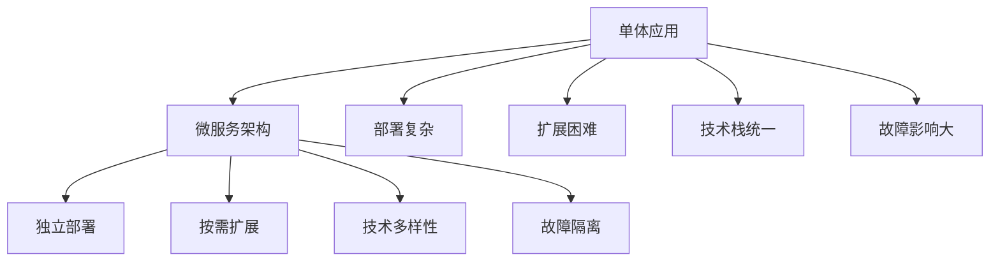
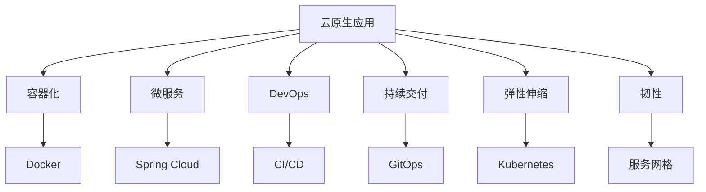
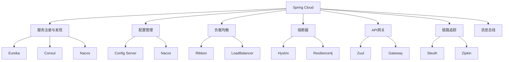
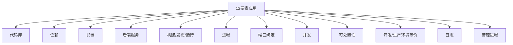

# SpringBoot微服务与云原生

## 微服务与云原生概述

随着云计算和容器化技术的发展，微服务架构和云原生应用已成为现代软件开发的主流趋势。Spring Boot作为Java生态系统中最受欢迎的框架之一，为构建微服务和云原生应用提供了强大的支持。

### 微服务架构优势



### 云原生特性



## Spring Cloud微服务

### Spring Cloud组件



### 服务注册与发现

```xml
<dependency>
    <groupId>org.springframework.cloud</groupId>
    <artifactId>spring-cloud-starter-netflix-eureka-server</artifactId>
</dependency>
```

Eureka Server配置：

```java
@SpringBootApplication
@EnableEurekaServer
public class EurekaServerApplication {
    public static void main(String[] args) {
        SpringApplication.run(EurekaServerApplication.class, args);
    }
}
```

```yaml
# application.yml
server:
  port: 8761

eureka:
  instance:
    hostname: localhost
  client:
    register-with-eureka: false
    fetch-registry: false
    service-url:
      defaultZone: http://${eureka.instance.hostname}:${server.port}/eureka/
```

服务提供者配置：

```java
@SpringBootApplication
@EnableEurekaClient
public class UserServiceApplication {
    public static void main(String[] args) {
        SpringApplication.run(UserServiceApplication.class, args);
    }
}
```

```yaml
# application.yml
spring:
  application:
    name: user-service

server:
  port: 8081

eureka:
  client:
    service-url:
      defaultZone: http://localhost:8761/eureka/
```

### 配置管理

```xml
<dependency>
    <groupId>org.springframework.cloud</groupId>
    <artifactId>spring-cloud-config-server</artifactId>
</dependency>
```

Config Server配置：

```java
@SpringBootApplication
@EnableConfigServer
public class ConfigServerApplication {
    public static void main(String[] args) {
        SpringApplication.run(ConfigServerApplication.class, args);
    }
}
```

```yaml
# application.yml
server:
  port: 8888

spring:
  cloud:
    config:
      server:
        git:
          uri: https://github.com/username/config-repo
          search-paths: '{application}'
```

客户端配置：

```yaml
# bootstrap.yml
spring:
  application:
    name: user-service
  cloud:
    config:
      uri: http://localhost:8888
      profile: dev
```

### 负载均衡

```java
@Service
public class UserServiceClient {
    
    @Autowired
    private LoadBalancerClient loadBalancerClient;
    
    @Autowired
    private RestTemplate restTemplate;
    
    public User getUserById(Long id) {
        ServiceInstance instance = loadBalancerClient.choose("user-service");
        String url = String.format("http://%s:%s/users/%d", 
                                 instance.getHost(), instance.getPort(), id);
        return restTemplate.getForObject(url, User.class);
    }
}

@Configuration
public class RestTemplateConfig {
    
    @Bean
    @LoadBalanced
    public RestTemplate restTemplate() {
        return new RestTemplate();
    }
}
```

### 熔断器

```xml
<dependency>
    <groupId>org.springframework.cloud</groupId>
    <artifactId>spring-cloud-starter-circuitbreaker-resilience4j</artifactId>
</dependency>
```

```java
@Service
public class UserServiceClient {
    
    @Autowired
    private CircuitBreakerFactory circuitBreakerFactory;
    
    @Autowired
    private RestTemplate restTemplate;
    
    public User getUserById(Long id) {
        return circuitBreakerFactory.create("user-service")
            .run(() -> {
                String url = "http://user-service/users/" + id;
                return restTemplate.getForObject(url, User.class);
            }, throwable -> {
                // 熔断降级处理
                return new User(-1L, "默认用户", "default@example.com");
            });
    }
}
```

### API网关

```xml
<dependency>
    <groupId>org.springframework.cloud</groupId>
    <artifactId>spring-cloud-starter-gateway</artifactId>
</dependency>
```

```java
@SpringBootApplication
@EnableDiscoveryClient
public class GatewayApplication {
    public static void main(String[] args) {
        SpringApplication.run(GatewayApplication.class, args);
    }
}
```

```yaml
# application.yml
server:
  port: 8080

spring:
  application:
    name: api-gateway
  cloud:
    gateway:
      routes:
        - id: user-service
          uri: lb://user-service
          predicates:
            - Path=/api/users/**
          filters:
            - StripPrefix=2
        - id: order-service
          uri: lb://order-service
          predicates:
            - Path=/api/orders/**
          filters:
            - StripPrefix=2
```

## 容器化部署

### Docker化Spring Boot应用

Dockerfile：

```dockerfile
# 使用官方OpenJDK运行时作为基础镜像
FROM openjdk:17-jdk-slim

# 设置维护者信息
LABEL maintainer="your-email@example.com"

# 设置工作目录
WORKDIR /app

# 复制jar文件到容器中
COPY target/*.jar app.jar

# 暴露端口
EXPOSE 8080

# 运行应用
ENTRYPOINT ["java", "-jar", "app.jar"]
```

多阶段构建Dockerfile：

```dockerfile
# 构建阶段
FROM openjdk:17-jdk-slim AS builder
WORKDIR /app
COPY . .
RUN ./mvnw clean package -DskipTests

# 运行阶段
FROM openjdk:17-jre-slim
WORKDIR /app
COPY --from=builder /app/target/*.jar app.jar
EXPOSE 8080
ENTRYPOINT ["java", "-jar", "app.jar"]
```

### Docker Compose配置

```yaml
# docker-compose.yml
version: '3.8'

services:
  eureka-server:
    build: ./eureka-server
    ports:
      - "8761:8761"
    networks:
      - spring-cloud-network

  config-server:
    build: ./config-server
    ports:
      - "8888:8888"
    environment:
      - EUREKA_SERVER=http://eureka-server:8761/eureka
    depends_on:
      - eureka-server
    networks:
      - spring-cloud-network

  user-service:
    build: ./user-service
    ports:
      - "8081:8080"
    environment:
      - EUREKA_SERVER=http://eureka-server:8761/eureka
      - CONFIG_SERVER=http://config-server:8888
    depends_on:
      - eureka-server
      - config-server
    networks:
      - spring-cloud-network

  api-gateway:
    build: ./api-gateway
    ports:
      - "8080:8080"
    environment:
      - EUREKA_SERVER=http://eureka-server:8761/eureka
    depends_on:
      - eureka-server
      - user-service
    networks:
      - spring-cloud-network

networks:
  spring-cloud-network:
    driver: bridge
```

## Kubernetes部署

### Kubernetes部署配置

Deployment配置：

```yaml
# user-service-deployment.yaml
apiVersion: apps/v1
kind: Deployment
metadata:
  name: user-service
  labels:
    app: user-service
spec:
  replicas: 3
  selector:
    matchLabels:
      app: user-service
  template:
    metadata:
      labels:
        app: user-service
    spec:
      containers:
      - name: user-service
        image: your-registry/user-service:latest
        ports:
        - containerPort: 8080
        env:
        - name: SPRING_PROFILES_ACTIVE
          value: "k8s"
        - name: EUREKA_SERVER
          value: "http://eureka-server:8761/eureka"
        resources:
          requests:
            memory: "512Mi"
            cpu: "250m"
          limits:
            memory: "1Gi"
            cpu: "500m"
        livenessProbe:
          httpGet:
            path: /actuator/health
            port: 8080
          initialDelaySeconds: 60
          periodSeconds: 30
        readinessProbe:
          httpGet:
            path: /actuator/health
            port: 8080
          initialDelaySeconds: 30
          periodSeconds: 10
```

Service配置：

```yaml
# user-service-service.yaml
apiVersion: v1
kind: Service
metadata:
  name: user-service
  labels:
    app: user-service
spec:
  selector:
    app: user-service
  ports:
  - port: 8080
    targetPort: 8080
  type: ClusterIP
```

### Helm Chart

Chart.yaml：

```yaml
apiVersion: v2
name: user-service
description: A Helm chart for User Service
type: application
version: 0.1.0
appVersion: "1.0.0"
```

values.yaml：

```yaml
replicaCount: 3

image:
  repository: your-registry/user-service
  tag: latest
  pullPolicy: IfNotPresent

service:
  type: ClusterIP
  port: 8080

resources:
  limits:
    cpu: 500m
    memory: 1Gi
  requests:
    cpu: 250m
    memory: 512Mi

env:
  SPRING_PROFILES_ACTIVE: k8s
```

templates/deployment.yaml：

```yaml
apiVersion: apps/v1
kind: Deployment
metadata:
  name: {{ include "user-service.fullname" . }}
  labels:
    {{- include "user-service.labels" . | nindent 4 }}
spec:
  replicas: {{ .Values.replicaCount }}
  selector:
    matchLabels:
      {{- include "user-service.selectorLabels" . | nindent 6 }}
  template:
    metadata:
      labels:
        {{- include "user-service.selectorLabels" . | nindent 8 }}
    spec:
      containers:
        - name: {{ .Chart.Name }}
          image: "{{ .Values.image.repository }}:{{ .Values.image.tag }}"
          imagePullPolicy: {{ .Values.image.pullPolicy }}
          ports:
            - name: http
              containerPort: {{ .Values.service.port }}
              protocol: TCP
          env:
            - name: SPRING_PROFILES_ACTIVE
              value: {{ .Values.env.SPRING_PROFILES_ACTIVE | quote }}
          resources:
            {{- toYaml .Values.resources | nindent 12 }}
          livenessProbe:
            httpGet:
              path: /actuator/health
              port: http
            initialDelaySeconds: 60
            periodSeconds: 30
          readinessProbe:
            httpGet:
              path: /actuator/health
              port: http
            initialDelaySeconds: 30
            periodSeconds: 10
```

## 服务网格

### Istio集成

VirtualService配置：

```yaml
apiVersion: networking.istio.io/v1alpha3
kind: VirtualService
metadata:
  name: user-service
spec:
  hosts:
  - user-service
  http:
  - route:
    - destination:
        host: user-service
        subset: v1
      weight: 90
    - destination:
        host: user-service
        subset: v2
      weight: 10
```

DestinationRule配置：

```yaml
apiVersion: networking.istio.io/v1alpha3
kind: DestinationRule
metadata:
  name: user-service
spec:
  host: user-service
  subsets:
  - name: v1
    labels:
      version: v1
  - name: v2
    labels:
      version: v2
```

### 故障注入

```yaml
apiVersion: networking.istio.io/v1alpha3
kind: VirtualService
metadata:
  name: user-service-fault
spec:
  hosts:
  - user-service
  http:
  - fault:
      delay:
        percentage:
          value: 50
        fixedDelay: 5s
    route:
    - destination:
        host: user-service
```

## 监控与追踪

### Prometheus集成

```xml
<dependency>
    <groupId>io.micrometer</groupId>
    <artifactId>micrometer-registry-prometheus</artifactId>
</dependency>
```

```yaml
# application.yml
management:
  endpoints:
    web:
      exposure:
        include: health,info,metrics,prometheus
  metrics:
    export:
      prometheus:
        enabled: true
```

Prometheus配置：

```yaml
# prometheus.yml
global:
  scrape_interval: 15s

scrape_configs:
  - job_name: 'spring-boot'
    static_configs:
      - targets: ['localhost:8080']
```

### 链路追踪

```xml
<dependency>
    <groupId>org.springframework.cloud</groupId>
    <artifactId>spring-cloud-starter-sleuth</artifactId>
</dependency>
<dependency>
    <groupId>org.springframework.cloud</groupId>
    <artifactId>spring-cloud-sleuth-zipkin</artifactId>
</dependency>
```

```yaml
# application.yml
spring:
  sleuth:
    zipkin:
      base-url: http://localhost:9411
    sampler:
      probability: 1.0
```

## 云原生最佳实践

### 12要素应用原则



### 配置管理最佳实践

```yaml
# application.yml
spring:
  datasource:
    url: ${DATABASE_URL:jdbc:h2:mem:testdb}
    username: ${DATABASE_USERNAME:sa}
    password: ${DATABASE_PASSWORD:}
  redis:
    host: ${REDIS_HOST:localhost}
    port: ${REDIS_PORT:6379}
```

### 健康检查配置

```java
@Component
public class CustomHealthIndicator implements HealthIndicator {
    
    @Override
    public Health health() {
        // 检查数据库连接
        boolean databaseUp = checkDatabase();
        // 检查Redis连接
        boolean redisUp = checkRedis();
        // 检查外部API
        boolean apiUp = checkExternalApi();
        
        if (databaseUp && redisUp && apiUp) {
            return Health.up()
                .withDetail("database", "OK")
                .withDetail("redis", "OK")
                .withDetail("external-api", "OK")
                .build();
        } else {
            return Health.down()
                .withDetail("database", databaseUp ? "OK" : "DOWN")
                .withDetail("redis", redisUp ? "OK" : "DOWN")
                .withDetail("external-api", apiUp ? "OK" : "DOWN")
                .build();
        }
    }
    
    private boolean checkDatabase() {
        // 实现数据库检查逻辑
        return true;
    }
    
    private boolean checkRedis() {
        // 实现Redis检查逻辑
        return true;
    }
    
    private boolean checkExternalApi() {
        // 实现外部API检查逻辑
        return true;
    }
}
```

### 日志最佳实践

```yaml
# application.yml
logging:
  level:
    root: INFO
    com.example: DEBUG
    org.springframework.web: DEBUG
  pattern:
    console: "%d{yyyy-MM-dd HH:mm:ss} [%thread] %-5level %logger{36} - %msg%n"
    file: "%d{yyyy-MM-dd HH:mm:ss} [%thread] %-5level %logger{36} - %msg%n"
  file:
    name: logs/application.log
```

### 弹性设计

```java
@Service
public class ResilientUserService {
    
    @Retryable(value = {Exception.class}, maxAttempts = 3, backoff = @Backoff(delay = 1000))
    public User getUserById(Long id) {
        // 可能失败的远程调用
        return userServiceClient.getUserById(id);
    }
    
    @Recover
    public User recover(Exception ex, Long id) {
        // 降级处理
        logger.warn("获取用户失败，使用默认用户: id={}", id, ex);
        return new User(id, "默认用户", "default@example.com");
    }
    
    @CircuitBreaker(name = "user-service", fallbackMethod = "getUserFallback")
    public List<User> getAllUsers() {
        return userServiceClient.getAllUsers();
    }
    
    public List<User> getUserFallback(Exception ex) {
        // 熔断降级
        logger.warn("服务熔断，返回空列表", ex);
        return Collections.emptyList();
    }
}
```

### 安全最佳实践

```java
@Configuration
@EnableWebSecurity
public class SecurityConfig {
    
    @Bean
    public SecurityFilterChain filterChain(HttpSecurity http) throws Exception {
        http
            .authorizeHttpRequests(authz -> authz
                .requestMatchers("/actuator/**").hasRole("ADMIN")
                .requestMatchers("/api/public/**").permitAll()
                .anyRequest().authenticated()
            )
            .oauth2ResourceServer(OAuth2ResourceServerConfigurer::jwt)
            .sessionManagement(session -> session
                .sessionCreationPolicy(SessionCreationPolicy.STATELESS)
            )
            .csrf(csrf -> csrf.disable())
            .headers(headers -> headers
                .frameOptions().deny()
                .contentTypeOptions().and()
                .httpStrictTransportSecurity(hstsConfig -> 
                    hstsConfig.maxAgeInSeconds(31536000).includeSubdomains(true))
            );
        return http.build();
    }
}
```

## CI/CD流水线

### GitHub Actions配置

```yaml
# .github/workflows/ci-cd.yml
name: CI/CD Pipeline

on:
  push:
    branches: [ main ]
  pull_request:
    branches: [ main ]

jobs:
  build:
    runs-on: ubuntu-latest
    
    steps:
    - uses: actions/checkout@v2
    
    - name: Set up JDK 17
      uses: actions/setup-java@v2
      with:
        java-version: '17'
        distribution: 'adopt'
    
    - name: Build with Maven
      run: ./mvnw -B package --file pom.xml
    
    - name: Build Docker image
      run: |
        docker build -t ${{ secrets.DOCKER_USERNAME }}/user-service:${{ github.sha }} .
    
    - name: Login to DockerHub
      uses: docker/login-action@v1
      with:
        username: ${{ secrets.DOCKER_USERNAME }}
        password: ${{ secrets.DOCKER_PASSWORD }}
    
    - name: Push Docker image
      run: |
        docker push ${{ secrets.DOCKER_USERNAME }}/user-service:${{ github.sha }}
    
    - name: Deploy to Kubernetes
      run: |
        kubectl set image deployment/user-service user-service=${{ secrets.DOCKER_USERNAME }}/user-service:${{ github.sha }}
```

通过以上内容，我们可以全面了解Spring Boot在微服务和云原生领域的应用，包括Spring Cloud微服务组件、容器化部署、Kubernetes集成、服务网格、监控追踪以及云原生最佳实践等。这些技术使得Spring Boot成为构建现代化云原生应用的理想选择。