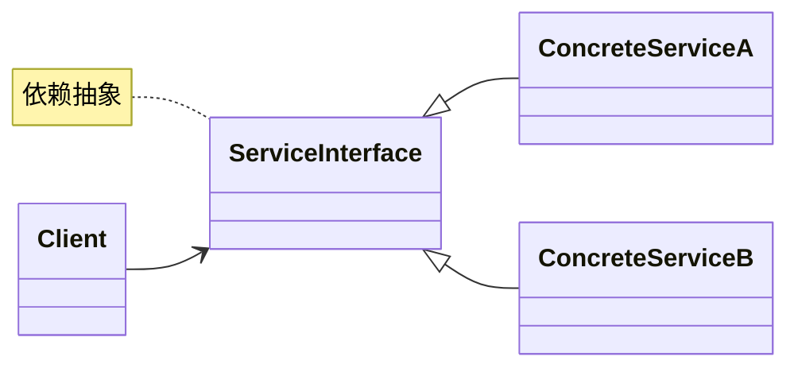

# 架构-架构设计规范

## 1. 架构设计基本原则
### 1.1 SOLID原则在架构中的应用
- **单一职责原则**：每个模块只负责一个业务领域
- **开闭原则**：通过接口和抽象类实现扩展开放、修改关闭
- **里氏替换原则**：子类必须能替换父类且不影响功能正确性
- **接口隔离原则**：客户端不应依赖不需要的接口
- **依赖倒置原则**：依赖抽象而非具体实现

<可视化规则>

</可视化规则>

## 2. 分层架构设计
### 2.1 经典四层架构
- **表示层**：处理HTTP请求和响应
- **业务逻辑层**：实现核心业务规则
- **数据访问层**：与数据库交互
- **领域模型层**：定义业务实体

<代码_example>
```java
// 领域模型层
public class Order {
    private Long id;
    private User user;
    private List<OrderItem> items;
    // 领域行为
    public BigDecimal calculateTotal() {
        return items.stream()
            .map(item -> item.getPrice().multiply(new BigDecimal(item.getQuantity())))
            .reduce(BigDecimal.ZERO, BigDecimal::add);
    }
}

// 数据访问层
public interface OrderRepository extends JpaRepository<Order, Long> {
    List<Order> findByUserId(Long userId);
}

// 业务逻辑层
@Service
public class OrderService {
    private final OrderRepository orderRepository;
    private final InventoryService inventoryService;
    
    // 构造函数注入
    public OrderService(OrderRepository orderRepository, InventoryService inventoryService) {
        this.orderRepository = orderRepository;
        this.inventoryService = inventoryService;
    }
    
    @Transactional
    public Order createOrder(OrderRequest request) {
        // 业务逻辑实现
    }
}

// 表示层
@RestController
@RequestMapping("/api/orders")
public class OrderController {
    private final OrderService orderService;
    
    public OrderController(OrderService orderService) {
        this.orderService = orderService;
    }
    
    @PostMapping
    public ResponseEntity<OrderDTO> createOrder(@RequestBody @Valid OrderRequest request) {
        Order order = orderService.createOrder(request);
        return ResponseEntity.status(HttpStatus.CREATED)
            .body(OrderMapper.toDTO(order));
    }
}
```
</代码_example>

## 3. 微服务架构设计
### 3.1 服务拆分策略
- 按业务领域边界拆分
- 考虑数据自治和团队结构
- 避免分布式事务

### 3.2 服务通信模式
- 同步通信：REST API、gRPC
- 异步通信：消息队列（Kafka、RabbitMQ）

<可视化规则>
```mermaid
graph TD
    Client[客户端] --> API Gateway[API网关]
    API Gateway --> UserService[用户服务]
    API Gateway --> OrderService[订单服务]
    API Gateway --> ProductService[商品服务]
    OrderService --> Kafka[Kafka消息队列]
    Kafka --> InventoryService[库存服务]
    Kafka --> PaymentService[支付服务]
    UserService --> UserDB[(用户数据库)]
    OrderService --> OrderDB[(订单数据库)]
    ProductService --> ProductDB[(商品数据库)]
```
</可视化规则>

## 4. 架构安全性设计
### 4.1 认证与授权
- 使用OAuth 2.0/OpenID Connect实现认证
- 基于角色的访问控制(RBAC)
- API权限粒度控制

<代码_example>
```java
@Configuration
@EnableWebSecurity
public class SecurityConfig {
    @Bean
    public SecurityFilterChain securityFilterChain(HttpSecurity http) throws Exception {
        http
            .authorizeHttpRequests(auth -> auth
                .requestMatchers("/api/public/**").permitAll()
                .requestMatchers("/api/admin/**").hasRole("ADMIN")
                .requestMatchers("/api/orders/**").hasAnyRole("USER", "ADMIN")
                .anyRequest().authenticated()
            )
            .oauth2ResourceServer(oauth2 -> oauth2.jwt());
        return http.build();
    }
}
```
</代码_example>

## 5. 避坑指南
- 避免过度设计：YAGNI(You Aren't Gonna Need It)原则
- 警惕分布式事务陷阱，优先使用最终一致性
- 避免服务间紧耦合，通过API版本控制实现兼容
- 防止架构腐化，定期进行代码和架构评审

## 6. 深度思考题
<深度思考题>
在微服务架构设计中，如何平衡服务粒度和系统复杂性？请结合具体业务场景分析服务拆分的决策过程和演进策略。
</深度思考题>
<思考题回答>
服务粒度平衡需考虑以下因素：
1. **业务边界清晰度**：通过领域驱动设计(DDD)识别限界上下文
2. **团队结构匹配度**：遵循康威定律，服务边界与团队结构对齐
3. **数据自治程度**：每个服务应拥有私有数据存储
4. **性能与可用性**：避免过多服务间调用导致的性能损耗
5. **变更频率**：将变更频率相似的功能放在同一服务

演进策略：从小粒度单体开始，随业务增长逐步拆分为微服务，通过API网关和服务发现实现平滑过渡。
</思考题回答>
