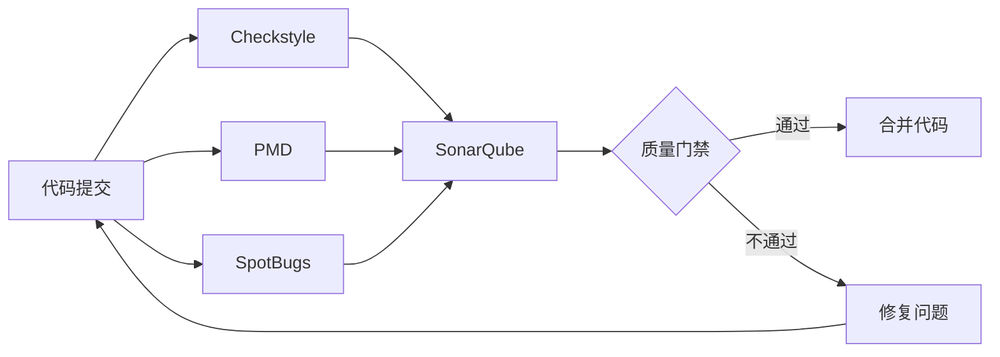
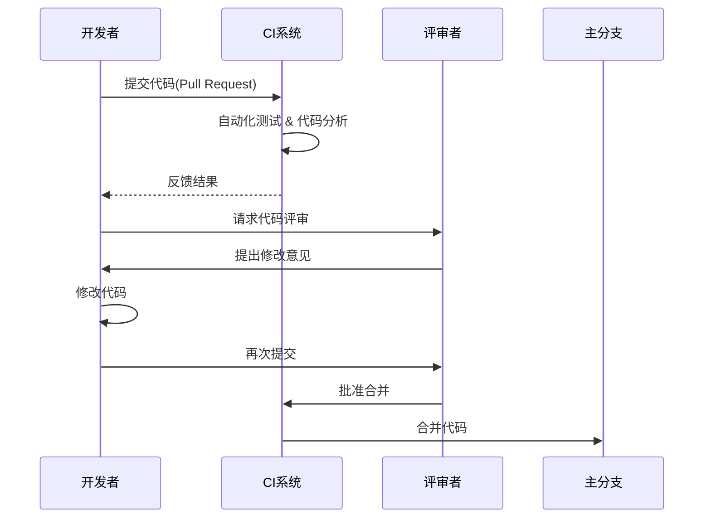

# 生态-规范落地与工具链

## 1. 规范自动化工具链
### 1.1 静态代码分析工具
- **Checkstyle**：强制代码风格规范
- **PMD**：检测代码缺陷和潜在问题
- **FindBugs/SpotBugs**：字节码级别的缺陷检测
- **SonarQube**：综合代码质量平台，支持多语言

<可视化规则>

</可视化规则>

### 1.2 工具集成配置
<代码_example>
```xml
<!-- pom.xml 中集成Checkstyle -->
<plugin>
    <groupId>org.apache.maven.plugins</groupId>
    <artifactId>maven-checkstyle-plugin</artifactId>
    <version>3.2.0</version>
    <configuration>
        <configLocation>checkstyle.xml</configLocation>
        <failOnViolation>true</failOnViolation>
        <violationSeverity>error</violationSeverity>
    </configuration>
    <executions>
        <execution>
            <phase>validate</phase>
            <goals>
                <goal>check</goal>
            </goals>
        </execution>
    </executions>
</plugin>
```
</代码_example>

## 2. CI/CD中的规范集成
### 2.1 GitHub Actions工作流配置
<代码_example>
```yaml
# .github/workflows/code-quality.yml
name: Code Quality

on:
  push:
    branches: [ main, develop ]
  pull_request:
    branches: [ main, develop ]

jobs:
  code-quality:
    runs-on: ubuntu-latest
    steps:
      - uses: actions/checkout@v3
      - name: Set up JDK 17
        uses: actions/setup-java@v3
        with:
          java-version: '17'
          distribution: 'temurin'
      - name: Checkstyle
        run: mvn checkstyle:check
      - name: PMD
        run: mvn pmd:check
      - name: SonarQube Scan
        run: mvn sonar:sonar -Dsonar.projectKey=my-project -Dsonar.host.url=${{ secrets.SONAR_URL }} -Dsonar.login=${{ secrets.SONAR_TOKEN }}
```
</代码_example>

### 2.2 质量门禁设置
- 代码覆盖率最低阈值：80%
- 不允许阻断性bug
- 不允许安全漏洞
- 代码重复率低于5%

## 3. 代码评审流程与规范执行
### 3.1 评审 checklist
- 代码是否符合项目命名规范
- 是否遵循架构设计原则
- 是否包含适当的单元测试
- 是否处理了异常情况
- 性能和安全性考虑

### 3.2 自动化评审工具
- **Crucible**：专业代码评审工具
- **GitHub Pull Request**：集成代码评审功能
- **GitLab Merge Request**：内置评审流程

<可视化规则>

</可视化规则>

## 4. 规范合规度量与改进
### 4.1 关键指标监控
- 规范违规数量趋势
- 代码评审通过率
- 自动化工具覆盖率
- 规范执行耗时

### 4.2 持续改进流程
1. 定期审计规范执行情况
2. 收集团队反馈优化规范
3. 更新工具配置适应新规范
4. 培训新规范和工具使用

<代码_example>
```java
// 规范改进示例：自定义SonarQube规则
public class CustomSonarRule extends IssuableSubscriptionVisitor {
    @Override
    public List<Tree.Kind> nodesToVisit() {
        return Collections.singletonList(Tree.Kind.METHOD);
    }
    
    @Override
    public void visitNode(Tree tree) {
        MethodTree methodTree = (MethodTree) tree;
        if (methodTree.block() == null) {
            // 抽象方法不需要检查
            return;
        }
        
        if (methodTree.parameters().size() > 5) {
            reportIssue(methodTree.simpleName(), 
                "方法参数不应超过5个，考虑使用DTO封装");
        }
    }
}
```
</代码_example>

## 5. 避坑指南
- 避免过度自动化：保留必要的人工评审
- 规范不是一成不变的：定期回顾和更新
- 工具只是辅助：培养团队规范意识更重要
- 平衡严格性和开发效率：避免规范成为负担

## 6. 深度思考题
<深度思考题>
在大型分布式团队中，如何确保不同团队遵循统一的编码规范？请设计一套规范落地的完整解决方案，包括工具选择、流程设计和文化建设。
</深度思考题>
<思考题回答>
大型分布式团队规范落地解决方案：
1. **分层规范体系**：
   - 公司级基础规范（必须遵守）
   - 业务线特定规范（灵活扩展）
   - 项目级补充规范（按需定制）

2. **工具链策略**：
   - 统一的规范配置库（Git管理）
   - 容器化的规范检查环境
   - 规范自动同步机制

3. **流程保障**：
   - 规范培训与认证机制
   - 跨团队规范委员会
   - 定期规范审计与改进

4. **文化建设**：
   - 规范大使制度
   - 规范执行优秀团队表彰
   - 技术分享会中的规范实践案例

通过技术手段（自动化工具）+ 管理手段（流程与文化）相结合，实现规范的有效落地。
</思考题回答>

**版本控制**: JDK 17+ | Spring Boot 3.1+ | SonarQube 9.9+ | Maven 3.8+