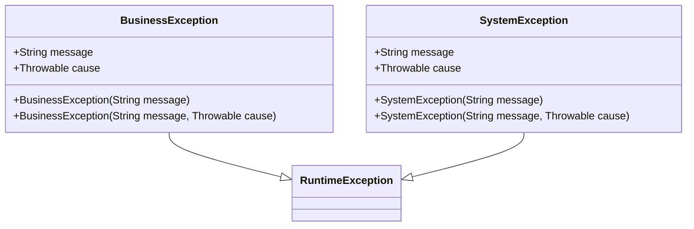

# 进阶-代码规范

## 1. 代码风格规范
### 1.1 缩进与空格
- 使用4个空格进行缩进，不使用Tab
- 运算符两侧各保留一个空格
- 逗号后保留一个空格
- 示例：
<代码_example>
```java
if (user != null && user.isActive()) {
    processOrder(user, order);
}
```
</代码_example>

### 1.2 大括号位置
- 采用K&R风格，左大括号与语句同行
- 右大括号单独成行，与对应语句对齐
- 示例：
<代码_example>
```java
public void processData() {
    // 方法体
    if (condition) {
        // 条件体
    } else {
        // else体
    }
}
```
</代码_example>

## 2. 注释规范
### 2.1 Javadoc注释
- 类、公共方法、接口必须包含Javadoc
- 包含作者、版本、参数说明、返回值和异常信息
- 示例：
<代码_example>
```java
/**
 * 用户服务类，处理用户相关业务逻辑
 * 
 * @author 架构师团队
 * @version 1.0.0
 * @since JDK 17
 */
public class UserService {
    /**
     * 根据ID获取用户信息
     * 
     * @param userId 用户ID
     * @return 用户信息对象
     * @throws UserNotFoundException 当用户不存在时抛出
     */
    public User getUserById(Long userId) throws UserNotFoundException {
        // 方法实现
    }
}
```
</代码_example>

## 3. 异常处理规范
### 3.1 异常使用原则
- 避免捕获通用异常（Exception），应捕获具体异常
- 不忽略异常，至少记录日志
- 自定义业务异常继承RuntimeException
- 示例：
<代码_example>
```java
try {
    // 可能抛出IO异常的代码
    fileReader.read(buffer);
} catch (FileNotFoundException e) {
    log.error("文件未找到: {}", filePath, e);
    throw new BusinessException("配置文件缺失", e);
} catch (IOException e) {
    log.error("文件读取失败: {}", filePath, e);
    throw new SystemException("系统IO错误", e);
}
```
</代码_example>

<可视化规则>

</可视化规则>

## 4. 并发编程规范
### 4.1 线程安全
- 共享可变状态必须进行同步
- 优先使用并发容器（ConcurrentHashMap）而非同步容器（Hashtable）
- 使用原子类（AtomicInteger）替代手动同步
- 示例：
<代码_example>
```java
// 推荐
private final ConcurrentMap<String, Object> cache = new ConcurrentHashMap<>();
private final AtomicInteger counter = new AtomicInteger(0);

// 不推荐
private final Map<String, Object> unsafeCache = new HashMap<>();
```
</代码_example>

## 5. 避坑指南
- 避免在循环中创建对象
- 慎用static关键字，防止内存泄漏
- 集合初始化时指定初始容量
- 关闭资源使用try-with-resources

## 6. 深度思考题
<深度思考题>
在高并发场景下，如何平衡代码规范性和性能优化需求？请举例说明在遵循编码规范的同时进行性能调优的实践方法。
</深度思考题>
<思考题回答>
在高并发场景下，可通过以下方式平衡规范性和性能：
1. 使用不可变对象减少同步需求
2. 合理使用线程池而非手动创建线程
3. 采用延迟初始化减少启动开销
4. 使用本地缓存减少远程调用
例如：通过ConcurrentHashMap实现高效缓存，既保证线程安全又提供良好性能。
</思考题回答>

## 7. 代码规范检查工具配置
以下是Checkstyle配置示例，用于强制实施上述规范：
<代码_example>
```xml
<module name="Indentation">
    <property name="basicOffset" value="4"/>
    <property name="braceAdjustment" value="0"/>
</module>
<module name="JavadocMethod">
    <property name="scope" value="public"/>
</module>
```
</代码_example>

**版本控制**: JDK 17+ | Spring Boot 3.1+