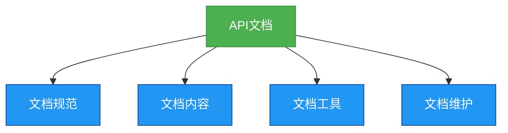

# 基础-API文档规范

## 概述
API文档是软件开发中不可或缺的一部分，它是开发者之间沟通的桥梁，也是用户使用API的指南。良好的API文档可以提高开发效率，减少沟通成本，提升用户体验。



## 知识要点
### 1. API文档的重要性
- **提高开发效率**: 良好的API文档可以帮助开发者快速理解和使用API，减少学习成本。
- **减少沟通成本**: 开发者可以通过API文档了解API的功能和使用方法，减少不必要的沟通。
- **提升用户体验**: 清晰、详细的API文档可以提升用户的使用体验，减少用户的疑惑和错误。
- **便于维护**: 良好的API文档可以帮助维护人员快速理解API的设计和实现，便于后续的维护和升级。

### 2. API文档的基本要素
- **API描述**: 简要描述API的功能和用途。
- **接口定义**: 包括接口名称、参数、返回值、异常等。
- **使用示例**: 提供API的使用示例，帮助用户快速掌握API的使用方法。
- **注意事项**: 包括API的限制、使用条件、性能考虑等。
- **版本信息**: 包括API的版本号、更新时间、更新内容等。

### 3. API文档的规范
- **命名规范**: 包括接口名称、参数名称、返回值名称等的命名规范。
- **格式规范**: 包括文档的格式、字体、颜色、布局等的规范。
- **内容规范**: 包括文档的内容、深度、广度等的规范。
- **更新规范**: 包括文档的更新频率、更新方式、更新内容等的规范。

### 4. 代码示例
#### 接口定义示例
```java
/**
 * 用户服务接口
 * 提供用户的CRUD操作
 */
public interface UserService {
    /**
     * 根据ID获取用户
     * @param id 用户ID
     * @return 用户对象
     * @throws IllegalArgumentException 当ID为null或小于等于0时抛出
     */
    User getUserById(Long id);

    /**
     * 保存用户
     * @param user 用户对象
     * @return 保存后的用户对象
     * @throws NullPointerException 当user为null时抛出
     * @throws IllegalArgumentException 当user的名称为空或长度超过50时抛出
     */
    User saveUser(User user);

    // 省略其他方法
}
```

#### 接口实现示例
```java
/**
 * 用户服务实现类
 * 实现用户的CRUD操作
 */
@Service
public class UserServiceImpl implements UserService {
    @Autowired
    private UserDao userDao;

    @Override
    public User getUserById(Long id) {
        if (id == null || id <= 0) {
            throw new IllegalArgumentException("ID must be not null and greater than 0");
        }
        return userDao.findById(id);
    }

    @Override
    public User saveUser(User user) {
        if (user == null) {
            throw new NullPointerException("User must be not null");
        }
        if (user.getName() == null || user.getName().length() > 50) {
            throw new IllegalArgumentException("User name must be not null and length must be less than or equal to 50");
        }
        return userDao.save(user);
    }

    // 省略其他方法
}
```

## 知识扩展
### 设计思想
API文档的设计思想是沟通和共享，它通过提供清晰、详细的API信息，促进开发者之间的沟通和协作，提高开发效率和代码质量。

### 避坑指南
- 不要忽略API文档的重要性，它是软件开发中不可或缺的一部分。
- 不要提供模糊、不完整的API文档，这会导致开发者的误解和错误。
- 不要忘记更新API文档，当API发生变化时，要及时更新文档。
- 不要使用过于复杂的语言和结构，保持文档的简洁和清晰。

### 深度思考题
**深度思考题:** 为什么说API文档是软件开发中不可或缺的一部分？

**思考题回答:** API文档是开发者之间沟通的桥梁，也是用户使用API的指南。良好的API文档可以提高开发效率，减少沟通成本，提升用户体验，便于后续的维护和升级。如果没有API文档，开发者需要花费更多的时间和精力去理解和使用API，这会导致开发效率的降低和沟通成本的增加。

**深度思考题:** 如何编写一份良好的API文档？

**思考题回答:** 编写一份良好的API文档需要考虑以下几点：
- 清晰、详细的API描述和接口定义
- 提供实用的使用示例
- 指出注意事项和限制
- 保持文档的简洁和清晰
- 及时更新文档
- 遵循相关的规范和标准