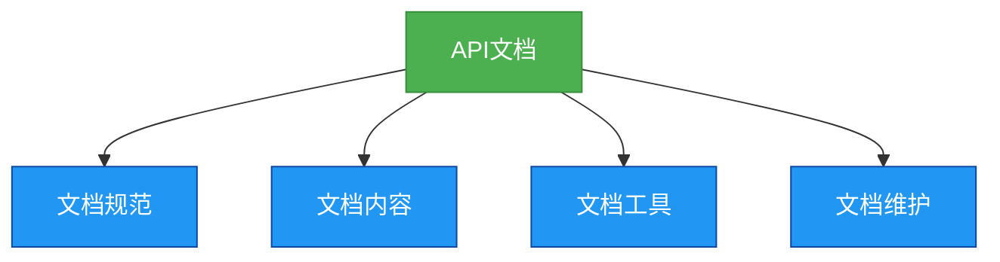

# 基础-API文档规范

## 概述
API文档是软件开发中不可或缺的一部分，它是开发者之间沟通的桥梁，也是用户使用API的指南。良好的API文档可以提高开发效率，减少沟通成本，提升用户体验。


```mermaid
graph TD
    A[API文档] --> B[文档规范]
    A --> C[文档内容]
    A --> D[文档工具]
    A --> E[文档维护]

    classDef structure fill:#4CAF50,stroke:#388E3C,color:white;
    classDef algorithm fill:#2196F3,stroke:#0D47A1,color:white;

    class A structure;
    class B,C,D,E algorithm;
```

## 知识要点
### 1. API文档的重要性
- **提高开发效率**: 良好的API文档可以帮助开发者快速理解和使用API，减少学习成本。
- **减少沟通成本**: 开发者可以通过API文档了解API的功能和使用方法，减少不必要的沟通。
- **提升用户体验**: 清晰、详细的API文档可以提升用户的使用体验，减少用户的疑惑和错误。
- **便于维护**: 良好的API文档可以帮助维护人员快速理解API的设计和实现，便于后续的维护和升级。

### 2. API文档的基本要素
- **API描述**: 简要描述API的功能和用途。
- **接口定义**: 包括接口名称、参数、返回值、异常等。
- **使用示例**: 提供API的使用示例，帮助用户快速掌握API的使用方法。
- **注意事项**: 包括API的限制、使用条件、性能考虑等。
- **版本信息**: 包括API的版本号、更新时间、更新内容等。

### 3. API文档的规范
- **命名规范**: 包括接口名称、参数名称、返回值名称等的命名规范。
- **格式规范**: 包括文档的格式、字体、颜色、布局等的规范。
- **内容规范**: 包括文档的内容、深度、广度等的规范。
- **更新规范**: 包括文档的更新频率、更新方式、更新内容等的规范。

### 4. 代码示例
#### 接口定义示例
```java
/**
 * 用户服务接口
 * 提供用户的CRUD操作
 */
public interface UserService {
    /**
     * 根据ID获取用户
     * @param id 用户ID
     * @return 用户对象
     * @throws IllegalArgumentException 当ID为null或小于等于0时抛出
     */
    User getUserById(Long id);

    /**
     * 保存用户
     * @param user 用户对象
     * @return 保存后的用户对象
     * @throws NullPointerException 当user为null时抛出
     * @throws IllegalArgumentException 当user的名称为空或长度超过50时抛出
     */
    User saveUser(User user);

    // 省略其他方法
}
```

#### 接口实现示例
```java
/**
 * 用户服务实现类
 * 实现用户的CRUD操作
 */
@Service
public class UserServiceImpl implements UserService {
    @Autowired
    private UserDao userDao;

    @Override
    public User getUserById(Long id) {
        if (id == null || id <= 0) {
            throw new IllegalArgumentException("ID must be not null and greater than 0");
        }
        return userDao.findById(id);
    }

    @Override
    public User saveUser(User user) {
        if (user == null) {
            throw new NullPointerException("User must be not null");
        }
        if (user.getName() == null || user.getName().length() > 50) {
            throw new IllegalArgumentException("User name must be not null and length must be less than or equal to 50");
        }
        return userDao.save(user);
    }

    // 省略其他方法
}
```

## 知识扩展
### 设计思想
API文档的设计思想是沟通和共享，它通过提供清晰、详细的API信息，促进开发者之间的沟通和协作，提高开发效率和代码质量。

### 避坑指南
- 不要忽略API文档的重要性，它是软件开发中不可或缺的一部分。
- 不要提供模糊、不完整的API文档，这会导致开发者的误解和错误。
- 不要忘记更新API文档，当API发生变化时，要及时更新文档。
- 不要使用过于复杂的语言和结构，保持文档的简洁和清晰。

### 深度思考题
#### 7.1 跨团队协作机制

**API设计评审流程**
1. **需求分析阶段**: 产品经理、架构师、前端负责人共同评审API需求
2. **设计阶段**: 使用OpenAPI规范定义接口，进行技术评审
3. **实现阶段**: 并行开发，定期同步接口变更
4. **测试阶段**: 联调测试，验证文档准确性
5. **发布阶段**: 文档与代码同步发布

**文档维护责任制**
- **后端开发**: 负责接口定义和业务逻辑文档
- **测试工程师**: 负责测试用例和边界条件文档
- **运维工程师**: 负责部署和监控相关文档
- **产品经理**: 负责业务场景和用户故事文档

#### 7.2 质量度量指标

**文档质量KPI**
```yaml
文档覆盖率: 95%  # API接口文档覆盖率
文档准确率: 98%  # 文档与实际代码一致性
开发者满意度: 4.5/5.0  # 内部开发者反馈评分
首次集成成功率: 90%  # 基于文档完成集成的成功率
支持工单数量: <5/周  # 因文档问题产生的技术支持工单
```

**持续改进机制**
- 每月进行文档质量回顾会议
- 收集开发者使用反馈，优化文档结构
- 定期更新文档模板和工具链
- 建立文档贡献激励机制

## 成功案例分享

### 电商平台API文档建设实战

某电商平台在实施API文档规范后，取得了显著成效：

**关键成果**：
- 新员工上手时间从5天缩短到2天
- API调用错误率下降60%
- 跨团队协作效率提升40%
- 第三方合作伙伴集成时间减少50%

**核心做法**：
1. 建立业务场景驱动的文档编写规范
2. 实施CI/CD自动化文档生成流程
3. 创建交互式API文档平台
4. 定期举办API设计和文档编写培训

**经验总结**：
- 投入与产出成正比，文档质量直接影响团队协作效率
- 自动化工具是基础，人工审核和优化是关键
- 文档不仅是技术资产，更是团队协作文化的体现

## 下一步行动建议

### 立即可执行的改进措施

1. **评估现状**：审查现有API文档，识别改进机会
2. **工具选型**：选择适合团队的文档生成和管理工具
3. **制定标准**：基于本规范制定团队特定的文档标准
4. **试点项目**：选择1-2个关键API进行文档重构试点
5. **推广应用**：逐步在所有项目中应用新的文档规范

通过系统化的API文档管理，不仅能提升开发效率，更能构建高质量的技术团队协作文化。