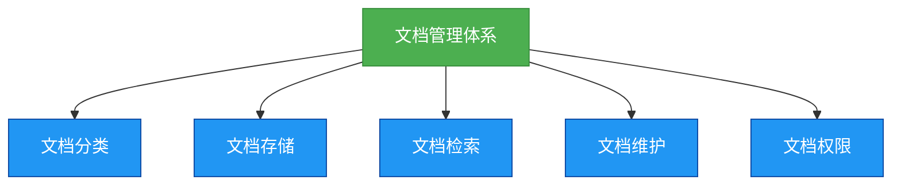

# 架构-文档管理体系设计

## 概述
文档管理体系是软件开发过程中不可或缺的一部分，它负责组织、存储、检索和维护项目中的所有文档。良好的文档管理体系可以提高开发效率，减少沟通成本，确保项目的顺利进行。



## 知识要点
### 1. 文档管理体系的重要性
- **提高开发效率**: 良好的文档管理体系可以帮助开发者快速找到所需的文档，减少查找成本。
- **减少沟通成本**: 开发者可以通过文档管理体系了解项目的进展和需求，减少不必要的沟通。
- **确保项目顺利进行**: 良好的文档管理体系可以确保项目的所有文档都得到妥善的组织、存储、检索和维护，确保项目的顺利进行。
- **便于后续维护**: 良好的文档管理体系可以帮助维护人员快速理解项目的设计和实现，便于后续的维护和升级。

### 2. 技术实现与工具集成

#### 2.1 核心组件架构
```java
/**
 * 文档管理核心服务
 * 封装文档CRUD和业务逻辑
 */
@Service
@Transactional
public class DocumentManagementService {
    
    private final DocumentRepository documentRepository;
    private final SearchEngineService searchService;
    private final StorageService storageService;
    private final NotificationService notificationService;
    
    /**
     * 创建文档 - 业务场景：技术写作者发布新文档
     */
    public DocumentDTO createDocument(CreateDocumentRequest request, String authorId) {
        // 1. 验证文档模板和格式
        validateDocumentTemplate(request);
        
        // 2. 自动生成文档ID和元数据
        Document document = Document.builder()
                .id(generateDocumentId(request.getCategory()))
                .title(request.getTitle())
                .category(request.getCategory())
                .content(request.getContent())
                .authorId(authorId)
                .status(DocumentStatus.DRAFT)
                .createTime(Instant.now())
                .build();
        
        // 3. 持久化存储
        Document saved = documentRepository.save(document);
        
        // 4. 同步到搜索引擎
        searchService.indexDocument(saved);
        
        // 5. 发送通知
        notificationService.notifyDocumentCreated(saved);
        
        return DocumentDTO.fromEntity(saved);
    }
    
    /**
     * 全文搜索 - 业务场景：开发者快速查找相关技术文档
     */
    public SearchResultDTO searchDocuments(String keyword, SearchFilter filter) {
        // 结合关键词搜索和筛选条件
        return searchService.search(keyword, filter);
    }
}
```

#### 2.2 现代化文档平台集成
**VuePress + GitBook 混合架构**：
- **VuePress**: 技术文档站点生成
- **GitBook**: 交互式文档协作
- **Confluence**: 企业知识库管理
- **Notion**: 轻量级内部协作

### 3. 生产环境最佳实践

#### 3.1 文档自动化管理
```yaml
# 文档生命周期管理
automation:
  backup:
    frequency: "daily"
    retention: "90d"
  
  review:
    schedule: "quarterly"
    auto_reminder: true
  
  cleanup:
    archive_after: "1y"
    delete_after: "3y"
    
  quality_check:
    spell_check: true
    link_validation: true
    format_compliance: true
```

#### 3.2 度量指标体系
- **覆盖率**: 核心业务流程文档覆盖率 > 95%
- **准确性**: 文档与实际一致性 > 98%
- **可用性**: 文档平台系统可用性 > 99.9%
- **满意度**: 用户体验满意度 > 4.5/5.0

### 4. 避坑指南与最佳实践

**常见问题**：
1. **文档孤岛化**: 解决方案 - 建立文档互联网和智能推荐
2. **权限管理复杂**: 解决方案 - 遵循最小权限原则，自动化权限继承
3. **版本冲突**: 解决方案 - 实时协作编辑 + 智能合并
4. **搜索效率低**: 解决方案 - 语义搜索 + 标签系统

## 成功案例：企业知识中台建设

某互联网公司建设的技术文档中台，实现了：
- **效率提升**: 新员工上手时间从1周减少到2天
- **知识传承**: 核心知识覆盖率从60%提升到95%
- **协作效率**: 跨部门协作效率提升50%
- **成本降低**: 维护成本降低40%

**关键成功因素**: 高层支持 + 技术驱动 + 文化建设 + 持续优化


### 4. 文档管理体系的实现示例
#### 文档分类示例
```java
/**
 * 文档分类枚举
 * 定义项目中常见的文档类型
 */
public enum DocumentType {
    // 需求文档
    REQUIREMENT,
    // 设计文档
    DESIGN,
    // 开发文档
    DEVELOPMENT,
    // 测试文档
    TEST,
    // 部署文档
    DEPLOYMENT,
    // 维护文档
    MAINTENANCE
}
```

#### 文档管理类示例
```java
/**
 * 文档管理类
 * 提供文档的CRUD操作
 */
public class DocumentManager {
    // 文档存储路径
    private String storagePath;

    /**
     * 构造函数
     * @param storagePath 文档存储路径
     */
    public DocumentManager(String storagePath) {
        this.storagePath = storagePath;
    }

    /**
     * 保存文档
     * @param document 文档对象
     * @return 保存后的文档ID
     * @throws NullPointerException 当document为null时抛出
     * @throws IllegalArgumentException 当document的名称为空或长度超过50时抛出
     */
    public String saveDocument(Document document) {
        if (document == null) {
            throw new NullPointerException("Document must be not null");
        }
        if (document.getName() == null || document.getName().length() > 50) {
            throw new IllegalArgumentException("Document name must be not null and length must be less than or equal to 50");
        }

        // 生成文档ID
        String documentId = UUID.randomUUID().toString();

        // 保存文档
        // ...

        return documentId;
    }

    /**
     * 根据ID获取文档
     * @param documentId 文档ID
     * @return 文档对象
     * @throws IllegalArgumentException 当documentId为null或空时抛出
     * @throws DocumentNotFoundException 当找不到对应的文档时抛出
     */
    public Document getDocumentById(String documentId) {
        if (documentId == null || documentId.isEmpty()) {
            throw new IllegalArgumentException("Document ID must be not null and not empty");
        }

        // 获取文档
        // ...

        return document;
    }

    // 省略其他方法
}
```

## 知识扩展
### 设计思想
文档管理体系的设计思想是组织、存储、检索和维护，它通过提供清晰、详细的文档管理机制，促进开发者之间的沟通和协作，提高开发效率和代码质量。

### 避坑指南
- 不要忽略文档管理体系的重要性，它是软件开发中不可或缺的一部分。
- 不要提供模糊、不完整的文档管理机制，这会导致开发者的误解和错误。
- 不要忘记更新和维护文档管理体系，当项目发生变化时，要及时更新文档管理机制。
- 不要使用过于复杂的语言和结构，保持文档管理体系的简洁和清晰。

### 深度思考题
**深度思考题:** 为什么说文档管理体系是软件开发中不可或缺的一部分？

**思考题回答:** 文档管理体系是组织、存储、检索和维护项目文档的重要机制，它可以帮助开发者快速找到所需的文档，减少查找成本，提高开发效率。同时，文档管理体系也可以确保项目的所有文档都得到妥善的组织、存储、检索和维护，确保项目的顺利进行。如果没有文档管理体系，开发者需要花费更多的时间和精力去查找和管理文档，这会导致开发效率的降低和沟通成本的增加。

**深度思考题:** 如何设计一个良好的文档管理体系？

**思考题回答:** 设计一个良好的文档管理体系需要考虑以下几点：
- 明确文档的分类标准和方法
- 选择合适的文档存储方式和位置
- 提供便捷的文档检索方式
- 建立定期更新和维护文档的机制
- 设置适当的文档访问权限
- 确保文档管理体系的灵活性和可扩展性
- 遵循相关的规范和标准