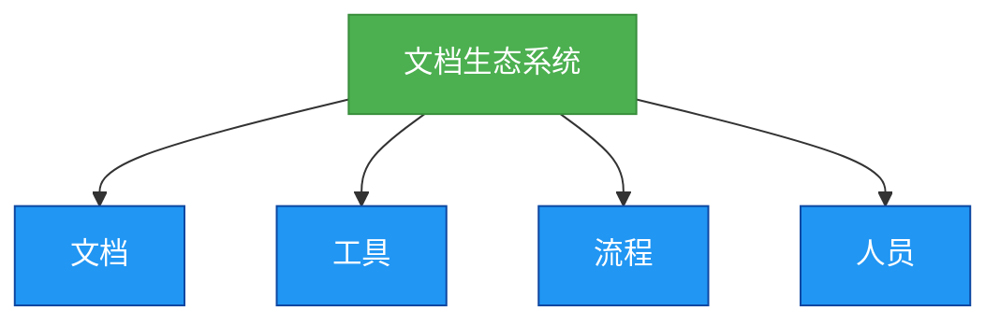

# 生态-文档生态系统

## 概述
文档生态系统是软件开发过程中不可或缺的一部分，它由文档、工具、流程和人员组成，负责文档的创建、管理、使用和维护。良好的文档生态系统可以提高开发效率，减少沟通成本，确保项目的顺利进行。



## 知识要点
### 1. 文档生态系统的重要性
- **提高开发效率**: 良好的文档生态系统可以帮助开发者快速创建、管理、使用和维护文档，减少开发成本。
- **减少沟通成本**: 开发者可以通过文档生态系统了解项目的进展和需求，减少不必要的沟通。
- **确保项目顺利进行**: 良好的文档生态系统可以确保项目的所有文档都得到妥善的创建、管理、使用和维护，确保项目的顺利进行。
- **便于后续维护**: 良好的文档生态系统可以帮助维护人员快速理解项目的设计和实现，便于后续的维护和升级。

### 2. 文档生态系统的基本要素
- **文档**: 包括需求文档、设计文档、开发文档、测试文档、部署文档、维护文档等。
- **工具**: 包括文档创建工具、文档管理工具、文档检索工具、文档转换工具等。
- **流程**: 包括文档的创建流程、审核流程、更新流程、维护流程等。
- **人员**: 包括文档的创建者、审核者、使用者、维护者等。

### 3. 文档生态系统的设计原则
- **实用性原则**: 文档生态系统应该满足开发者的实际需求，便于使用和管理。
- **系统性原则**: 文档生态系统应该是一个完整的系统，包括文档、工具、流程和人员等方面。
- **灵活性原则**: 文档生态系统应该具有一定的灵活性，能够适应项目的变化和发展。
- **安全性原则**: 文档生态系统应该确保文档的安全性和保密性，防止文档的丢失和泄露。
- **可扩展性原则**: 文档生态系统应该具有一定的可扩展性，能够适应项目的增长和发展。

### 4. 文档生态系统的实现示例
#### 文档工具类示例
```java
/**
 * 文档工具类
 * 提供文档的各种操作
 */
public class DocumentTool {
    /**
     * 转换文档格式
     * @param sourcePath 源文档路径
     * @param targetPath 目标文档路径
     * @param sourceFormat 源文档格式
     * @param targetFormat 目标文档格式
     * @throws NullPointerException 当sourcePath或targetPath为null时抛出
     * @throws IllegalArgumentException 当sourceFormat或targetFormat不支持时抛出
     * @throws IOException 当转换失败时抛出
     */
    public static void convertDocumentFormat(String sourcePath, String targetPath, String sourceFormat, String targetFormat) throws IOException {
        if (sourcePath == null || targetPath == null) {
            throw new NullPointerException("Source path and target path must be not null");
        }
        if (!isSupportedFormat(sourceFormat) || !isSupportedFormat(targetFormat)) {
            throw new IllegalArgumentException("Unsupported format");
        }

        // 转换文档格式
        // ...
    }

    /**
     * 检查格式是否支持
     * @param format 文档格式
     * @return 是否支持
     */
    private static boolean isSupportedFormat(String format) {
        // 检查格式是否支持
        // ...
        return true;
    }

    // 省略其他方法
}
```

#### 文档流程示例
```java
/**
 * 文档流程类
 * 定义文档的各种流程
 */
public class DocumentProcess {
    /**
     * 文档审核流程
     * @param document 文档对象
     * @param reviewers 审核人员列表
     * @return 审核结果
     * @throws NullPointerException 当document或reviewers为null时抛出
     * @throws IllegalArgumentException 当reviewers为空时抛出
     */
    public static boolean reviewDocument(Document document, List<User> reviewers) {
        if (document == null || reviewers == null) {
            throw new NullPointerException("Document and reviewers must be not null");
        }
        if (reviewers.isEmpty()) {
            throw new IllegalArgumentException("Reviewers must be not empty");
        }

        // 文档审核流程
        // ...

        return true;
    }

    // 省略其他方法
}
```

## 知识扩展
### 设计思想
文档生态系统的设计思想是协作和共享，它通过提供清晰、详细的文档生态机制，促进开发者之间的沟通和协作，提高开发效率和代码质量。

### 避坑指南
- 不要忽略文档生态系统的重要性，它是软件开发中不可或缺的一部分。
- 不要提供模糊、不完整的文档生态机制，这会导致开发者的误解和错误。
- 不要忘记更新和维护文档生态系统，当项目发生变化时，要及时更新文档生态机制。
- 不要使用过于复杂的语言和结构，保持文档生态系统的简洁和清晰。

### 深度思考题
**深度思考题:** 为什么说文档生态系统是软件开发中不可或缺的一部分？

**思考题回答:** 文档生态系统是协作和共享项目文档的重要机制，它可以帮助开发者快速创建、管理、使用和维护文档，减少开发成本，提高开发效率。同时，文档生态系统也可以确保项目的所有文档都得到妥善的创建、管理、使用和维护，确保项目的顺利进行。如果没有文档生态系统，开发者需要花费更多的时间和精力去创建、管理、使用和维护文档，这会导致开发效率的降低和沟通成本的增加。

**深度思考题:** 如何设计一个良好的文档生态系统？

**思考题回答:** 设计一个良好的文档生态系统需要考虑以下几点：
- 明确文档的类型和用途
- 选择合适的文档工具
- 建立清晰的文档流程
- 确定相关的人员和职责
- 确保文档生态系统的灵活性和可扩展性
- 遵循相关的规范和标准