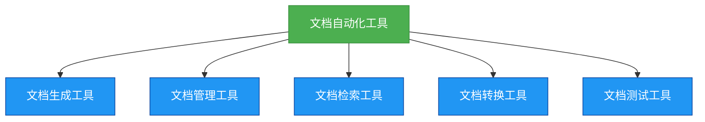

# 进阶-文档自动化工具

## 概述
文档自动化工具是软件开发过程中不可或缺的一部分，它可以帮助开发者自动创建、管理、使用和维护文档，减少手动操作，提高开发效率。良好的文档自动化工具可以提高开发效率，减少沟通成本，确保项目的顺利进行。



## 知识要点
### 1. 文档自动化工具的重要性
- **提高开发效率**: 良好的文档自动化工具可以帮助开发者自动创建、管理、使用和维护文档，减少手动操作，提高开发效率。
- **减少沟通成本**: 开发者可以通过文档自动化工具了解项目的进展和需求，减少不必要的沟通。
- **确保项目顺利进行**: 良好的文档自动化工具可以确保项目的所有文档都得到妥善的创建、管理、使用和维护，确保项目的顺利进行。
- **便于后续维护**: 良好的文档自动化工具可以帮助维护人员快速理解项目的设计和实现，便于后续的维护和升级。

### 2. 文档自动化工具的基本类型
- **文档生成工具**: 自动生成文档，如JavaDoc、Swagger等。
- **文档管理工具**: 自动管理文档，如Confluence、GitHub Wiki等。
- **文档检索工具**: 自动检索文档，如Elasticsearch、Solr等。
- **文档转换工具**: 自动转换文档格式，如Pandoc、Apache POI等。
- **文档测试工具**: 自动测试文档的正确性和完整性，如DocTest、Sphinx等。

### 3. 文档自动化工具的设计原则
- **实用性原则**: 文档自动化工具应该满足开发者的实际需求，便于使用和管理。
- **系统性原则**: 文档自动化工具应该是一个完整的系统，包括文档的生成、管理、检索、转换和测试等方面。
- **灵活性原则**: 文档自动化工具应该具有一定的灵活性，能够适应项目的变化和发展。
- **安全性原则**: 文档自动化工具应该确保文档的安全性和保密性，防止文档的丢失和泄露。
- **可扩展性原则**: 文档自动化工具应该具有一定的可扩展性，能够适应项目的增长和发展。

### 4. 文档自动化工具的实现示例
#### 文档生成工具示例
```java
/**
 * 文档生成工具类
 * 自动生成文档
 */
public class DocumentGenerator {
    /**
     * 生成API文档
     * @param sourcePath 源代码路径
     * @param targetPath 目标文档路径
     * @param format 文档格式
     * @throws NullPointerException 当sourcePath或targetPath为null时抛出
     * @throws IllegalArgumentException 当format不支持时抛出
     * @throws IOException 当生成失败时抛出
     */
    public static void generateApiDocument(String sourcePath, String targetPath, String format) throws IOException {
        if (sourcePath == null || targetPath == null) {
            throw new NullPointerException("Source path and target path must be not null");
        }
        if (!isSupportedFormat(format)) {
            throw new IllegalArgumentException("Unsupported format");
        }

        // 生成API文档
        // ...
    }

    /**
     * 检查格式是否支持
     * @param format 文档格式
     * @return 是否支持
     */
    private static boolean isSupportedFormat(String format) {
        // 检查格式是否支持
        // ...
        return true;
    }

    // 省略其他方法
}
```

#### 文档测试工具示例
```java
/**
 * 文档测试工具类
 * 自动测试文档
 */
public class DocumentTester {
    /**
     * 测试文档的正确性和完整性
     * @param documentPath 文档路径
     * @return 测试结果
     * @throws NullPointerException 当documentPath为null时抛出
     * @throws IOException 当测试失败时抛出
     */
    public static boolean testDocument(String documentPath) throws IOException {
        if (documentPath == null) {
            throw new NullPointerException("Document path must be not null");
        }

        // 测试文档的正确性和完整性
        // ...

        return true;
    }

    // 省略其他方法
}
```

## 知识扩展
### 设计思想
文档自动化工具的设计思想是自动化和智能化，它通过提供清晰、详细的文档自动化机制，减少手动操作，提高开发效率和代码质量。

### 避坑指南
- 不要忽略文档自动化工具的重要性，它是软件开发中不可或缺的一部分。
- 不要提供模糊、不完整的文档自动化机制，这会导致开发者的误解和错误。
- 不要忘记更新和维护文档自动化工具，当项目发生变化时，要及时更新文档自动化机制。
- 不要使用过于复杂的语言和结构，保持文档自动化工具的简洁和清晰。

### 深度思考题
**深度思考题:** 为什么说文档自动化工具是软件开发中不可或缺的一部分？

**思考题回答:** 文档自动化工具是自动化和智能化创建、管理、使用和维护项目文档的重要机制，它可以帮助开发者减少手动操作，提高开发效率。同时，文档自动化工具也可以确保项目的所有文档都得到妥善的创建、管理、使用和维护，确保项目的顺利进行。如果没有文档自动化工具，开发者需要花费更多的时间和精力去手动创建、管理、使用和维护文档，这会导致开发效率的降低和沟通成本的增加。

**深度思考题:** 如何设计一个良好的文档自动化工具？

**思考题回答:** 设计一个良好的文档自动化工具需要考虑以下几点：
- 明确文档自动化的需求和目标
- 选择合适的文档自动化技术和方法
- 建立清晰的文档自动化流程
- 确保文档自动化工具的灵活性和可扩展性
- 测试和验证文档自动化工具的正确性和有效性
- 遵循相关的规范和标准