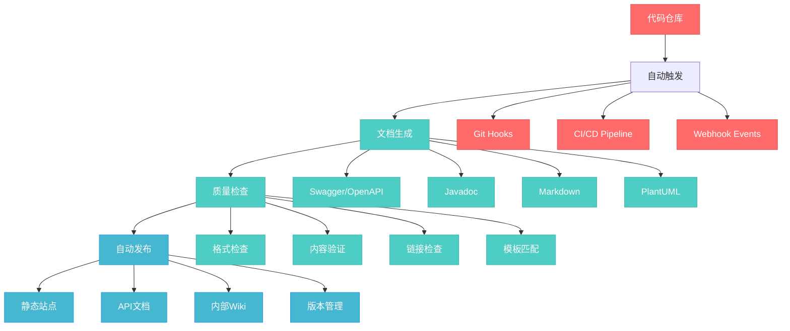

# 进阶-文档自动化工具

## 业务挑战：从手工到自动化的跨越

### 传统文档维护痛点

在一个快速迭代的产品开发团队中，技术写作者面临着以下挑战：

**手工维护的困境**：
- 代码更新后，相关文档经常忘记同步更新
- API文档与实际接口不一致，引发集成问题
- 多人协作编写文档时，格式和风格不统一
- 文档发布流程复杂，需要多个部门协调
- 质量检查依赖人工审核，效率低且容易遍漏

**业务影响分析**：
- **开发效率**: 开发者花30%的时间用于文档维护
- **质量问题**: 40%的线上问题源于文档与实际不符
- **协作成本**: 文档同步沟通成本占项目管理成本的20%
- **用户体验**: 第三方开发者反馈文档体验不优

这正是文档自动化工具要解决的核心问题。

## 现代化文档自动化体系架构


```mermaid
flowchart TB
    A["代码仓库"] --> B["自动触发"]
    B --> C["文档生成"]
    C --> D["质量检查"]
    D --> E["自动发布"]
    
    B --> B1["Git Hooks"]
    B --> B2["CI/CD Pipeline"]
    B --> B3["Webhook Events"]
    
    C --> C1["Swagger/OpenAPI"]
    C --> C2["Javadoc"]
    C --> C3["Markdown"]
    C --> C4["PlantUML"]
    
    D --> D1["格式检查"]
    D --> D2["内容验证"]
    D --> D3["链接检查"]
    D --> D4["模板匹配"]
    
    E --> E1["静态站点"]
    E --> E2["API文档"]
    E --> E3["内部Wiki"]
    E --> E4["版本管理"]
    
    classDef source fill:#FF6B6B,stroke:#E55353,color:white
    classDef process fill:#4ECDC4,stroke:#45B7AF,color:white
    classDef output fill:#45B7D1,stroke:#3498DB,color:white
    
    class A,B1,B2,B3 source
    class C,C1,C2,C3,C4,D,D1,D2,D3,D4 process
    class E,E1,E2,E3,E4 output
```

### 1. 核心自动化工具链

#### 1.1 代码驱动的文档生成

**Swagger/OpenAPI自动生成**：
```java
/**
 * 自动化API文档配置
 * 基于Spring Boot + OpenAPI 3.0
 */
@Configuration
@EnableOpenApi
public class DocumentationAutoConfig {
    
    @Bean
    public OpenAPI customOpenAPI() {
        return new OpenAPI()
                .info(apiInfo())
                .servers(serverList())
                .components(securityComponents());
    }
    
    private Info apiInfo() {
        return new Info()
                .title(获取业务系统名称())
                .version(获取系统version())
                .description(生成详细描述())
                .contact(new Contact()
                        .name("技术支持团队")
                        .email("tech-support@company.com")
                        .url("https://docs.company.com"))
                .license(new License()
                        .name("MIT")
                        .url("https://opensource.org/licenses/MIT"));
    }
    
    /**
     * 基于环境变量动态生成服务器列表
     */
    private List<Server> serverList() {
        String env = System.getenv("SPRING_PROFILES_ACTIVE");
        return switch (env) {
            case "prod" -> List.of(
                new Server().url("https://api.company.com").description("生产环境")
            );
            case "staging" -> List.of(
                new Server().url("https://api-staging.company.com").description("测试环境")
            );
            default -> List.of(
                new Server().url("http://localhost:8080").description("开发环境")
            );
        };
    }
}
```

**JavaDoc自动化生成**：
```xml
<!-- Maven插件配置 -->
<plugin>
    <groupId>org.apache.maven.plugins</groupId>
    <artifactId>maven-javadoc-plugin</artifactId>
    <version>3.4.1</version>
    <configuration>
        <source>17</source>
        <target>17</target>
        <encoding>UTF-8</encoding>
        <charset>UTF-8</charset>
        <docencoding>UTF-8</docencoding>
        <!-- 自定义文档主题 -->
        <stylesheetfile>${basedir}/src/main/javadoc/stylesheet.css</stylesheetfile>
        <!-- 添加业务信息 -->
        <doctitle>企业级开发框架API文档</doctitle>
        <windowTitle>技术文档 v${project.version}</windowTitle>
        <!-- 排除测试类 -->
        <excludePackageNames>*.test.*:*.mock.*</excludePackageNames>
        <!-- 自动生成UML图 -->
        <doclet>nl.talsmasoftware.umldoclet.UMLDoclet</doclet>
        <docletArtifact>
            <groupId>nl.talsmasoftware</groupId>
            <artifactId>umldoclet</artifactId>
            <version>2.0.16</version>
        </docletArtifact>
    </configuration>
    <executions>
        <execution>
            <id>generate-docs</id>
            <phase>package</phase>
            <goals>
                <goal>javadoc</goal>
            </goals>
        </execution>
    </executions>
</plugin>
```

#### 1.2 CI/CD文档流水线

**GitHub Actions完整流程**：
```yaml
name: 文档自动化流程

on:
  push:
    branches: [main, develop]
  pull_request:
    branches: [main]
  schedule:
    - cron: '0 2 * * 0'  # 每周日定时检查

jobs:
  docs-automation:
    runs-on: ubuntu-latest
    steps:
      - name: 检出代码
        uses: actions/checkout@v3
        with:
          fetch-depth: 0  # 获取完整历史
          
      - name: 设置Java环境
        uses: actions/setup-java@v3
        with:
          java-version: '17'
          distribution: 'temurin'
          
      - name: 设置Node.js环境
        uses: actions/setup-node@v3
        with:
          node-version: '18'
          cache: 'npm'
          
      # 步骤1: API文档自动生成
      - name: 生成OpenAPI文档
        run: |
          ./mvnw spring-boot:run -Dspring-boot.run.arguments="--spring.profiles.active=docs" &
          sleep 30
          curl -o docs/api/openapi.json http://localhost:8080/v3/api-docs
          pkill -f spring-boot:run
          
      # 步骤2: 文档质量检查
      - name: 文档质量检查
        run: |
          # Markdown格式检查
          npx markdownlint docs/**/*.md
          # 链接有效性检查
          npx markdown-link-check docs/**/*.md --config .mlc_config.json
          # 拼写检查
          npx cspell "docs/**/*.md### 2. 智能化文档质量保障
         
      # 步骤3: 文档网站生成
      - name: 构建文档站点
        run: |
          # 使用VuePress生成静态站点
          cd docs
          npm install
          npm run build
          
      # 步骤4: 部署到多个环境
      - name: 部署文档
        if: github.ref == 'refs/heads/main'
        run: |
          # 部署到GitHub Pages
          echo "docs.company.com" > docs/.vuepress/dist/CNAME
          
      - name: GitHub Pages部署
        uses: peaceiris/actions-gh-pages@v3
        if: github.ref == 'refs/heads/main'
        with:
          github_token: ${{ secrets.GITHUB_TOKEN }}
          publish_dir: docs/.vuepress/dist
          
      # 步骤5: 通知和反馈
      - name: 发送通知
        if: failure()
        uses: 8398a7/action-slack@v3
        with:
          status: ${{ job.status }}
          channel: '#tech-docs'
          webhook_url: ${{ secrets.SLACK_WEBHOOK }}
```
#### 2.1 自动化质量检查工具

**多维度质量检测**：
```javascript
// .mlc_config.json - 链接检查配置
{
  "ignorePatterns": [
    {"pattern": "^http://localhost"}
  ],
  "replacementPatterns": [
    {
      "pattern": "^/",
      "replacement": "https://docs.company.com/"
    }
  ],
  "httpHeaders": [
    {
      "urls": ["https://api.company.com"],
      "headers": {
        "Authorization": "Bearer ${{ secrets.API_TOKEN }}",
        "User-Agent": "docs-link-checker"
      }
    }
  ],
  "retryOn429": true,
  "retryCount": 3,
  "fallbackHttpStatus": [400, 401, 403, 404, 410]
}
```

```yaml
# cspell.config.yaml - 拼写检查配置
language: "en,zh-CN"
dictionaries:
  - technical-terms
  - company-names
  - project-names
words:
  - microservice
  - kubernetes
  - dockerfile
  - gitops
ignorePaths:
  - "node_modules/**"
  - "target/**"
  - "*.log"
fileTypes:
  - "*.md"
  - "*.java"
  - "*.yml"
  - "*.yaml"
```
 

### 3. 文档自动化工具的设计原则
- **实用性原则**: 文档自动化工具应该满足开发者的实际需求，便于使用和管理。
- **系统性原则**: 文档自动化工具应该是一个完整的系统，包括文档的生成、管理、检索、转换和测试等方面。
- **灵活性原则**: 文档自动化工具应该具有一定的灵活性，能够适应项目的变化和发展。
- **安全性原则**: 文档自动化工具应该确保文档的安全性和保密性，防止文档的丢失和泄露。
- **可扩展性原则**: 文档自动化工具应该具有一定的可扩展性，能够适应项目的增长和发展。

### 4. 文档自动化工具的实现示例
#### 文档生成工具示例
```java
/**
 * 文档生成工具类
 * 自动生成文档
 */
public class DocumentGenerator {
    /**
     * 生成API文档
     * @param sourcePath 源代码路径
     * @param targetPath 目标文档路径
     * @param format 文档格式
     * @throws NullPointerException 当sourcePath或targetPath为null时抛出
     * @throws IllegalArgumentException 当format不支持时抛出
     * @throws IOException 当生成失败时抛出
     */
    public static void generateApiDocument(String sourcePath, String targetPath, String format) throws IOException {
        if (sourcePath == null || targetPath == null) {
            throw new NullPointerException("Source path and target path must be not null");
        }
        if (!isSupportedFormat(format)) {
            throw new IllegalArgumentException("Unsupported format");
        }

        // 生成API文档
        // ...
    }

    /**
     * 检查格式是否支持
     * @param format 文档格式
     * @return 是否支持
     */
    private static boolean isSupportedFormat(String format) {
        // 检查格式是否支持
        // ...
        return true;
    }

    // 省略其他方法
}
```

#### 文档测试工具示例
```java
/**
 * 文档测试工具类
 * 自动测试文档
 */
public class DocumentTester {
    /**
     * 测试文档的正确性和完整性
     * @param documentPath 文档路径
     * @return 测试结果
     * @throws NullPointerException 当documentPath为null时抛出
     * @throws IOException 当测试失败时抛出
     */
    public static boolean testDocument(String documentPath) throws IOException {
        if (documentPath == null) {
            throw new NullPointerException("Document path must be not null");
        }

        // 测试文档的正确性和完整性
        // ...

        return true;
    }

    // 省略其他方法
}
```

## 知识扩展
### 设计思想
文档自动化工具的设计思想是自动化和智能化，它通过提供清晰、详细的文档自动化机制，减少手动操作，提高开发效率和代码质量。

### 避坑指南
- 不要忽略文档自动化工具的重要性，它是软件开发中不可或缺的一部分。
- 不要提供模糊、不完整的文档自动化机制，这会导致开发者的误解和错误。
- 不要忘记更新和维护文档自动化工具，当项目发生变化时，要及时更新文档自动化机制。
- 不要使用过于复杂的语言和结构，保持文档自动化工具的简洁和清晰。

### 深度思考题
**深度思考题:** 为什么说文档自动化工具是软件开发中不可或缺的一部分？

**思考题回答:** 文档自动化工具是自动化和智能化创建、管理、使用和维护项目文档的重要机制，它可以帮助开发者减少手动操作，提高开发效率。同时，文档自动化工具也可以确保项目的所有文档都得到妥善的创建、管理、使用和维护，确保项目的顺利进行。如果没有文档自动化工具，开发者需要花费更多的时间和精力去手动创建、管理、使用和维护文档，这会导致开发效率的降低和沟通成本的增加。

**深度思考题:** 如何设计一个良好的文档自动化工具？

**思考题回答:** 设计一个良好的文档自动化工具需要考虑以下几点：
- 明确文档自动化的需求和目标
- 选择合适的文档自动化技术和方法
- 建立清晰的文档自动化流程
- 确保文档自动化工具的灵活性和可扩展性
- 测试和验证文档自动化工具的正确性和有效性
- 遵循相关的规范和标准