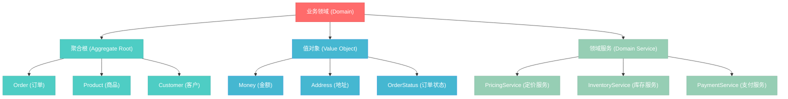

# 基础-命名规范

## 业务场景引入：电商订单系统重构实战

### 遗留系统的命名噩梦

想象你刚接手一个电商订单系统的重构项目，打开代码库后发现了这样的代码：

```java
// 糟糕的命名示例 - 让人困惑的遗留代码
public class O {
    private String n;        // 这是什么？
    private int q;           // 数量？质量？
    private double p;        // 价格？
    private String s;        // 状态？
    private Date d1, d2;     // 哪个是创建时间？哪个是更新时间？
    
    public void doSth() {    // 做什么事情？
        // 业务逻辑...
    }
    
    public String getInfo() { // 获取什么信息？
        return n + "-" + s;
    }
}
```

**现实问题分析**：
- 新团队成员需要1周时间才能理解核心业务逻辑
- Bug修复时间延长300%，因为需要反复猜测变量含义
- 代码审查效率低下，评审者无法快速理解业务意图
- 跨团队协作困难，前端开发者无法理解后端接口设计

**业务影响**：
- 产品迭代速度下降50%
- 线上问题响应时间延长
- 新功能开发成本上升
- 技术债务累积，系统维护成本飙升

这正是规范化命名要解决的核心问题。

## 业务驱动的命名体系设计

### 1. 领域建模驱动的命名策略

基于DDD（领域驱动设计）思想，建立清晰的命名层次：



### 2. 场景化命名实践指南

#### 2.1 业务实体命名 - 从业务语言到代码实现

**订单管理核心实体**：
```java
/**
 * 电商订单聚合根
 * 命名遵循业务语言，直接对应业务概念
 */
@Entity
@Table(name = "ecommerce_orders")
public class Order {
    
    // 主键：使用业务含义明确的命名
    @Id
    private OrderId orderId;                    // 而非简单的 "id"
    
    // 客户信息：体现归属关系
    private CustomerId customerId;              // 而非 "cId" 或 "customer"
    private CustomerInfo customerInfo;          // 冗余信息，便于查询优化
    
    // 订单商品：集合命名使用复数形式
    private List<OrderItem> orderItems;         // 而非 "items" 或 "list"
    
    // 金额相关：使用业务领域术语
    private Money subtotalAmount;               // 小计金额
    private Money discountAmount;               // 折扣金额  
    private Money shippingFee;                  // 运费
    private Money totalAmount;                  // 总金额
    
    // 时间戳：明确时间语义
    private Instant orderCreatedAt;             // 而非 "createTime"
    private Instant orderUpdatedAt;             // 而非 "updateTime"
    private Instant expectedDeliveryAt;         // 预计配送时间
    
    // 状态管理：使用枚举增强类型安全
    private OrderStatus orderStatus;            // 而非 "status" 字符串
    
    // 业务行为方法：动词+宾语结构
    public void confirmPayment(PaymentInfo paymentInfo) {
        // 确认支付 - 业务语言直译
    }
    
    public void cancelOrder(CancellationReason reason) {
        // 取消订单 - 明确业务意图
    }
    
    public boolean canBeModified() {
        // 布尔方法使用 can/is/has 前缀
        return orderStatus.allowsModification();
    }
    
    public Money calculateTotalAmount() {
        // 计算方法使用 calculate 前缀
        return subtotalAmount.subtract(discountAmount).add(shippingFee);
    }
}
```

#### 2.2 业务服务命名 - 体现服务职责

```java
/**
 * 订单处理服务
 * 服务命名：{业务领域} + Service
 */
@Service
@Transactional
public class OrderProcessingService {
    
    // 依赖注入：明确依赖关系
    private final OrderRepository orderRepository;
    private final InventoryCheckService inventoryCheckService;
    private final PaymentGatewayService paymentGatewayService;
    private final NotificationService notificationService;
    
    /**
     * 创建订单 - 核心业务流程
     * 方法命名：动词 + 业务对象
     */
    public OrderCreationResult createOrder(CreateOrderRequest request) {
        // 1. 业务前置条件验证
        validateOrderCreationRequest(request);
        
        // 2. 库存检查
        InventoryCheckResult inventoryResult = 
            inventoryCheckService.checkAvailability(request.getOrderItems());
        
        if (!inventoryResult.isAvailable()) {
            throw new InsufficientInventoryException(
                "库存不足，无法创建订单", inventoryResult.getUnavailableItems());
        }
        
        // 3. 价格计算
        PricingResult pricingResult = calculateOrderPricing(request);
        
        // 4. 订单实体构建
        Order order = buildOrderFromRequest(request, pricingResult);
        
        // 5. 持久化保存
        Order savedOrder = orderRepository.save(order);
        
        // 6. 发布领域事件
        publishOrderCreatedEvent(savedOrder);
        
        return OrderCreationResult.success(savedOrder);
    }
    
    /**
     * 私有方法命名：动词 + 宾语，体现内部职责
     */
    private void validateOrderCreationRequest(CreateOrderRequest request) {
        // 验证逻辑
    }
    
    private PricingResult calculateOrderPricing(CreateOrderRequest request) {
        // 定价计算逻辑
    }
    
    private Order buildOrderFromRequest(CreateOrderRequest request, PricingResult pricingResult) {
        // 订单构建逻辑
    }
    
    private void publishOrderCreatedEvent(Order order) {
        // 事件发布逻辑
    }
}
```

### 3. 现代Java命名最佳实践

#### 3.1 记录类(Record)命名规范

```java
/**
 * JDK 17+ Record类命名
 * 使用业务领域术语，体现不可变性
 */
public record CustomerAddress(
    String streetLine1,           // 街道地址第一行
    String streetLine2,           // 街道地址第二行（可选）
    String city,                  // 城市
    String province,              // 省份
    String postalCode,            // 邮政编码
    String countryCode            // 国家代码
) {
    // 构造器验证
    public CustomerAddress {
        Objects.requireNonNull(streetLine1, "街道地址不能为空");
        Objects.requireNonNull(city, "城市不能为空");
        validatePostalCode(postalCode);
    }
    
    // 业务方法：使用现在分词表示状态
    public boolean isInternational() {
        return !"CN".equals(countryCode);
    }
    
    // 格式化方法：使用 format 前缀
    public String formatForShipping() {
        return String.format("%s, %s, %s %s", 
            streetLine1, city, province, postalCode);
    }
}
```

#### 3.2 枚举类命名规范

```java
/**
 * 订单状态枚举
 * 枚举名使用名词，常量使用过去分词或形容词
 */
public enum OrderStatus {
    // 状态常量：使用业务语言，避免技术术语
    PENDING_PAYMENT("待支付", "用户已下单，等待支付"),
    PAYMENT_CONFIRMED("支付确认", "支付成功，等待商家处理"),
    PROCESSING("处理中", "商家正在准备商品"),
    SHIPPED("已发货", "商品已发出，正在配送中"),
    DELIVERED("已送达", "商品已成功送达客户"),
    CANCELLED("已取消", "订单已取消"),
    REFUNDED("已退款", "订单已退款处理");
    
    private final String displayName;      // 显示名称
    private final String description;      // 状态描述
    
    // 构造函数
    OrderStatus(String displayName, String description) {
        this.displayName = displayName;
        this.description = description;
    }
    
    // 业务逻辑方法：使用 allows/permits 表示权限
    public boolean allowsModification() {
        return this == PENDING_PAYMENT || this == PAYMENT_CONFIRMED;
    }
    
    public boolean allowsCancellation() {
        return this != DELIVERED && this != CANCELLED && this != REFUNDED;
    }
    
    // 状态转换方法：使用 canTransitionTo
    public boolean canTransitionTo(OrderStatus newStatus) {
        return switch (this) {
            case PENDING_PAYMENT -> newStatus == PAYMENT_CONFIRMED || newStatus == CANCELLED;
            case PAYMENT_CONFIRMED -> newStatus == PROCESSING || newStatus == CANCELLED;
            case PROCESSING -> newStatus == SHIPPED || newStatus == CANCELLED;
            case SHIPPED -> newStatus == DELIVERED;
            default -> false;
        };
    }
}
```
