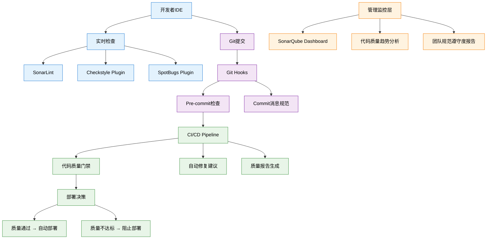

# 生态-规范落地与工具链集成

## 企业级规范落地实战：从理想到现实

### 规范落地的现实挑战

在一个拥有500+开发人员的互联网公司中，技术总监面临的规范落地困境：

**组织层面挑战**：
- 20个不同技术栈的团队，各自为政的开发习惯
- 新老员工技能差异巨大，规范理解不一致
- 项目进度压力下，开发者倾向于绕过规范检查
- 跨部门协作时，不同团队的代码风格冲突严重

**技术层面困难**：
- 遗留系统改造成本高，规范应用阻力大
- 工具链复杂度高，配置和维护负担重
- 规范检查性能影响开发体验
- 误报和漏报问题影响开发者信任度

**文化层面阻力**：
- 开发者认为规范约束创造力和开发效率
- 管理层对规范投入产出比存疑
- 缺乏规范遵守的激励机制
- 规范违规后果不明确，执行力不足

这些挑战需要通过系统性的工具链和文化建设来解决。


## 现代化规范落地工具链架构




### 1. 企业级代码质量平台建设

#### 1.1 SonarQube企业版配置与定制

```yaml
# sonar-project.properties - 企业级配置
sonar.projectKey=ecommerce-platform
sonar.projectName=电商平台代码质量分析
sonar.projectVersion=2.0.0

# 源码和测试代码路径
sonar.sources=src/main/java
sonar.tests=src/test/java
sonar.java.binaries=target/classes
sonar.java.test.binaries=target/test-classes

# 代码覆盖率配置
sonar.coverage.jacoco.xmlReportPaths=target/site/jacoco/jacoco.xml
sonar.junit.reportPaths=target/surefire-reports

# 企业定制规则
sonar.profile=company-java-profile

# 质量门禁阈值
sonar.qualitygate.wait=true

# 排除第三方库和生成代码
sonar.exclusions=**/target/**,**/generated/**,**/*DTO.java
sonar.test.exclusions=**/*Test.java,**/*IT.java

# 企业级插件配置
sonar.plugins.downloadOnlyRequired=true
```

**自定义质量规则实现**：
```java
/**
 * 企业自定义SonarQube规则
 * 检查业务特定的代码规范
 */
@Rule(key = "BusinessNamingConvention")
public class BusinessNamingConventionRule extends IssuableSubscriptionVisitor {
    
    private static final String MESSAGE = "业务实体类名应以Entity、DTO或VO结尾";
    
    @Override
    public List<Tree.Kind> nodesToVisit() {
        return Collections.singletonList(Tree.Kind.CLASS);
    }
    
    @Override
    public void visitNode(Tree tree) {
        ClassTree classTree = (ClassTree) tree;
        String className = classTree.simpleName().name();
        
        // 检查是否在业务包下
        if (isBusinessPackage(context().getFile().toString())) {
            if (!isValidBusinessClassName(className)) {
                reportIssue(classTree.simpleName(), MESSAGE);
            }
        }
    }
    
    private boolean isValidBusinessClassName(String className) {
        return className.endsWith("Entity") 
            || className.endsWith("DTO") 
            || className.endsWith("VO")
            || className.endsWith("Request")
            || className.endsWith("Response");
    }
    
    private boolean isBusinessPackage(String filePath) {
        return filePath.contains("/domain/") 
            || filePath.contains("/dto/")
            || filePath.contains("/vo/");
    }
}
```


#### 1.2 企业级CI/CD集成方案

**GitHub Actions企业工作流**：
```yaml
name: 企业代码质量检查流水线

on:
  push:
    branches: [main, develop, 'feature/*', 'hotfix/*']
  pull_request:
    branches: [main, develop]

jobs:
  code-quality-gate:
    runs-on: ubuntu-latest
    strategy:
      matrix:
        java-version: [17, 21]  # 支持多Java版本
        
    steps:
      - name: 检出代码
        uses: actions/checkout@v4
        with:
          fetch-depth: 0  # 完整历史，支持SonarQube增量分析
          
      - name: 设置Java环境
        uses: actions/setup-java@v4
        with:
          java-version: ${{ matrix.java-version }}
          distribution: 'temurin'
          
      - name: 缓存Maven依赖
        uses: actions/cache@v3
        with:
          path: ~/.m2/repository
          key: ${{ runner.os }}-maven-${{ hashFiles('**/pom.xml') }}
          
      # 阶段1: 编译和基础检查
      - name: Maven编译
        run: mvn clean compile test-compile
        
      - name: Checkstyle代码风格检查
        run: mvn checkstyle:check
        continue-on-error: false
        
      - name: PMD代码质量检查
        run: mvn pmd:check
        continue-on-error: false
        
      - name: SpotBugs缺陷检测
        run: mvn spotbugs:check
        continue-on-error: false
        
      # 阶段2: 单元测试和覆盖率
      - name: 单元测试执行
        run: mvn test
        
      - name: 生成测试覆盖率报告
        run: mvn jacoco:report
        
      # 阶段3: SonarQube质量分析
      - name: SonarQube质量分析
        env:
          GITHUB_TOKEN: ${{ secrets.GITHUB_TOKEN }}
          SONAR_TOKEN: ${{ secrets.SONAR_TOKEN }}
        run: |
          mvn sonar:sonar \
            -Dsonar.projectKey=${{ github.repository }} \
            -Dsonar.host.url=${{ secrets.SONAR_HOST_URL }} \
            -Dsonar.login=${{ secrets.SONAR_TOKEN }} \
            -Dsonar.pullrequest.key=${{ github.event.pull_request.number }} \
            -Dsonar.pullrequest.branch=${{ github.head_ref }} \
            -Dsonar.pullrequest.base=${{ github.base_ref }}
            
      # 阶段4: 质量门禁检查
      - name: 等待SonarQube质量门禁结果
        uses: sonarqube-quality-gate-action@master
        timeout-minutes: 5
        env:
          SONAR_TOKEN: ${{ secrets.SONAR_TOKEN }}
          
      # 阶段5: 安全漏洞扫描
      - name: OWASP依赖漏洞检查
        run: mvn org.owasp:dependency-check-maven:check
        
      # 阶段6: 性能基线测试
      - name: JMH性能基准测试
        if: github.event_name == 'pull_request'
        run: mvn clean test -Pbenchmark
        
      # 阶段7: 生成质量报告
      - name: 生成质量报告
        if: always()
        run: |
          mkdir -p quality-reports
          cp target/checkstyle-result.xml quality-reports/
          cp target/pmd.xml quality-reports/
          cp target/spotbugsXml.xml quality-reports/
          cp target/site/jacoco/jacoco.xml quality-reports/
          
      - name: 上传质量报告
        uses: actions/upload-artifact@v3
        if: always()
        with:
          name: quality-reports-${{ matrix.java-version }}
          path: quality-reports/
          retention-days: 30
          
      # 阶段8: 通知和反馈
      - name: 发送质量报告到Slack
        if: failure()
        uses: 8398a7/action-slack@v3
        with:
          status: ${{ job.status }}
          channel: '#code-quality'
          webhook_url: ${{ secrets.SLACK_WEBHOOK }}
```

### 2. 智能化规范落地与文化建设

#### 2.1 渐进式规范推广策略

```java
/**
 * 规范推广管理器
 * 实现渐进式的规范落地和团队适配
 */
@Component
public class ComplianceRolloutManager {
    
    private final TeamMetricsService metricsService;
    private final NotificationService notificationService;
    
    /**
     * 团队规范成熟度评估
     */
    public ComplianceMaturityLevel assessTeamMaturity(String teamId) {
        TeamMetrics metrics = metricsService.getTeamMetrics(teamId);
        
        return ComplianceMaturityLevel.builder()
                .codeQualityScore(calculateCodeQualityScore(metrics))
                .testCoverageScore(calculateCoverageScore(metrics))
                .documentationScore(calculateDocScore(metrics))
                .toolAdoptionScore(calculateToolAdoptionScore(metrics))
                .build();
    }
    
    /**
     * 个性化规范推荐
     */
    public List<ComplianceRecommendation> generateRecommendations(
            String teamId, ComplianceMaturityLevel maturity) {
        
        List<ComplianceRecommendation> recommendations = new ArrayList<>();
        
        // 基于成熟度推荐渐进式改进措施
        if (maturity.getCodeQualityScore() < 70) {
            recommendations.add(ComplianceRecommendation.builder()
                    .priority(Priority.HIGH)
                    .category("代码质量")
                    .title("启用基础静态代码分析")
                    .description("从Checkstyle基础规则开始，逐步提升代码风格一致性")
                    .estimatedEffort("2-3周")
                    .expectedImpact("代码可读性提升30%")
                    .actionItems(Arrays.asList(
                            "配置Maven Checkstyle插件",
                            "团队培训基础编码规范",
                            "设置IDE自动格式化"
                    ))
                    .build());
        }
        
        if (maturity.getTestCoverageScore() < 60) {
            recommendations.add(ComplianceRecommendation.builder()
                    .priority(Priority.MEDIUM)
                    .category("测试质量")
                    .title("建立单元测试基线")
                    .description("为核心业务逻辑建立测试覆盖率基线")
                    .estimatedEffort("4-6周")
                    .expectedImpact("减少30%的线上缺陷")
                    .build());
        }
        
        return recommendations;
    }
    
    /**
     * 激励机制设计
     */
    @Async
    public void processComplianceAchievements(String teamId, String developerId) {
        ComplianceAchievement achievement = 
                evaluateIndividualCompliance(developerId);
        
        if (achievement.hasNewBadge()) {
            // 发送成就通知
            notificationService.sendAchievementNotification(
                    developerId, achievement);
            
            // 团队排行榜更新
            updateTeamLeaderboard(teamId, developerId, achievement);
            
            // 技能树更新
            updateDeveloperSkillTree(developerId, achievement);
        }
    }
}
```

#### 2.2 规范遵守度可视化Dashboard

```typescript
// React组件 - 团队规范遵守度仪表板
interface ComplianceDashboardProps {
  teamId: string;
}

const ComplianceDashboard: React.FC<ComplianceDashboardProps> = ({ teamId }) => {
  const [metrics, setMetrics] = useState<TeamComplianceMetrics | null>(null);
  const [trends, setTrends] = useState<ComplianceTrend[]>([]);
  
  return (
    <div className="compliance-dashboard">
      {/* 整体健康度得分 */}
      <ComplianceHealthScore 
        score={metrics?.overallScore}
        trend={metrics?.scoreTrend}
      />
      
      {/* 各维度雷达图 */}
      <RadarChart
        data={[
          { metric: '代码质量', value: metrics?.codeQuality },
          { metric: '测试覆盖率', value: metrics?.testCoverage },
          { metric: '文档完整性', value: metrics?.documentation },
          { metric: '安全规范', value: metrics?.security },
          { metric: '性能标准', value: metrics?.performance },
        ]}
      />
      
      {/* 改进建议 */}
      <ImprovementRecommendations 
        recommendations={metrics?.recommendations}
      />
      
      {/* 团队成员贡献排行 */}
      <DeveloperLeaderboard 
        developers={metrics?.topContributors}
      />
    </div>
  );
};
```

### 3. 规范落地成功案例分享

#### 某电商平台规范落地实践

**实施前状况**：
- 15个开发团队，代码风格各异
- 线上故障频发，平均修复时间4小时
- 新人上手周期2-3周
- 代码审查耗时长，效率低

**分阶段实施策略**：

**第一阶段（1-2个月）**：基础设施建设
- 部署SonarQube企业版
- 建立CI/CD质量门禁
- 制定团队适配的规范标准

**第二阶段（3-4个月）**：工具链完善
- IDE插件统一配置和推广
- 自动化修复工具开发
- 规范培训和认证体系建立

**第三阶段（5-6个月）**：文化建设
- 代码质量激励机制
- 跨团队最佳实践分享
- 持续改进反馈循环

**实施成果**：
- **质量提升**：线上故障率下降65%，故障修复时间缩短到1小时
- **效率提升**：新人上手时间缩短至3-5天，代码审查效率提升80%
- **成本节约**：技术债务减少，维护成本降低40%
- **团队满意度**：开发者满意度从3.2提升至4.6（5分制）

**关键成功因素**：
1. **高层支持**：CTO直接推动，各团队负责人全力配合
2. **渐进推广**：从核心团队开始试点，逐步推广至全公司
3. **工具先行**：优先解决工具易用性，降低使用门槛
4. **激励机制**：建立正向激励，而非纯粹的约束和惩罚
5. **持续优化**：根据反馈持续调整规范和工具配置

## 总结：规范落地的核心要素

规范落地成功的关键不在于工具本身，而在于：

**技术维度**：
- 工具链的易用性和集成度
- 自动化程度和智能化水平
- 性能影响和开发体验优化

**管理维度**：
- 清晰的推广路径和时间规划
- 合理的激励机制和考核标准
- 跨团队协调和资源投入保障

**文化维度**：
- 开发者对质量文化的认同
- 团队学习和改进的氛围
- 长期坚持和持续优化的决心

只有技术、管理、文化三个维度协同发力，才能实现规范的真正落地和可持续发展。

