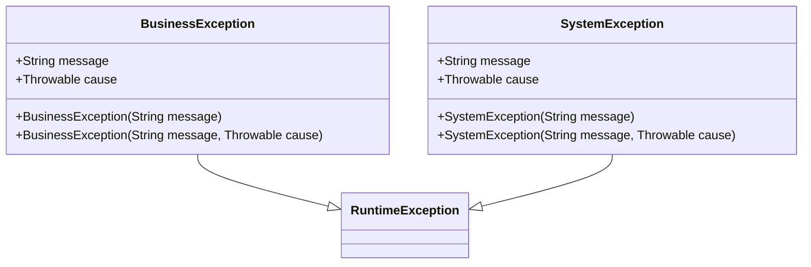

# 进阶-代码规范

## 1. 代码风格规范
### 1.1 缩进与空格
- 使用4个空格进行缩进，不使用Tab
- 运算符两侧各保留一个空格
- 逗号后保留一个空格
- 示例：
```java
if (user != null && user.isActive()) {
    processOrder(user, order);
}
```

### 1.2 大括号位置
- 采用K&R风格，左大括号与语句同行
- 右大括号单独成行，与对应语句对齐
- 示例：
```java
public void processData() {
    // 方法体
    if (condition) {
        // 条件体
    } else {
        // else体
    }
}
```

## 2. 注释规范
### 2.1 Javadoc注释
- 类、公共方法、接口必须包含Javadoc
- 包含作者、版本、参数说明、返回值和异常信息
- 示例：
```java
/**
 * 用户服务类，处理用户相关业务逻辑
 * 
 * @author 架构师团队
 * @version 1.0.0
 * @since JDK 17
 */
public class UserService {
    /**
     * 根据ID获取用户信息
     * 
     * @param userId 用户ID
     * @return 用户信息对象
     * @throws UserNotFoundException 当用户不存在时抛出
     */
    public User getUserById(Long userId) throws UserNotFoundException {
        // 方法实现
    }
}
```

## 3. 异常处理规范
### 3.1 异常使用原则
- 避免捕获通用异常（Exception），应捕获具体异常
- 不忽略异常，至少记录日志
- 自定义业务异常继承RuntimeException
- 示例：
```java
try {
    // 可能抛出IO异常的代码
    fileReader.read(buffer);
} catch (FileNotFoundException e) {
    log.error("文件未找到: {}", filePath, e);
    throw new BusinessException("配置文件缺失", e);
} catch (IOException e) {
    log.error("文件读取失败: {}", filePath, e);
    throw new SystemException("系统IO错误", e);
}
```

**可视化规则**


## 4. 并发编程规范
### 4.1 线程安全
- 共享可变状态必须进行同步
- 优先使用并发容器（ConcurrentHashMap）而非同步容器（Hashtable）
- 使用原子类（AtomicInteger）替代手动同步
- 示例：
```java
// 推荐
private final ConcurrentMap<String, Object> cache = new ConcurrentHashMap<>();
private final AtomicInteger counter = new AtomicInteger(0);

// 不推荐
private final Map<String, Object> unsafeCache = new HashMap<>();
```

## 5. 避坑指南
- 避免在循环中创建对象
- 慎用static关键字，防止内存泄漏
- 集合初始化时指定初始容量
- 关闭资源使用try-with-resources

## 6. 深度思考题
在高并发场景下，如何平衡代码规范性和性能优化需求？请举例说明在遵循编码规范的同时进行性能调优的实践方法。
在高并发场景下，可通过以下方式平衡规范性和性能：
1. 使用不可变对象减少同步需求
2. 合理使用线程池而非手动创建线程
3. 采用延迟初始化减少启动开销
4. 使用本地缓存减少远程调用
例如：通过ConcurrentHashMap实现高效缓存，既保证线程安全又提供良好性能。

## 7. 代码规范检查工具配置
以下是Checkstyle配置示例，用于强制实施上述规范：

```xml
<module name="Indentation">
    <property name="basicOffset" value="4"/>
    <property name="braceAdjustment" value="0"/>
</module>
<module name="JavadocMethod">
    <property name="scope" value="public"/>
</module>
```

## 8. 单元测试规范
### 8.1 单元测试基本原则
- **AIR原则**：自动化（Automatic）、独立性（Independent）、可重复执行（Repeatable）
- 测试用例应独立运行，不依赖外部资源和其他测试用例
- 测试结果应稳定可靠，不受环境影响

### 8.2 测试范围与要求
- 所有业务逻辑代码必须编写单元测试
- 核心模块代码覆盖率不低于80%
- 测试粒度应为方法级别
- 测试目录结构应与源码保持一致：`src/test/java`

### 8.3 测试方法命名规范
- 使用`test[MethodName][Scenario][ExpectedResult]`格式
- 示例：

```java
public void testCalculateTotal_withDiscount_returnsDiscountedPrice() {
    // 测试实现
}
```

### 8.4 BCDE测试原则
- **边界值测试**（Boundary Value）：测试输入输出的边界条件
- **正确输入测试**（Correct Input）：验证正常业务场景
- **设计规范测试**（Design Specification）：验证代码符合设计规范
- **错误输入测试**（Error Input）：验证异常处理机制


```java
@Test
void testCreateOrder_withInvalidProductId_throwsBusinessException() {
    // 准备测试数据
    OrderRequest request = new OrderRequest();
    request.setProductId(null);
    request.setQuantity(1);
    
    // 执行测试并验证结果
    assertThrows(BusinessException.class, () -> orderService.createOrder(request));
}
```

### 8.5 数据库测试规范
- 使用内存数据库（如H2）进行单元测试
- 测试数据应自动创建和清理
- 事务测试应使用`@Transactional`注解确保自动回滚

## 9. 错误码规范
### 9.1 错误码格式
- 采用5位字符串格式：`A-BBBB`
  - A：1位字母，表示错误来源（如B-业务错误，S-系统错误）
  - BBBB：4位数字，表示具体错误编号
- 示例：`B0001`（业务错误-参数验证失败），`S0002`（系统错误-数据库连接失败）

### 9.2 错误码设计原则
- **快速溯源**：通过错误码可直接定位错误类型和模块
- **扩展性**：预留一定区间给新增业务模块
- **避免语义过载**：一个错误码对应一种具体错误场景
- **禁止包含版本号**：错误码不应体现版本信息


```java
public enum ErrorCode {
    // 业务错误（B开头）
    PARAM_VALIDATION_FAILED("B0001", "参数验证失败"),
    RESOURCE_NOT_FOUND("B0002", "资源不存在"),
    // 系统错误（S开头）
    DB_CONNECTION_ERROR("S0001", "数据库连接错误"),
    CACHE_OPERATION_FAILED("S0002", "缓存操作失败");
    
    private final String code;
    private final String message;
    
    ErrorCode(String code, String message) {
        this.code = code;
        this.message = message;
    }
    
    // getter方法
    public String getCode() { return code; }
    public String getMessage() { return message; }
}
```

## 10. NPE防护规范
### 10.1 常见NPE场景
- 返回null的方法调用链
- 自动拆箱null的包装类型
- 集合中存放null元素
- 远程调用返回null
- Optional.get()在值为空时调用
- JSON反序列化可能产生null

### 10.2 NPE防护措施
- 使用`Optional`类包装可能为null的返回值
- 集合初始化时避免null，使用空集合替代
- 方法参数使用`@NonNull`注解并进行前置校验
- 使用`Objects.requireNonNull()`进行空值检查
- 优先使用Java 8+的Stream API和Optional API


```java
// 推荐：使用Optional避免NPE
public Optional<User> findUserById(Long id) {
    // 数据库查询逻辑
    User user = userRepository.findById(id);
    return Optional.ofNullable(user);
}

// 调用方处理
User user = findUserById(1L)
    .orElseThrow(() -> new UserNotFoundException("用户不存在"));

// 集合初始化
List<String> list = new ArrayList<>(); // 而非 null

// 参数校验
public void processOrder(Order order) {
    Objects.requireNonNull(order, "订单对象不能为空");
    // 业务逻辑
}
```

### 8.5 数据库测试规范
- 使用内存数据库（如H2）进行单元测试
- 测试数据应自动创建和清理
- 事务测试应使用`@Transactional`注解确保自动回滚

## 11. 集合处理规范
### 11.1 集合初始化
- 明确指定集合初始容量，避免频繁扩容
- 使用接口而非实现类声明集合变量
- 禁止使用`new ArrayList()`无参构造器初始化已知大小的集合


```java
// 推荐
List<User> users = new ArrayList<>(10); // 已知需要存储10个元素
Map<String, Object> config = new HashMap<>(4); // 已知需要存储4个键值对

// 不推荐
List<User> badUsers = new ArrayList<>(); // 已知大小却不指定容量
ArrayList<User> notInterface = new ArrayList<>(); // 使用实现类声明
```

### 11.2 集合判空
- 使用`Collection.isEmpty()`判断集合是否为空，而非`size() == 0`
- 集合为null时必须显式处理，避免NPE


```java
// 推荐
if (CollectionUtils.isEmpty(users)) { // 使用工具类处理可能为null的情况
    return;
}

// 不推荐
if (users.size() == 0) { // 无法处理users为null的情况
    return;
}
```

### 11.3 集合遍历
- 避免在遍历过程中修改集合结构（添加/删除元素）
- 优先使用增强for循环或Stream API遍历集合
- 遍历Map时根据场景选择合适的方式（keySet/entrySet/values）


```java
// 推荐
for (User user : users) { // 增强for循环
    process(user);
}

users.forEach(user -> process(user)); // forEach方法

Map<String, User> userMap = new HashMap<>();
for (Map.Entry<String, User> entry : userMap.entrySet()) { // 遍历键值对
    String key = entry.getKey();
    User value = entry.getValue();
    // 处理逻辑
}
```


## 12. 控制语句规范
### 12.1 if-else语句
- 避免超过3层的if-else嵌套，考虑使用卫语句、策略模式等优化
- 优先处理异常情况或特殊情况，尽早返回
- 条件表达式中避免否定判断


```java
// 推荐：卫语句优化多层嵌套
public void processOrder(Order order) {
    if (order == null) {
        log.error("订单对象为空");
        return;
    }
    
    if (!order.isValid()) {
        log.error("订单无效: {}", order.getId());
        return;
    }
    
    // 正常业务逻辑
    doProcess(order);
}

// 不推荐：深层嵌套
public void badProcessOrder(Order order) {
    if (order != null) {
        if (order.isValid()) {
            // 业务逻辑
        } else {
            log.error("订单无效");
        }
    } else {
        log.error("订单为空");
    }
}
```

### 12.2 switch-case语句
- 每个case必须以break/return/throw结束，或使用注释说明穿透意图
- 必须包含default分支，处理意外情况
- JDK 17+推荐使用switch表达式


```java
// 推荐：switch表达式（JDK 17+）
String result = switch (status) {
    case PENDING -> "待处理";
    case PROCESSING -> "处理中";
    case COMPLETED -> "已完成";
    case CANCELLED -> "已取消";
    default -> {
        log.warn("未知状态: {}", status);
        yield "未知状态";
    }
};

// 传统switch语句
switch (type) {
    case TYPE_A:
        handleTypeA();
        break;
    case TYPE_B:
        handleTypeB();
        break;
    default:
        handleDefault();
        break;
}
```


### 12.2 数据库测试规范
- 使用内存数据库（如H2）进行单元测试
- 测试数据应自动创建和清理
- 事务测试应使用`@Transactional`注解确保自动回滚

## 13. 安全规约
### 13.1 输入验证
- 所有外部输入必须进行验证，包括参数、请求头、Cookie等
- 使用正则表达式或验证框架（如Hibernate Validator）进行输入校验
- 验证失败时应返回明确错误信息，不暴露系统实现细节


```java
@PostMapping("/users")
public ResponseEntity<UserDTO> createUser(@RequestBody @Valid UserRequest request) {
    // @Valid触发验证，验证规则在UserRequest中定义
    return ResponseEntity.status(HttpStatus.CREATED)
        .body(userService.createUser(request));
}

// UserRequest类
public class UserRequest {
    @NotBlank(message = "用户名不能为空")
    @Pattern(regexp = "^[a-zA-Z0-9_]{4,20}$", message = "用户名只能包含字母、数字和下划线，长度4-20位")
    private String username;
    
    @NotBlank(message = "密码不能为空")
    @Length(min = 8, max = 32, message = "密码长度必须为8-32位")
    private String password;
    
    // getter和setter
}
```

### 13.2 SQL注入防护
- 禁止直接拼接SQL字符串，必须使用参数化查询
- 优先使用ORM框架（MyBatis、JPA）的参数绑定功能
- 避免使用动态SQL，如必须使用应严格过滤输入内容


```java
// 推荐
@Select("SELECT * FROM user WHERE username = #{username}")
User findByUsername(String username);

// 不推荐
String sql = "SELECT * FROM user WHERE username = '" + username + "'";
statement.executeQuery(sql);
```

### 13.3 XSS防护
- 输出HTML内容时必须进行转义
- 使用安全的模板引擎（如Thymeleaf自动转义）
- 对用户输入的HTML内容使用白名单过滤（如OWASP AntiSamy）

### 13.4 敏感信息保护
- 密码必须使用加密存储（如BCrypt、Argon2）
- 传输敏感信息必须使用HTTPS
- 日志中禁止记录明文密码、身份证号等敏感信息


```java
// 密码加密存储
@Service
public class UserService {
    private final PasswordEncoder passwordEncoder = new BCryptPasswordEncoder();
    
    public User createUser(UserRequest request) {
        User user = new User();
        user.setUsername(request.getUsername());
        // 加密密码
        user.setPassword(passwordEncoder.encode(request.getPassword()));
        return userRepository.save(user);
    }
}
```

## 14. 日志规范
### 14.1 日志级别使用
- **ERROR**：影响系统运行的错误，需要立即处理
- **WARN**：不影响主流程但需关注的异常情况
- **INFO**：重要业务操作、系统启动/关闭等关键事件
- **DEBUG**：开发调试信息，生产环境默认关闭
- **TRACE**：详细跟踪信息，仅在特定问题排查时开启

### 14.2 日志内容规范
- 日志应包含时间、日志级别、线程名、类名、具体信息
- 异常日志必须包含完整堆栈信息
- 避免重复日志，确保日志唯一性
- 日志信息应清晰、完整、无二义性


```java
// 推荐
log.info("用户[{}]成功登录系统，IP地址：{}", username, ipAddress);
log.error("订单[{}]处理失败，原因：{}", orderId, e.getMessage(), e);

// 不推荐
log.info("登录成功"); // 信息不完整
log.error(e); // 缺少业务上下文
log.debug("用户" + username + "登录失败"); // 字符串拼接，性能差
```

### 14.3 日志工具选择与配置
- 统一使用SLF4J作为日志门面，底层实现可选用Logback/Log4j2
- 生产环境日志应滚动输出，避免单个文件过大
- 设置合理的日志保留策略，兼顾问题排查和磁盘空间


```xml
<!-- Logback配置示例 -->
<appender name="ROLLING_FILE" class="ch.qos.logback.core.rolling.RollingFileAppender">
    <file>logs/application.log</file>
    <rollingPolicy class="ch.qos.logback.core.rolling.TimeBasedRollingPolicy">
        <fileNamePattern>logs/application.%d{yyyy-MM-dd}.log</fileNamePattern>
        <maxHistory>30</maxHistory> <!-- 保留30天日志 -->
    </rollingPolicy>
    <encoder>
        <pattern>%d{yyyy-MM-dd HH:mm:ss.SSS} [%thread] %-5level %logger{36} - %msg%n</pattern>
    </encoder>
</appender>
```
