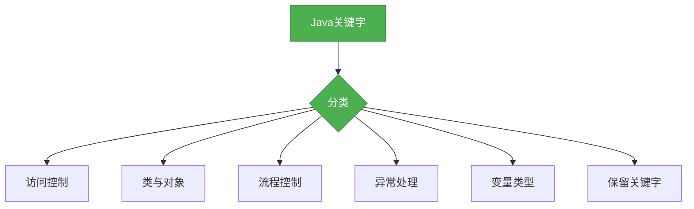

# Java基础-关键字

## 概述

关键字是Java语言中具有特殊含义的保留单词，它们不能被用作标识符（变量名、类名、方法名等）。掌握Java关键字是学习Java语法的基础，本章节将系统梳理Java中的关键字分类及核心用法。



## 知识要点

### 1. 访问控制关键字

Java提供了四个访问控制关键字，用于控制类、变量、方法的访问权限：

```java
public class AccessControlDemo {
    // 公共访问级别，任何地方都可以访问
    public String publicVar = "public";
    
    // 受保护访问级别，同一包或子类可以访问
    protected String protectedVar = "protected";
    
    // 默认访问级别，同一包可以访问
    String defaultVar = "default";
    
    // 私有访问级别，只有本类可以访问
    private String privateVar = "private";
}
```

### 2. 类与对象相关关键字

这些关键字用于定义类、对象以及它们之间的关系：

```java
// class: 定义类
public class Person {
    // static: 静态成员，属于类而不是实例
    static String className = "Person";
    
    // final: 最终的，不可修改
    final String name;
    
    // this: 引用当前对象
    public Person(String name) {
        this.name = name;
    }
    
    // super: 引用父类
    public void printInfo() {
        System.out.println("Name: " + name);
    }
}

// interface: 定义接口
interface Animal {
    void eat();
}

// implements: 实现接口
class Dog implements Animal {
    @Override
    public void eat() {
        System.out.println("Dog eats骨头");
    }
}

// extends: 继承类
class Puppy extends Dog {
    @Override
    public void eat() {
        super.eat(); // 调用父类方法
        System.out.println("Puppy eats小狗粮");
    }
}
```

### 3. 流程控制关键字

这些关键字用于控制程序的执行流程：

```java
public class FlowControlDemo {
    public void controlFlow() {
        // if-else: 条件判断
        int a = 10;
        if (a > 5) {
            System.out.println("a > 5");
        } else if (a == 5) {
            System.out.println("a = 5");
        } else {
            System.out.println("a < 5");
        }
        
        // for: 循环
        for (int i = 0; i < 5; i++) {
            System.out.println("i = " + i);
        }
        
        // while: 循环
        int j = 0;
        while (j < 5) {
            System.out.println("j = " + j);
            j++;
        }
        
        // do-while: 循环
        int k = 0;
        do {
            System.out.println("k = " + k);
            k++;
        } while (k < 5);
        
        // switch-case: 多条件分支
        int month = 3;
        switch (month) {
            case 1:
                System.out.println("一月");
                break;
            case 2:
                System.out.println("二月");
                break;
            case 3:
                System.out.println("三月");
                break;
            default:
                System.out.println("其他月份");
        }
        
        // break: 跳出循环
        for (int m = 0; m < 10; m++) {
            if (m == 5) {
                break;
            }
            System.out.println("m = " + m);
        }
        
        // continue: 跳过当前循环
        for (int n = 0; n < 10; n++) {
            if (n == 5) {
                continue;
            }
            System.out.println("n = " + n);
        }
    }
}
```

### 4. 异常处理关键字

这些关键字用于处理程序运行过程中的异常：

```java
public class ExceptionHandlingDemo {
    public void handleException() {
        try {
            // 可能抛出异常的代码
            int result = 10 / 0;
        } catch (ArithmeticException e) {
            // 捕获特定异常
            System.out.println("算术异常: " + e.getMessage());
        } catch (Exception e) {
            // 捕获所有异常
            System.out.println("发生异常: " + e.getMessage());
        } finally {
            // 无论是否发生异常都会执行
            System.out.println("程序继续执行");
        }
    }
    
    // throws: 声明方法可能抛出的异常
    public void declareException() throws Exception {
        throw new Exception("抛出异常");
    }
}
```

### 5. 变量类型关键字

这些关键字用于定义变量的类型：

```java
public class VariableTypeDemo {
    // 基本类型
    byte b = 10;
    short s = 100;
    int i = 1000;
    long l = 10000L;
    float f = 3.14f;
    double d = 3.14159;
    char c = 'A';
    boolean bool = true;
    
    // 引用类型
    String str = "Hello";
    int[] arr = {1, 2, 3};
}
```

### 6. 保留关键字

这些关键字是Java保留的，目前没有特定用途，但可能在未来版本中使用：
- goto
- const

## 知识扩展

### 设计思想

Java关键字的设计体现了以下思想：
1. **简洁性**：关键字数量控制在合理范围内，避免过多的保留单词
2. **一致性**：关键字的含义和用法保持一致，便于学习和记忆
3. **扩展性**：保留一些关键字，为未来版本的扩展预留空间
4. **可读性**：通过关键字使代码结构清晰，提高代码的可读性

### 避坑指南

1. **关键字误用**：不要尝试使用关键字作为标识符，这会导致编译错误
2. **大小写敏感**：Java关键字是大小写敏感的，例如`class`是关键字，但`Class`不是
3. **特殊含义**：某些关键字具有特殊含义，例如`null`、`true`、`false`不是关键字，但它们是保留字，不能用作标识符
4. **版本差异**：注意不同Java版本中关键字的变化，例如`var`在Java 10中成为保留类型名称

### 深度思考题

**思考题1:**
为什么Java要保留一些关键字（如goto、const）而不直接使用它们？

**回答:**
Java保留这些关键字是为了保持语言的向后兼容性和未来的扩展性。虽然这些关键字在当前版本中没有使用，但它们可能在未来的版本中被赋予新的含义。此外，这也可以避免开发者使用这些可能在未来版本中成为关键字的单词作为标识符，从而避免代码迁移的困难。

**思考题2:**
Java中的访问控制关键字有什么设计优势？

**回答:**
Java的访问控制关键字提供了灵活而精细的访问控制机制，这有助于实现封装性原则。通过控制类、变量和方法的访问权限，开发者可以隐藏内部实现细节，只暴露必要的接口，从而提高代码的安全性、可维护性和可重用性。

**思考题3:**
为什么Java要区分`static`和`final`这两个关键字？

**回答:**
`static`和`final`是两个不同的概念。`static`表示成员属于类而不是实例，它可以被修改（除非同时被`final`修饰）。`final`表示成员是最终的，不可修改，它可以是实例成员也可以是类成员。这种区分使得Java的类型系统更加灵活，可以更好地满足不同的编程需求。