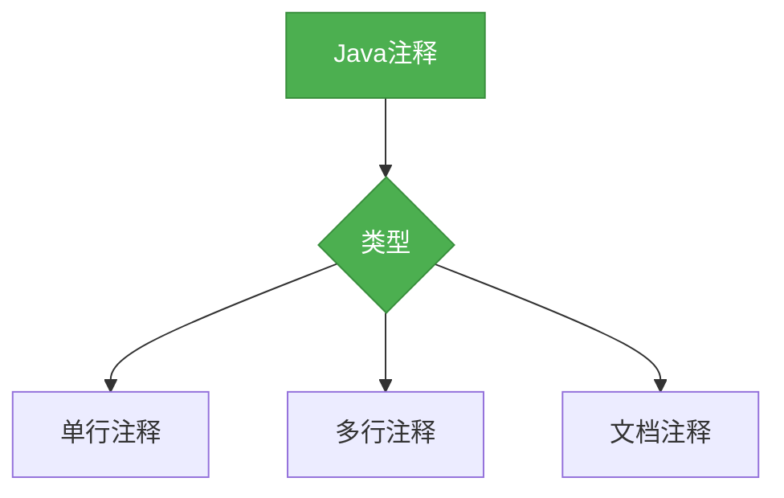

# Java基础-注释

## 概述

注释是Java代码中不可或缺的一部分，它用于解释代码的功能、目的和实现细节，提高代码的可读性和可维护性。本章节将系统梳理Java中的注释类型及使用规范。



## 知识要点

### 1. 单行注释

单行注释以`//`开头，用于解释单行代码的功能：

```java
public class SingleLineCommentDemo {
    public static void main(String[] args) {
        // 定义一个整数变量
        int num = 10;
        
        // 输出变量的值
        System.out.println("num = " + num); // 这是一个行尾注释
    }
}
```

### 2. 多行注释

多行注释以`/*`开头，以`*/`结尾，用于解释多行代码的功能：

```java
public class MultiLineCommentDemo {
    /*
     * 这是一个多行注释
     * 用于解释下面的方法
     * 该方法用于计算两个数的和
     */
    public int add(int a, int b) {
        return a + b; // 返回两个数的和
    }
}
```

### 3. 文档注释

文档注释以`/**`开头，以`*/`结尾，用于生成API文档：

```java
/**
 * 这是一个文档注释
 * 用于描述Person类
 */
public class Person {
    /**
     * 人员姓名
     */
    private String name;
    
    /**
     * 人员年龄
     */
    private int age;
    
    /**
     * 构造方法
     * @param name 姓名
     * @param age 年龄
     */
    public Person(String name, int age) {
        this.name = name;
        this.age = age;
    }
    
    /**
     * 获取姓名
     * @return 姓名
     */
    public String getName() {
        return name;
    }
    
    /**
     * 设置姓名
     * @param name 姓名
     */
    public void setName(String name) {
        this.name = name;
    }
    
    /**
     * 获取年龄
     * @return 年龄
     */
    public int getAge() {
        return age;
    }
    
    /**
     * 设置年龄
     * @param age 年龄
     */
    public void setAge(int age) {
        this.age = age;
    }
}
```

## 知识扩展

### 设计思想

Java注释的设计体现了以下思想：
1. **可读性优先**：通过注释提高代码的可读性，便于其他开发者理解和维护
2. **文档化**：通过文档注释生成API文档，方便用户使用
3. **灵活性**：提供多种注释类型，满足不同的注释需求
4. **无干扰性**：注释不会影响代码的执行，只是提供解释信息

### 避坑指南

1. **过度注释**：不要为每个代码行都添加注释，只注释关键部分
2. **过时注释**：及时更新或删除过时的注释，避免误导其他开发者
3. **错误注释**：确保注释与代码一致，不要提供错误的信息
4. **冗余注释**：避免添加与代码重复的注释，注释应该提供额外的信息
5. **不规范注释**：遵循团队的注释规范，保持一致性

### 深度思考题

**思考题1:**
为什么说注释是代码的"第二语言"？

**回答:**
注释是代码的"第二语言"，因为它可以帮助其他开发者理解代码的功能、目的和实现细节。一份好的代码不仅要能正确运行，还要易于理解和维护。通过注释，开发者可以表达代码背后的思想和设计理念，使得代码更具有可读性和可维护性。

**思考题2:**
如何平衡代码中的注释数量？

**回答:**
注释的数量应该适中，过多的注释会使代码变得臃肿，过少的注释会使代码难以理解。一般来说，我们应该为以下部分添加注释：
1. 类和接口的目的和功能
2. 方法的目的、参数、返回值和异常
3. 复杂的算法和逻辑
4. 代码中的特殊处理和边界条件
5. 容易引起误解的部分

**思考题3:**
文档注释有什么优势？

**回答:**
文档注释的优势主要有以下几点：
1. 可以通过Javadoc工具生成API文档，方便用户使用
2. 可以规范地描述类、方法的功能、参数、返回值和异常
3. 可以提高代码的可读性和可维护性
4. 可以帮助开发者更好地理解和使用代码
5. 可以作为代码审查的依据之一